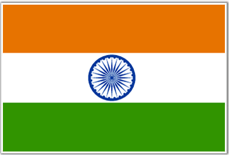
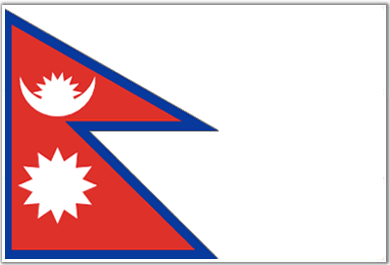
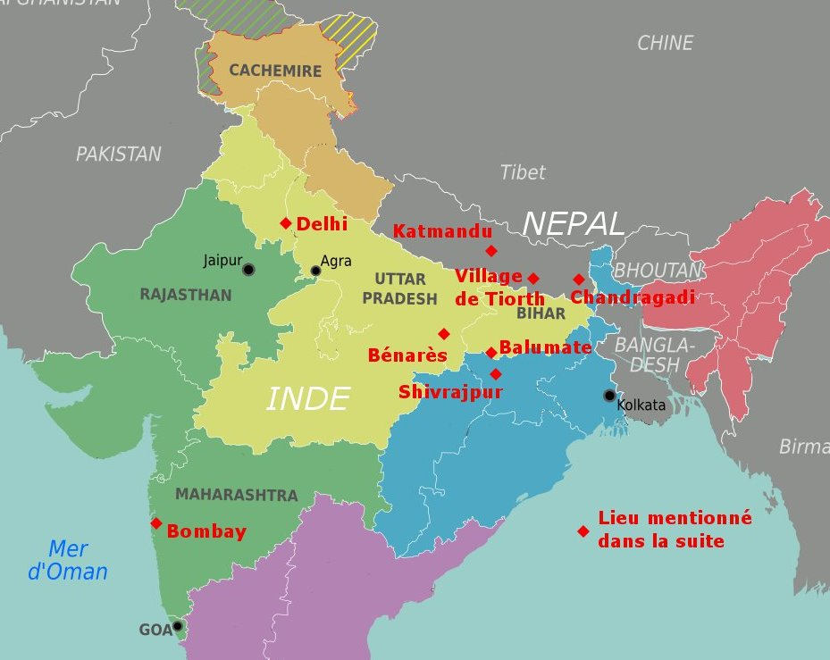

  Drapeau de l'Inde

 

  Drapeau du Népal

Cela fait bientôt 6 mois que je voyage autour du monde à la découverte des religions. Bientôt, j'arriverai au Népal et en Inde. Dans ces deux pays, l'hindouisme est largement majoritaire (à 80%).

Je m'aperçois aussi que dans ces deux pays, il existait des castes, c’est-à-dire des groupes sociaux hiérarchisés, endogames et héréditaires. Mais est-ce seulement du passé ?

Quand je rencontre Bernd, un voyageur allemand qui revient tout juste d'Inde, il m'assure "Les castes ? Elles n'existent plus ! Elles ont été abolies en 1950 par la constitution indienne !"

En fait, contrairement à ce que beaucoup d'occidentaux pensent, la constitution indienne n'a pas "aboli les castes" mais a simplement interdit la discrimination par la caste. Mais la caste, elle, existe encore belle et bien.

La caste peut sembler être une institution archaïque qui s'effacerait avec la modernisation de l'Inde. Mais en y regardant de plus près, Robert Deliège nous explique que "c'est, à l'inverse, la capacité d'adaptation de la caste qui frappe l'observateur" !

Alors quel est l’avenir de la caste?

Pour répondre à une telle question, avec ma formation d’étudiant en Télécommunication, il me semble logique de m’intéresser aux influences d’internet et du numérique sur le système des castes.

Comment le numérique influe-t-il sur le système des castes ? L’identité de caste se conserve-t-elle sur internet et comment se reproduit-elle sur les communautés des réseaux sociaux ? Dans quelle mesure le système des castes s'adapte-t-il à internet ? Comment discute-t-on des castes sur internet ?

Avant de pouvoir réfléchir à de telles questions, il me faut d’abord comprendre quelle est l’idéologie qui sous-tend le système des castes, quels sont les enjeux d’un tel système ? Qu’est-ce qui le rend si mystérieux pour nous, les occidentaux ?

Je pars donc en Inde pour rencontrer des villageois qui sont immergés dans la tradition et ainsi découvrir les fondements du système des castes. Puis, je vais essayer de m'intéresser plus particulièrement aux internautes indiens pour comprendre leurs pratiques et me donner une idée de l'évolution du système des castes avec l'arrivée des nouvelles technologies. Je m'intéresserai en particulier aux réseaux sociaux sur internet pour repérer dans quelle mesure les castes sont présentes sur la toile.

Je vais donc tenir ce journal pour vous faire partager mes découvertes et vous dévoiler, au fil de mes rencontres, ma compréhension du système des castes et ses évolutions avec l'arrivée du numérique.

Bon voyage !

Carte de mon voyage en Inde et au Népal

[Article suivant](/castes/2)
