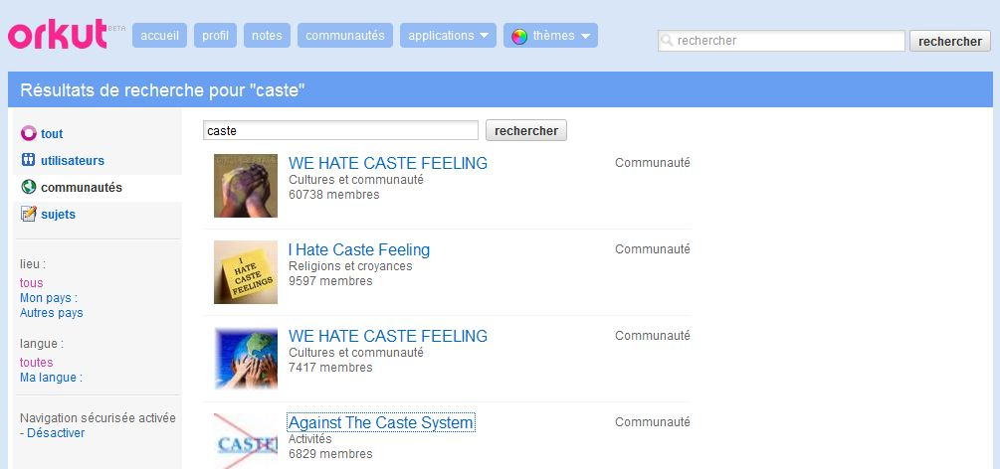
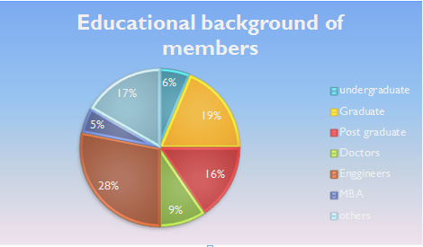

> **PUKAR** (Partner for Urban Knoledge, Action and Research) est un centre de recherche indien multi-sectoriel pour les questions liées à l'urbanisation et la mondialisation

L'un des changements important de l'Inde moderne est le phénomène d'urbanisation. De Delhi, je prends le train pour Bombay où je compte m'intéresser au centre de recherche PUKAR.

> **Orkut** est une communauté virtuelle dont le but est de relier ses membres par le biais de leurs amis et de personnes qu'ils connaissent. Il fut créé en 2004 et appartient à Google.

J'ai contacté Sunil Gangavane et Urvi Shah, chercheurs à PUKAR, qui pensent que l'accès à Internet est très corrélé à l'urbanisation. Ils ont donc effectué une thèse à propos des castes sur le web. Et notamment, ils se sont intéressé aux utilisateurs d'Orkut.

Pour cela, ils ont sélectionné 32 communautés virtuelles relatives aux castes telles que :

- Hinduism (131490 membres)
- I was born with no religion (11176)
- No caste, no religion (1905)
- No casteism only Hinduism (9264)
- Brahmin tradition and culture (6961)
- etc.

Orkut

Et ils ont fait le constat très intéressant que le sujet des castes, qui est assez tabou dans le monde réel, était particulièrement débattu sur internet !

D'après eux, "Les sites de réseaux sociaux ont le pouvoir de reproduire des opinions sur des sujets tabous étouffés. Les gens discutent de choses ici dont ils ne peuvent pas discuter en face-à-face"

En effet, la constitution de 1950, en interdisant la discrimination selon la caste, a eu pour effet pervers de rendre tabou le sujet des castes. On ne peut plus parler de la caste en publique et donc les sites de réseaux sociaux sont l'endroit idéal pour en parler.

Mais pour Gaurav Mishra, expert des médias sociaux, ce n'est pas l'anonymat qui conduit à l'élaboration de ces communautés virtuelles. Pour lui, "le phénomène n'est que le reflet du fait que la caste est une partie importante de l'identité pour de nombreux Indiens urbains" et "l'identité est plus persistante et réelle dans l'espace virtuel", en effet, dans l'espace virtuelle, les amis ont directement accès notre identité.

Mais qui participe à ces communautés?

Commentaire photo droite

Ils ont trouvé que 81% étaient des hommes; la plupart vient des grandes villes; ils sont jeunes et une grande partie est très qualifiée.

On observe une très large surreprésentation des hautes castes.

Cela est surprenant car, d'après les chercheurs, après la constitution de 1950, "les hautes castes ont conservé leur privilèges tacites au statut de leur caste et n'ont pas vraiment eu besoin de parler de la caste".

Alors on peut se demander pourquoi ils sont si présents dans les communautés virtuelles de caste aujourd'hui.

Notamment, les castes de Brahmanes sont très présentent.

Sur les réseaux sociaux, on peut dénombrer deux grands types de communautés virtuelles relatives aux castes.

- Les communautés qui regroupent les personnes d'une même caste. (exemple : "I am Karki")
- Les communautés qui parlent des castes (exemple : "No casteism only Hinduism")

Dans mes deux prochains articles, je vais m'intéresser d'une part à l'exemple d'une caste et aux communautés qui regroupent les personnes de cette caste. Je vais m'intéresser aux sujets de discussion des communautés qui parlent des castes.

[Article précédent](/castes/9)

[Article suivant](/castes/11)
