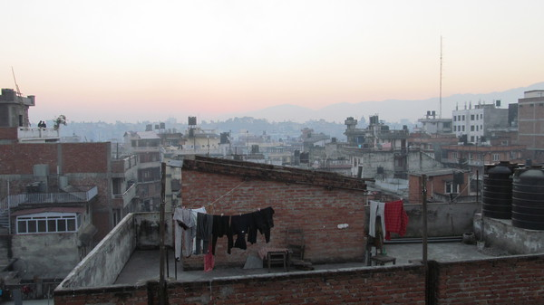
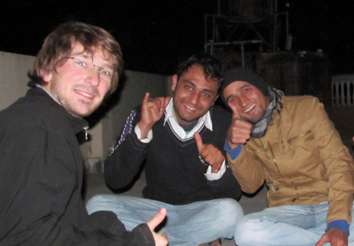
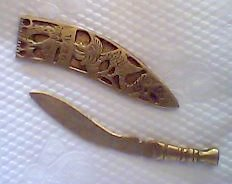
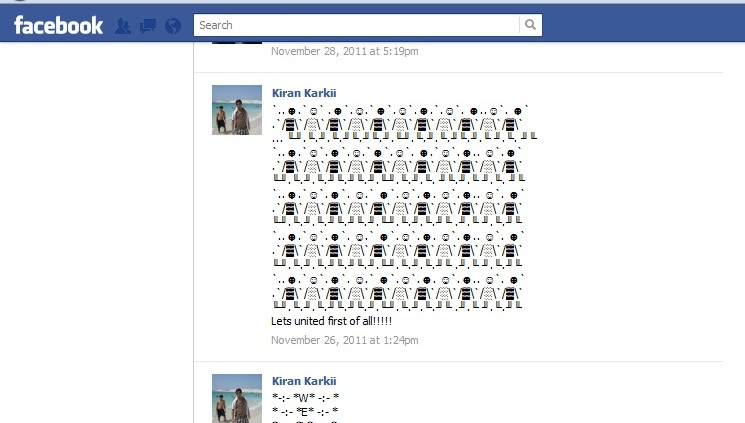
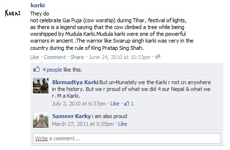
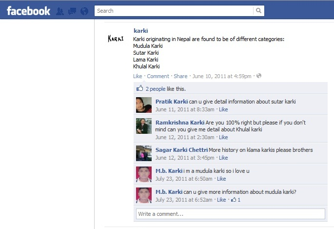
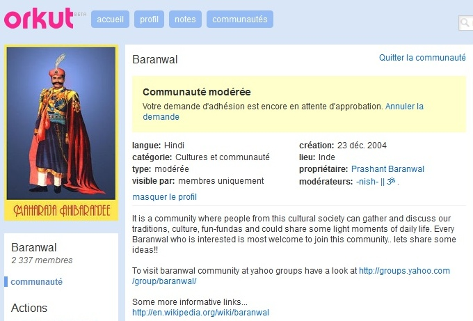
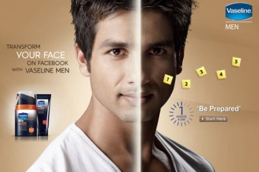

Depuis Bombay, retour vers la capitale du Népal : Katmandu !

En cherchant un endroit où me loger, je rencontre Kishan. Il est étudiant. Très vite, il me propose de dormir sur le toit de sa chambre qu'il partage en collocation avec Mohan. J'accepte avec plaisir et nous discutons sur la route.

Invité sur les toits de Katmandu

Kishan Mohan et moi sur les toits de Katmandu

Rapidement Kishan me parle du système des castes alors je lui demande quel est sa caste. Il me répond qu'il est Raj Karki. Raj signifie "drapeau". Raj Karki est une caste de guerriers (dont la Varna est Ksatriya).

Et en effet, le père de Kishan est militaire, son frère est gendarme et sa sœur est dans la police !

Le kukri offert par Kishan et Mohan

Après deux jours passés en leur compagnie, Kishan et Mohan m'offrent un kukri, c'est le sabre traditionnel des Gurkhas qui sont les fameux combattants Népalais !

Avant de se quitter, Kishan Karki me donne son identifiant facebook pour que nous restions en contact. Après l'avoir rajouté dans mes "amis", je surfe sur facebook, je suis intéressé de savoir s'il existe des groupes spécialement dédié à la caste des Karki.

Plus généralement, dans quelle mesure les personnes d'une même caste se regroupent en communautés sur les réseaux sociaux?

A ma grande surprise, il existe une multitude de groupes dédiés aux Karki. Je répertorie alors les communautés virtuelles relatives à cette caste.

Il existe 2 pages fan et plusieurs dizaines de groupes tels que :

- "Karki power", (49 membres)
- "karki" (142 membres)
- "Karki group membres" (153 membres)
- "Proud 2 b a KARKI" (162 membres),
- "Mudula Karki Samaj(मुडुला कार्की)" (203 members)
- "KARKI COMMUNITY" (262 membres)
- "Let's Count Karki's On Facebook" (311 membres),
- "I am karki" (420 membres)

On le voit donc avec cette profusion de groupe, les membres de la caste Karki (qui sont sur facebook) se regroupent dans des communautés virtuelles.

Les sites de réseaux sociaux sont devenus un terrain fertile pour les groupes basés sur la caste.

Alors qu'est ce qui les pousse à se regrouper ainsi? Quelles sont leurs motivations? Et de quoi discutent-ils dans ces communautés?

Il semble que les Karkis veuillent se regrouper tous ensemble. Il y a même un groupe qui entend recenser tous les Karki de Facebook ! Tout d'abord, c'est la fierté d'appartenance à la caste qui joue un rôle. Sur le groupe "I am Karki", Dhruba Karki nous dit : "when we feel of being karkis, it gives us a sense of oneness; it unites those spread around the globe; it bestows us collective experience; ultimately, it reenergizes us with new zeal, vigor, and enthusiasm!!!"

  Sur le mur facebook d'un groupe : "Unissons-nous d'abord !"

Ainsi le sentiment d'appartenance à la caste est très fort et le groupe facebook est le moyen utilisé pour reproduire la communauté de la caste sur internet. Il permet donc de se retrouver dans un environnement où l'on peut parler librement de sa fierté d'appartenir à sa caste avec d'autres membres de sa caste.

  Sur une page facebook d'un groupe Karki, tout le monde est fier d'appartenir à
  cette caste

D'un point de vue géographique, ces communautés virtuelles vont encore plus loin que les relations classiques de castes puisqu'elles permettent de rester en contact avec des membres de sa caste qui n'habitent pas la même ville ou le même village. (Ici, Dhruba veut même rassembler tous les Karki du monde !)

Mais à quoi peuvent alors servir la création de ces communautés onlines?

Pour Khadga Karki, membre de l'un des groupe, c'est très clair, il nous explique : "It is for united, in the future we could do lot of things to get to know each other, help each other and all; If anyone has some best ideas that can be accepted and followed."

Ainsi, ces groupes peuvent être un moyen d'organiser des activités en commun, de se retrouver ou tout simplement de partager des idées.

Cela est particulièrement intéressant au regard des injustices que subissent encore les plus basses castes (ségrégations, mépris, meurtres d'honneur, etc.) et des "révolutions arabes" qui ont eu lieu au printemps 2010 grâce aux réseaux sociaux. Peut-on envisager dans l'avenir que les réseaux sociaux soient un outil pour les Dalits (les intouchables) de se rebeller ou de demander plus de droits?

Le parallèle entre les révolutions arabe et la situation en Inde ne peut être fait que dans une certaine mesure car, contrairement à l'Afrique du nord, en Inde, seule une partie de la population souffre des injustices et c'est la partie la moins éduquée et donc qui a le moins accès à internet.

Si l'utilisation des réseaux sociaux pour la promotion des droits des Dalits n'est pas évidente dans un futur proche, on peut néanmoins déjà constater l'utilisation des réseaux sociaux par la classe moyenne indienne pour se mobiliser.

Ce fut notamment le cas pour soutenir Anna Hazare dans sa lutte contre la corruption en Inde.

Revenons aux Karkis.

Sur plusieurs communautés virtuelles de Karkis, il est possible de lire l'Histoire des Karkis, des nouvelles de certains Karkis et des signes de fierté à n'en plus finir.

  Mur d'un groupe facebook : "Je suis Mudula Karki donc je vous aime"

Les Karki se rassemblent entre eux, mais y a-t-il cette notion de pureté rituelle que nous avons vu dans la première partie?

Nous avions parlé de l'idéologie du pur et de l'impur qui, selon Louis Dumont, sous-tend la hiérarchisation des castes. Cependant, dans le monde numérique, il est difficile de voir des traces de pureté puisqu'il n'y a pas de contact direct sur facebook.

Ceci étant, il existe des éléments qui témoignent encore de la hiérarchie des castes sur facebook.

Voici deux exemples :

Communauté Orkut modérée

Certains groupes de caste ne sont pas ouvert au publique. Un modérateur choisit les adhérents et ainsi un Dalit (basse caste) n'aura jamais l'occasion de partager les discussions de certains groupes de brahmanes. Sauf s'il se fait passé pour un Brahmane (en changeant de nom par exemple) mais on peut voir ça comme une tentative de changer de caste. On peut voir cela, dans une certaine mesure, comme une transposition de la ségrégation géographique.

Le deuxième exemple est pour montrer que ce n'est pas seulement appartenir à une caste qui a de la valeur mais certains indiens aspirent à appartenir aux plus hautes castes.

En Inde, l'entreprise Vaseline vient de lancer (en 2010) une application Facebook permettant aux utilisateurs de pâlir leur visage sur leur profil en ligne.

  Affiche publicitaire pour vanter l'application facebook qui permet de blanchir
  son visage sur sa photo de profil

En effet, T.K. Oommen, professeur de sociologie à l'Université Jawaharlal Nehru de New Delhi, explique que "la croyance populaire veut que si vous avez la peau pâle, vous appartenez à la caste supérieure, celle des brahmanes" qui descendraient des Aryens venus d'Asie centrale il y a plusieurs milliers d'années.

Et cette application fait un carton ! C'est dire combien apparaître comme étant d'une caste élevée semble important aux yeux de nombreux indiens !

La caste sur les réseaux sociaux n'est pas seulement discutée à l'intérieur de chaque caste, dans le prochain article nous verrons comment Orkut est une bonne interface de discussion des castes.

[Article précédent](/castes/10)

[Article suivant](/castes/12)
