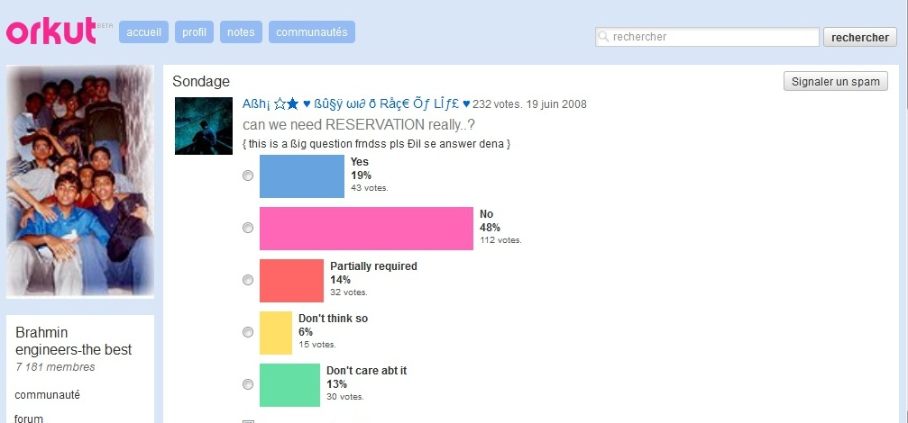

On a vu avec l'exemple des Karki sur facebook que les membres d'une caste se regroupent en communautés virtuelles sur les réseaux sociaux.

Il existe aussi sur les sites de réseaux sociaux des communautés virtuelles qui parlent des castes sans être affilié a priori à une caste.

Alors quels sont ces groupes ? Quels sont les grands sujets de discussion de la caste aujourd'hui ?

La caste occupe aujourd'hui un volume conséquent dans l'actualité et donc dans les discussions des réseaux sociaux en Inde.

Il y est principalement question du mariage inter-castes dont le nombre augmente en ville, de la politique de quota que pratique l'Inde depuis la constitution de 1950, ou de la polémique sur la mention de la caste dans le dernier recensement de 2011.

**Le mariage inter-castes**

Communauté Orkut en faveur du mariage inter-caste

Le mariage arrangé nous paraît archaïque. C’est cependant le mode de mariage que pratique plus des ¾ des indiens. Beaucoup de parents m’ont témoigné : « le mariage arrangé, c’est plus sûr que le mariage d’amour ». Et en effet, le taux de divorce en Inde est tout proche de 0%. Ce qui m’a surpris, c’est d’entendre des jeunes de mon âge m’expliquer qu’ils préféraient le mariage arrangé. Pour eux, c’est un souci de moins à s’occuper et les parents choisissent très bien.

Il ne faut cependant pas confondre « mariage arrangé » et « mariage forcé ».

  Communauté Orkut dont les membres comparent le mariage d'amour et le mariage
  arrangé

Dipak, mon ami de Pokara au Népal, m’explique : quand son fils aura l’âge de se marier, il ira voir toutes les familles de sa caste et il demandera s’il y a une jeune fille qui pourrait correspondre. Après quelques rencontres entre parents, les deux futurs époux pourront se rencontrer et donner leur avis. Si cela ne colle pas, les parents chercheront une autre partenaire. Dans la pratique, les futurs époux refusent rarement le choix de leurs parents.

Voilà comment se passent la plupart des mariages en Inde.

Cependant, une minorité d’indiens revendique son droit au mariage d’amour et donc au mariage inter-caste.

La cours suprême de justice a même expliqué que le mariage inter-caste était dans l’intérêt national car c’est un outil pour combattre le système des castes.

Cependant les mentalités changent lentement. Les amants qui veulent vivre leur mariage d’amour prennent alors le risque de se mettre leurs familles à dos. Ces dernières peuvent leur interdire de se voir ou pire, commettre un crime d’honneur. Une étude réalisée l’an dernier estimait à environ 900 le nombre de ces crimes, commis chaque année dans seulement trois états du nord, le plus souvent par les familles des victimes qui s’opposent à l’amour des amants de castes différentes.

Dans les grandes villes, notamment à Bombay, le mariage d’amour s’est quand même démocratisé pour une certaine catégorie de la population. Sur les quais de Bombay, il n’est pas rare de croiser des amoureux bras dessus bras dessous.

Les amoureux de Bombay

**La politique des quotas**

Pour combattre les injustices liées au système des castes, le gouvernement indien a mis en place, dès 1950, une politique de quota. Les plus basses castes ont reçu le statut de « caste répertorié » (scheduld cast), « tribu répertorié » (scheduld tribe) ou « autre caste arriérées » (other backward caste). Une proportion des sièges de la fonction publique et des universités sont réservé aux castes répertoriés. Au fil des années, le nombre de castes bénéficiant du statut de caste répertorié n’a cessé d’augmenter. Aujourd’hui, les sièges réservés aux castes répertoriées représentent près de 50% des sièges dans certains cas.

Cette politique de quota a l’avantage d’éviter que les hautes castes aient le monopole des postes à pouvoir. Elle a néanmoins aussi quelques inconvénients.

Il est difficile d’établir une délimitation claire entre les bénéficiaires des quotas et ceux qui n’en bénéficieront pas. Certaines castes font pression pour entrer dans les castes répertoriées. Notamment, répertorier certaines castes est un choix politique majeur pour les candidats aux élections. Les castes deviennent des niches électorales auxquelles il faut plaire.

Certificat de caste

D’autre part, l’application de cette politique de quota exige de bien savoir qui appartient à quelle caste. Pour bénéficier de leurs avantages, les castes répertoriées doivent fournir un justificatif de caste. En combattant les injustices du système de caste, on a pour effet secondaire de rendre explicite l’identité de caste.

L’expression « caste répertoriée » est maintenant passée dans le langage courant. Pour certains, ce terme a une connotation péjorative. Certains indiens voient les castes répertoriées comme étant des castes d’assistés.

  Une communauté virtuelle de Brahmanes sur orkut se demande s'ils peuvent
  vraiment avoir besoin des quotas

**L'identité de caste dans le recensement de 2011**

  Données démographiques indiennes obtenues grâce aux recensements

En 2011 a eu lieu en Inde un recensement d’une envergure exceptionnelle. 2,5 millions de personnes ont été mobilisées pour recueillir les données de plus de 1,2 milliard de personnes.

En ce qui concerne notre sujet, l’enjeu principal a été de savoir s’il fallait demander aux personnes quelle était leur caste. D’un côté, connaître les répartitions démographiques des castes permet de mieux les appréhender. D’un autre, les personnes se retrouvent figées dans une identité dont on essaye de combattre la source.

Les militants contre la question de la caste dans le recensement de 2011 avaient plusieurs arguments. Ils avançaient les difficultés logistiques ou la crainte que les données soient reprises à des fins politiques. Ils expliquaient que cela était difficile de demander la caste des personnes car, à la question « de quelle caste faites-vous partie ? », il y a plusieurs réponses qui varient selon l’interlocuteur et le contexte. D’autre part, demander la caste serait un retour en arrière. Pourquoi demander la caste des personnes alors qu’on essaye de la nier ? Le dernier recensement avec cette question était en 1931 par les colons anglais et depuis, la question n’avait pas été abordée de nouveau.

On leur a répondu qu’il fallait arrêter de se voiler la face : les castes existent et cela ne mènerait à rien de faire semblant de ne pas les voir.

Il a finalement été décidé de demander le nom de la caste des personnes.

La personne opérant le recensement est souvent un instituteur ou une personne proche des gens qu’elle interroge, ce qui assure une certaine validité des données dans le cadre local.

[Article précédent](/castes/11)

[Article suivant](/castes/13)
