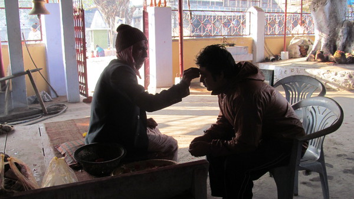
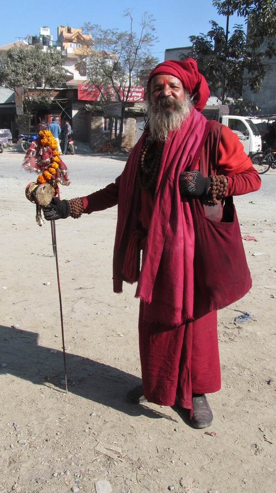

> **CouchSurfing.Org** est un site internet de réseau social qui permet de créer des amitiés en mettant en relation des voyageurs avec des habitants locaux qui leur offrent un endroit où dormir.

Aujourd'hui, pour commencer mon voyage, je pars pour Chandragadi, une petite ville de l'Est du Népal à la rencontre de Sayliza et de sa famille. Sayliza est une jeune fille de 25 ans que j'ai rencontrée grâce au réseau _Couch Surfing_.

Avec Nicolas, mon compagnon de route, nous sommes accueillis dans la maison familiale comme des rois : petits biscuits, thé, petites attentions, etc. Au Népal comme en Inde, l'invité est considéré comme un dieu !

Sayliza, notre hôte

  Sayliza, sa maman et sa grand-mère. En Inde et au Népal, la famille élargie
  vit sous le même toit

Je demande à Sayliza quelle est sa caste, elle m'explique qu'elle appartient à la caste des Brahmanes. Qu'est-ce que c'est ?

Pour comprendre ce terme, il faut revenir aux fondements de l'hindouisme.

Durgâ, l'un des nombreux dieux hindous

En effet, dans les textes sacrés de l'hindouisme (les _Védas_), la société est divisée en 4 _varnas_. Ce terme de la langue sanskrite signifie catégorie ou couleur.
Chaque varna est issu d'une partie du corps de _Brahmâ_ (le Dieu créateur), et a une fonction donnée :

- Les **Brahmanes** sont issus de la tête de _Brahmâ_. Ils connaissent les textes sacrés et accomplissent les prières.
- Les **Ksatriyas** sont nés des bras de _Brahmâ_. Ce sont les guerriers, les nobles ou les rois.
- Les **Vaisya** viennent des cuisses de _Brahmâ_, ils sont marchands ou les agriculteurs.
- Les **Sûdras**, sortis des pieds de _Brahmâ_, sont les artisans, les employés des fermes ou autres prestataires de service.

  Un Brahmane qui s'occupe d'un temple de Chandragadi donne sa bénédiction

  Un Brahmane qui m'a béni aux abords du temple Pashupatinath à Kathmandu, Népal

Ainsi, tandis que les Brahmanes s'occupent de la vie spirituelle du peuple, les Ksatriyas le protège ; Les Vaisya font tourner l'économie et les Sûdras sont au service des trois premiers _varnas_.

D'un point de vue rituelle, les Sûdras s'opposent aux autres _varnas_ car il ne participent pas au rituel védique. Les hindous des trois premiers _varnas_ sont dits « deux fois nés ».

Il existe une cinquième catégorie dont les Vedas ne font pas mention; ce sont les hors-castes (les intouchables ou encore les dalits). L'expression "hors-caste" est inappropriée car elle peut porter à confusion : les "hors-caste" font bien partis de castes. Ils effectuent les plus basses tâches dont personne ne veut s'occuper, nous en reparlerons lorsque nous nous intéresserons à la notion de pureté rituelle.

Ainsi, Sayliza et sa famille font parti du _varna_ des Brahmanes. Le plus "haut" des _varnas_. Ils sont donc en bonne position pour être sauvés.

Comment être sauvé pour un hindou?

Dans l'hindouisme (comme dans la philosophie bouddhique), être sauvé signifie sortir du cycle de réincarnation, pour atteindre la délivrance (_moksa_ ou _nirvana_ pour les bouddhistes).

Selon la tradition hindou, on peut en effet être réincarné en homme, en animal, en végétal ou même en quelque chose qu'on ne connaît pas sur une autre planète.

Il faut s'élever dans la hiérarchie des être au fil des réincarnations.

Ainsi, chaque âme essaie d'accomplir son devoir du mieux qu'elle peut pour se réincarner dans l'un des _varnas_ supérieurs (notamment en Brahmane) et pouvoir être en bonne disposition pour devenir un renonçant intégral et être enfin délivré du cycle infernal des réincarnations.

La délivrance s'atteint par une vie de bonnes actions et par la méditation.

Sayliza nous explique qu'elle pratique la méditation deux fois par jour, chaque jour. Dans son expérience de méditation, elle a plusieurs fois atteint le monde spirituel. Ce monde spirituel se divise ensuite en plusieurs paliers dont le dernier est la délivrance.

La maman de Sayliza témoigne qu'elle a pu savoir ce qu'elle était dans les réincarnations précédentes par l'expérience de la méditation.

Atteindre la délivrance est, selon elle, accessible à tout le monde mais cela est difficile et demande un grand investissement de temps et de la régularité.

D'un point de vu sociétal, au Népal, depuis une cinquantaine d'années, les castes de Brahmanes ont pris d'assaut l'administration du pays. La plupart des postes de l'administration est occupé par des Brahmanes. Le père de Sayliza, par exemple, a fait toute sa carrière dans l'administration. Sayliza elle-même, quand je l'ai rencontré, était en train de préparer studieusement le concours pour rentrer dans l'administration.

Pour éviter ce problème de prise du pouvoir par les hautes castes, l'Inde a choisi d'instaurer des systèmes de quota. Les plus basses castes ont des sièges réservés dans la fonction publique.

La société hindoue est divisée en 4 _varnas_… Mais le système de caste est bien plus complexe, chaque _varna_ est divisé en une multitude de castes : les _jatis_.

  Un homme nous explique comment méditer, à Aktasa, Rajasthan, Inde

[Article précédent](/castes/1)

[Article suivant](/castes/3)
