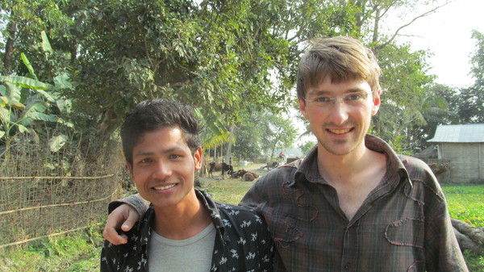

Aux abords d'un village népalais

Après avoir quitté Sayliza et sa famille, je me dirige vers la campagne à la rencontre d'une population plus représentative de l'Inde. En effet, 70% de la population indo-népalaise est rurale.

Tiorth, mon nouvel ami

Je m'éloigne donc à pied sur des petits chemins agrestes. Je passe plusieurs villages. Je m'arrête à un puits pour boire de l'eau. Je m'apprête à continuer ma route quand un jeune homme me barre le passage et me demande où je vais. Je lui réponds que je vais tout droit mais il rétorque qu'il n'y a rien dans cette direction. Rien, sauf le village de sa famille. Finalement, nous sympathisons et Tiorth nous invite à déjeuner chez lui. Nous nous trouvons maintenant dans la partie de son village où vit exclusivement sa jati. Qu'est-ce qu'une jati?

Nous avons vu que la société indienne est divisée en cinq catégories (les 4 Varnas et les intouchables) mais ces catégories sont à leur tour subdivisées en une multitude de jatis, que l'on peut aussi appeler "castes". Au total, on dénombre plus de 4000 jatis en Inde !

> **Célestin Bouglé** (1870-1940) est un philosophe et sociologue français. Il a écrit l'_Essais sur le régime des castes_ en 1908

Pour définir la caste (Jati), Célestin Bouglé, dans son _Essais sur le régime des castes_, nous explique que l'on peut parler de système de castes lorsque l’ensemble de la société est divisée en un grand nombre de groupes héréditaires distingués et reliés par trois caractères :

- Séparation en matière de mariage et de contact direct (le touché) ou indirect (manger la nourriture préparée par autrui)
- Division du travail, chacun de ces groupes ayant une profession traditionnelle ou théorique dont ses membres ne peuvent s’écarter que dans certaines limites
- Hiérarchie, qui ordonne les groupes en tant que relativement supérieurs et inférieurs les uns aux autres.

Tiorth m'explique qu'il appartient au Chaudhary, une caste d'agriculteurs. Il était surpris que nous voulions emprunter ce chemin car il n'est pas anodin d'entrer sur le "territoire" d'une caste. Ici, tout le monde se connaît (plus ou moins car les Chaudhary sont au nombre de 1000 dans ce village). Emprunter une rue, c'est déjà entrer chez quelqu'un.

Dans le village de Tiorth

La famille élargie de Tiorth, photo souvenir

Comme vous l'avez compris, chaque caste se regroupe dans une partie du village. Et cette partie du village est elle-même divisée en foyers. Chaque foyer abrite une famille élargie (Les grands-parents et leur descendance).

Tiorth nous fait visiter plusieurs familles de sa caste. Il appelle ses cousins (même éloignés) « brothers » et les personnes de la génération d'au-dessus sont ses « uncles ». Quelqu'un de sa caste est un « relative ».

Tiorth sait très bien reconnaître si quelqu'un est de sa caste ou non grâce à sa couleur de peau, à sa physionomie de visage ou encore grâce sa prononciation. Il peut reconnaître la caste de n'importe qui aux abords de son village.

Cependant, dès qu'il va en ville où il étudie, c'est beaucoup plus difficile de reconnaître la caste des gens.

Pour Tiorth, la caste est comme une grande famille dans laquelle il se sent à sa place. Dans quelques années, ses parents vont lui choisir une fille de sa caste et lui arranger un mariage. Le mariage arrangé, ici, tout le monde trouve ça normal et beaucoup plus fiable que le mariage d'amour.

Environ 4 mariages sur 5 sont arrangés en Inde (selon l'Express).

Deux hommes au travail dans le village de Tiorth

Dans sa caste, presque tout le monde est agriculteur. Tiorth a cependant la chance de faire des études et de connaître un peu l'anglais. Peut-être deviendra-t-il ingénieur. Mais s'il ne trouve pas de travail, c'est sûr, il sera agriculteur dans son village comme toute sa famille.

Tiorth est né dans la caste des Chaudhary de ce petit village, il y vit et il y restera attaché jusqu'à sa mort.

Tiorth m'invite à rester passer la nuit chez lui. Les femmes nous préparent le dîner et les hommes me tiennent la conversation. Le lendemain, je dois poursuivre ma route. Je pars avec une question en tête : Tiorth vient d'une caste d'agriculteur, est ce que cela signifie qu'il est destiné à devenir agriculteur ?

Activité traditionnelle du tisseur

D'après Célestin Bouglé, il y a un fort lien entre l'activité héréditaire et la caste. Et en effet, M. Nesfield nous révèle que 77% des noms de castes seraient d'anciens noms de métiers. (Brief View of the Caste system, p. 89)

C'est ainsi que le mot Mayara, qui désigne les pâtissiers, serait une forme altérée du sanscrit Modakakâra (pâtissier) pour ne citer qu'un exemple.

Dans les villages, tous les blanchisseurs sont de la caste des blanchisseurs mais l'inverse n'est pas vrai : les indiens de la caste des blanchisseurs ne sont pas tous blanchisseurs. Les femmes s'occupent bien souvent de la maison et certains exercent d'autres métiers. C'est de plus en plus le cas avec l'émergence de nouveaux métiers dans notre monde moderne !

La rencontre de Tiorth et de sa caste d'agriculteur m'ont aidé à comprendre un peu mieux ce qu'est une caste. J'ai observé la séparation entre les castes avec la ségrégation géographique dans le village de Tiorth et son mariage arrangé prévu. J'ai compris comment la caste était attachée à une activité traditionnelle.

Cependant, je n'ai toujours pas observé de hiérarchie entre les castes. Avant cela, je dois comprendre l'idéologie du pur et de l'impur car elle sous-tend la hiérarchisation des castes.

[Article précédent](/castes/2)

[Article suivant](/castes/4)
