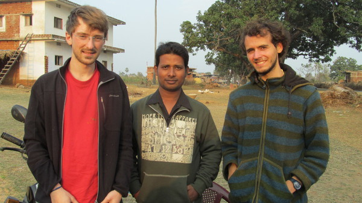
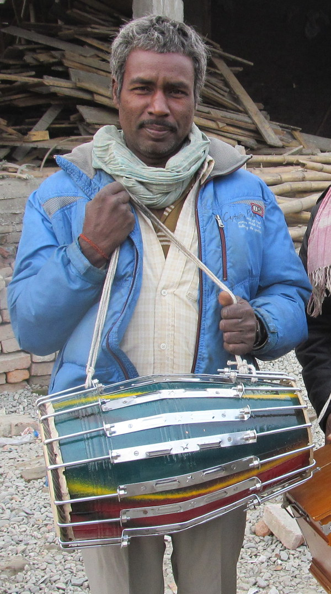
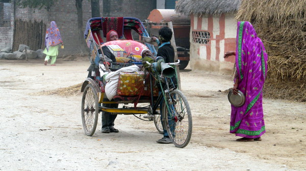
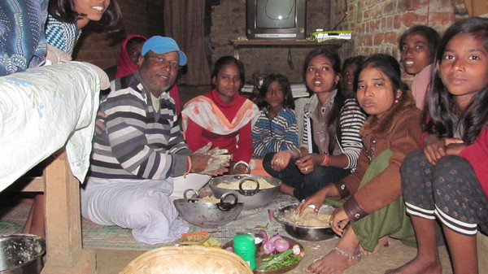
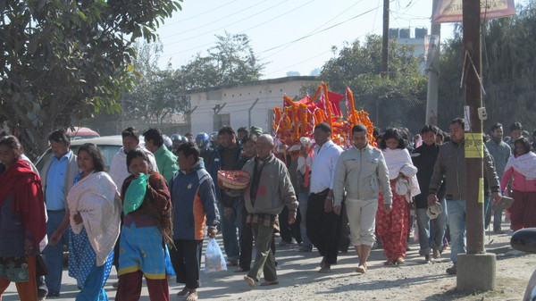
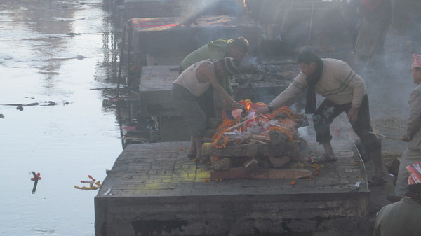
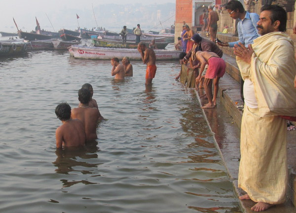
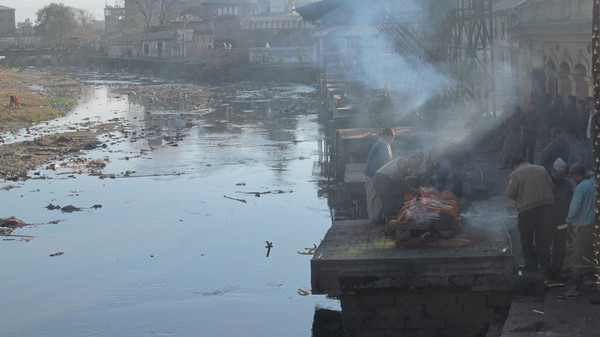
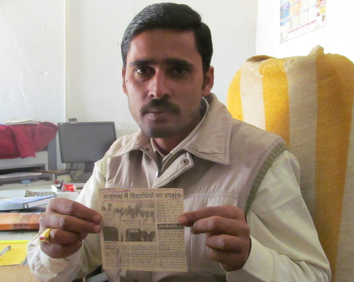

Après avoir quitté le petit village népalais d'agriculteurs où j'avais rencontré Tiorth, je me dirige en Inde.

Rencontre avec Ravi

Quelques jours plus tard, après une journée dans une petite ville, je m'apprête à faire du stop au bord de la route. Mais comme il se fait tard, un homme m'interpelle est m'exhorte de m'arrêter là pour la nuit et de ne repartir que le lendemain. Il s'appelle Ravi et il m'invite chez lui. J'accepte avec plaisir. Il m'explique que je suis ici dans sa maison natale. Lui, habite ailleurs mais il a fait le déplacement car, sa grand-mère est décédée il y a 3 jours. Il m'explique que nous sommes dans une période de deuil. Ce deuil dure 10 jours et pendant ces 10 jours, Ravi m'explique qu'il perd sa pureté rituelle.

Qu'est-ce que la pureté rituelle? Que veut dire être pur ou impur? En quoi cela a-t-il un rapport avec le système des castes?

Selon sa caste, un hindou a une pureté rituelle plus ou moins grande. Une grande pureté rituelle est nécessaire pour les hindous qui participent aux rites, aux sacrifices et notamment, les prêtres (souvent des Brahmanes) ont besoin d'être très pur.

  Les tambourins forment une basse caste car manipuler le cuire est impur

Cependant, certains actes ou moments de la vie peuvent diminuer la pureté rituelle d'une personne. Par exemple, manipuler le cuir, vivre dans les détritus ou approcher un cadavre sont des actes impurs. Avoir ses menstruations pour la femme, subir le décès d'un proche sont des moments qui réduisent aussi la pureté.

Ainsi, les castes qui s'occupent du cuir, les tambourins ou les cordonniers par exemple, sont des castes dont la pureté est faible parrapport aux autres castes.

Côtoyer un homme moins pur diminue également la pureté. Ainsi, le Brahmane ne peut pas toucher le cordonnier, ni manger avec lui, ni manger de la nourriture qu'il a cuisiné, ni même l'approcher.

Ceci crée localement une hiérarchisation des castes. Dans un village donné, on peut retrouver cette hiérarchie en se posant par exemple les questions : "Est-il permis à telle personne de dîner ou prendre le thé chez telle autre personne?"; "Est-il possible à cet homme d'approcher cet autre homme?"

En quelque sorte, les travaux impurs sont réservés aux basses castes pour permettre aux hautes castes de rester pures afin de prier les textes védiques et accomplir le rite.

Nous avons donc une hiérarchie de pureté rituelle et non une hiérarchie de pouvoir (comme beaucoup de voyageurs le comprennent en faisant alors un contre sens).

Ainsi, le prêtre brahmane, en haut de la hiérarchie de la pureté, vit traditionnellement d'offrandes données par des personnes des autres castes de son village.

De ce point de vue, il est dépendant du reste de la population et n'a aucun pouvoir politique.

Brahmane qui mendie

Cependant, en pratique, les hautes castes, qui ont la connaissance sont souvent plus aisée que les basses castes qui sont là pour servir.

  Préparation de nourriture non frite qui convient à la période de deuil

Revenons à Ravi. Il a perdu sa pureté rituelle. Comment faut-il faire pour la récupérer?

Pour récupérer sa pureté, il faut suivre des rituels qui varient selon la cause de la perte de pureté et selon la caste.

Cortège funéraire hindou

Avec ce décès, les membres de la famille perdent leur pureté et pendant les 10 jours de deuil, ils doivent suivre une série de règles : Ne pas cuisiner d'aliments fris, ne pas utiliser de savon, pleurer la morte, prendre deux bains rituels le 3e et le 6e jour, organiser un grand repas avec toute la caste (si le porte-monnaie le permet) où l'on mangera du poisson (Ravi fait partie d'une caste de pêcheurs), etc.

Après ces 10 jours, la famille de Ravi est allée à Vârânasî, la ville sainte de l'hindouisme, pour y faire brûler le corps de la défunte et pour prendre un bain rituel dans l'eau sacrée du Gange.

Inhumation au bord de la rivière

Bain rituel dans le Gange

Après cela, la famille de Ravi sera redevenue pure comme avant !

Mais attention ! Pureté (rituelle) ne signifie pas "propreté" ! L'eau du Gange n'est pas propre du tout. Des cadavres à moitié incinérés y sont plongés chaque jour, des vaches mortes flottent à sa surface, les eaux usagées y sont déversées ! Cependant, le Gange est un fleuve sacré. Son eau est dite pure, et on va prendre un bain rituel pour bénéficier de cette pureté.

Une rivière pure n'est pas forcément propre

Cette obsession pour la pureté est moins présente en ville. Dans le métro de Delhi, un brahmane sait qu'il va effleurer des personnes de basses castes. Peu importe. Cependant, de retour dans son village, ce même brahmane fera bien attention à ne pas croiser le regard des intouchables (qui vivent d'ailleurs à l'extérieur du village).

  Madhav me montre l'article de journal racontant sa mésaventure

Cette mentalité est encore bien présente en milieu rural. Ainsi, Madhav, directeur d'une petite école du Bihâr en Inde, que j'ai rencontré, m'explique qu'il a fait scandale dans la presse locale pour avoir été boire le thé dans une famille d'intouchables. Les journalistes s'indignaient de son acte et en demandaient la raison. Madhav, lui, voulait juste tisser des liens pour recruter de nouveaux écoliers, en dépit du système des castes.

Cette idéologie du pur et de l'impur rend compte de beaucoup de gestes et d'attitude en Inde, elle n'est pas respectée au pied de la lettre dans les villes mais elle permet de donner une bonne base pour comprendre ensuite la hiérarchisation des castes et les interactions entre castes.

[Article précédent](/castes/3)

[Article suivant](/castes/5)
