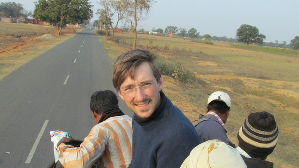

  Sur le toit d'un bus, en route vers ma prochaine destination

Après ma rencontre avec Ravi dans le Bihar, je reprends ma route en bus jusqu'à une petite ville.

Quelques jours plus tard, je continue ma route en milieu rural. Alors que je marche avec mon compagnon de route, nous sommes abordés par un jeune homme à vélo. Il s'appelle Pankaj, il a 20 ans. Nous faisons connaissance sur la route qui le ramène à Shivrajpur, son village. Pankaj veut travailler dans le tourisme quand il aura fini ses études. Il est très content de parler avec nous pour travailler son anglais. Il nous demande si nous voulons bien venir visiter son village.

Pankaj va aussi me donner un aperçu de la manière dont il vit la hiérarchie de castes dans son village.

Louis Dumont, dans homo hierarchicus, nous explique qu'il existe une hiérarchie entre les castes et que cette hiérarchie est basée sur la pureté relative des différentes castes. Globalement, plus une caste est pure, plus elle est haute dans la hiérarchie. Mais ce n'est pas tout à fait aussi simple

  Les brahmanes sont tout en haut de la hiérarchie de pureté rituelle

D'abord, cette hiérarchie n'est pas linéaire. Si le potier est au-dessus du laitier lui-même au-dessus du tisserand, on ne peut pas conclure quant à la relation potier-tisserand.

D'autre part, cette hiérarchie varie selon les régions. Si une caste de Tisserand dans telle région est au-dessus de la caste des laitiers, ce ne sera pas forcément le cas dans la région d'à côté. Cependant, il est possible de rendre compte de la hiérarchie des castes dans un village donné.

Pankaj m'explique que, en plus des liens forts qu’il a à l’intérieur de sa caste, il existe la "relation de village" (_village relationship_) qui s'applique à chaque relation entre les villageois de castes différentes à Shivrajpur.

Quand il parle à ses amis, il les appelle _"son"_, _"brother"_ ou _"uncle"_. Pourtant ses amis semblent avoir tous environ le même âge. Mais dans la relation de village, telle personne est son fils, son frère ou son oncle.

La relation de village s'applique quand Pankaj parle de quelqu'un hors de sa caste. S'il parle à quelqu'un de sa caste, il utilisera le terme "frère" pour sa génération et "oncle" pour la génération du dessus.

Il m'explique que la "relation de village" vient des ancêtres, elle se transmet de génération en génération et tout le monde suit cette coutume. Je comprends vite que la relation de village est le statut relatif de deux personnes dans la hiérarchie de castes.

D'un coup, le jeu est de savoir qui est l'oncle de qui ou le frère de qui ! Les amis sont très d'accord sur leurs statuts relatifs respectifs et ceux qui sont les "fils" de tout le monde (c’est-à-dire les plus basses castes) ne sont pas honteux du tout. Chacun semble accepter son statut.

A chaque fois que nous rencontrons une nouvelle personne, je demande si c'est son fils, son frère ou son oncle dans la relation de village.

Tout le monde a l'air très respectueux de la caste de chacun mais tout de même le Laitier (_Yadov_) reçoit des moqueries.

Cependant, les relations entre castes ne se cantonnent pas à une dénomination. Chaque caste a une véritable place dans la vie du village.

  L'agriculture représente 80% de l'activité en milieu rural

Les agriculteurs récoltent le grain pour nourrir le village (Les castes d'agriculteurs ne sont pas les seules à s'occuper de l'agriculture qui représente 80% de l'activité en milieu rural). Le laitier distribue le lait, le potier prépare les statues pour les fêtes religieuses, le barbier rase tout ce beau monde. En cas de décès par exemple, les hommes de la famille proche du défunt doivent se raser entièrement la tête sauf une petite mèche derrière.

  Statue élaborée par la caste des potiers pour la fête de Sarithey

La pratique de l'activité traditionnelle est héréditaire : Le meilleur ami de Pankaj, par exemple, fait partie de la caste des potiers. Après la fin de ses études, il retournera suivre les pas de son père et deviendra à son tour potier.

Les relations inter-castes sont héréditaires : Lorsque nous dînons avec Pankaj (de la caste _Kumar_), c'est un petit garçon de 7 ans, le fils du laitier (_Yadov_) qui vient nous servir le lait. Dès son plus jeune âge, ce laitier exerce sa profession héréditaire et débute les relations avec la caste de Pankaj.

Traditionnellement, chaque caste rend service selon son activité héréditaire et se voit rétribué en fonction de son statut.

  Mariage hindou arrangé au sein de la même caste. Les parents de l'épouse offre
  une dote à la famille de l'époux

Pour garder cet équilibre de relations entre différentes castes, on ne se marie que dans sa caste. Comme on l'a vu précédemment, dans les villages, tous les mariages sont arrangés au sein même de la caste.

Pour éviter les contaminations des hautes castes par les plus basses castes, ces dernières vivent un peu à l'écart dans le village. Pankaj fait partie de la caste des _Chandravanshi_, une caste de Kshatriya (noble prince ou guerrier). Son père travaille à la banque. Pankaj ne se rend jamais dans toute une partie du village où vivent les plus basses castes.

Cependant, en ce qui concerne la nourriture, cela ne posait pas de problème à Pankaj de dîner avec son ami potier (qui est une caste un peu plus basse que lui)

Ce séjour avec Pankaj m'a permis d'avoir un petit aperçu de l'organisation des castes entre-elles. Dans son village, tout le monde était hindou et, on l'a vu, le système des castes a des fondements dans la culture hindou (la division des tâches en 4 Varnas et la pureté rituelle). L'hindouisme en Inde représente 80% de la population, je me demande donc ce qu'il en est des 20% restants. Comment les autres religions en Inde vivent le système des castes?

[Article précédent](/castes/4)

[Article suivant](/castes/6)
