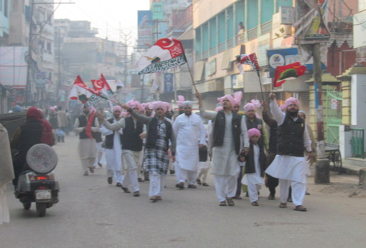
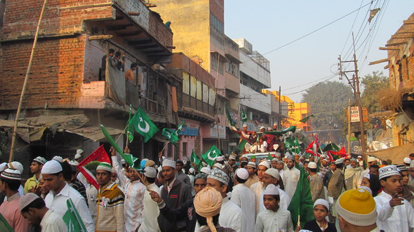
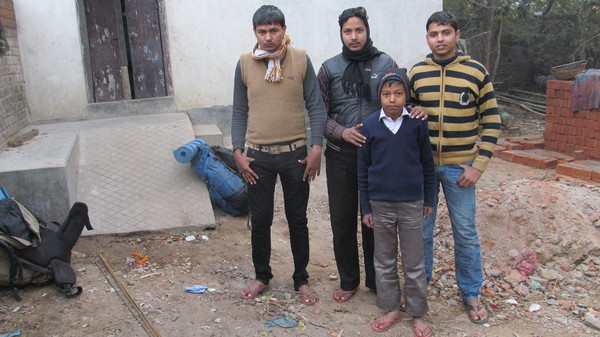
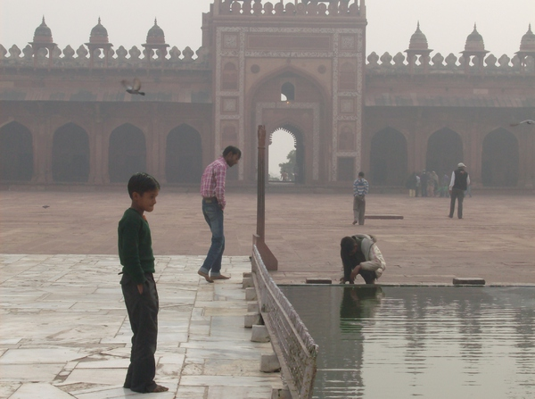
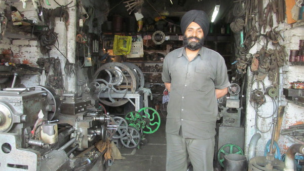
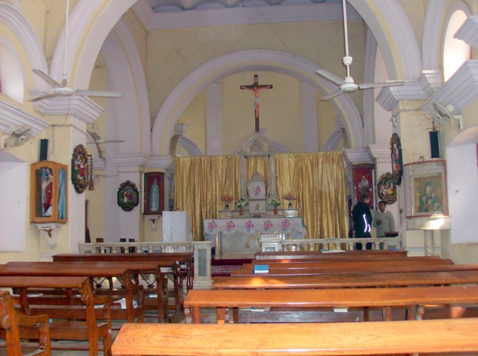

### Les musulmans

Lorsque j'étais à Bénarès, j'ai eu la chance d'assister à une manifestation religieuse islamique : Mawlid, c’est-à-dire la célébration de l'anniversaire de Mahomet.

Des musulmans, partout dans les rues, paradaient en brandissant des drapeaux et en scandant des slogans religieux.

Manifestation de musulmans pour la fête Malawid

17% de la population indienne est musulmane

Cette manifestation fut pour moi l'occasion de prendre conscience que l'Inde n'est pas seulement hindoue mais aussi le 3e plus grands pays musulmans au monde.

Alors, y-a-t-il des castes chez les musulmans ? La notion de pureté relative (essentielle pour parler de système de caste selon Louis Dumont), présente dans l'hindouisme, n'existe pas dans la religion de l'Islam. Peut-on quand même parler de système de castes chez les musulmans indiens ?

Après la fête de Mawlid, j'ai de nouveau l'occasion de rencontrer des musulmans sur ma route.

Alan (à droite) et ses frères

Alan est un jeune musulman, rencontré à Patna, capitale du Bihâr, il nous invitera dans sa famille qui nous hébergera un soir. La rencontre d’Alan m'a principalement aidé à comprendre que, comme les hindous, dans les villages, les musulmans vivent en groupes sociaux plus ou moins endogames qui s'insèrent dans la hiérarchie des autres castes.

Alan faisait partie d'une caste plutôt élevé. Mais il nous explique que tous les musulmans n'ont pas le même niveau social.

Et il avait peur qu'en nous voyant, les castes plus basses (et hindoues) ne fassent la confusion entre notre venue dans ce village et l'agrandissement de la maison familiale qui était en cours. D'après lui, les moins éduqués pourraient lancer des rumeurs comme quoi nous serions la cause de la richesse de la famille d'Alan

Mais revenons à la question du système des castes chez les musulmans.

Mosquée de Fathepur Sikri

Contrairement à l'idéologie sociale hindoue basée sur l'opposition du pur et de l'impur, l'Islam revendique aujourd'hui un système égalitaire.

Cependant, la situation actuelle contraste nettement avec cette volonté d'égalitarisme puisque des groupes sociaux musulmans semblent s'insérer dans la hiérarchie des castes hindoues.

Comment expliquer que les castes de musulmans s'insèrent dans le système hiérarchique des castes en Inde alors même que la notion de pureté rituelle n'a pas de sens chez les musulmans?

Dès la guerre de succession du Prophète au 7e siècle, l'appartenance à la famille du Prophète, à son clan ou à sa tribu est devenue un critère de différentiation social entre musulmans. Ce type de critère s’est conservé dans le sous-continent indien et l'on reconnaît une distinction entre les hautes castes d'origines arabes et les basses castes constituées de descendants de convertis à l'Islam.

Dans l’organisation sociale musulmane sud-asiatique, trois grandes catégories (ashrâf, ajlâf, arzâl) hiérarchisées émergent, à l’intérieur desquelles nous trouvons de nombreuses unités sociales interdépendantes et plus ou moins endogames, de taille variable, semblables à des castes ou des sous-castes dans l’hindouisme et inégalement réparties sur le territoire indien.

Au sommet de cette hiérarchie, nous avons les ashrâf (nobles), d’origine arabe, persane, turque ou afghane, se réclamant d’un lignage prestigieux, remontant jusqu’au Prophète, sa tribu ou ses compagnons.

Nombre d’ashrâf sont soit des oulémas (docteur de la loi coranique) soit des propriétaires terriens, des marchands ou des entrepreneurs. Le groupe de naissance constitue un critère majeur de définition du statut social et la distinction entre Arabes et non-Arabes reste fondamentale.

De niveau intermédiaire, les ajlâf (ignobles) représentent la masse, ils sont descendants de convertis à l’islam. Se rangent dans cette catégorie de nombreuses castes de statut intermédiaire comme les agriculteurs, les commerçants, les tisserands.

En bas de l’échelle sociale se trouvent enfin les arzâl (vils, vulgaires), c’est-à-dire un groupe rassemblant des non-intouchables et des « intouchables » convertis pratiquant, comme dans l’hindouisme, des métiers dits impurs : équarisseurs, blanchisseurs (Dhôbi), barbiers (Nâi, Hajjâm), tanneurs (Chamâr), etc.

A l’instar de la société de castes hindoue, les relations entre les groupes sociaux musulmans sont régies par une série d’interdits sociaux (commensalité, mariage, sociabilité) et spatiaux (accès aux espaces domestiques, aux lieux de prière, ségrégation dans les cimetières et les quartiers). Cependant, ces interdits visant à mettre à distance les hautes des basses castes ne sont pas fondés sur la notion de pollution rituelle.

Comme pour les hindous, ces règles s’assouplissent fortement en milieu urbain.

D'autres facteurs rentrent cependant en jeu dans la définition du statut social des individus et des groupes comme le niveau économique des ménages et le niveau d’éducation.

Ces trois grandes catégories hiérarchisées se subdivisent ensuite en de nombreux groupes et sous-groupes, lesquels constituent de véritables catégories d’identification sociale au niveau local, et dont la dénomination et la proportion varient également selon les régions.

On peut alors qualifier de castes ces groupes sociaux puisqu’ils sont fortement hiérarchisés entre eux en fonction de l’origine géographique, du groupe de naissance et de l’occupation professionnelle.

Comme dans les castes hindoues, il existe une certaine endogamie largement soutenue par la présence de mariages arrangés.

##### En résumé :

Bien que l'Islam se réclame égalitariste, les musulmans en Inde sont divisés en groupement sociaux fortement hiérarchisés en fonction de l'origine, la région et leur activité traditionnelle mais cette hiérarchie ne retient pas le critère de pureté.

Ces groupes sociaux, que l'on peut nommer "castes", sont de véritables catégories d'indentification sociale reconnues à l'échelle locale.

### Les sikhs

Un Sikh nous montre son atelier

Quand je suis arrivé à Delhi, j'ai pu être logé par la communauté Sikh. Cette communauté a aboli les inégalités de castes dès la fin du 17e siècle.

Cependant, cela ne veut pas dire que le système des castes n'existe plus chez les Sikh.

Certains disent que les castes existent mais qu'elles sont égales. D'autres disent que les castes ne devraient pas du tout exister.

On peut aujourd'hui facilement repérer différentes castes dans la communauté Sikh, c'est cependant difficile de dégager une hiérarchie verticale de ces castes.

D'autre part, chaque homme Sikh ajoute _"Singh"_ (Lion) à son nom et chaque femme ajoute _"Kaur"_ (princesse). Cette dénomination spécifique les rend facilement identifiable comme c'est le cas pour les membres des castes hindoues en Inde.

### Les chrétiens

Eglise Sainte-Marie à Agra

La question de l'inégalité entre les castes s'est toujours posée pour les chrétiens d'Inde. Les missions de conversions ont été de deux types :

Conversions des plus basses castes qui étaient plus sensibles à la cause du Christ car elles retrouvaient dans le christianisme une dignité et une considération qu'elles avaient perdues avec leur statut de caste.

Conversions individuelles dans les hautes castes : le père de Nobili, par exemple, a adopté le mode de vie des hautes castes, les conversions n'étant possibles qu'en se tenant éloigné des basses castes.

Les missions du passé ont laissé des traces. Encore aujourd'hui, certains indiens dénoncent les discriminations au sein de certaines églises (du sud de l'Inde particulièrement).

Alors que 3 chrétiens sur 4 est Dalit (intouchable), seuls 6 des 156 évêques indiens sont issus des basses castes en 2011. (source wikipédia)

Les minorités religieuses en Inde se positionnent toutes en défaveur du système des castes. Cependant, on observe par plusieurs aspects qu'elles sont absorbées par ce système.

[Article précédent](/castes/5)

[Article suivant](/castes/7)
