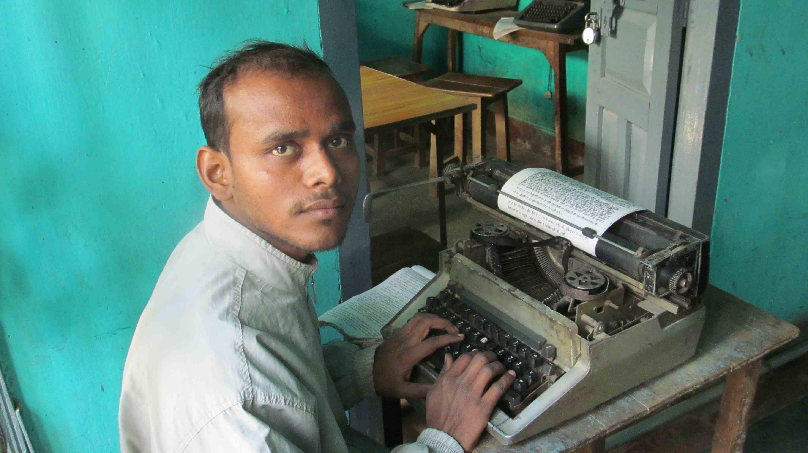

Dans cette première partie de voyage à la découverte du système des castes au Népal et en Inde, je me suis principalement intéressé aux villageois car leurs vies sont ancrées dans la tradition. C'est un bon moyen pour comprendre le système des castes dans sa version à la fois traditionnelle et actuelle puisque les deux tiers de la population Indienne est rurale.

Dans la tradition hindoue, la société est divisée en 4 catégories (les Varnas). Chaque catégorie ayant un rôle spécifique dans la société. Chaque Varna est à son tour subdivisé en une multitude de groupes appelés castes (ou jati). Une caste est bien souvent attachée à une activité traditionnelle. Au sein de la caste, les parents arrangent les mariages.

Les relations entre castes sont d'abord fondées sur le principe de pureté relative : les hautes castes doivent être tenues à l'écart des basses castes pour conserver leur pureté rituelle. A l'inverse, certains métiers impurs sont réservés aux basses castes, ce qui permet de ne pas souiller toute la société.

A partir de l'opposition du pur et de l'impur, s'organise hiérarchiquement les castes dans le village. Chaque caste a son rôle et les relations entre différentes castes sont héréditaires.

Concernant les autres religions, bien qu'elles ne reconnaissent pas le critère de pureté rituelle et qu'elles se déclarent égalitaristes, elles ont plus ou moins tendance à s'insérer dans le système des castes indien.

  En Inde, peu de gens ont un ordinateur. Cependant l'accès au numérique
  augmente considérablement

Après cette première partie sur le système des castes traditionnel, je me pose maintenant la question de l'avenir de ce système et ces évolutions avec l'arrivée du numérique. Comment le système des castes s'adapte-t-il à internet?

Pour cela, après avoir vu qui sont les utilisateurs d'internet aujourd'hui, je vais expliquer que le numérique est effectivement un bon angle pour appréhender le futur de la caste puisque l'accès à l'Internet explose en Inde, la présence des castes sur internet concernera une grande proportion de la population dans le futur.

Je poserais ensuite la question de savoir si l'internet favorise ou défavorise la conservation de l'identité de caste. Je prendrais deux sites internet en exemple. Un site de réseau social importé d'Europe, couchsurfing.com, qui est un espace complètement en marge du système des castes. L'autre, le site matrimonial shaadi.com, créé par un indien, qui s'adapte au plus près pour conserver la tradition du système des castes.

Puis, je regarderais qui discute des castes sur les réseaux sociaux. Nous verrons qu'il existe deux grands types de communauté virtuelle :

- Les groupes propres à une caste en particulier qui sont un espace adapté au communautarisme de caste.
- Les groupes traitant de sujets en rapport avec la caste qui sont une interface idéal pour la discussion de la caste.

Ce dernier type de communauté virtuelle me permettra aussi de faire le point sur
les enjeux actuels du système de caste qui sont notamment discutés sur les réseaux
sociaux.

La 2e partie s'appuie moins sur des rencontres mais plus sur des informations venues d'internet.

[Article précédent](/castes/6)

[Article suivant](/castes/8)
