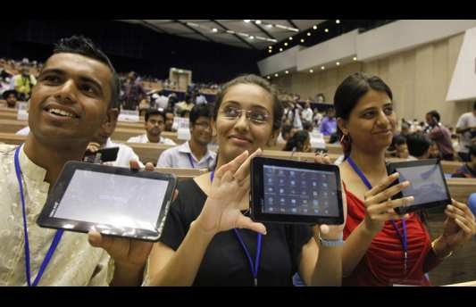
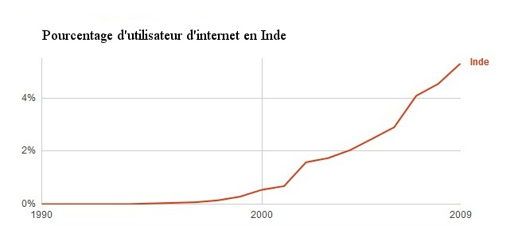
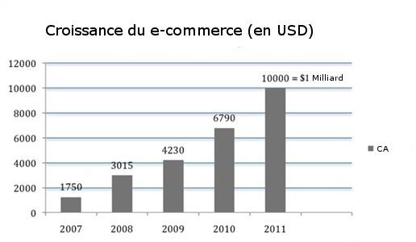

Lors de mon voyage, dans la plupart des villages et la totalité des villes où je suis allé, au moins une personne utilisait internet et avait un compte facebook dont ils me donnaient l'identifiant pour que nous restions en contact. Cependant, en milieu rural, l'accès internet restait assez difficile à cause de l'absence de structures adaptées (cybercafés, réseau 3G)

Dans cet article, nous allons voir qui sont les internautes en Inde aujourd'hui et dans quelle mesure leur nombre explose.

### On estime à 121 millions le nombre d'utilisateurs d'internet en janvier 2012, qui sont-ils?

**Urbain ou rural ?**

C'est en ville qu'il est le plus facile de croiser des internautes.

> **IMAI** est l'association indienne pour le développement et l'amélioration des services internet et mobiles.

En effet, malgré un taux d'urbanisation de 30% en2011, c'est en ville que l'on trouve 3/4 des internautes. Cependant le nombre d'internautes ruraux ne cesse d'augmenter. En 2011, il a doublé pour atteindre 24 millions et cette tendance devrait s'accentuer d'après l'IMAI.

**Homme ou femme ?**

Les utilisateurs d'internet sont majoritairement des hommes, 95% des utilisateurs d'internet sur téléphone mobile sont des hommes

(Source: on device research opera software)

72% des profils facebook en Inde sont des hommes. (Source: facebook)

**Quel niveau social ?**

Les faibles taux d’accès à Internet dans les pays en voie de développement tels que l’Inde sont souvent liés aux faibles taux de possession d’ordinateurs personnels et au coût élevé du matériel. Internet reste un outil onéreux dans ce pays. En plus de ces facteurs économiques, il y a une série de barrières cognitives telles que le faible niveau d’alphabétisation, le manque de connaissances de la langue anglaise ou le manque de connaissances électroniques, qui empêchent une utilisation efficace de ces nouvelles technologies (Warschauer, 2003).

  la tablette Aakash est bon marchée, elle est principalement déstinée aux
  étudiants

L'une des clefs de la propagation d'internet en Inde sera la traduction du contenu en différentes langues. Mais avec 23 langues officielles, ce ne sera pas une mince affaire.

Pour diminuer la fracture sociale, le gouvernement est en train de lancer un Ipad low-cost, connu sous le nom de Aakash. Il coûte environs 40€. Le gouvernement espère ainsi toucher les étudiants.

Ainsi, les utilisateurs d'internet en Inde aujourd'hui sont à grande majorité des hommes, bien souvent urbains. Ils sont assez riches pour pouvoir se procurer un accès à internet et plutôt éduqués (ils connaissent un peu l'anglais!!)

### La proportion des internautes en Inde ne cesse d'augmenter :

Pour m'intéresser au numérique en Inde, je choisis de me diriger vers les grandes villes. Et pourquoi ne pas commencer par Delhi, la capitale indienne.

Je suis à Delhi, j'ai entendu parler de la mise sur le marché de la tablette Aakash qui permettrait de surfer sur internet à moindre coût (environs 60€ pour la tablette et la clé 3G)

Je cherche à me procurer cette fameuse tablette, mais on m'indique qu'elle est en rupture de stock et que je ne peux espérer m'en procurer une avant 2 mois.

Si cette tablette est en rupture de stock, c'est parce qu'elle est très demandée.

Avoir accès à internet à bas coût devient de plus en plus important pour une partie de la population.

Et en effet, comme dans beaucoup d'autres pays, on observe une explosion du nombre d'utilisateurs d'internet.

  Proportion d'utilisateur d'internet en Inde d'après Google.

En 2012, 121 millions d'indiens utilisent l'internet, soit 10% de la population indienne. Mais cette proportion ne cesse d'augmenter. (Source : CIA World Fact Book)

  D'après l'IMAI, le e-commerce 40 milliards de $ en 2015

Notamment, on observe une monté du E-commerce, du M-commerce, une explosion du nombre d'utilisateurs des sites matrimoniaux et des réseaux sociaux Facebook et Orkut.

Cela laisse à penser que le numérique va avoir un rôle de plus en plus important dans la société indienne.

Dans la suite de mes articles, je m'intéresse à une minorité de la population, mais cet échantillon de la population indienne (les utilisateurs d'internet) ne va cesser d'augmenter dans les années qui suivent.

S'intéresser aux utilisateurs d'internet, c'est donc s'intéresser au futur de l'Inde. Ce qui se passe maintenant sur internet à propos des castes risque de concerner une grande partie de la population indienne dans les années à venir. C’est la raison pour laquelle je vais m'intéresser au devenir de la caste sur internet.

Dans le prochain article, nous allons comparer deux sites internet. L'un, couchsurfing.org, a complètement ignoré la caste; l'autre, shaadi.com, a décidé d'intégrer la caste comme partie intégrante de l'identité virtuelle des indiens.

[Article précédent](/castes/7)

[Article suivant](/castes/9)
