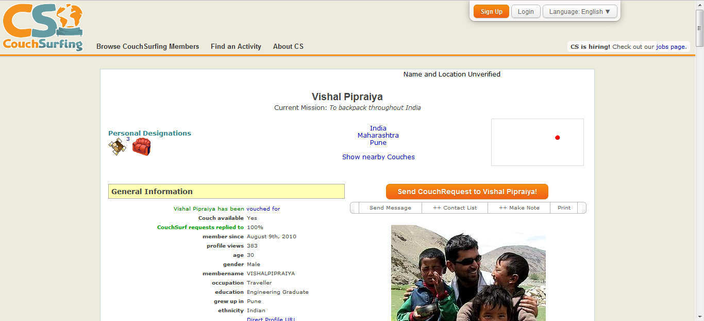
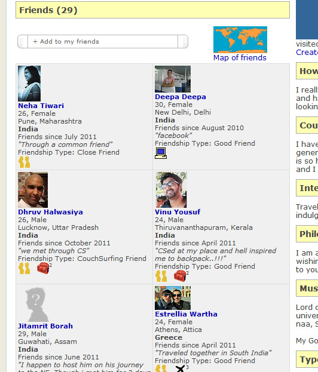
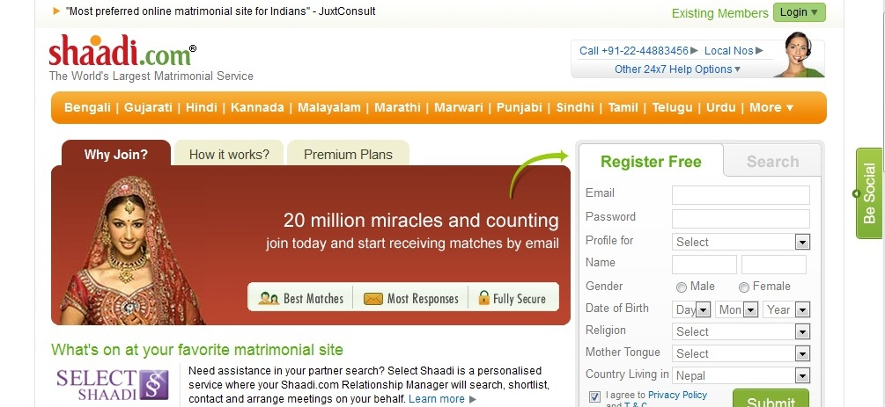
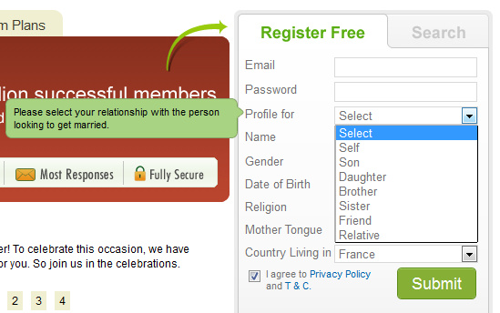
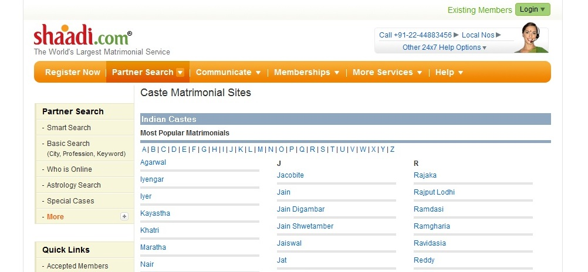
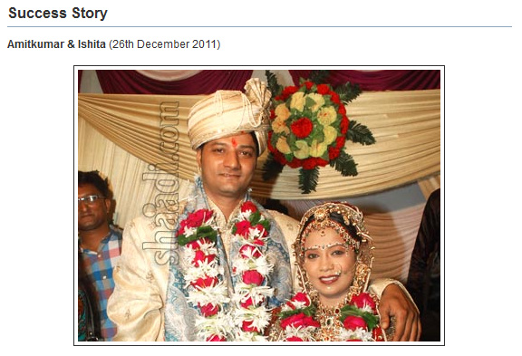

Durant mon voyage, afin de rencontrer la population locale, j'utilise le réseau couchsurfing. Lors mes recherches sur la caste et internet, ce site est particulièrement avantageux. Il me permet d'être directement en relation avec des internautes !

Le site de couchsurfing met en relation les voyageurs avec des personnes qui peuvent les héberger. Le critère de la caste est-il pris en compte dans la mise en relation de deux personnes?

Le site Shaadi.com est le plus grand site matrimonial indien. Dans un pays où le mariage arrangé à l'intérieur d'une caste reste de loin la pratique la plus commune, dans quelle mesure ce site matrimonial tient compte de la caste dans la mise en relation des partenaires ?

Voyons comment ces deux sites traitent le problème de l'identité de caste.

### Couchsurfing.com, un site qui ignore la caste

  Profil de l'indien Vishal sur le site couchsurfing.org

Couchsurfing, est un site français exporté à l'international. Dans la description des profils, il n'est pas fait mention de la caste. Le "nom de famille" peut toutefois être un fort indicateur de la caste mais sur le site, il n'est pas nécessaire de le remplir.

Quand je recherche un couchsurfer pour m'héberger, il m'est quasiment impossible de discerner à quelle caste appartient mon future hôte.

Plus qu'un site web, le couchsurfing est une philosophie. Le but est de créer des amitiés entre personnes ayant un intérêt commun, au-delà de toute différence culturelle et sociale.

L'absence du critère de la caste s'inscrit parfaitement dans la philosophie de cette communauté.

Il arrive donc qu'un indien héberge un autre indien. En regardant les profiles des indiens sur le site, on peut voir leurs liens d’amitiés. Par exemple, en octobre 2011, Dhruv a hébergé Vishal. Ils sont maintenant amis et ils restent en contact. Ils sont allés l'un chez l'autre sans se préoccuper de quelle caste ils sont.

La plupart des amis de Vishal sont des indiens

On peut se demander si les sites internet indiens vont évoluer dans ce sens, sans mention de la caste.

Cependant il faut relativiser : seul 850 indiens sont membres du couchsurfing (nombre de membre en Avril 2012 ; sur plus de 700000 membre sur le globe). De plus, les membres de ce réseau ont un profile assez particulier. Souvent aventureux, sociables et à contre-courant ; ils ne sont pas un bon échantillon de la population des internautes indiens.

### Shaadi.com, un site matrimonial qui prend en compte l'identité de caste

  Page d'accueil du site matrimonial indien Shaadi.com

Sur internet, l'arrivée des réseaux sociaux a été précédée de la création des sites de rencontre matrimoniaux.

En Inde, le plus connu et le plus fréquenté est shaadi.com

Quelle est la place de la caste sur ce site de rencontre matrimonial? Comment se positionne-t-il quant au mariage arrangé ?

Ce site internet favorise-t-il les mariages inter-castes? Ou bien renforce-t-il l'endogamie?

  Sélection de la personne que l'on cherche à marier sur shaadi.com

Pour créer un profile, il faut spécifier sa caste, ou plutôt, la caste de la personne à marier ! En effet, sur shaadi.com, vous pouvez rechercher un mari (ou une femme) pour votre enfant, votre frère/sœur ou votre neveu/nièce.

Et c'est un pratique courante, il n'est pas rare de voir des messages telles que : "We are looking for a suitable match for our daughter. She is working in[…] "

Ce message témoigne d'une organisation du site qui permet de respecter la tradition du mariage arrangé.

J'ai donc voulu me créer un profile fictif pour voir quel rôle avait la caste dans l'intérêt que portent les partenaires aux profiles.

Il ne m'a pas été possible de créer un tel profil pour divers raison : difficultés de faire concorder caste, région et noms; impossibilité de procurer une adresse et un numéro de téléphone valide.

Cela ne m'empêche pas de pouvoir observer ce site et faire des recherches.

En plus de permettre le mariage arrangé, les options de recherche facilitent le filtrage pour trouver une personne de la bonne caste.

Vous pouvez trier les profiles par région, par religion et par caste.

  Tri des profiles par caste sur le site internet shaadi.com

Dans la description des profils, il n'est pas rare de voir un avertissement tel que : "ONLY Schedule cast or jatav's". Pour expliciter l'endogamie de caste voulue par la personne ou par sa famille.

Photo d'une succes-story sur shaadi.com

Dr Prakriti, l'experte en conseil du site internet confesse : "Women in India are more likely to first look for their own ethnic group and their own religious background and sometimes, even their own caste."

Concernant le mariage inter-caste, il apparaît assez marginal et difficile. Il est même difficile d'avoir ses parents qui viennent de castes différentes. Pour trouver une femme ou un mari, la personne ne peut plus se reposer sur son identité de caste.

Un membre de Shaadi témoigne : "I registered on Shaadi.com a year ago. I’m currently working in Bhopal and my family is based in Surat. My parents had an inter-caste marriage. I think this is one reason, why I’m unable to find the right match."

Ainsi, on pouvait penser que les moyens de communication modernes effaceraient peu à peu les traces du mariage arrangé et de l'importance de la caste dans le choix de la personne à marier. Pas du tout ! Au contraire, sur le site Shaadi, internet rend explicite La pratique du mariage arrangé et l'importance de l'identité de caste.

Nous avons donc vu, à travers ces deux exemples, que l'évolution d'internet en faveur ou en défaveur de la caste n'était pas tranchée. D'un côté internet permet de créer des relations indépendamment de l'identité de caste. D'un autre côté, quand il est question de la caste, internet fixe l'identité de caste et la rend explicite.

[Article précédent](/castes/8)

[Article suivant](/castes/10)
