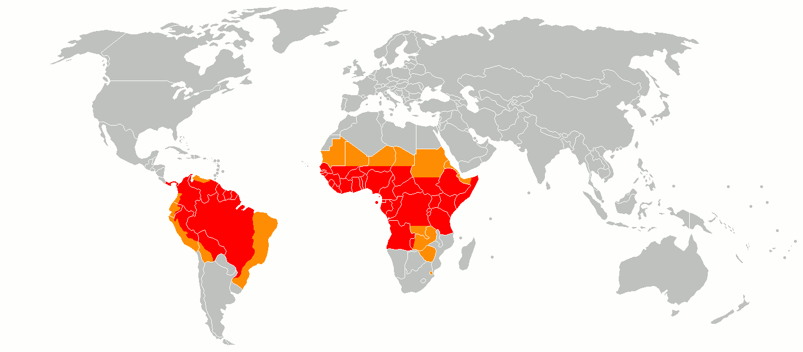
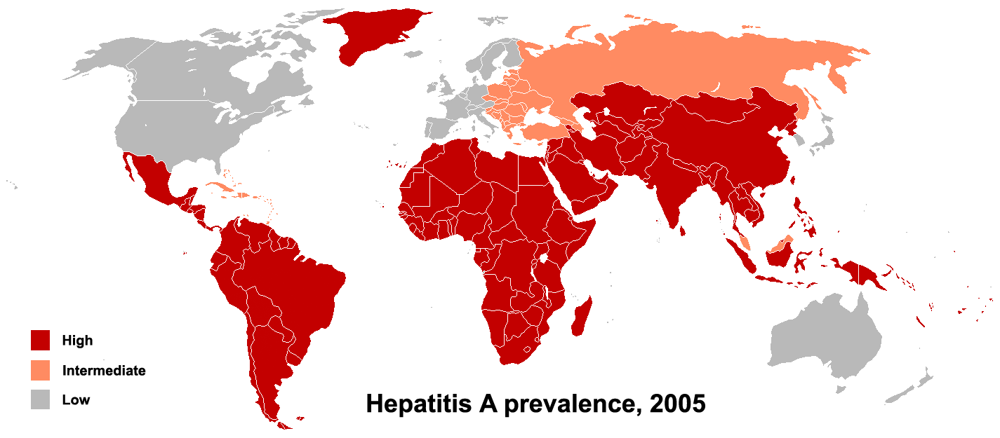
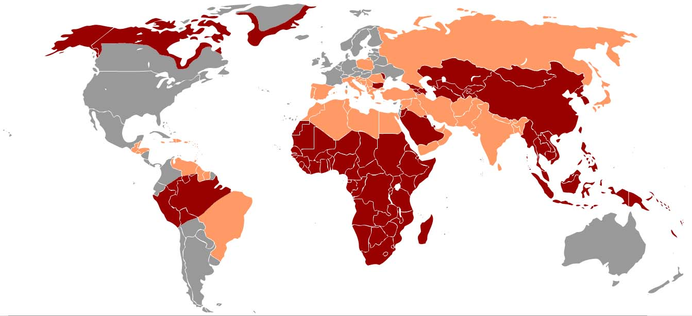
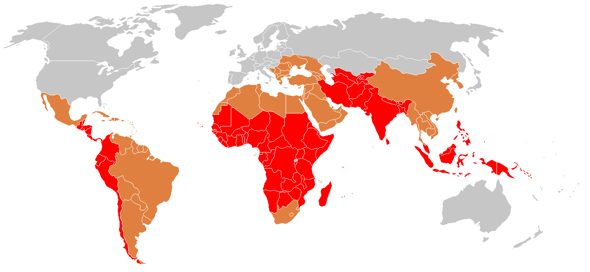
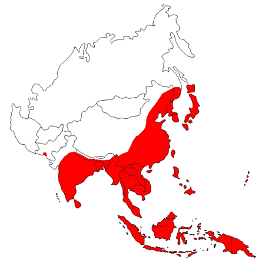

Ils coûtent chers, obligent à préparer le voyage à l'avance, ne sont pas toujours

très efficaces, sont la phobie de certains dont nous tairons ici le nom... mais peuvent aussi sauver la vie ! Voici leur page !

Voici donc un petit résumé des informations dont nous avons eu besoin pour nous décider à choisir les vaccins à faire.

La liste des vaccins est exhaustive. Les prix peuvent varier d'une pharmacie à l'autre (valable en 2011)

### Fièvre jaune

- Prix : 34€/dose
- Traitement : Une injection au moins 10 jours avant le départ. Rappel tous les 10 ans
- Où se faire vacciner: Dans un centre de vaccination
- Zones à risque: Indispensable en zone intertropicale d'Afrique et d'Amérique du Sud

- Remboursé par la sécurité sociale: Non
- La maladie: Elle est transmise par un moustique. Le risque est élevé en zone forestière ou rurale. La plupart des malades voient leur état s'améliorer au bout de 3 à 4 jours. Toutefois dans 15% des cas la maladie évolue vers une forme plus grave. La fièvre jaune est mortelle dans 50 à 80% des cas graves. Aucun traitement possible après la piqûre. Le sujet est contagieux
- Efficacité du vaccin: efficace sur 95% des personnes vaccinées
- Notre note: Nous ne pouvons pas y échapper car nous passons dans des pays à risque et il nous ait interdit d'entrer dans un autre pays si nous ne sommes pas vaccinés

### Hépatite A (Havrix/Avaxim)

- Prix : 45€/dose
- Traitement: Une injection 15 jours avant le départ. Rappel 6 à 12 mois plus tard puis tous les 10 ans
- Où se faire vacciner: Dans un centre de vaccination ou chez un généraliste
- Zones à risque: Dans des endroits où l'hygiène est précaire

- Remboursé par la sécurité sociale : Non
- La maladie: Elle s'attrape par la nourriture et l'eau ou par exposition à une personne contaminée. Elle n'est pas mortelle
- Efficacité du vaccin: Très efficace et bien toléré
- Notre note: Nous n'avions que le rappel à faire

### Hépatite B

- Prix : 26€/dose
- Traitement: 2 injections à 1 mois d'intervalle
- Où se faire vacciner: Dans un centre de vaccination ou chez un généraliste
- Zones à risque: Pays où l'accès aux soins est aléatoire

- Remboursé par la sécurité sociale : Oui
- Notre note: Déjà vaccinés pendant l'enfance

### Rage

- Prix : 40€/dose
- Traitement: 3 injections : 1er jour, 7ème jour, 28ème jour. Puis rappel 1 an plus tard. Ensuite : rappel tous les 5 ans
- Où se faire vacciner: Dans un centre de vaccination ou chez un généraliste
- Zones à risque: Séjour prolongé ou aventureux dans un pays à haut risque (Asie, Inde)
- Remboursé par la sécurité sociale : Non
- La maladie: anxiété, confusion, agitation avec troubles du comportement, les hallucinations, insomnies. La production de grande quantité de salive et de larmes avec difficulté de déglutition sont typiques des phases avancées. Spécifiquement chez l'homme se développe également en fin d'évolution une hydrophobie : la vue de liquide provoque une peur non raisonnable, alors que le contact entraîne des sensations de brûlures insoutenables. La mort, quasiment inévitable, survient de deux à dix jours après les premiers symptômes.
- Notre note: 120€ c'est relou, mais un peu moins que la description au-dessus. F\*\*\* les débats "faut-il faire ce vaccin ou pas..." Ne prendre aucun risque, nous on estime que ça vaut bien ce prix !

### Diphtérie, tétanos, poliomyelite, coqueluche (Repevax)

- Prix : 38€/dose
- Traitement: Injections obligatoires à l'âge de : 2mois, 3mois, 4mois, 16-18mois, 6ans, 11-13ans, 16-18ans. Puis rappels tous les 10 ans (dose spéciale rappel (Revaxis) à 20€)
- Où se faire vacciner: Chez un généraliste
- Zones à risque: Recommandée partout... pour les voyageurs ou non. Mais d'autant plus important en zone à risque : Asie du Sud-Est et ex URSS
- Remboursé par la sécurité sociale : Oui

### Typhoïde (Typhim/Typherix)

- Prix: 33€/dose
- Traitement: Une injection 15 jours avant le départ. Rappel tous les 3 ans
- Où se faire vacciner: Chez un généraliste ou dans un centre de vaccination
- Zones à risque: Séjour prolongé dans un pays où l'hygiène est précaire

- Remboursé par la sécurité sociale : Non
- La maladie: elle s'attrape par la nourriture et l'eau. Décès dans 30 % des cas en l'absence de traitement
- Remarques: Il est censé exister un vaccin Typhoïde/Hépatite A (à confirmer)

### Encéphalite à tiques

- Prix : 35€/dose
- Traitement: 3 injections : 1er jour, 1-3mois, 5-12mois. Rappel tous les 5 ans (3 ans pours les +60 ans). 3ème injection à faire juste avant le printemps.
- Où se faire vacciner: Dans les centres de vaccinations uniquement
- Zones à risque: Activités rurales (randonnées, camping...), du printemps à l'automne, en zone à risque (notamment Europe centrale et Orientale) 
- Remboursé par la sécurité sociale : Non
- La maladie: Elle est transmise par des piqûres de tiques. Exceptionnellement, elle peut être transmise lors de la consommation de lait de vache ou de chèvre non pasteurisé. La maladie est habituellement bénigne (syndrômes gripaux). Le décès et les séquelles neurologiques sont rares. Le risque d'infection est saisonnier : du printemps à l'automne inclus (d'avril à octobre)
- Efficacité du vaccin: 1 injection : 50-75% après 4 semaines, 3 injections : 98%.
- Remarques: En cas d'urgence, on peut appliquer un schéma accéléré pour une réponse immunitaire rapide (3 doses) : - 2 injections aux jours 1 et 14 - 1 troisième injection après 9-12 mois.

### Encéphalite japonaise

- Prix : 98€/dose
- Traitement: 2 injections : 1er jour et 28ème jour. Rappel tous les 3 ans. A faire une semaine avant l'exposition
- Où se faire vacciner: Dans les centres de vaccinations uniquement
- Zones à risque: Séjour de plus d'un mois en zone rurale pendant la saison des pluies en Asie du Sud et de l'Est

- Remboursé par la sécurité sociale: Non
- La maladie: Elle s'attrape via les moustiques
- Notre note: Nous n'avons pas prévu de le faire car nous n'allons pas en Asie pendant la saison des pluies

### Méningite A+C

- Prix : 33€/dose
- Traitement: Une injection 10 jours avant le départ. Rappel tous les 3 ans.
- Où se faire vacciner: Dans les centres de vaccinations
- Zones à risque: Dans certaines zones d'Afrique
- Remboursé par la sécurité sociale : Non

### Méningite A+C+W135+Y

- Prix : 60€/dose (Menveo), 48€/dose (Mencevax)
- Traitement: Une injection 15 jours avant le départ. Rappel tous les 3 ans.
- Où se faire vacciner: Dans les centres de vaccinations
- Zones à risque: Obligatoire dans le cas de pélerinage de La Mecque et de Médine.
- Remboursé par la sécurité sociale : Non
- Notre note : Nous avons décidé de nous de nous faire vacciner uniquement contre les méningites A et C mais le médecin du centre de vaccination nous a dit que Mencevax va disparaître dans les années à venir car Menveo est bien plus efficace

### Quelques liens utiles

- [Les centres de vaccination en France](http://www.muskadia.com/sante/centres_de_vaccination_en_france.asp)
- [Un site](http://www.vaccinations-voyages.com) très complet sur les vaccinations pour les voyageurs qui reprend et détaille le tableau ci-dessus.
- [Le site du quai d'Orsay](http://www.diplomatie.gouv.fr/fr/conseils-aux-voyageurs_909/index.html) : la référence pour s'assurer des vaccins recommandés pour entrer dans chaque pays.
