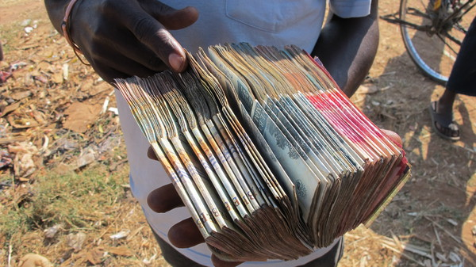

Beaucoup de pays imposent un droit d'entrée aux douanes. Pour faire le tour du monde, il y a donc un vrai budget visa à prévoir. Mais cela demande également beaucoup d'organisation : peut-on l'obtenir à la frontière ? Sinon où ? Combien de temps pour l'obtenir ? Quels papiers ?

Voici quelques informations à propos des visas que nous avons obtenus.

Ces informations étaient valables en 2011 pour les français. Lors de recherches, il faut privilégier les sources récentes : tout peut changer très vite.

Pour plus d'info, la référence reste : [le site du quai d'Orsay](http://www.diplomatie.gouv.fr/fr/conseils-aux-voyageurs_909/index.html) : chaque pays a un paragraphe intitulé "Entrées/Sorties" qui explique les formalités à suivre. Une mine d'information est aussi [le site des froggys](<(http://tourdumonde2010.free.fr/wordpresstdm/)>) !

### Afrique du Sud

Entrer en Afrique du Sud ne nécessite pas de visa. Nous avons obtenu notre tampon sud-africain à l'aéroport de Johannesburg très facilement.

**Voici la liste des papiers dont il faut se munir :**

1. Le formulaire de passage de douane distribué aux postes frontière ou dans l'avion
2. Passeport valide jusque 30 jours après la fin du séjour et avec au moins une page vierge.
3. Certificat de vaccination si vous avez un tampon d'un pays touché par la fièvre jaune (en Afrique ou en Amérique du Sud). <a href='vaccins.php' target='_blanck'>En savoir plus</a>
4. La preuve de moyens financiers suffisants : RIB ou relevé bancaire
5. Le billet de retour ou de continuation du voyage

En pratique, rien de tout cela ne nous a été demandé. Le formulaire et le passeport ont fait l'affaire.

Ceci est valable pour un séjour de moins de 90 jours.

**Pour plus d'informations :**

- [le site de l'ambassade d'Afrique du Sud à Paris](http://www.afriquesud.net/)
- [La page Afrique du Sud du site du ministère des affaires étrangères](http://www.diplomatie.gouv.fr/fr/conseils-aux-voyageurs_909/conseils-par-pays_12191/afrique-du-sud_12193/index.html)

### Namibie

Entrer en Namibie ne nécessite pas de visa. Nous sommes entrés en Namibie par le poste frontière de <a href='http://maps.google.fr/maps?q=Noordoewer,+Karas,+Namibia&hl=fr&ll=-28.72913,17.62207&spn=7.915409,14.128418&sll=46.75984,1.738281&sspn=6.186683,14.128418&vpsrc=6&hnear=Noordoewer,+Karas,+Namibie&t=m&z=6' target='_blanck'>Noordoewer</a> sans difficultés.

**Voici la liste des papiers dont il faut se munir :**

1. Le formulaire de passage de douane distribué aux postes frontière ou dans l'avion
2. Passeport valide au moins 6 mois après la fin du séjour et avec au moins deux pages vierges.

Le séjour ne doit pas excéder 90 jours.

**Pour plus d'informations :**

- [La page de Namibie du site du ministère des affaires étrangères.](http://www.diplomatie.gouv.fr/fr/conseils-aux-voyageurs_909/conseils-par-pays_12191/namibie_12297/index.html)

### Zambie

Un visa est nécessaire pour entrer en Zambie. Nous sommes entrés en Zambie par le poste frontière de <a href='http://maps.google.fr/maps?q=Katima+Mulilo,+Caprivi,+Namibie&hl=fr&ll=-17.518344,24.301758&spn=17.167636,28.256836&sll=-28.72913,17.62207&sspn=7.915409,14.128418&vpsrc=6&hnear=Katima+Mulilo,+Caprivi,+Namibie&t=m&z=5' target='_blanck'>Katima Mulilo</a>. Le visa s'obtient directement à la frontière. **Il nous a coûté 50 USD**. Malgré les nombreuses banques présentent à Katima Mulilo, il n'est pas évident d'y trouver des dollars : soit le système informatique de la banque ne fonctionne pas et il est donc impossible de faire du change ; soit il n'y a pas de dollars dans les caisses. De plus les banques ferment à 15h. Le mieux est donc de s'en procurer à Windhoek. Nous avons eu la chance d'en trouver dans la dernière banque de notre marathon aux dollars.

Nous cherchions à tout prix des dollars avant d'atteindre la frontière car nous ne savions pas s'il était possible de payer en dollars namibien ou en kwacha zambien. En fait, c'était possible mais à un taux très désavantageux. Il est aussi possible de se procurer des dollars au poste frontière au noir. Cette option n'est conseillée qu'aux bons négociants qui connaissent le taux des monnaies ! En revanche, il n'y a pas de distributeurs de billets à la frontière. Il faut donc avoir l'équivalent de 50USD en cash avant d'arriver au poste frontière.

Business men aux frontières d'Afrique

**Voici la liste des papiers dont il faut se munir :**

1. Le formulaire de passage de douane distribué aux postes frontière ou dans l'avion
2. Passeport

Le séjour ne doit pas excéder 90 jours. Mais attention, pour nous, le temps accordé était celui que nous avions spécifié sur notre formulaire d'entrée en Zambie.

**Pour plus d'informations :**

- [La page de Zambie du site du ministère des affaires étrangères.](http://www.diplomatie.gouv.fr/fr/conseils-aux-voyageurs_909/conseils-par-pays_12191/zambie_12303/index.html)

### Malawi

Entrer au Malawi ne nécessite pas de visa. Nous sommes entrés au Malawi par le poste frontière de [Chitipa](http://maps.google.fr/maps?q=Chitipa,+Malawi&hl=fr&ie=UTF8&ll=-9.535749,34.958496&spn=8.897559,14.128418&sll=-17.518344,24.301758&sspn=17.167636,28.256836&vpsrc=6&hnear=Chitipa,+District+de+Chitipa,+R%C3%A9gion+Nord,+Malawi&t=m&z=6). **Attention :** traverser la frontière à ce poste est une vraie aventure. C'est un petit poste frontière perdu au milieu de nul part : peu d'africains y passent et nous sommes surement les seuls touristes de l'année à y être passé. Peu de locaux savaient qu'il était possible de traverser la frontière ici et nous redirigeaient vers la route reliant Lusaka à Lilongwe. D'autres routes au nord de la Zambie relient le Malawi d'après Google Map. Elles ne sont pas praticables.

Attention également, il faut obtenir le tampon de sortie de Zambie à [Naconde](http://maps.google.fr/maps?q=Nakonde,+Province+Septentrionale,+Zambie&hl=fr&ll=-9.275622,32.695313&spn=8.904219,14.128418&sll=-12.704651,34.804688&sspn=8.801802,14.128418&vpsrc=6&geocode=FVWYcf8dlMzzAQ&hnear=Nakonde,+Province+Septentrionale,+Zambie&t=m&z=6) car il n'y a pas la possibilité de l'obtenir à la **cabane frontière** poste frontière. Nous ne le savions pas et avons donc faillit dû retourner à Naconde pour l'obtenir... Brrr... ça nous donne des frissons dans le dos rien que d'y penser. Retourner à Naconde puis revenir au poste frontière... ce trajet de 2h est l'un des moins confortable de notre voyage en Afrique.

Le garde-frontière du Malawi a bien remarqué que nous n'avions pas de tampon de sortie de Zambie mais après avoir insisté, après un petit coup de fil au supérieur, il nous laisse "exceptionnellement" entrer au Malawi.

**Voici la liste des papiers dont il faut se munir :**

1. Le formulaire de passage de douane distribué aux postes frontière ou dans l'avion
2. Passeport valide au moins 6 mois après la fin du séjour et avec au moins deux pages vierges.

Le séjour ne doit pas exceder 90 jours.

**Pour plus d'informations :**

- [La page du Malawi du site du ministère des affaires étrangères.](http://www.diplomatie.gouv.fr/fr/conseils-aux-voyageurs_909/conseils-par-pays_12191/malawi_12285/index.html)

### Mozambique

Entrer au Mozambique nécessite un visa. Nous sommes entrés au Mozambique par le poste frontière de [Metangula](http://maps.google.fr/maps?q=Metangula,+Mozambique&hl=fr&ll=-12.704651,34.804688&spn=8.801802,14.128418&sll=-12.626268,34.893265&sspn=0.275387,0.441513&vpsrc=6&hnear=Metangula,+Lago,+Province+de+Niassa,+Mozambique&t=m&z=6) sans difficultés.

Nous avions fait la demande de visa en France comme le consulat le conseillait. Il semblerait que l'obtention du visa aux frontières avec la Tanzanie et le Zimbabwe soit problématique. Nous pensions arriver au Mozambique depuis le Zimbabwe, c'est pourquoi nous avions réalisé la procédure en France.

En prenant le ferry Ilala depuis le Malawi, l'obtention du visa à Metangula aurait aussi posé un problème, sans visa, nous aurions dû débarquer à Cobue (au lieu de Metangula) où il est possible d'obtenir le visa du Mozambique. Le tampon de sortie du Malawi se fait à bord du ferry Ilala lorsqu'il accoste l'île de Likoma. Soit le garde-frontière monte à bord d'Ilala pour tamponner les passeports des voyageurs, soit il faut se rendre au poste sur l'île. Dans tous les cas, descendre sur l'île est une bonne idée car le bateau s'arrête pour de nombreuses heures.

**Voici la liste des papiers dont il faut se munir pour réaliser le visa à l'ambassade du Mozambique à Paris :**

1. Le formulaire rempli
2. Passeport valide jusque 6 mois après la fin du séjour et avec au moins une page vierge.
3. Une photocopie du passeport
4. 2 photos d'identité
5. Attestation de voyage (billet d'avion, certificat d'hébergement)
6. Un chèque de 40 euros

Le séjour ne doit pas excéder 90 jours.

**Pour plus d'informations :**

- Ambassade du Mozambique à Paris

82, rue Laugier. 75017 Paris

Tél. : 01 47 64 91 32

Ouverture du Lundi au vendredi

Heures des dépôts et des retraits : 09h30 à 12h00

- [La page du Mozambique du site du ministère des affaires étrangères.](http://www.diplomatie.gouv.fr/fr/conseils-aux-voyageurs_909/conseils-par-pays_12191/mozambique_12296/index.html)

- [Site Visa-Office](http://www.visa-office.fr/spip.php?article46)

### Tanzanie

Un visa est nécessaire pour entrer en Tanzanie. Nous venions du Mozambique, nous avons obtenu facilement notre visa tanzanien au poste frontière de [Kitunguli](http://g.co/maps/bt8nq).

Là encore, s'y rendre est une grande aventure. Pourtant, nous sommes passés par le poste frontière principal reliant le Mozambique et la Tanzanie. Les échanges terrestres entre le Mozambique et la Tanzanie sont très limités. Nous avons passé une semaine pour relier Nampula à Dar Es Salam. Passer ce poste frontière est impossible en voiture car il faut traverser une rivière et il n'y a pas de pont. Nous devions donc traverser avec des petites embarcations. Il faut prévoir de se munir de dollars dès Nampula mais autrement on peut payer en Mtcs et il y a des personnes qui font du change à la frontière. Il faut négocier pour obtenir un taux convenable. Le plus important est de connaître le taux pratiqué dans les banques à l'avance. Compter 350Mtcs/pers pour aller de Mocimboa à la frontière. Les départs se font très tôt le matin 2-3h du matin et il est très difficile de trouver un véhicule après.

**Le prix du visa est de 50USD** mais il est aussi possible d'obtenir un visa de transit donnant un droit d'entrée dans le pays de 14 jours. Il coûte 30USD mais nous ne sommes pas censé faire du tourisme avec ce visa (pas de parc animalier, pas de voyage à Zanzibar). Puisque nous étions pressés de rejoindre le Kenya, le visa de transit correspondait exactement à nos besoins.

**Voici la liste des papiers dont il faut se munir :**

1. Le formulaire de passage de douane distribué aux postes frontière ou dans l'avion
2. Passeport valide au moins 6 mois après la fin du séjour et avec au moins une pages vierges.

**Pour plus d'informations :**

- [La page de Tanzanie du site du ministère des affaires étrangères.](http://www.diplomatie.gouv.fr/fr/conseils-aux-voyageurs_909/conseils-par-pays_12191/tanzanie_12326/index.html)

### Kenya

Il faut un visa pour entrer au Kenya. Il s'obtient facilement au poste frontière. Nous sommes entrés Kenya par le [poste frontière](http://maps.google.fr/maps?q=Tanga,+Tanzania&hl=fr&ll=-4.67498,39.572754&spn=8.991678,14.128418&sll=-2.510822,32.912773&sspn=0.035243,0.055189&vpsrc=6&hnear=Tanga,+Tanzanie&t=h&z=6) entre Pamba et Mombassa sans difficultés.

**Il coûte 50USD**. Le visa de transite n'est valable que pour 72h et coûte 15USD.

**Voici la liste des papiers dont il faut se munir :**

1. Le formulaire de passage de douane distribué aux postes frontière ou dans l'avion
2. Passeport valide au moins 6 mois après la fin du séjour et avec au moins deux pages vierges.

Le séjour ne doit pas excéder 90 jours.

**Pour plus d'informations :**

- [La page du Kenya du site du ministère des affaires étrangères.](http://www.diplomatie.gouv.fr/fr/conseils-aux-voyageurs_909/conseils-par-pays_12191/kenya_12271/index.html)

### Egypte

Il faut un visa pour entrer en Egypte. Il s'obtient facilement à l'aéroport du Caire. Il faut acheter un autocollant de **15USD** avant de faire la queue à la douane.

**Voici la liste des papiers dont il faut se munir :**

1. Le formulaire de passage de douane distribué aux postes frontière ou dans l'avion
2. Passeport valide au moins 6 mois après la fin du séjour et avec au moins deux pages vierges.

Le séjour ne doit pas excéder 90 jours.

**Pour plus d'informations :**

- [La page d'Egypte du site du ministère des affaires étrangères.](http://www.diplomatie.gouv.fr/fr/conseils-aux-voyageurs_909/conseils-par-pays_12191/egypte_12239/index.html)

### Israel

Le visa israélien s'obtient gratuitement à l'entrée du pays. En revanche, il y a des frais pour quitter le pays. Pour nous, ces frais étaient compris dans le billet d'avion. Nous sommes entrés en Israël par la frontière de Taba/Eilat. Il n'y avait pas de queue mais le passage a été long. On nous a posé de très nombreuses questions.

**Voici la liste des documents qui nous ont été demandés :**

1. Le formulaire de passage de douane distribué aux postes frontière ou dans l'avion
2. Passeport valide au moins 6 mois après la fin du séjour et avec au moins deux pages vierges.
3. Notre carte bancaire. Nous aurions gagné du temps avec un relevé de compte justifiant que nous sommes riches !
4. Le billet d'avion pour quitter le pays
5. Notre carte étudiant

La sortie du pays par l'aéroport de Ben Gurion est encore plus longue que l'entrée. On nous a questionnés et fouillés pendant 2h. Nous avons même dû déplier la tente et les sacs de couchages.

**Pour plus d'informations :**

- [La page d'Israël du site du ministère des affaires étrangères.](http://www.diplomatie.gouv.fr/fr/conseils-aux-voyageurs_909/conseils-par-pays_12191/israel-territoires-palestiniens_12265/index.html)

### Lettonie

Il s'agit d'un pays de l'espace Schengen. Pas de problème pour s'y rendre.

### Russie

Ce visa est une vraie galère, surtout si l'on n'est pas en France durant les 3 mois précédant l'arrivée en Russie. Nous voulions l'obtenir à Tel Aviv en Israël mais ce n'était pas possible. On nous a dit qu'il fallait le faire dans notre pays d'origine (ou dans l'espace Schengen). Nous avons donc été contraints de prolonger notre escale en Lettonie. Nous avons néanmoins des <a href='http://www.laruevibre.org/?p=2566' target='_blanck'>amis qui ont obtenu leur visa russe à Pékin</a>.

Pour faire le visa Russe sans agence:
Il faut réunir de nombreux papiers

1. Passeport
2. Photocopie du passeport
3. Photo d'identité
4. Formulaire de la confirmation de l'accueil du touriste étranger comprenant l'itinéraire détaillé du voyage si celui-ci dure plus de 14jours
5. L'original du voucher touristique
6. L'original de l'attestation d'assurance valide durant la durée du séjour en Russie

... et être très tôt le matin au consulat russe.

Le **voucher** peut être obtenu soit par l'invitation d'un résident Russe soit par l'intermédiaire d'une agence spécialisée.

Il est compliqué d'obtenir une invitation par un résident Russe car cela est plutôt contraignant pour lui.

Par une agence spécialisée (il y en a beaucoup sur internet), le voucher coûte entre 14€ et 50€. Attention, à l'ambassade de Russie à Riga, on nous a demandé l'original (pas une photocopie ni un fax)

Pour l'assurance, avec AVI-international, il est facile de se procurer l'attestation demandée. Il suffit pour cela d'aller sur le site d'AVI international et de suivre les instructions via "l'accès rapide". La liste des compagnies d'assurance qui sont acceptées pour le visa Russe est facilement disponible sur internet.

**Pour faire son visa avec une agence:**

Avec action-visa par exemple, il faut rassembler toutes les pièces mentionnées ci-dessus.

Votre visa vous coûtera : 120€ (35€ de frais consulaire + 35€ de frais de dossier + 50€ de voucher) sans compter les frais postaux.

Le délai sera de 14 jours ouvrés (10 jours pour le visa et 4 jours pour le voucher) sans compter les délais postaux.

Attention, selon la période de l'année, l'agence est parfois surbookée.

Pour notre part, nous avons fait faire le visa par une agence de voyage Lettone à Riga. Il vaut mieux choisir une agence accréditée (puisque les autres agences passent par les agences accréditées).

Nous avons dû fournir notre passeport, une photo d'identité et... c'est tout !

Le visa (voucher compris) nous aura coûté 34Lat (48€) et il a été prêt en 8 jours ouvrés. (Avec une agence accrédité le visa nous aurait coûté 32Lat).

Le séjour ne doit pas excéder 30 jours.

**S'enregistrer**

Il ne faut pas oublier de s'enregistrer dans les 72h qui suivent l'arrivée en Russie (il semblerait que ce soit maintenant 7 jours). En fait nous l'avons fait au bout de 9 jours à la poste de Irkoutsk avec Alex, notre Couch Surfer. Cette formalité nous a pris plus d'une heure. Nous avons du remplir chacun un formulaire en Russe et en 2 exemplaires. Nous avons du fournir les photocopies de notre passeport, de notre visa Russe et de la partie "départ" la carte d'immigration (ce dernier papier est délivré à l'entrée du territoire de la fédération de Russie). L'enregistrement, donc, nous a couté environs 4€ chacun. Il est aussi possible de procéder à l'enregistrement dans l'hôtel où vous séjournez ou auprès de l'agence qui vous a invités. Cela coûte 25€ minimum. A notre sortie du pays à Manzhouli, personne n'a vérifié que nous nous étions enregistrés.

Le prix du bus Riga-Moscou est de 35Lat avec -10% pour les étudiants. Le prix du train est de 25Lat.

**Pour plus d'informations :**

- [La page de Russie du site du ministère des affaires étrangères.](http://www.diplomatie.gouv.fr/fr/conseils-aux-voyageurs_909/conseils-par-pays_12191/russie_12352/index.html)

### Chine

Il faut un visa pour entrer en Chine. Il est nécessaire de faire la demande de visa avant d'arriver en Chine. Pour faire les démarches en France, les renseignements sont facile à obtenir sur internet. Pour faire les démarches en Mongolie, [voici un lien](http://tourdumonde2010.free.fr/wordpresstdm/?page_id=2983) qui explique très bien les démarches à suivre. Il semble facile d'obtenir le visa à Bangkok. Pour notre part, nous avons demandé notre visa chinois en Russie, à Moscou. D'après nos recherches, il n'y a pas d'ambassade de Chine à Irkoutsk.

Le prix du visa est de **1800 roubles (45€) pour l'obtenir en 1 jour**, **1350 roubles (34€) pour l'obtenir en 2-3 jours** et **900 roubles (22€) pour l'obtenir en 5 jours**. Les jours sont comptés en jours de travail (les WE ne comptent pas).

**Voici la liste des papiers dont il faut se munir (bon courage pour trouver une photocopieuse à Moscou !):**

1. Les (longs) formulaire que nous conseillons d'imprimer à l'avance sans quoi on peut se retrouver à remplir un formulaire en russe/chinois. <a href='formulaire_chinois.pdf' target='_blanck'>Premier formulaire</a>, <a href='formulaire_chinois_2.pdf' target='_blanck'>deuxième formulaire</a>
2. Passeport valide au moins 6 mois après la fin du séjour et avec au moins deux pages vierges. **Il faut être en régle en ce qui concerne l'enregistrement sur le sol russe avant de faire la demande de visa !** (cf le paragraphe du visa russe)
3. Une photocopie du passeport
4. Une photo d'identité
5. Une invitation qui s'obtient auprès d'une agence de voyage ou avec un ami chinois (dans ce cas, voici un <a href='exemple_invitation_chine.pdf'>exemple d'invitation</a> qui a été acceptée pour nous - le mieux est de l'écrire à la main, de la signer à la main puis de montrer l'original ou une photocopie) SIGNEE
6. La photocopie de la carte d'identité de la personne qui invite dans le deuxième cas

Malgré ce que nous pensions, le visa est valable pour une durée de 30 jours. Il semble possible de le prolonger pour 15-20€ une fois en Chine.
