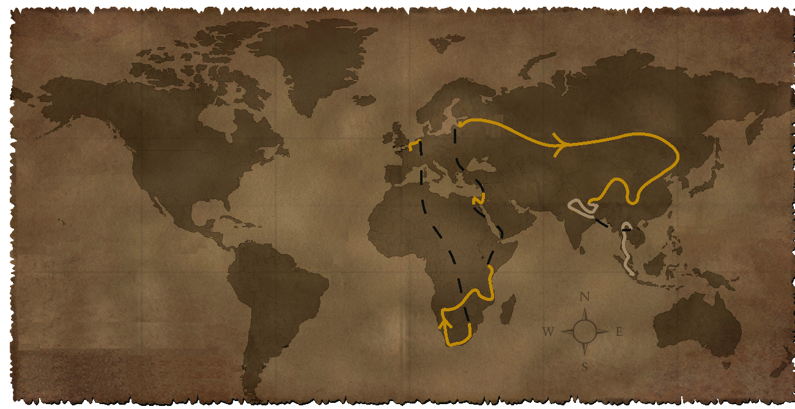

Voici la liste des pays que nous traversons :

### Europe

- France
- Belgique
- Pays-Bas

### Afrique

- Afrique du Sud
- Namibie
- Zambie
- Malawi
- Mozambique
- Tanzanie
- Kenya
- Egypte

### Asie

- Israel
- Lettonie
- Lituanie
- Russie
- Chine
- Tibet
- Népal
- Inde
- Thailande
- Cambodge
- Malaisie
- Indonésie

Avant de partir, nous pensions aller en Amérique du Sud pour nos trois derniers mois, mais nous avons changé d'avis. Nous trouvons que le voyage serait trop court en Asie et en Amérique. Donc nous avons décidé de rester en Asie pour ces derniers mois.
