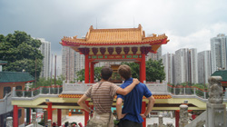

Hong Kong, août 2010, temple taoiste

Ca y est : C'est fait ! Notre premier billet Amsterdam-Johannesbourg est acheté, marquant ainsi définitivement notre engagement dans le projet qui nous occupe l'esprit depuis déjà plus de 3 mois. Quelle bonne raison pour écrire notre premier article qui inaugure notre beau (que dis-je, notre magnifique) site internet !

Nous voici donc à la mi-décembre et on peut dire que depuis notre première discussion sur le sujet en août dernier, les choses ont bien avancé. Après des dizaines de livres empreintés à la médiathèque, des journées entières à discuter ensemble et à s'informer de la situation dans chaque pays du monde, nous avons pu définir les grandes lignes de notre itinéraire. Le casse-tête des billets d'avions se résoud de plus en plus ; notre association "Au coeur du monde" est parue au journal officiel et va ainsi nous permettre de faire des demandes d'aides publiques ; la première version de notre dossier de présentation a vu le jour tout comme notre site internet. Bref, nous sommes fin prêts à entrer de plein pied dans l'année de notre voyage et à partager avec vous toutes nos avancées ! A très bientôt, Nicolas et Olivier
