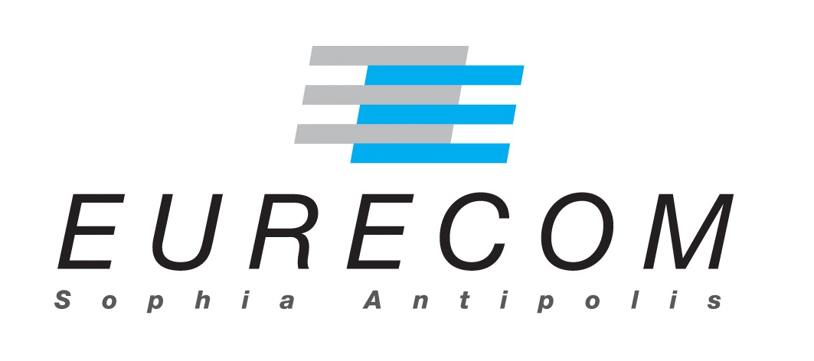

EURECOM (l'école de Nicolas) est le premier partenaire à nous soutenir. L'école nous aide à hauteur de **1000 €**. Voici deux années consécutives que l'école soutient ce type de projet : l'année dernière, ce sont <a href="http://laruevibre.org">Rémi et Romane</a> qui ont bénéficiés de l'aide d'Eurecom. Un grand merci, donc, à Eurecom de soutenir ses élèves dans des projets "hors scolarité" !)

Le soutient d'Eurecom pour ces deux voyages a d'ailleurs fait l'objet d'un article dans Nice Matin : [Des Eurecomiens autour du monde](./articleNiceMatin1.pdf). Nous continuerons probablement à donner de nos nouvelles à Nice Matin au cours de notre voyage.
