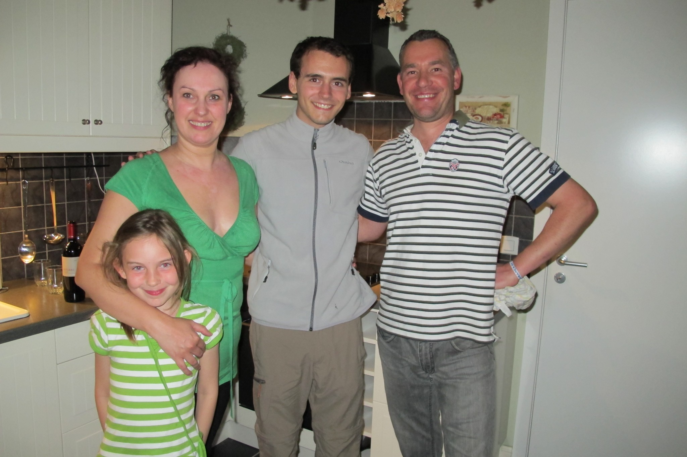
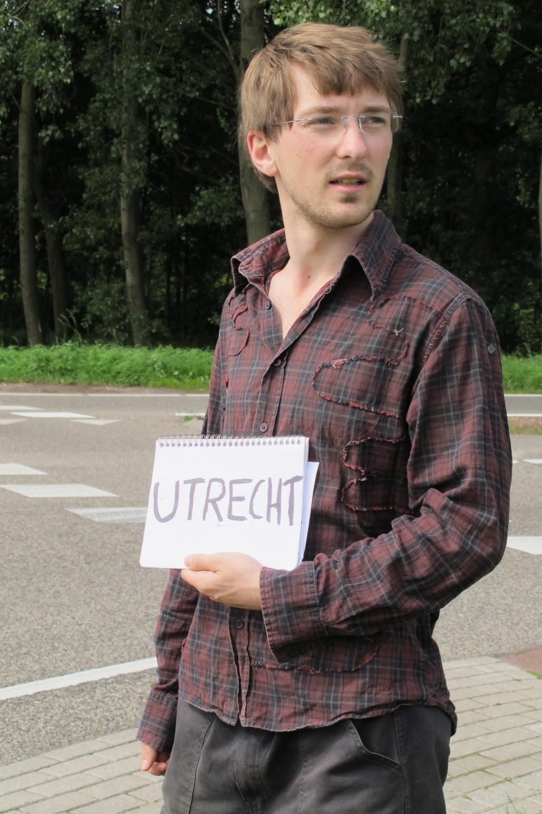

Ca y est, c’est parti ! Après une fête mémorable, nous sommes partis de Paris samedi 2 juillet en covoiturage pour Lille. Ce fut la première occasion de rencontrer 3 routards, en direction d’Amsterdam (première piste pour être logés là-bas). Nous arrivons à Lille pour un repas à la Patatière (le resto où travaille la sœur d’Olivier) et pour finir les préparatifs.

<!--  -->

Départ en stop de Lille en fin de journée, direction Dunkerque où nous attend la grand-mère d’Olivier ! Nous sommes chaleureusement invités à déjeuner chez Chris et Manu (famille d’Olivier) avant de partir dimanche 3 juillet après-midi vers Amsterdam. A l’aventure. Plus personne ne nous attend.)

Ce dimanche, après des débuts difficiles, 4 véhicules (dont une ambulance, une fois !) nous permettront d’atteindre une station essence, non loin de Bruxelles. Il commence à se faire tard (21h) et nous ne sommes pas à un endroit facile pour être pris en stop. Tout le monde va à Bruxelles alors que nous voulons nous diriger vers le nord (Anvers). Nous espérons quand même être pris une dernière fois en stop avant de trouver un endroit où dormir. Alors qu’Olivier regarde la carte de la station-service, nous sommes accostés par un Belge. Il nous offre une bière (Belgique: done!). Puis, de fil en aiguille, Gert nous proposera d’aller dormir chez lui ! Pour cette première journée d’aventure, la chance nous sourit, nous avons passé une super soirée à discuter avec Gert et sa femme.

Gert nous a offert des lasagnes et du vin pour un dîner aux chandelles et nous avons pu dormir dans la cabane au fond du jardin ! Le lendemain, il nous emmène même au nord de Bruxelles, à un très bon endroit pour faire du stop. La pancarte à peine levée, nous trouvons notre conducteur. Nous serons malheureusement déposés à un croisement d’autoroute et nous nous retrouvons comme deux ronds de frites, hors de Belgique !

Pour le stop, nous nous rendons compte que l’essentiel est d’être au bon endroit. La règle de 3 du bon auto-stoppeur :

1. Il est très dur de sortir d’une grande ville.
2. Il est difficile d’être pris quand les automobilistes ont encore le choix entre deux routes.
3. Jamais de stop à un endroit où les voitures roulent vite.

Ainsi, le mieux est d’être sur une station-essence ou bien à une entrée d’autoroute, même avec peu de passage.

Nous voilà donc bien dans l’embarras lorsqu’on nous laisse au nord de Breda, à un grand carrefour multidirectionnel, où tout le monde roule vite ! Après une dizaine de tentatives au niveau d’un feu au milieu de la « Rrrighway », un policier nous escorte pour nous faire quitter le lieu et nous rappelle gentiment que l’endroit est réservé aux voitures. Sages comme des images, nous n’y retournerons pas et marcherons plus de 2h pour rejoindre la sortie suivante de l’autoroute. En moins de 10 secondes, nous nous retrouvons dans une Mini. Elle nous emmène jusqu’à Utricht à 40km d’Amsterdam.

Nous décidons de faire une pause dans un bar (avec Wifi). Et nous apprenons que notre vol Amsterdam-Johannesburg est annulé...

Désolés pour l'instant, nous n'arrivons pas à mettre de photos et à mettre à jour le site. Mais cela viendra bientôt.

Depuis l'écriture de cet article, nous sommes bien arrivés à Johannesburg, nous vous le raconterons plus tard.

import Navigation from "../../Navigation";

<Navigation
  previous="/2011-06-11"
  next="/2011-07-10"
  gallery="/galerie/pays-bas"
/>
