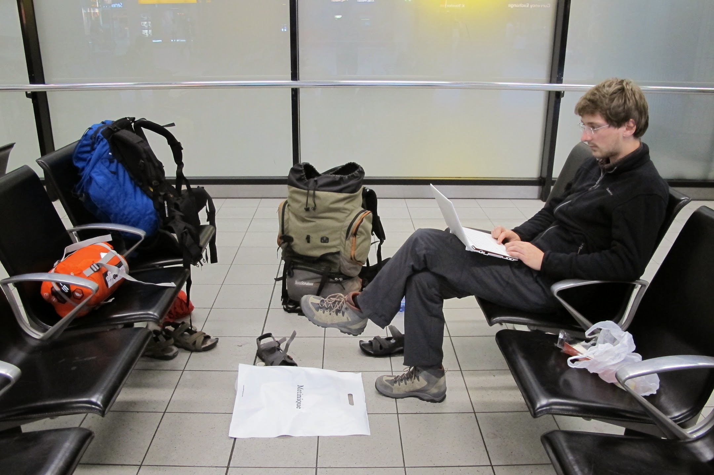
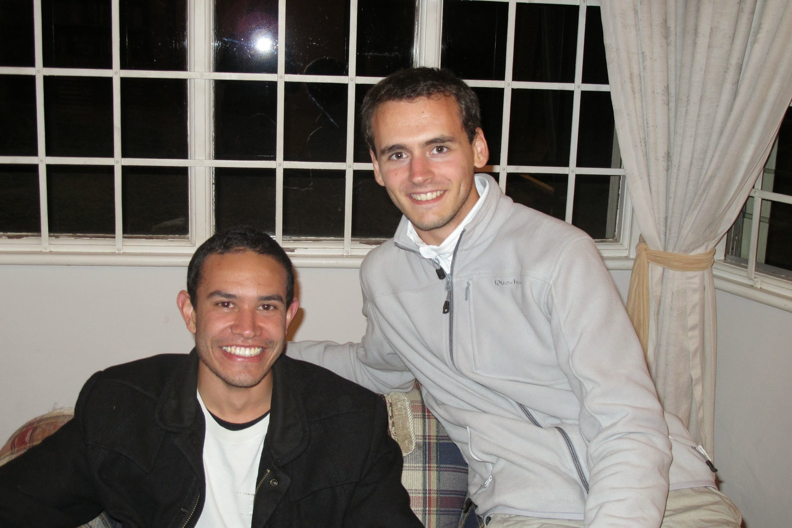

Thank you to our dear Daphné for the translation. [French version](/2011-07-10)

### End of our trip to Amsterdam

When we arrived in Ultecht we found out our plane was cancelled. We weren't that worried but we had to fix that up which was not easy without a cell. Our EgyptAir receptionist was quite obliging and we knew that, we'll have to remain in Amsterdam all the expenses paid until the next flight in the worse case. It was not a problem for us since we were not in a hurry. However, we decided to go to the airport to fix that up as soon as possible. We left the Wifi café where we had been settling for a while and went to the airport hitchhiking for the very last step before South Africa. The day after, at the airport, everything was settled: we'll be the very next day in Johannesburg.

### Johannesburg and Durban

We spent our first day in Johannesburg and the two following days in Durban. We didn't really enjoy those two cities. South Africa is a country where crime rate is high (50 as much murders as in France) and this concerns mostly big cities. That was a real problem for us. We wanted to stop to get in touch with people but we couldn't and walked fast to avoid thieves. We were told it was important not to seem lost. It looked complicated for us to stay there.

Nevertheless we keep excellent memories of our time spent in Johannesburg. Thanks to Olivier's aunt, Tanette, we got in touch with Sister Claude-Monique. She went picking us up at the airport with her friend Everina. They brought us to one of the most dangerous city area where Sister Claude-Monique and three others nuns of the Petite Soeurs de Jesus religious community live. They have been there since the Apatheid. At that time, black people's rights were significantly restricted. They didn't have the right to take same bus as white people, they were not allowed to be seen on some public places, they couldn't even vote.

This first day was though a chance for us to connect with extraordinary women who decided to live with people from poor area with very hard living conditions.

Akiko, one of the nun brought us to take local means of transportation she takes every day and which are known to be dangerous. She took us through the dangerous areas. We didn't come across any white people in these districts. But she didn't seem uncomfortable or unsafe. For us, it was a great chance to discover the city through an unusual point of view. We enjoyed it.

At night, we met Steen-John and his mother who received us for the night.

We didn't looked very organized because we hadn't planned anything for the following days. We were told to go to Durban, big city of the East Cost. We took the bus early in the morning to Durban. When we arrived, we made for the cheapest BackPacker's of the city. It was quite far. Good chance for us to feel the city atmosphere hanging around. We stopped by for groceries, convinced we were not in a rush. We didn't feel comfortable in these streets known to be unsafe. The night fell suddenly. We remembered that we are in Winter and that it is already dark at 17'30. We went completely lost at last. We followed Steven-John's advice and walked straight. We took care not to walk to close to the wall for fear of being threaten with a knife. We split our money in distinct pockets and even in our shoes, to be sure not to lost everything at one go.

Eventually, we stop at a service station to ask for directions. We took a taxi. Relief was worth the price of journey!

In the taxi, we found out we were hanging out in a dangerous district, as we already suspected it. Once we reached the hostel, there was no room left. We decided to go to another hostel even if prices were more expensive than we can afford. But it felt good to have a shelter for the night. We keep in mind what we have learnt from our lack of organisation and enjoyed the quiet night we were longing for.

The following day, we decided to visit Durban's city centre, on broad day light this time! Once again, we felt frustrated no to have the possibility to stop talking to people. We couldn't have a moment to rest somewhere for fear to seem lost. This day was however the occasion to discover how public transport are working over there. There are minibus taxis (like Jeepney for our Filipino readers). They have a definite route but they can stop all along to pick up or to drop off people. It is really effective! A man distinct from the driver is in charge to gather clients together yelling the name of the terminus and to collect the money. This mean of transportation is quite difficult to use for unaccustomed people because we are supposed to know where the bus can be taken. Of course, it's not mentioned on a map and there is no bus stop. And even if you know where you can take it, there can be 30 buses in the same place but only one will drive you where you want to go. And if you are not really sure of where you want to go'it turns out to be complicated!

These first few days downtown didn't let us the occasion to relax because we had to be constantly careful with people. We decided to leave big cities for Coffe Bay, a Wild Coastvillage where Xhosa people is living. For the first night we spent over there, we were well-advised to book a camping site in a youth hostel.(Indeed after an costly night spent inDurban, we decided to buy a tent)..

import Navigation from "../../Navigation";

<Navigation
  previous="/2011-07-04"
  next="/2011-07-17"
  gallery="/galerie/afrique-du-sud"
/>
