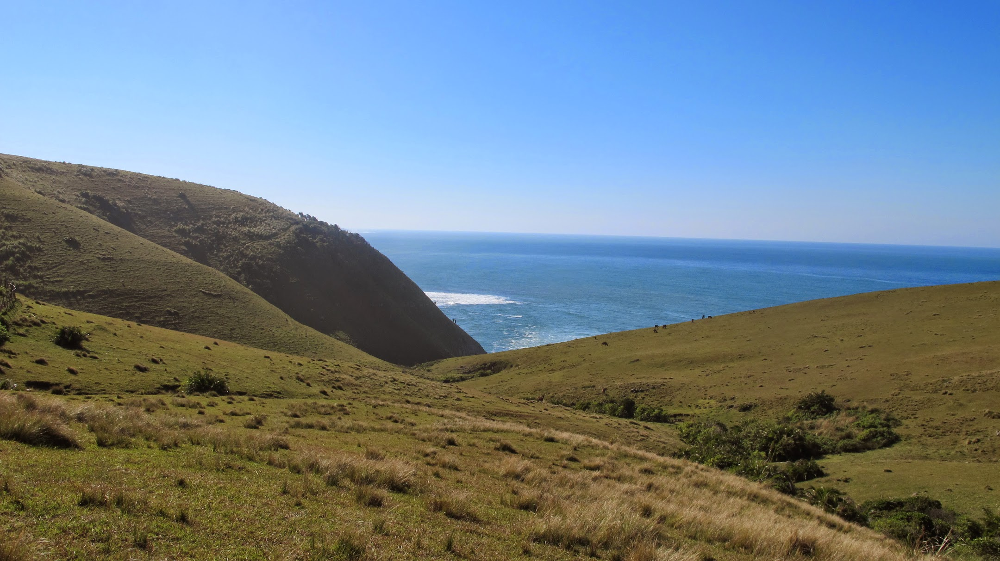
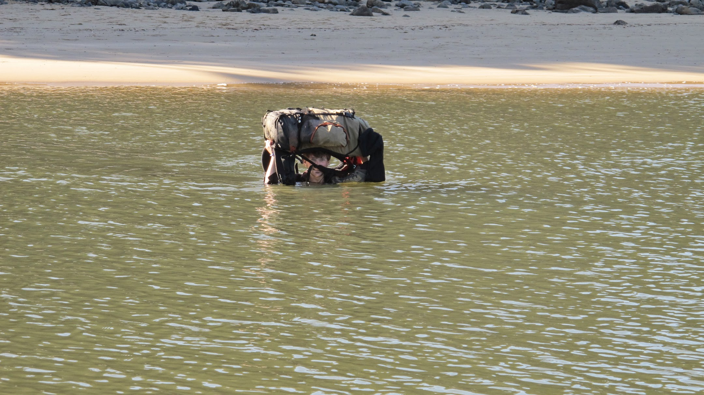
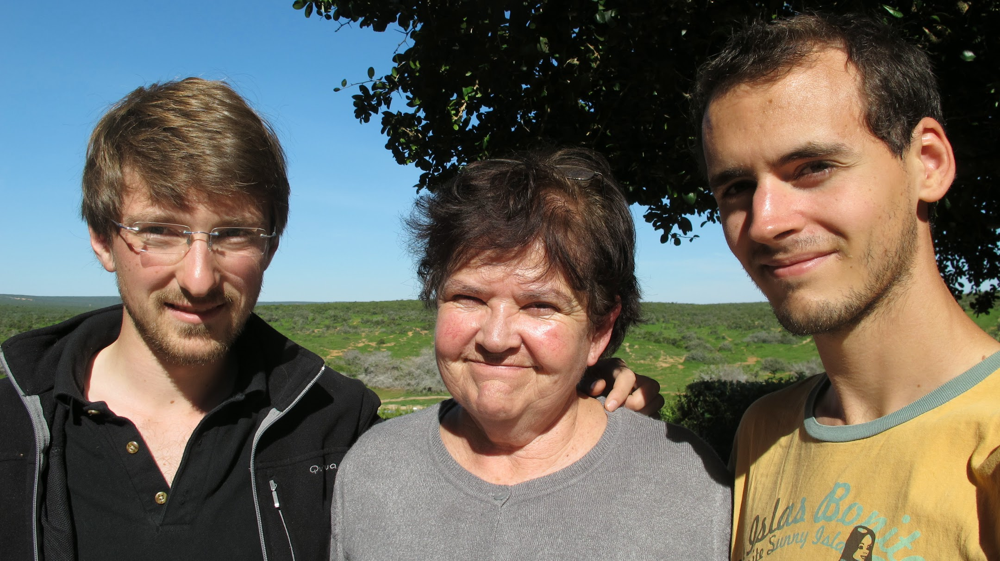
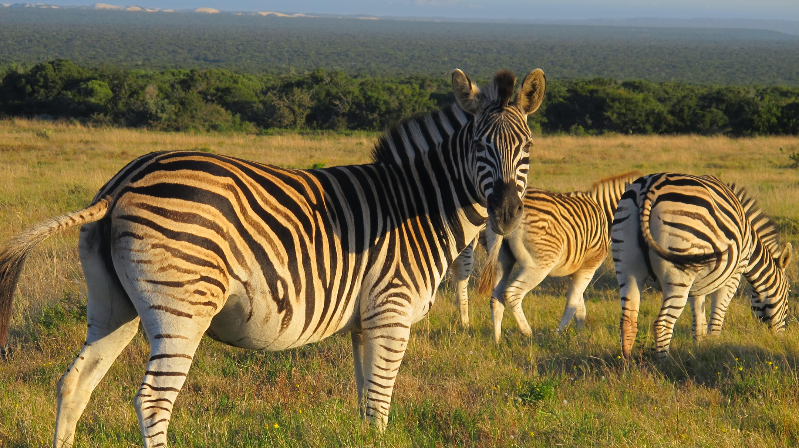

Thank you to our dear Damien for this translation. [French version here](/2011-07-17)

### 5 days on the Wild Coast: From Coffee Bay to Dwesa

To go to Coffee Bay, we took the bus to
Mthatha. Then the Lonely Planet guide said that taxi minibus are going to
Coffee Bay in one hour for 25 rands (2,5 €). In fact, we needed 3h to arrive
there and we had to pay 40 rands. The bus was overcrowded but we were amazed by
the hilly landscapes where is living the Xhosa people.

The day after, let's go for the adventure!
We decided to walk along the coast towards the South in order to go as far as
possible. Maybe till East London, who knows! (Don't dream too much: It would be
200 km!) We got fresh supplies in water and food, a map and the hike could
begin.

After one hour on the pist, we met a SUV
who stoped to inform us that there was a way along the sea a lot nearer than the
one we were on. Along the track we felt a lot better than in the city. The
fear to meet people went away. Rapidly we met 2 children playing.
They started to follow us. We discussed a bit, but far away from big
cities the local speeches are a lot more common than English. Using "Molo"
(hello) and "Enzuki" (merci) exchanges are limited. However, we were delighted
by this encounter. Very rapidly, other children came and soon it was a real
troop following us! Some started to sing. We also sang (We promise to
try to find something better than "Frère Jacques"). But this
delighting moment gave birth to doubt... Do they want money? They were following
us for a while ! We started to say that we were not giving any money, we
repeated it, and finally we understood that they were just waiting for such
things through our exchanges. As they understood that we would not give
anything, they let us continue to walk and left. It happened several times as
we were passing near houses, children were following us. Some wanted to be our
guide for a few rands.

Once we found the track just along the sea,
we were more isolated but the beauty of the landscapes managed to make us
forgot everything! The coast was uninhabited but so nice! We went up and down
over the hills impatient and waiting for the next landscape. It's always hard
to describe but the landscapes from this first day will stay indelibly printed
on our minds. About 3 pm we decided not to get surprised by the sunset. (At 5
pm, it's already night)

In the far distance we saw houses and we
wanted to ask for pitching the tent in the "garden". But there 3 dogs were
preventing us to go further. We are not afraid of the dogs but we did not dare
to make one step furthermore. Perfect! It's a good
excuse to stop and discuss a bit with the wives making some washing there. One
of them spoke well English. Rapidly, we asked to pitch they tent here.
They accepted. We also asked to eat with them. The also accepted !
Awesome ! Some children came. They helped us to pitch the tent. We looked
like an attraction. Everyone is looking at us. We tried to
speak a bit and then we started to play ball with children. In fact, the ball
was nothing else as a mass of plastic bags.

We also ate with the women and children
some sweet potatoes. Delicious, but seeing their aspect, we asked ourselves if
we would take a smecta at once! We continued to enjoy the last sun shines
playing with the children. We lived a great moment! We were delighted to live
this relationship not linked to money and we felt safe there, (Nevertheless,
Olivier heard the children asking their mother "Mum, do you think that I can
ask for some money and when they did so we said no, they were okay, and all
started again as before.) Soon the father came back with the cow and donkey
cattle. The sunset on valley with the sea in the far distance would have
deserved a picture but we did not dare take out the camera in front of them to
show our wealth. Their happiness with almost nothing (some animals and fields a
roof) was amazing.

We went on our hike during 3 and a half
days, every evening was the occasion for a new encounter.

We are not describing them all, because
each of them would deserve an article. Walking in these landscapes was tiring.
We stopped at the entrance of the Dwesa reserve. We thought that we could take
a taxi minibus to continue our trip but in fact it was totally uninhabited! Only
a hotel quite luxurious was standing there. We were trapped! But while
discussing at the hotel we found a solution: some employees were going to the
city the next day and will drop us there. The proposal was really interesting
and we got a hot shower, a good meal as well as the possibility to drop off our
bags for the day.

### Port Elizabeth, last stop before Cape Town.

Back to Mthatha, we had to take the local
transports to go to Port Elizabeth. There, Steven-John's aunt was waiting for
us. At 13h30, we were in the taxi minibus going to Port Elizabeth: we expected
to be there at 20h, which was okay for us. Actually, the taxi minibus was
leaving only full. At 4pm we were still waiting. Eventually, we arrived after
midnight at PE. Margareth, the so kind Steven John's aunt, was waiting for us
at our arrival.

This stop at PE allowed us to rest before
going to Cape Town. At last we enjoyed a city where we felt safe. In fact, we
were just better informed: safe places are not in the center as in Paris but in
the suburbs. We enjoyed having a good rest for the first time in our trip.

The next day Margareth brought us to see
the great attraction in South Africa. We went to a natural reserve!

Next Sunday evening we are leaving for Cape
town, a city whose everyone is speaking well, for our first experience in
couchsurfing!
