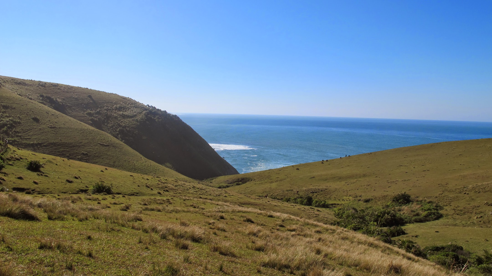
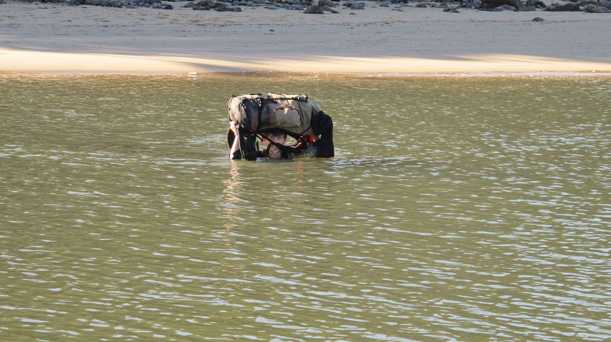
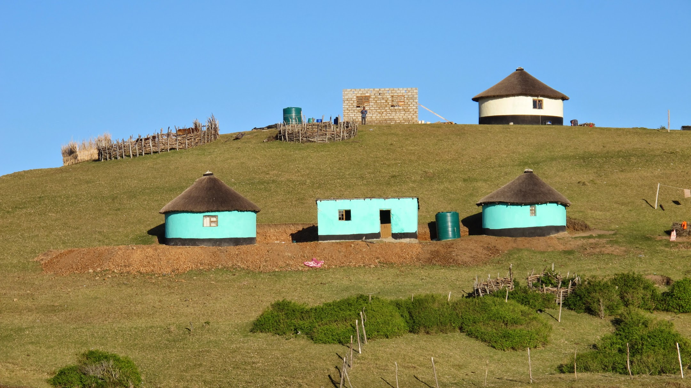
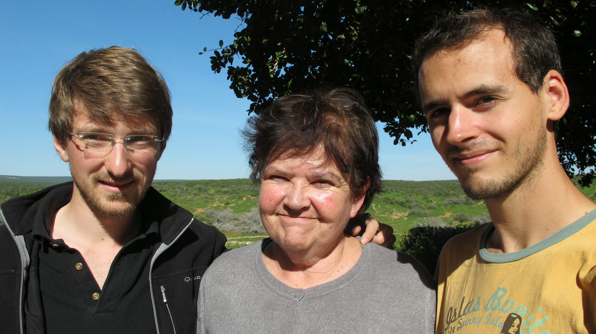

[English version](/en/2011-07-17)

### 5 jours sur la Wild Coast : de Coffee Bay à Dwesa

Pour nous rendre à Coffee Bay, nous prenons le bus jusqu’à Mthatha. Puis le Lonely Planet indique que des taxis minibus vont jusqu’à Coffee Bay en une heure pour 25 rands (2,5€). En réalité, nous mettrons près de 3h pour nous y rendre et payerons 40 rands. Serrés comme des sardines, nous nous émerveillons devant des paysages vallonnés où demeure le peuple Xhosa dans leurs habitations cylindriques.

Le lendemain, c’est parti pour l’aventure ! Nous décidons de longer la côte vers le sud et d’aller le plus loin possible. Peut-être jusqu’à East London, qui sait (ne rêvons pas non plus : ça ferait 200km). Nous nous ravitaillons en eau et en nourriture, nous nous procurons une carte et la randonnée commence.

Après une heure sur une piste, nous croisons un 4x4 qui s’arrête et nous informe qu’il y a un sentier qui longe la mer, bien plus proche de celle-ci. Le long de la piste, nous nous sentons vraiment mieux qu’en ville. La peur de croiser les gens disparaît. Rapidement, nous croisons deux enfants qui jouent. Ils se mettent à nous suivre. Nous discutons un peu, mais loin des grandes villes, l’anglais disparaît pour faire place à la langue locale. Avec un « Molo » (bonjour) et « Enkuzi » (merci), les échanges sont très réduits, mais nous sommes tout de même ravis de cette rencontre. Très vite, d’autres enfants arrivent et bientôt, une vraie troupe nous suit. Certains commencent à chanter. A notre tour nous chantons (bon, promis on va cogiter pour trouver un peu mieux que « frère Jacques »). Mais ce moment de plaisir fait bientôt place à un moment de doute… Ne voudraient-ils pas de l’argent par hasard ? Cela commence à faire longtemps qu’ils nous suivent… Nous commençons à dire que nous ne donnons pas d’argent, nous le répétons, et finalement nous comprenons que c’est bien la seule chose qu’ils attendent de l’échange. Comprenant que nous ne donnerons rien, ils nous laissent continuer notre chemin. Cela se répète à plusieurs reprises, dès que nous passons proche d’une habitation, les enfants nous suivent. Certains veulent être notre guide pour gagner quelques rands.

Une fois le sentier longeant la mer retrouvé, nous sommes beaucoup plus isolés. Et là, la beauté des paysages nous fait tout oublier. La côte est déserte mais pourtant si jolie. Nous enchaînons les montées et les descentes des collines en attendant toujours avec impatience d’arriver en haut pour voir le paysage suivant. C’est toujours difficile à décrire, mais les paysages de cette première journée resteront gravés dans nos mémoires !

Vers 15h, nous décidons de ne pas nous laisser avoir par le soleil qui se couche très vite (à 17h, il fait déjà nuit).

Au loin, nous voyons des maisons et nous comptons demander à planter la tente dans le « jardin ». Là-bas, 3 chiens nous interdisent de passer. Nous n’avons pas peur des chiens mais là, pour le coup, nous n’osons pas faire un pas de plus. Parfait. Très bonne excuse pour nous arrêter et discuter un peu avec les femmes qui font la lessive à côté. L’une d’elles parle assez bien anglais. Rapidement, nous demandons si nous pouvons planter la tente ici. Elles acceptent. On leur demande également si on peut manger avec leurs familles. Elles acceptent également. Génial ! Quelques enfants arrivent. Ils nous aident à planter la tente. Nous sommes un peu l’attraction. Tout le monde nous regarde, nous engageons un peu la conversation. Puis nous commençons à jouer à la balle avec les enfants. La balle n’est en fait rien d’autre qu’un amas de sacs plastiques.

Nous aurons également l’occasion de manger avec les femmes et les enfants des pommes de terre douces. Délicieuses, mais vu leur tête, nous nous demandons si nous n’allons pas tout de suite prendre un smecta ! Nous continuons à profiter des derniers rayons de soleil en jouant avec les enfants. Nous vivons un grand moment. Nous sommes enchantés de vivre une relation non liée à l’argent et nous nous sentons en sécurité ici (malgré tout, Olivier entendra les enfants demander à leur mère « maman, tu crois que je peux leur demander des pièces » et lorsqu’ils le feront et que nous dirons non, ils diront d’accord et tout reprendra comme avant). Bientôt, le père revient avec le troupeau de vaches et d’ânes. Le coucher de soleil sur la vallée avec la mer au loin aurait bien valu une photo mais nous n’oserons pas sortir l’appareil devant eux pour montrer notre richesse. Leur bonheur avec trois fois rien (des animaux, des champs et un toit) nous émerveille.

Nous continuons ainsi notre randonnée pendant 3 jours et demi, chaque soir faisant place à une rencontre.

Nous ne les décrirons pas toutes car chacune d’elles mériterait un article. Marcher dans ce paysage accidenté nous fatigue. Nous nous arrêtons à l’entrée de la réserve Dwesa. Nous pensons pouvoir y prendre un taxi minibus pour continuer le voyage mais en fait c’est totalement désert ! Seul un hôtel assez luxueux s’y trouve. Nous voilà bloqués. Mais en discutant à l’hôtel, nous finirons par trouver une solution : des employés vont en ville le lendemain et nous y déposeront. L’offre est très intéressante et nous permettra de prendre une douche chaude, de bien manger et d’abandonner nos sacs pour la journée.

### Port Elizabeth, dernière étape avant Cape Town

De retour à Mthatha, nous sommes amenés à prendre les transports locaux pour aller à Port Elizabeth. Là-bas, la tante de Steven-John nous attend. A 13h30, nous sommes dans le taxi minibus qui se rend à Port Elizabeth : génial, nous serons vers 20h là-bas, ce n’est pas trop tard. Mais en fait, le taxi minibus ne part que lorsqu’il est plein. A 16h, nous attendons toujours de partir. Nous arriverons finalement après minuit à PE. Margareth, l’incroyablement gentille tante de Steven-John, nous attendait à notre arrivée.

Cette étape à P.E. nous permet de souffler avant de nous rendre à Cape Town. Nous profitons enfin d’une ville dans laquelle nous nous sentons en sécurité. En fait, nous sommes juste mieux informés : les lieux sûrs ne sont pas dans le centre comme à Paris, mais dans la périphérie. Nous avons en tout cas l’impression de pouvoir souffler/nous reposer un bon coup pour la première fois du voyage.

Le lendemain, Margareth nous emmène visiter la grande attraction de l’Afrique du Sud… nous nous rendons dans une réserve naturelle !

Nous partons ensuite dimanche soir pour Cape Town, ville dont on ne cesse de nous dire du bien, pour notre première expérience de couchsurfing. (Le couchsurfing est un réseau sociale pour créer des amitiés et dormir chez l'habitant)
