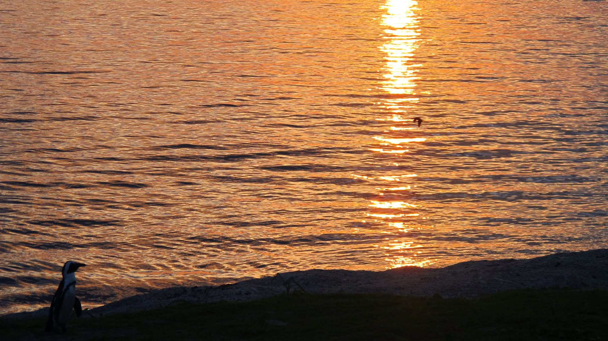

### Notre première expérience de couchsurfing

Nous sommes arrivés à Cape Town très tôt le lundi matin. Keith et John, nos adorables hôtes de couchsurfing étaient là pour nous accueillir ! Quelle chance ! Dès le matin, nous avons pu profiter du merveilleux lever de soleil avec les pingouins.

Puis nous sommes allés au « Cap of good hope » référencé dans tous nos livres d’histoire alors que les Sud-Africains connaissent plutôt le Cap-point non loin de là.

Nous y sommes aussi allés. La vue y était magnifique, le temps était au rendez-vous. Habituellement, en hiver c’est la tempête, il y a beaucoup de vent. Nous avons donc passé la journée, baladés en voiture par Keith et John, à découvrir les environs de la ville du Cap. Nous n’aurions jamais pu découvrir autant d’endroits sans nos hôtes. Le couchsurfing, c’est le bon plan !

Nous avons passé 6 jours au Cap en couchsurfing et nous passons une nuit chez une amie de Steven-John (rencontré à Johannesburg) avant de partir pour la Namibie.

### Franschhoek et la vallée des vins

L’Afrique du Sud est le 9e producteur de vin au monde. Et la région du Cap est très connue pour sa production de vin. Nous sommes donc allés y faire un tour !

Emmenés par nos hôtes, nous nous sommes dirigés vers Franschhoek, un petit village rempli d’histoire, de pancartes écrites en français et de vin. En 1685, avec la révocation de l’Edit de Nantes, quelques 200 protestants fuyant la France sont venus s’installer dans la région du Cap avec leurs vignes. Depuis lors, dans ces domaines viticoles, il est possible de déguster un Sauvignon, un Cognac ou encore un « assimilé Champagne ». Ce que nous avons fait avec plaisir !

### Bo-Kaap, le quartier musulman du Cap

Durant ces quelques jours au Cap, nous avons décidé de nous intéresser aux Malais du Cap. Ce groupe ethnique musulman est constitué de descendants d’esclaves ayant été exilés d’Indonésie et de Malaisie au 17e siècle. Sous l’apartheid, les Malais du Cap étaient considérés comme des métis et ils se sont regroupés dans le quartier de Bo-Kaap. C’est un réel plaisir de se balader dans ce quartier, les maisons y sont très colorées.

Nous avons eu la chance de goûter au Bredie, plat traditionnel des Malais. Nous avons aussi pu passer quelques heures à discuter avec un musulman vivant dans ce quartier.

### Départ pour la Namibie

Après cette escale de près d’une semaine, nous quittons notre petit confort, direction la frontière Namibienne à partir de laquelle nous espérons recommencer le stop, faire une grande randonnée près du Fish River Canyon et vivre beaucoup de nouvelles rencontres !
