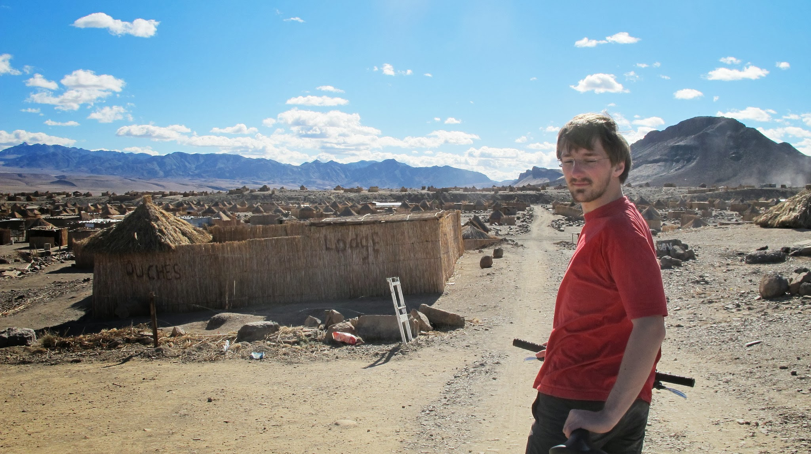
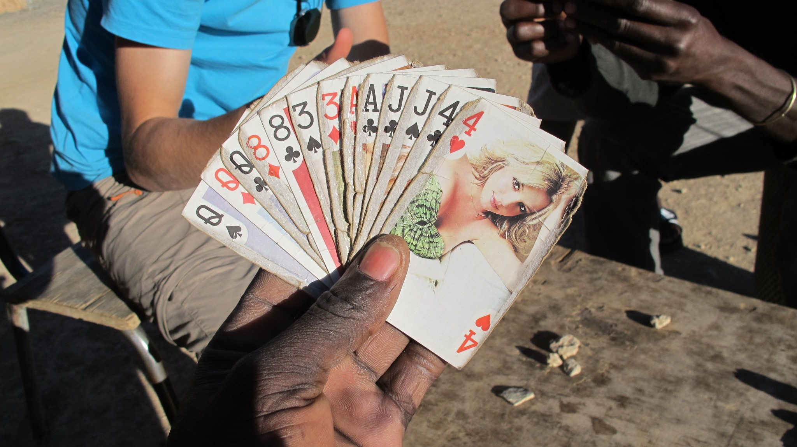
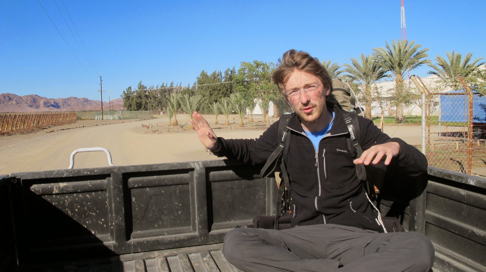
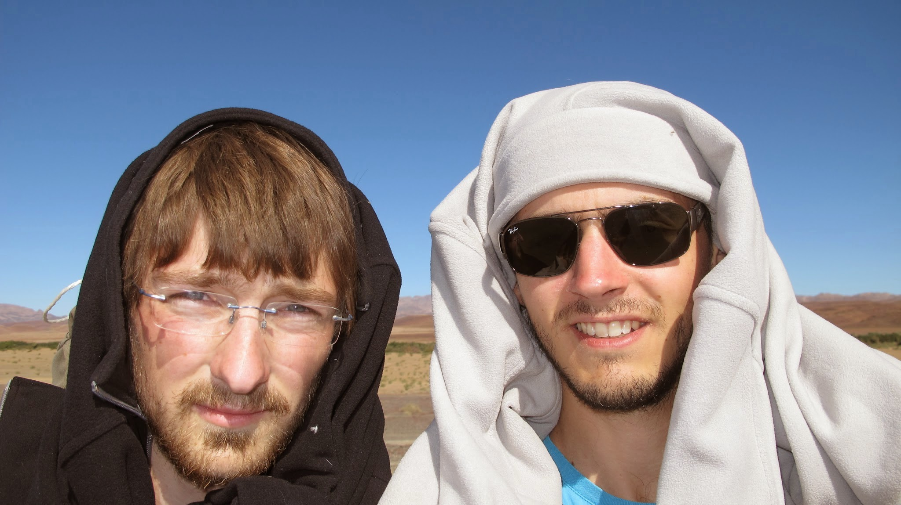
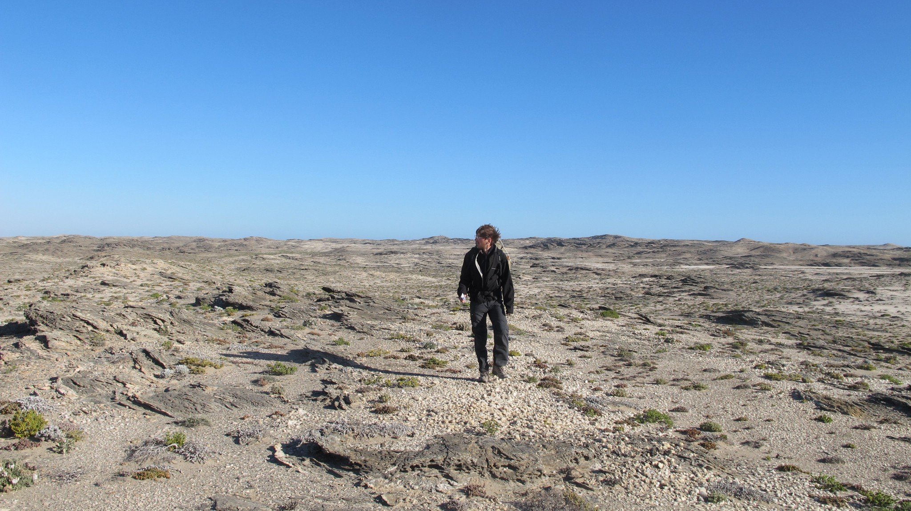
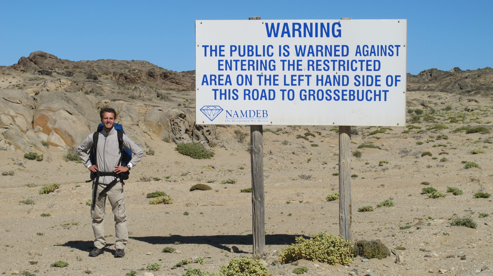

[French version here](/2011-07-30)

Our bus ride from Cape Town was very slow. We were supposed to arrive at the Namibian border at 8pm. Eventually, they left us in the middle of nowhere at 1.30 am. We put up the tent there. The following day, we rode to Aussenkehr for another couchsurfing session!

### Aussenkehr, the "straw town"

Our nice couchsurfing host, Antoni is a professional farmer. With two other men, he manages a farm owned by a big company. In this farm, we saw dozens of black workers cutting vines. Here, grapes are grown to be exported in Europe, even in France! On the road to Aussenkehr, we saw seven farms like this one. As Antoni lent us bikes, we decided to cycle into town. Before going there, we knew it's an agricultural village where are living farms workforce. In the distance, we caught sight of some straw roofs. Once arrived on the top of the mount, a mind-blowing landscape becomes apparent. We stayed several minutes amazed by this straw town.

It's like being in an Asterix&Obelix village reconstitution. The only difference is real people are living every day in this village. The only buildings not made in straw are the church and the supermarket.

We talked a little bit with people. Everybody is black and speaks Afrikaans, but some also speak English. As Oliver was taking few pictures of the village, someone asked us if we're working for a bus company. He thought we took pictures to sell them later.

Then, we stopped to talk to people. A villager came and suggested that we play cards. We accepted and asked what card game he wanted to play. He didn't understand. To him, there's only one card game possible with these 54 cards.

He was surprised to learn that we know several card games! So, we played their game and they kicked our asses... Rules are quite complicated. After this huge defeat, we taught them the "Corsican Battle" (a French version of <a href='http://www.52pickup.net/card-games/beggar-my-neighbor'>Beggar My neighbor</a>) and the <a href='http://en.wikipedia.org/wiki/Asshole_(card_game)'>"President"</a>

We talked about their situation. A Serbian businessman owns all the land, plantations and the village (altogether, it's about 250 000 acres). The Namibian government sold the lands some years ago and can't get them back. Workers work themselves to death for ridiculously low wages (about 75 Euros) while products in the supermarket are sold at the same price as in French supermarkets. The landowner controls imports on his propriety. So, nothing can change. The 15 000 inhabitants of this straw town seem to be condemned to work at the vineyards under 40° in summer, living without electricity nor cars and suffering from starvation or Aids. Nevertheless, many people think Namibia owes a lot to this Serbian. He gave work to many Namibians and the straw town is growing year after year.

### Hitchhiking in Namibia

We’re now in Namibia and hitchhiking is safe there. But, with only 2.1 million of inhabitants and 10 or 100 times less of cars (it’s too expensive for people), Namibia, a bigger country than France, has never had traffic jams!

If you consider the first rule of hitchhiking – there are always more cars in the opposite direction -, we were in deep trouble to travel in this country…

There is only one tarmac road in Namibia where 4 cars go by in an hour. Some trails are also used by car drivers, but less than 10 cars go by during a whole day.

It’s frustrating when no car passes during 2 hours. Hopefully, when you’re alone in the middle of the desert, with nothing near, car drivers will almost always take you for a ride.

Furthermore, lots of things happen during hitchhikings. Here is a best of our souvenirs:

In the middle of the desert, while no car went by for more than 2 hours, we moved away from the road to visit an old mine. At that moment, a tourism bus went by. We ran as fast as possible and the bus stopped. We got on and everyone was staring at us, like "What are they doing here".

We also got on a car, listening to a protestant priest’s speech. The driver, Alcine, was driving at 150 km per hour while texting on her phone. She said it was OK because God bless her driving.

We waited more than 4 hours before Alcine drove onto our road. Her heaven-sent stop made us laugh:

"We want to go to Luderitz, can we go with you? – But I’m scared of you! (With a cute tone) – Ok, maybe we can talk?" After few seconds of talk, she let us get on.

Another story: we met 4 really nice young people in a 4x4. They just had a 5 day’s walk in the great canyon of Namibia. Nicolas took the opportunity to dry his socks without a dryer.

In the trunk or on a seat, we made some nice encounters!

### Ghost towns

Ghost towns are common in Namibia. We experienced that between two hitchhiking, while making our way to Luderitz. A young farmer dropped us off at the crossroad of two roads. We waited but no one came. So, we decided to walk to the town we could see in the distance. But, the more we came closer, the more it became weird. We walked into the streets; some inhabitants were watching us from their houses. We arrived to a hotel; it seemed entirely deserted. The atmosphere was filled with desolation. Could you imagine a city like Paris deserted? A place ready to live but without life.

Caution, next paragraph is forbidden if you’re under 12. The next day, we arrived at Luderitz and went hiking to Diaz Point.

Diaz Point is a touristic spot where one can see dolphins or seals. After a long day’s walk, we arrived soon after sunset at Diaz Point. For some time, a lighthouse was leading our footsteps. Night was falling; we looked for a place to sleep. We were exhausted and the wind was blowing too powerful to settle the tent correctly. We discovered soon that the place was deserted. We tried to enter into houses to shelter from the gusty winds. Eventually, we slept in a small and bleak room full of sand. If you’re afraid of ghosts, don’t come in Namibia!

The day after, we went to the main attraction of Luderitz: an old mining town that turned into a ghost town. It’s at the edge of the prohibited zone where 26 tons of diamonds are extracted every year.

import Navigation from "../../Navigation";

<Navigation
  previous="/2011-07-23"
  next="/2011-08-10"
  gallery="/galerie/namibie"
/>
