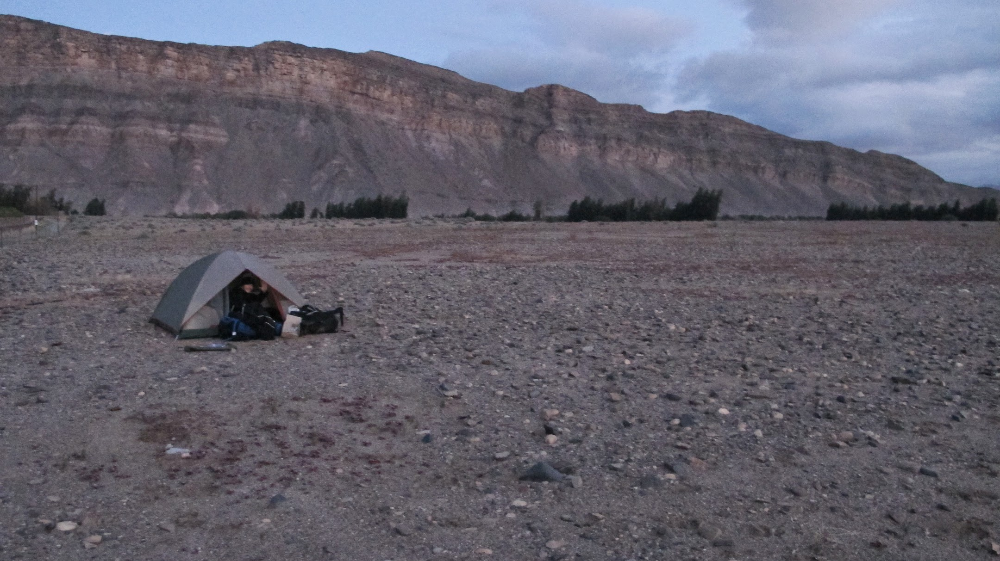
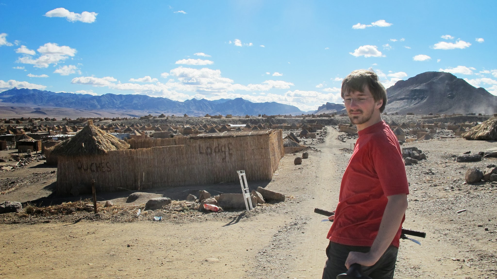
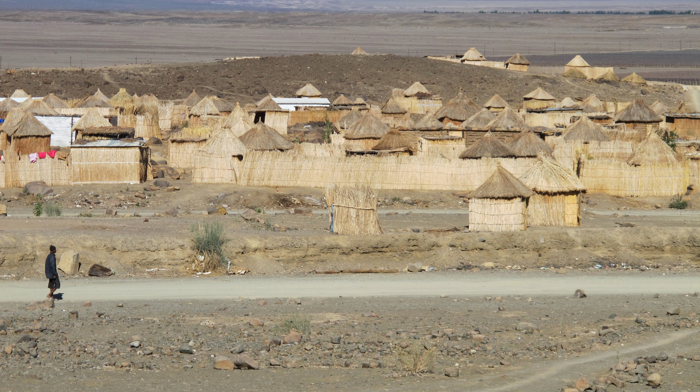
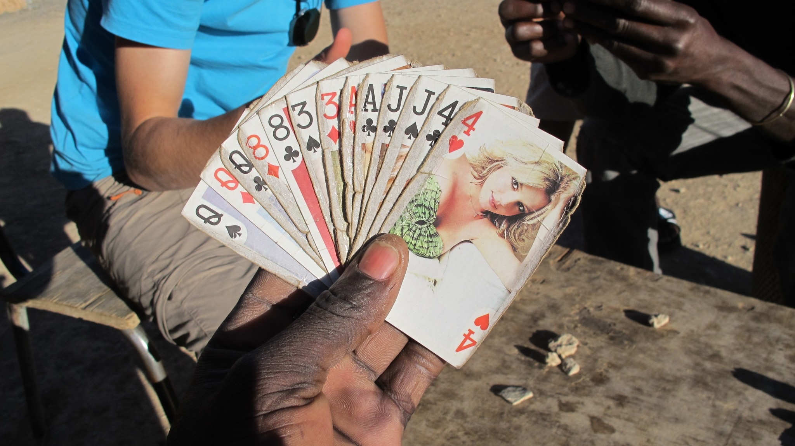
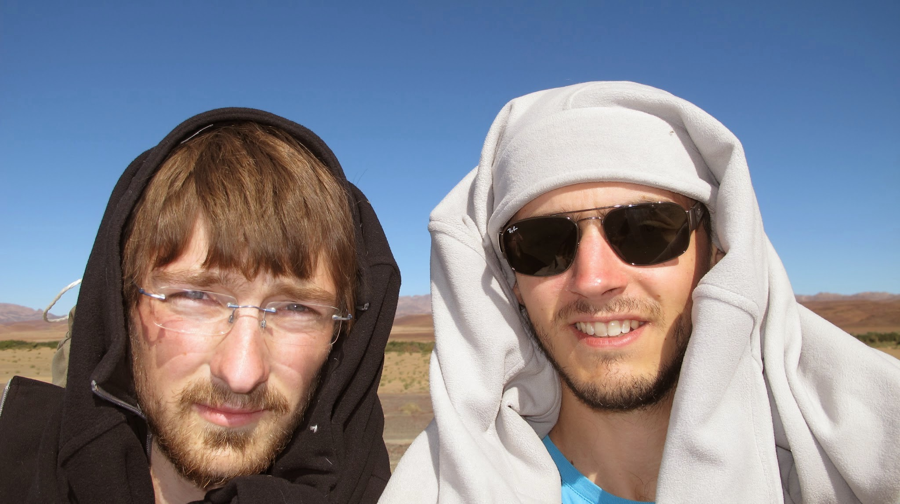
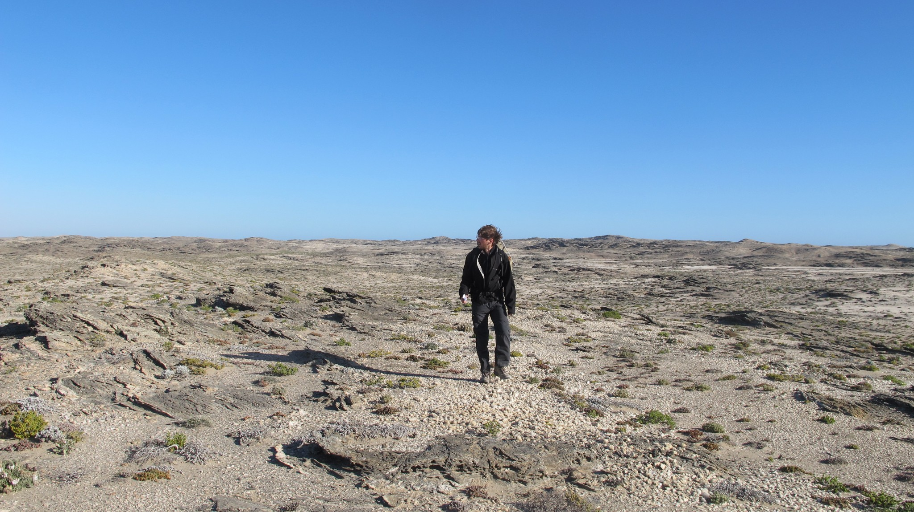
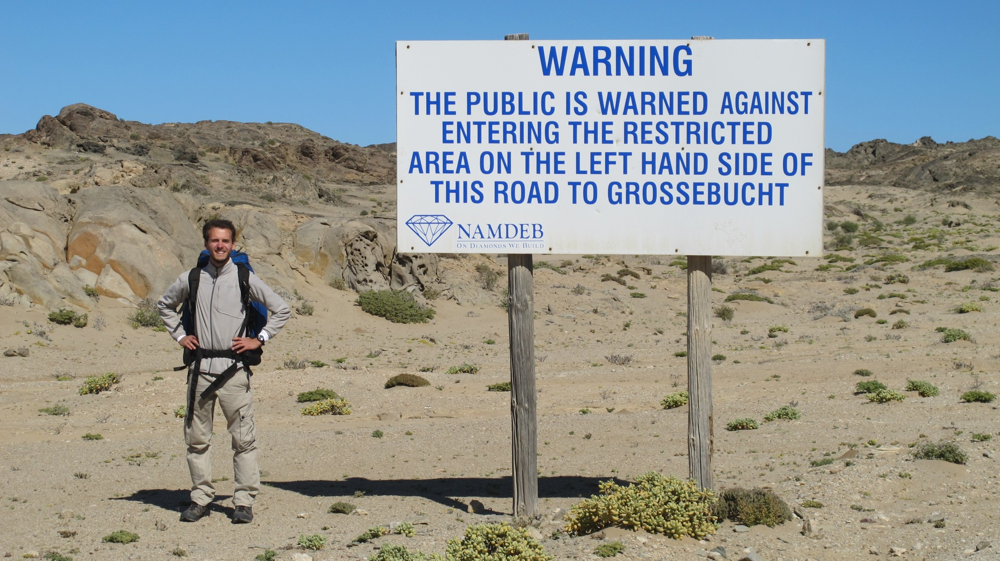

Notre trajet en car depuis Cape Town prend énormément de retard. Nous devions arriver à 20h à la frontière Namibienne. Finalement, nous serons lâchés dans la nature à 1h30 du matin. Nous installons la tente au milieu de nulle part. Le lendemain, direction Ausenkern pour couchsurfer à nouveau !

### Ausenkern, la ville de paille

Antoni, notre aimable hôte de couchsurfing est un fermier professionnel. Avec deux autres collaborateurs, il manage une ferme pour une grande compagnie. Dans cette ferme, on peut voir plusieurs dizaines d’ouvriers noirs occupés à tailler les vignes. Ici, on cultive du raisin qui sera ensuite exporté en Europe, et même en France ! Sur la route pour aller à Ausenkern, il y sept fermes comme celle-ci. Comme Antoni nous a prêté des vélos, nous décidons de nous rapprocher de la ville en pédalant. Nous savons que c’est une ville agricole qui héberge la main-d’œuvre des fermes. Au loin, nous apercevons quelques toits de paille. Une fois en haut de la colline, un spectacle époustouflant apparaît. Nous resterons plusieurs minutes interloqués devant cette ville de paille.

On se croirait presque dans une reconstitution du village d’Astérix et Obélix. Sauf que là, des vrais gens y vivent au quotidien. Les seuls bâtiments qui ne sont pas de paille sont l’église et le supermarché.

Nous allons discuter avec des gens. Ici, tout le monde est noir. Tout le monde parle Afrikans mais quelques personnes parlent aussi anglais. Comme Olivier prend quelques photos du village, quelqu’un nous demande si nous travaillons pour une compagnie de Bus. Il croyait que nous faisions des photos pour les vendre ensuite.

Puis nous nous arrêtons pour parler. Un autre villageois arrive et nous propose une partie de cartes. Nous demandons quel jeu. Il ne comprend pas. Pour lui il n’y a qu’un jeu qui va avec ces 54 cartes.

Il est bien surpris quand il apprend que nous en connaissons plusieurs ! Nous jouons avec lui. Au bout de trois parties, nous nous faisons toujours laminer ! Les règles sont assez compliquées. Après on leur apprend la bataille corse et le président.

Nous discutons de leur situation. Ici, un homme d’affaires serbe détient toutes les terres, les plantations et le village (100 000 hectares au total). Le gouvernement namibien a vendu ces terres et ne peut plus faire marche arrière. Les travailleurs se tuent à la tâche pour un salaire de misère (75€). Alors même que les produits vendus dans le supermarché sont au même prix qu’à Carrefour-Market en France. Le propriétaire des terres contrôle les importations sur sa propriété. Ainsi, rien ne peut changer. Les 15000 habitants de cette ville de paille semblent donc condamnés à travailler aux vignes sous 40° l’été, à ne pas avoir l’électricité, à ne pas avoir de voiture, à souffrir de la famine ou du SIDA. Néanmoins, beaucoup diront que la Namibie doit beaucoup à ce serbe. Il a permis de fournir du travail à beaucoup de namibien et la ville de paille s’agrandit année après année.

### Le stop en Namibie

Oui, nous sommes maintenant en Namibie et le stop est tout à fait envisageable au niveau de la sécurité. Seulement, avec ses 2,1 millions d’habitants et 10 ou 100 fois moins de véhicules (vu la pauvreté des gens), la Namibie, plus grande que la France, n’a encore jamais connu les embouteillages !!! Ajoutez à ça le principe fondamental de l’auto-stoppeur : il y a toujours plus de voitures qui vont dans l’autre sens. Nous voilà donc dans de beaux draps pour nous déplacer en Namibie !

Le réseau namibien est constitué :

- d’une route principale, goudronnée, sur laquelle passe une voiture tous les ¼ d’heure en moyenne.
- de pistes très praticables sur lesquelles passent moins de 10 voitures par jour.

C’est assez décourageant lorsqu’on ne voit pas passer de voiture pendant 2h. Heureusement, lorsqu’on est seuls au milieu du désert, sans rien à 30km à la ronde, LA voiture qui passe a tendance à s’arrêter.

En outre, le stop est source de belles anecdotes de voyage. Voici un Best-of de nos souvenirs :

En plein milieu du désert, alors qu’aucune voiture n’était passée depuis plus de 2h, nous nous éloignons 3 secondes du bord de la route pour regarder une ancienne mine. Et c’est à ce moment-là qu’un car de tourisme passe. Nous courons, il s’arrête. Nous montons dans le car, tous les regards sont pointés sur nous ! Mais qu’est-ce qu’ils faisaient là ces 2 rigolos !

Nous nous sommes également retrouvés dans une voiture à écouter la parole d’un pasteur protestant avec la charmante Alcine. Elle conduisait à 150 km/h en train d’envoyer des textos ! Mais, pas de problème, Dieu veillait sur sa conduite ! Son arrêt inespéré après plus de 4h d’attente nous a bien fait rire :

« We want to go to Luderitz, can we go with you? – But I’m scared of you! (d’un ton trop chou) – Ok, maybe we can talk ?”. Finalement, après quelques secondes de discussion, elle nous laissera monter.

Ou encore, nous avons rencontré 4 jeunes super sympas qui venaient de marcher pendant 5 jours dans le grand canyon de Namibie. Cela a permis à Nicolas de faire sécher ses chaussettes sans séchoir à l’arrière du 4X4.

Dans le coffre ou sur une banquette, nous avons fait de belles rencontres !

### Les villes fantômes

Les villes fantômes sont très répandues en Namibie. Nous en avons fait l’expérience entre deux stops pour nous rendre à Luderitz. Un jeune fermier namibien nous dépose au carrefour de deux routes. Après quelques quarts d’heure de stop infructueux, nous décidons de nous rendre dans la ville que nous apercevons au loin. Mais plus on se rapproche, plus c’est louche. Après une première rue passée avec quelques habitants qui nous regardent depuis leurs maisons, nous arrivons à un hôtel. Il semble totalement abandonné. Un sentiment de désolation règne. Imaginez-vous Paris abandonné ? Un lieu prêt à recevoir de la vie. Mais un lieu sans vie.

Attention, le paragraphe qui suit est interdit aux moins de 12 ans. Le lendemain à Luderitz, nous partons en randonnée pour nous rendre à Diaz Point.

Le Diaz Point est un endroit touristique où se trouvent des dauphins et des phoques. Après une longue journée de marche, nous arrivons peu de temps après le coucher de soleil au Diaz point. Depuis quelques temps, un phare éclaire à intervalles réguliers notre direction. Nous cherchons un endroit où dormir car la nuit tombe, nous sommes épuisés et la puissance du vent nous empêche de planter la tente. Nous découvrons vite que l’endroit est totalement abandonné. Nous essayons d’entrer dans les maisons pour nous mettre à l’abri. Le vent souffle en rafales. Finalement, nous finirons par dormir dans une petite pièce lugubre envahie par le sable. Peureux des fantômes, gardez-vous de venir en Namibie !

Nous irons demain à l’attraction principale de Luderitz : une ancienne ville minière devenue fantôme. Elle se trouve aux portes de la zone interdite de Namibie, zone restreinte d’accès où sont extraites 26 tonnes de diamants chaque année.

import Navigation from "../../Navigation";

<Navigation
  previous="/2011-07-23"
  next="/2011-08-10"
  gallery="/galerie/namibie"
/>
