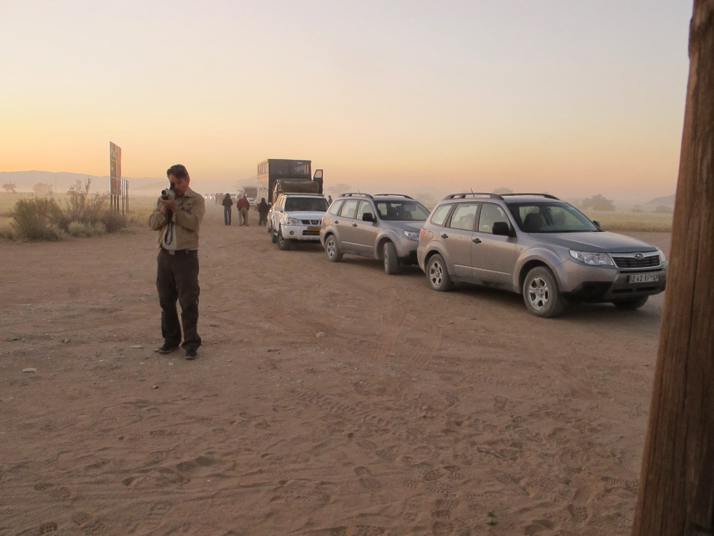
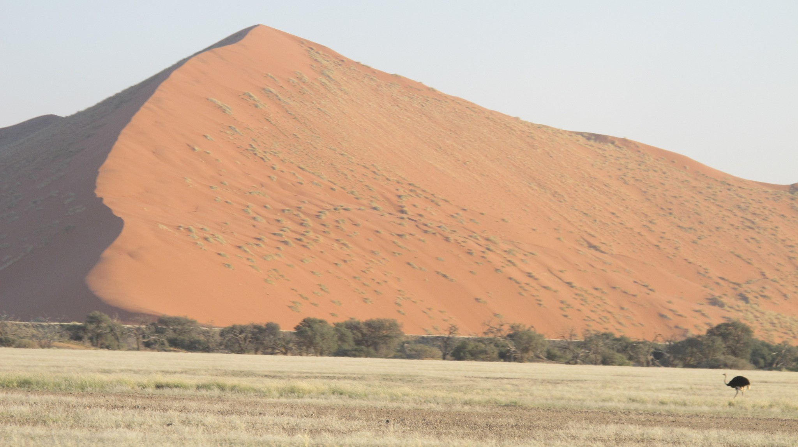
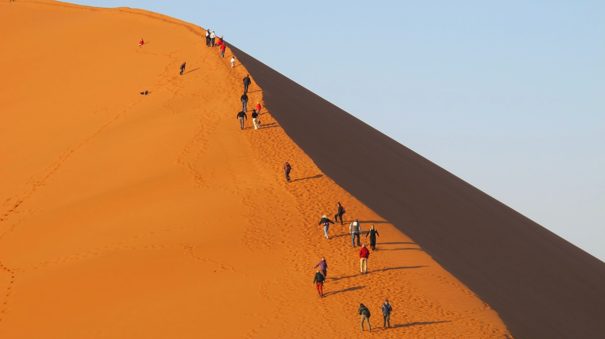
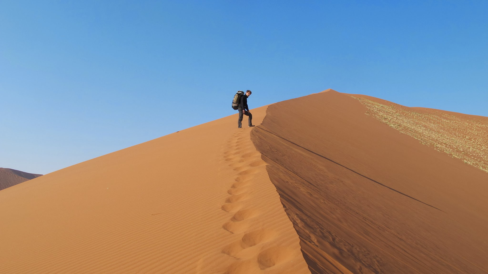
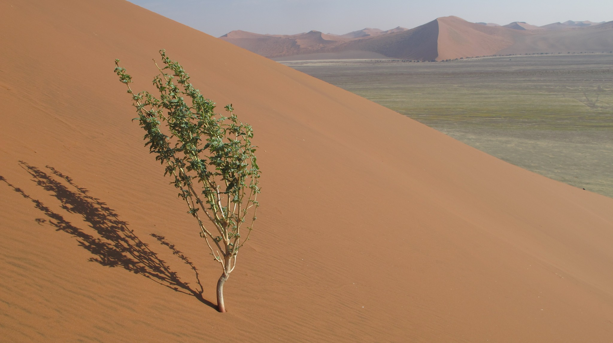

### Les dunes rouges de Sesriem

En Namibie, les deux attractions touristiques principales sont le parc national d'Etosha et les dunes rouges de Sesriem. Nous avons choisi de nous rendre à Sesriem. Depuis Luderitz, atteindre Sesriem n’est pas une mince affaire car cela suppose de prendre des routes non-tamisées et peu fréquentées. Heureusement pour nous, beaucoup de touristes se rendent à Sesriem. (Ici, « beaucoup » signifie « Au moins deux par jour » !). A Aus, ville à partir de laquelle la route n’est plus goudronnée, nous avons la chance de rencontrer deux couples de Français avec leurs enfants. Ils partent le lendemain pour Sesriem et nous font de la place dans la voiture pour nous embarquer avec eux. Ambiance de voyage en famille. Souvenirs des longs voyages pour aller jusqu’à Embrun ou Combloux, entassés dans la Nevada ou l’Espace ! « Maman, quand est-ce qu’on arrive ? ».

Sesriem est une ville, ou plutôt un lieu-dit, qui vit exclusivement pour le tourisme. Il s’agit de la ville à la porte du fameux désert de sable rouge namibien. Difficile de s’en sortir avec notre budget de bohême. Heureusement nous sommes toujours gentiment transportés par des touristes. Nous nous amusons à leur donner des noms : « les Italiens », « le solitaire », « les Allemands », « les cyclistes » etc. Et nous avons l’impression de presque tous les connaître ! Nous faisons du camping sauvage et décidons de payer l’entrée du parc qui mène aux fameuses dunes. Nous ne serons pas déçus ! La suite se savoure en image.

Tous les touristes vont sur la fameuse dune 45.

Nous irons 2km plus loin (sur la 47) où nous avons l’impression d’être seuls au monde, entourés par quelques antilopes, quelques autruches et des paysages magnifiques tout autour.

Après avoir savouré la beauté du paysage, nous retournons vers la « vraie » Namibie. Direction la capitale, Windhoek. Notre jeune CouchSurfer, Boris, nous attend. Et ce soir, chez Boris… C’est la fête !

Deux jours après, nous allons à Outapi. Dans le prochain article, nous vous relaterons une journée de voyage de la suite de notre périple en Namibie.

### Entre Blancs et Noirs

En Afrique du Sud, le clivage entre la population noire et la population blanche était flagrant. L’apartheid (mouvement politique sous lequel blancs et noirs étaient séparés) a laissé des traces qui sont encore perceptibles. Dans un restaurant, les serveurs et les hommes de ménage sont noirs, le propriétaire et les consommateurs sont blancs. Les noirs prennent les transports en commun (taxi-minibus), les blancs ont leur voiture. Les noirs vivent dans des townships, les blancs ont leurs quartiers résidentiels. Il y a beaucoup d’autres exemples comme cela. Cependant, il ne faut pas non plus être catégorique. L’écart est un peu moins fort chez les jeunes.

En Namibie, la population blanche est moins nombreuse (peut-être 10%). Les blancs ici, sont en général des descendants des allemands qui ont colonisé le pays au début du 20e siècle. L’écart de niveau de vie entre blancs et noirs est très grand. Quelques noirs ont accès aux responsabilités d’état ou ont des métiers qualifiés. Cependant, la plupart vivent avec un salaire de misère. Environ 75€ par mois. Pour les blancs, le salaire moyen est dix fois supérieur. Les blancs ont les postes managériaux et se regroupent en communautés. Certains n’aiment pas trop se mélanger à la population noire. Les blancs que nous avons rencontrés à Keetmanshoop n’envisageaient pas de mettre leurs enfants dans la même école que les noirs. Globalement, il semble que les blancs ne veuillent pas trop se mélanger et que les noirs aient accepté cette situation.

Il y a donc une tension entre blancs et noirs mais la Namibie reste un pays extrêmement paisible.

Voici quelques anecdotes résultant des différences entre blancs et noirs :

- Les gens (blancs ou noirs) nous prennent facilement en stop, ils nous font confiance
- Il arrive que les enfants en bas âge aient peur d’Olivier. (Mais c’est peut-être aussi à cause de la barbe…)
- Quand on demande à des noirs d’où nous venons d’après eux, ils répondent que nous venons de Norvège ! (Sans doute les yeux bleus d’Olivier)
- Nous sommes toujours les seuls blancs dans les transports publics : les taxi-minibus
