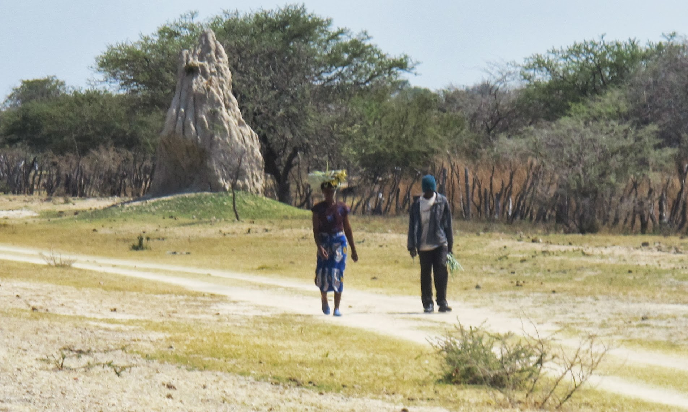
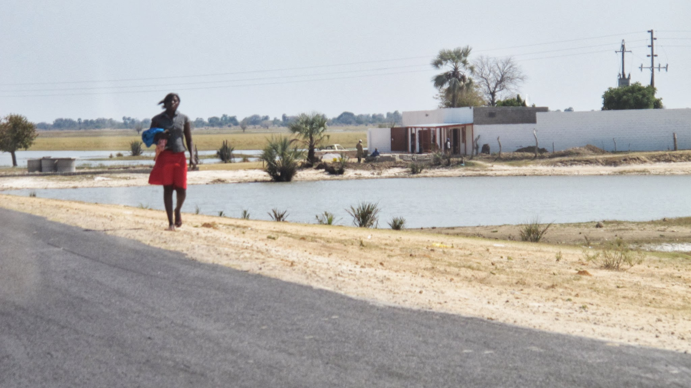
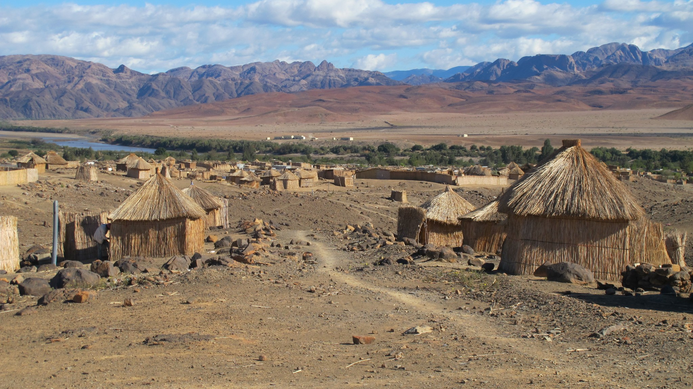

La plupart des touristes aiment voyager de site en site sans encombrement. Pour nous, se déplacer, trouver un logement et se nourrir font partie du voyage. C’est comme cela que nous rencontrons la population locale et que nous avons plein de petites anecdotes. Voici une journée de voyage parmi beaucoup d’autres.

### Matinée messe

Le Dimanche 7 août, nous sommes à Outapi, une petite bourgade du nord de la Namibie traversée par une route principale. Nous avons passé une nuit chez un pasteur rencontré par chance la veille et une nuit chez notre hôte de couchsurfing. Déçus par le côté « attraction touristique » des Himbas, nous renonçons à pousser notre voyage jusque Opuwo où vit cette tribu emblématique d'Afrique. Nous décidons donc de nous rendre à Rundu, une ville à 600km d’Outapi, en direction des chutes Victoria en Zambie. A Rundu, nous avons sollicité un couchsurfer mais nous n’avons pas eu accès à internet depuis Windhoek et nous ne connaissons pas sa réponse. Il est toujours plus facile de voyager tôt le matin, mais nous décidons quand même d’aller à la messe catholique romaine traditionnelle à 5km du village. Il semble qu’un certain nombre de fidèles sont en fait de culte luthérien. Tout le monde est bien habillé, c’est coloré et les chants sont magnifiques.

### Bain de foule de chauffeurs de bus

Après la messe, nous ne perdons pas de temps, nous commençons le stop. On nous propose 100N\$ (10€) pour revenir au centre-ville, on salue et on rigole.

Finalement une autre voiture nous prend et nous lâche à côté des bus longue distance et des taxis. Au bout de 10s, 25 hommes nous entourent (ceci n’est pas une exagération, nous avons compté ;-) ). Chacun nous dit : « hello my friend, how are you? ». Chacun veut nous attirer dans son bus ou son taxi. C’est à celui qui criera et postillonnera le plus fort. Tout le monde sait que nous allons à Rundu, chacun nous propose des combinaisons différentes en s’arrêtant dans certaines villes. On est presque bousculé vers les taxis. Alors on prend un peu de distance et on dit qu’on se débrouillera tout seul. Nous n’aurions pris les taxi mini-bus qu’en dernier recours car ils sont payants, lents, inconfortables et mettent beaucoup de temps à partir.

### Lift for free

100 mètres plus tard, nous commençons le stop, un voiture nous prend directement pour Oshakati, à 90km d’ici.

Nous pensons être d’accord sur le fait que c’était un stop gratuit. Erreur, le conducteur s’attendait à être payé. Arrivé à Oshakati, il nous demande plus d’argent que si nous avions pris un taxi. Nous refusons en disant qu’il ne nous avait pas prévenus que c’était payant et que si nous avions su, nous ne serions pas venus avec lui. Comme il insiste, nous lui donnons notre petite monnaie, il y en a pour 20N\$, ça ne lui suffit pas. Il veut nous emmener au poste de police. Nous refusons de monter dans sa voiture, mais nous voulons bien le suivre jusqu’au commissariat. Il finit par accepter, mais il se lasse très vite et s’en va. On n’aime pas ça du tout, la prochaine fois, on fera bien attention à s’assurer que la course est bien gratuite.

### Le militaire Angolais

C’est l’heure de déjeuner. Nous n'osons pas essayer la nourriture du marché car nous avons été malades récemment. Nous optons pour un resto dans un hôtel qui nous permet d’avoir accès au Wifi. Bonne nouvelle, le couchsurfer russe nous attend à Rundu pour la nuit du 9 août. Rassasiés, nous repartons sur la route, direction la station essence. Très vite tout le monde sait que nous allons à Tsumeb (ville sur la route pour aller à Rundu). Mais ici, ce n’est pas vraiment le bon endroit, nous en connaissons un meilleur, 25km plus loin. Nous recommençons le stop sur la route. Quelqu’un s’arrête. Free lift is ok? Ok. C’est un militaire Angolais.

On nous a bien avertis que faire du stop pouvait être dangereux et la veille notre hôte de couchsurfing nous a raconté l’histoire d’un couple kidnappé alors qu’il pensait prendre un taxi. Ceci étant, le bonhomme à l’air plutôt sympathique et nous montons à l’arrière du pick-up où une bonne dame est déjà installée. Quand il s’arrête pour faire de l’essence un peu plus loin, Olivier commence à discuter avec lui de politique. Pour lui, Mugabe est un bon président et la France n’aurait pas dû attaquer Kadhafi. Vivement intéressé par la discussion, notre chauffeur propose à Olivier de monter à l’avant. Un autre homme s’assoie à l’avant et Olivier se retrouve au milieu des deux hommes. La discussion est animée. A l’arrière, Nicolas est toujours avec la dame.

Tout à coup, la voiture change de direction et se dirige sur une petite route isolée. Les deux Angolais allument chacun une cigarette. Ça commence à être flippant. Nicolas ne sait pas ce qu'il se dit à l’avant. Olivier demande naïvement pourquoi ce changement de direction. Le militaire répond que c’est pour éviter la police. Une réponse pas du tout rassurante. Dans ces moments-là, on se demande pourquoi on n’a pas pris le bus. La voiture ralentit. On avale notre salive. Puis elle accélère. Et au bout de 10 longues minutes, on se retrouve sur la route principale. Nous sommes soulagés. Il fera même le détour jusqu'à l’endroit où nous voulons faire du stop. C’était quand même une grosse frayeur.

### Le millionnaire éméché

Quelques minutes plus tard, un autre pick-up s’arrête. Il va jusque Grootfontein. C’est la grosse ville avant Rundu. C’est parfait pour nous. Nous montons « for free » à l’arrière. Nous nous installons confortablement, on est content car la voiture semble aller très vite.

Au bout de 3h de trajet, nous sommes arrivés, tous les autres passagers sont descendus à divers endroits. Le chauffeur nous demande où nous allons et en discutant avec lui, nous nous apercevons qu’il est un peu éméché. Il nous explique qu’il a bu deux bouteilles de Whisky durant le trajet alors qu’il roulait à 150km/h. Cette fois-ci, la frayeur est après coup. Néanmoins, il veut absolument nous aider. Il semble assez riche et très connu. Apparemment, son père est millionnaire.

### Ce soir nous dormirons chez la police

Il nous propose de venir dormir chez lui. Mais il habite à 30km de la ville, alors il nous cherche un autre plan. Après nous avoir offert un soda (alors que lui prend une bière), il nous dit qu’il veut nous présenter l’inspecteur du district. Ce soir, nous irons dormir chez l’inspecteur Henz ! Nous allons à la station essence où l’inspecteur Henz a garé sa voiture (eh oui, l’inspecteur ne gare pas sa voiture devant le pub où il va boire un coup…) puis nous nous rendons dans l’immense maison de Monsieur l’inspecteur. Il vit seul dans ce bâtiment aux dimensions démesurées. Nous profitons d’un bon lit pour la nuit et demain nous irons à Rundu.

import Navigation from "../../Navigation";

<Navigation
  previous="/2011-08-10"
  next="/2011-08-29"
  gallery="/galerie/namibie"
/>
