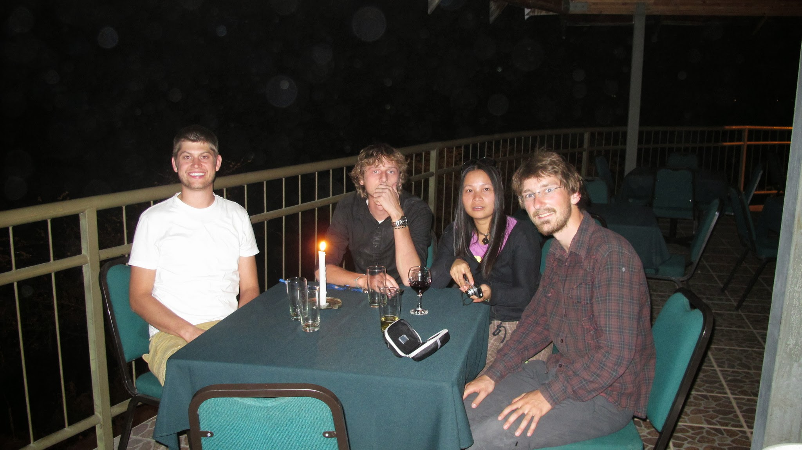
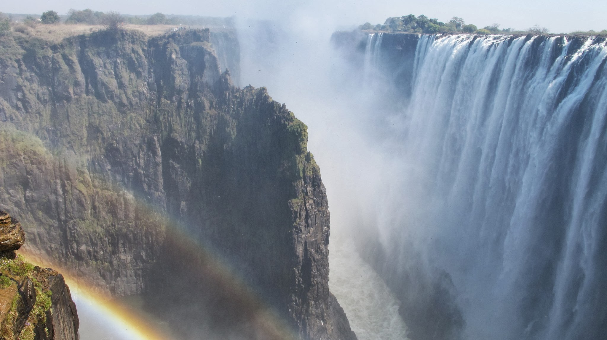
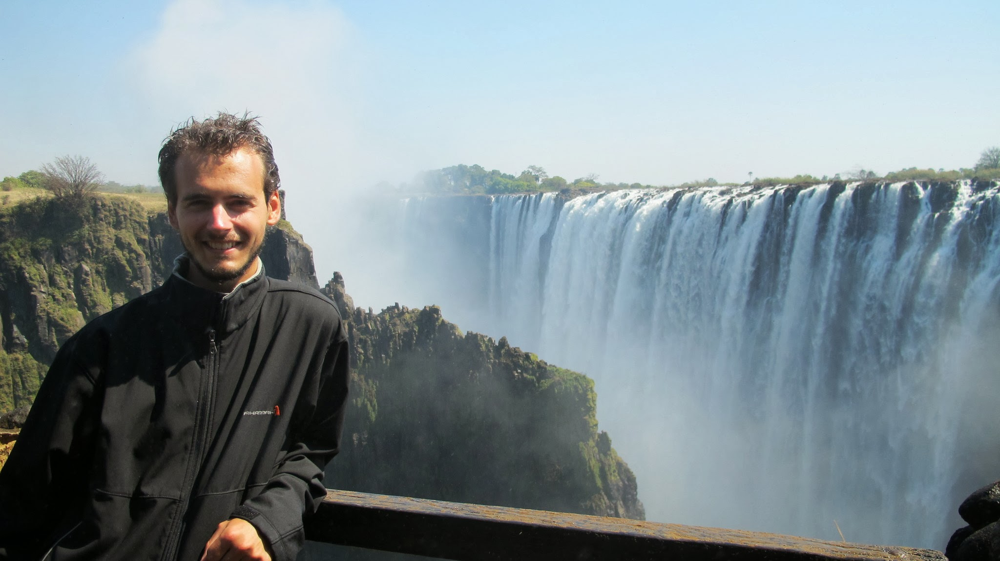
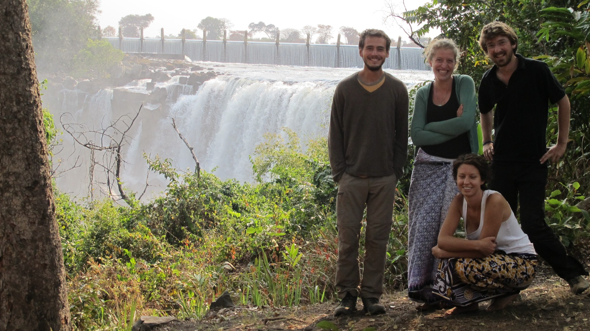
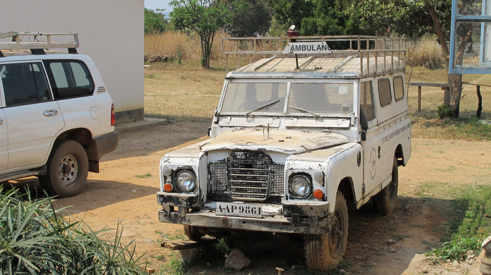
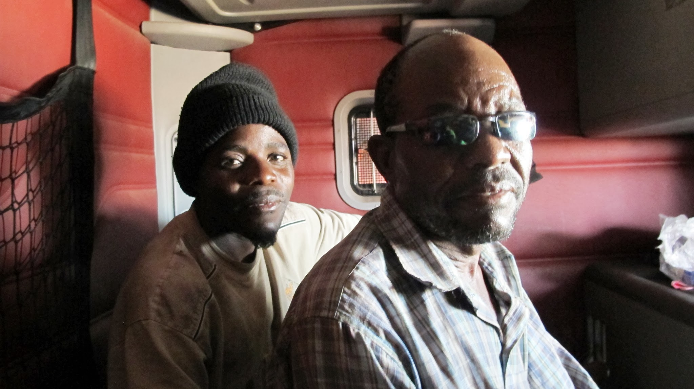
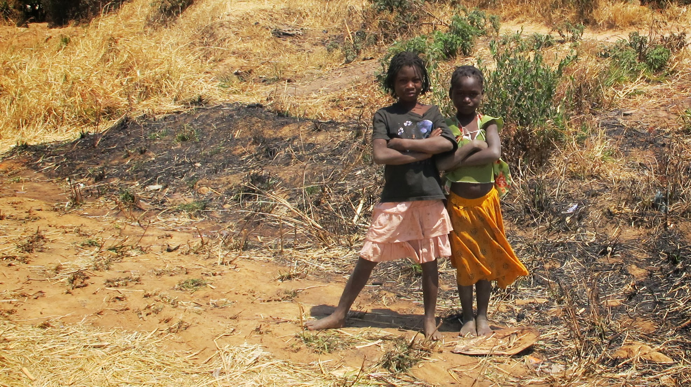

### The Vic’ Falls

Les 1000km qui séparent Grootfontein de Livingstone, n’auront pas été longs à parcourir. Nous passerons une nuit à Rundu chez nos accueillants hôtes couchsurfers américains : Alex et Matt.

Nous passerons une autre nuit à Katima Mulilo, la ville frontière entre la Namibie et la Zambie. Nous devons y trouver 100 USD pour acheter le visa et rejoindre la Zambie. Même avec 4 banques dans la ville, c’est loin d’être facile. Soit les banques n’ont pas de dollars, soit leur système informatique ne fonctionne pas… et ce n’est pas facile de se faire comprendre lorsque les banquiers ne sont pas très compétents ! Heureusement, notre dernière tentative dans la 4ème banque sera fructueuse et nous voilà admis en Zambie ! A la frontière, les USD s’échangent à des taux plus élevés par quelques africains qui ont compris qu’il y avait du business à faire ! Nous nous rendons ensuite en stop à 25km de Livingstone au bord de la rivière Zambèze, à une adresse de couchsurfing : Crocodile Creek.

Arrivés là-bas, nous sommes surpris : nous débarquons dans une lodge… Nous ne comprenons pas très bien ce qu’il se passe : le couchsurfing est censé être gratuit ! Finalement, oui, c’est bien gratuit et nous profiterons ainsi de 2 nuits dans une lodge ! Il s’agit en fait d’une sorte de « Community Farm » encore en construction. L’endroit est magnifique et il fait bon s’y poser pour 2 nuits. La nuit, nous profitons des grognements des hippopotames, et la journée nous avons la chance d’aller admirer les chutes Victoria sans nos gros sacs !

Les chutes Victoria sont l’attraction touristique majeure de Zambie. C’est compréhensible : l’endroit est absolument magnifique.

Nous voilà donc plongés dans un univers touristique. Nous payons 20 USD l’entrée (prix touriste). Nous croisons beaucoup de « blancs ». Nous sommes harcelés par les vendeurs de souvenirs. Nous admirons la beauté des paysages.

Le reste de la Zambie n’est pas touristique du tout. Essayez donc de trouver un guide touristique sur la Zambie ! Vous devriez le commander et seriez peut-être déçu par son épaisseur !

Nous sommes heureux de partir à la découverte d’un pays souvent délaissé par les autres visiteurs.

### Deux nuits sous les clochers

Notre nouvel objectif est maintenant de rejoindre Lusaka, la capitale de la Zambie. C’est un passage obligé en Zambie… non pas pour sa beauté ou son rayonnement culturel, mais plutôt parce que, dans cette région, toutes les routes mènent à Lusaka ! Nous nous y rendons donc en 3 jours, ce qui nous laissera le temps de faire 2 belles rencontres sur le thème de notre voyage.

La première se passe à Kalomo. Nous y arrivons dans la nuit et contrairement à ce dont on a l’habitude, le premier habitant à qui nous demandons si nous pouvons camper dans son jardin refuse et nous redirige vers l’église catholique de la ville. Nous nous y rendons et y rencontrons 2 prêtres et un séminariste qui nous accueillent à bras ouverts. Nous aurons ensemble une longue discussion sur les religions et sur la façon dont le christianisme trouve sa place dans ce pays. Il y a un peu plus d’un siècle, les premiers missionnaires (Jésuites en ce qui concerne le catholicisme) sont arrivés en Zambie. La religion prédominante est maintenant le christianisme. Diveres Eglises cohabitent. On trouve des catholiques, des pentecôtistes, des baptistes, des adventistes du 7e jour ou encore des témoins de Jéhovah. En plus de cette diversité de culte, les croyances traditionnelles se superposent aux croyances bibliques. On observe souvent un retour aux croyances locales lors des moments de crises. S’il y a un décès dans la famille, on va prier les ancêtres. D’autre part, tout accident doit avoir une explication spirituelle : si le voisin a pris la voiture alors qu’il était ivre et qu’il est mort suite à un accident, on va chercher ce qu’il s’est passé dans sa vie. Peut-être avait-il un différend avec quelqu’un qui lui aurait alors jeté un sort. Nous passerons plus tard quelques jours dans un petit village où se trouve une sorcière. Les villageois la craignent et ne plaisantent pas du tout avec ça : il ne faut pas lui chercher de noises sinon elle pourrait jeter un sort.

Notre seconde rencontre est celle d’un pasteur pentecôtiste de 20 ans et de sa famille. A notre arrivée dans sa maison, il est en pleine séance d’exorcisme. Nous attendons depuis la salle voisine. Plusieurs personnes sont avec lui et entourent la personne possédée. Ils crient et proclament leur foi. Seules des personnes ayant la foi sont admises dans cette pièce. En effet, le démon qui doit sortir du « patient » s’attaquera en premier aux personnes qui n’ont pas la foi. Cette séance est impressionnante à entendre, cela semble violent.

Nous irons le lendemain à l’église avec lui. La célébration dure 3 heures. Il y a beaucoup de chants et un très long prêche du pasteur. La participation de la salle est très vive. Cela semble être un moment très intense pour les croyants.

Nous passons ensuite 3 jours à nous reposer à Lusaka avant de rejoindre la région du nord de la Zambie.

### Le pays aux 72 langues

En Zambie, cohabitent une multitude de tribus avec chacune sa propre langue. L’anglais est la langue officielle mais en dehors des grandes villes, peu de gens le parlent. Chacun communique dans son propre dialecte. Parfois les locaux connaissent plusieurs langages mais la plupart du temps, deux Zambiens de tribus différentes ne se comprennent pas.

Avec autant de dialectes différents, il est difficile pour nous d’apprendre les bases de chacune des langues des régions que nous traversons. Cependant, les Zambiens sont très fiers de leur langue et ils n’hésitent pas à nous demander « Comment ça va ? » dans la langue locale pour nous tester. Avec les Vic’ Falls, la rapidité du voyage et nos trois jours à Lusaka, nous mettrons plus d’une semaine avant d’apprendre nos premiers mots du dialecte d’une des tribus du nord de la Zambie, le Bemba. Il suffit alors de connaître deux ou trois phrases pour que les gens soient admiratifs et heureux de voir que nous nous intéressons à leur culture.

Mais nos soucis de langues ne font que commencer. En Bemba, il y a des dizaines de manière de saluer quelqu’un selon le moment, l’humeur et l’activité. Voici les formes les plus employées :

- Mwashibukeni mukwai – au réveil
- Mwapoleni mukwai – quand l’autre est en bonne santé
- Mwabombeni mukwai – quand il travaille
- Mwatandaleni mukwai – quand il marche
- Mwaikaleni mukwai – quand il est assis
- Mwalileni mukwai – quand il mange
- Mwasalikeni mukwai - quand il vient de prier
- Mwapusukeni – après un danger (après l’accouchement par exemple)
- Mulishani – quand il n’y a rien de particulier
- Kafikeenipo mukwai – quand il vient d’arriver
- ...

Mais ceux qui veulent apprendre le Bemba ne sont pas au bout de leurs peines. En Bemba, on ne peut pas dire « maman » tout seul. Il y a un mot pour dire « ma maman », un autre pour dire « ta maman », encore un autre pour « la maman du voisin », etc. Ainsi, en Zambie, il semble plutôt judicieux de rester au même endroit pour n’avoir à apprendre les rudiments que d’une langue.

Nous nous rendons donc dans la région nord de la Zambie. Magda et Soline, nos hôtes couchsurfing nous y attendent.

### Chilubula Mission Village, au cœur de l’Afrique

Nous arrivons donc au village où vivent Magda et Soline avec les rudiments du langage local en poche. Notre venue ici sera l’occasion de comprendre un peu mieux le monde rural de Zambie.

Soline et Magda sont deux volontaires FIDESCO qui offrent respectivement un et deux ans de leur vie à aider au développement de l’Afrique. Soline est infirmière et Magda est sage-femme. Elles travaillent avec toute une équipe locale dans l’hôpital qui fait la renommée du village. Nous faisons l’agréable découverte que Soline est française ! Pastis et jambon de Bayonne seront donc de rigueur pour l’apéro ! Quant à Magda, ses petits plats locaux avec une touche polonaise seront un régal.

Ces quelques jours à Chilubula ont également été l’occasion de visiter les chutes Chisimba, de passer un peu de temps avec les enfants du village et de visiter l’hôpital pour mieux comprendre la situation actuelle.

Il est intéressant de faire un parallèle entre la situation religieuse et médicale. Comme nous le disions en ce qui concerne la religion : la croyance traditionnelle se superpose à l’apport des missionnaires. C’est exactement le même principe avec la médecine : la médecine traditionnelle se superpose avec les soins classiques apportés à l’hôpital. Avant d’aller à l’hôpital, la plupart des gens essayeront la médecine traditionnelle. Parfois cela marche. Mais parfois, mettre un mélange de terre sur une plaie ne suffit pas à faire guérir la gangrène naissante et le patient se retrouve amputé d’une main alors qu’on aurait pu soigner uniquement le doigt. Cela est très frustrant car les gens arrivent souvent trop tard à l’hôpital et il n’y a jamais d’urgence. On voit donc des enfants décéder du paludisme dont la forme présente dans la région est facilement curable.

A cette période de l’année, l’hôpital est calme, mais pendant la saison des pluies, la salle accueillant les enfants est pleine à cause de la malaria (paludisme). Le SIDA amène également beaucoup de patients qui sont soignés, suivis et conseillés tout au long de l’année. Cependant le HIV reste tabou, la plupart des gens préfèrent ne pas faire le test. Les femmes HIV-positives continuent à allaiter. Elles savent que cela augmente le risque de transmission au bébé mais si elles n’allaitaient pas, les autres femmes sauraient qu’elles sont HIV-positives. Il est toujours très difficile de faire changer les mentalités.

Nous garderons un excellent souvenir de notre visite de Chilubula. Bon courage à vous, Magda et Soline, pour votre formidable travail dans cet hôpital !

### L’auto-stop et la corruption

Nous voilà déjà repartis sur la route. Direction le Malawi. Nous ne suivons pas la route principale pour nous y rendre… à nos risques et périls ! Au moment où nous écrivons ces lignes, nous avons des frissons dans le dos à repenser à ces longs jours de voyage !

En temps normal, le trajet n’est pas très agréable car nous nous retrouvons souvent dans des camions avec beaucoup de monde. Tassés les uns sur les autres, trouver une position agréable est souvent difficile. N’en parlons pas quand le chauffeur décide de s’arrêter au bord de la route pour dormir ! Mais lorsque les routes sont en plus cabossées, les trajets deviennent vite longs et épuisants d’inconfort. Trouver un camion sur ces routes n’est pas non plus une mince affaire.

Nous apprenons donc petit à petit à ne pas aller tout droit sur la carte mais à faire de longs détours pour avoir du monde sur des routes fréquentables.

Voilà quelques temps que nous ne voyageons plus gratuitement. Trouver un véhicule qui accepte de nous transporter gratuitement relève de l’exception. Les camionneurs négocient leur prix à environ 1€ pour 50km. A première vue, rien de plus qu’un petit argent de poche… mais multipliez par 6 pour un trajet de 300km puis par 20 pour le nombre de personnes qu’ils peuvent transporter et voici un mois de salaire dans les poches du chauffeur… Nous n’arrivons toujours pas à comprendre ce qu’ils font de cet argent, pourquoi les prix sont si élevés et pourquoi il n’y a pas un business du transport qui se monte.

La seule chose que nous pensons comprendre est que ce n’est pas légal et qu’à chaque barrage de police (réguliers sur les routes principales) un billet va discrètement dans la poche du policier en fonction du nombre de personnes transportées.

Nous atteignons ainsi le Malawi par le nord pour de nouvelles aventures !

