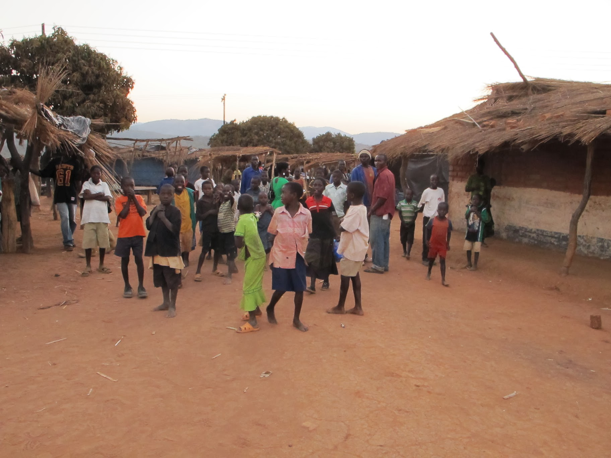
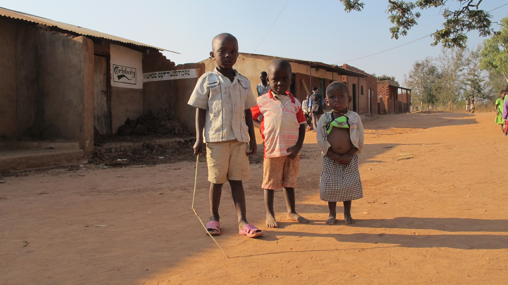
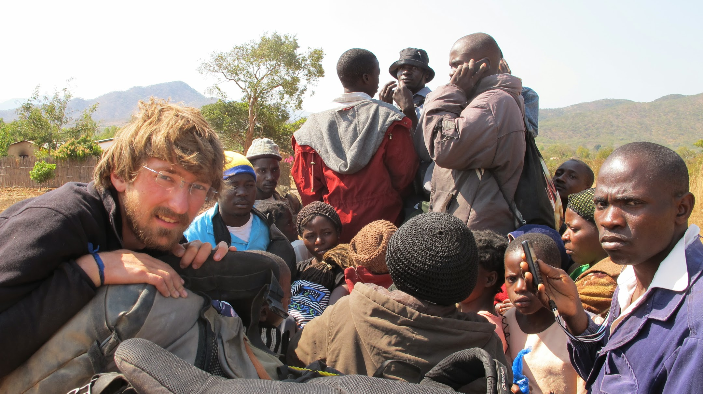
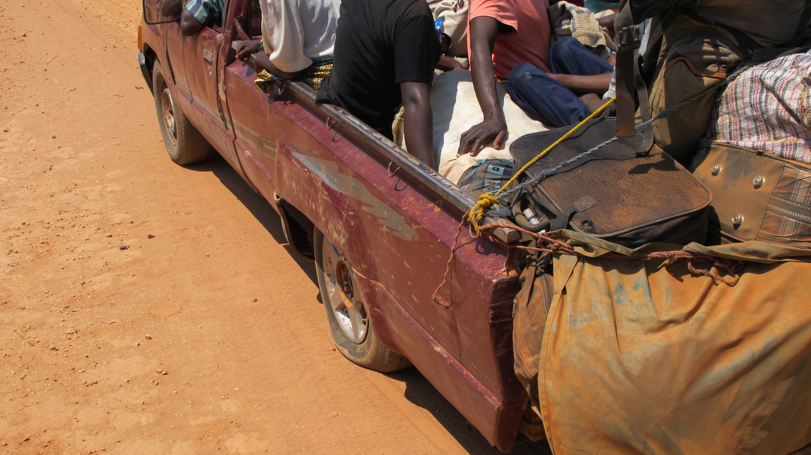
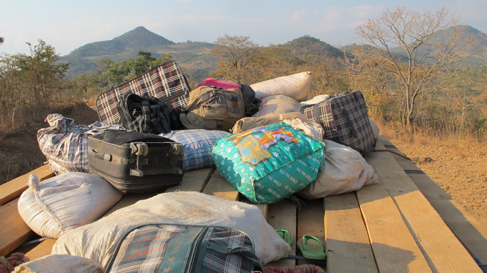
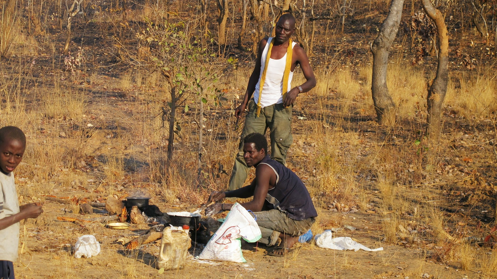

### Malawi, nous voilà !

Nous décidons de nous rendre au Malawi par le nord de la Zambie. Nous voyons bien des routes et des postes frontières sur les cartes du Malawi. Pourtant, lorsque nous demandons notre chemin, presque tout le monde nous redirige vers Lusaka, au sud du pays. Nous rencontrons finalement un zambien qui nous confirme qu’il y a bien une route qui va au Malawi depuis Naconde (ville frontière entre la Zambie et la Tanzanie). Nous comprenons vite pourquoi personne ne semble connaître cette route ! Tassés dans un taxi commun, nous passerons plusieurs heures à parcourir 50km sur une route à peine praticable. Au poste de frontière zambien, nous serons surpris de constater que le garde-frontière ne nous arrête même pas. 100m plus loin, au poste frontière du Malawi, cela nous posera bien des soucis : sans tampon de départ de Zambie, le garde-frontière refuse de tamponner notre passeport. En fait, il fallait obtenir le tampon à Naconde car il n’y a pas vraiment de poste frontière zambien ici. Après un certain temps de négociation, nous obtiendrons tout de même notre tampon d’entrée au Malawi sans retourner à Naconde.

Notre arrivée au Malawi semble être une bonne nouvelle pour notre porte-monnaie. Ici, un repas au resto coûte environ 1€. A peine arrivés à la ville frontière, Chitipa, nous apprenons à dire 3 mots en Chichewa, la 2e langue du Malawi après l’anglais.

### En route pour Nyika National Park

Notre plan est d’aller au parc national Nyika, dans le nord du Malawi, à 160km de Chitipa. Nous voulons y faire un trek de trois jours qui nous emmènerait jusque la ville de Livingstonia. Tout cela semblait simple. En fait c’était le début d’une sacrée aventure.

Augustine, rencontré le midi au restaurant, nous propose de nous emmener jusqu’à Mwenewenya village à 70km en direction du parc. Comme souvent, nous montons à l’arrière du pick-up. Plus que jamais, nous sommes secoués comme des prunes. Une main pour amortir les chocs de la tête, une autre pour les fesses et un travail abdominal constant pour ne pas se retrouver collé contre une vitre. Dans ces moments-là, le temps passe très lentement ! Au bout de trois ou quatre longues heures de trajet, nous voilà enfin dans le village où Augustine nous dit au revoir. Ce petit village assez isolé n’est pas habitué à voir débarquer des touristes. Nous nous retrouvons très vite entourés d’une foule et devenons l’attraction principale ! C’est la fin du marché. Nous nous y baladons avec une foule qui nous suit discrètement.

La plupart des enfants du village sont ahuris de voir des blancs. Pour eux, c’est la première fois.

Le lendemain, nous voilà repartis pour Nthalire, un petit village à 30km de Mwenewenya. D’après nos sources, nous pourrons y prendre un transport pour le Parc Nyika. Et en effet, à Nthalire, un pick-up nous attend. En fait, il ne nous attend pas vraiment, il est déjà plein. Mais quand il y a de la place pour 22, il y a très certainement de la place pour 24.

Nous étions déjà montés à beaucoup dans une camionnette, le début du trajet ne nous inquiète donc pas plus que ça. Cependant, en chemin, le chauffeur accepte encore des passagers (et les gros sacs de maïs qui vont avec). La route est très mauvaise. A chaque creux et à chaque bosse, l’arrière de la voiture touche la terre. Nous arrivons bientôt à la première grosse montée. La voiture s’arrête. Tous les hommes doivent descendre et continuer à pied jusqu’à ce que la route soit plate. Et à chaque montée, c’est la même histoire. Une ambiance assez familiale et solidaire s’instaure entre les passagers. Peu à peu, l’arrière de la voiture commence à toucher le sol de façon continue. On s’arrête. On descend. Les pneus sont à plat.

Qu’à cela ne tienne ! L’assistant du chauffeur les regonfle avec une pompe à vélo et c’est reparti. Bien sûr, quelques minutes plus tard, le pneu est de nouveau à plat et cette fois-ci le chauffeur se rend à l’évidence, on a crevé. Ce n’est pas étonnant vu la surcharge que doivent supporter les petites roues de l’arrière du véhicule. Après le changement de roue, nous entrons dans le Parc Nyika. Les passagers ont encore 120km avant d’arriver à Rumphi, leur ville de destination. Nous, il nous reste 15km avant d’arriver à la jonction d’où nous devrons encore marcher 16km pour arriver au camp principal.

La route est de plus en plus mauvaise. Les arrêts où nous marchons à côté de la voiture sont de plus en plus fréquents. La corde qui retient les sacs à l’arrière commence à se détériorer et nous sommes sur ces mêmes sacs. C’en est trop : nous ne sommes pas rassurés, un accident peut arriver d’un moment à l’autre… nous continuons à pied.

Le problème est qu’il ne nous reste plus beaucoup d’eau, il est déjà 15h30, nous n’avons pas déjeuné et il reste plus de 20km à parcourir. Nous n’avions pas encore connu une telle galère ! Mais nous prenions aussi suffisamment de recul pour profiter des paysages magnifiques et des animaux que nous avons vus à quelques mètres seulement (sorte de grosses antilopes). Quelle joie, au bout de 3h de marche, lorsque nous sommes arrivés près d’un lac où nous avons pu remplir nos bouteilles ! Quelle bonheur lorsque nous avons fait cuire du riz le soir ! Les pieds en compote, nous nous endormons comme des bébés !

### Oyez ! Oyez ! Touristes, sortez le portefeuille !

Après cette bonne nuit de sommeil passée à la bordure d’un camping vide, nous allons à la réception pour récolter les informations nécessaires pour faire notre randonnée. Nous apprenons alors que la randonnée ne peut se faire qu’avec un guide et que la petite balade ne nous coûtera pas moins de 150USD en plus des coûts d’entrée du parc que nous avons déjà payés. Ce n’est pas dans notre budget. Nous voulons alors quitter le parc, mais le réceptionniste nous dit que, par souci de « sécurité », il est interdit de marcher seul dans le parc pour les non locaux. Heureusement, il peut nous affréter un transport pour 20USD par personne pour nous déposer à 15km d’ici ! Aucun compromis ne semble possible. Finalement, un autre responsable arrive pour nous tirer d’affaire ! Nous apprenons que des camions qui transportent du bois peuvent nous sortir de là en nous emmenant à Rumphi, là où se dirigeait le pick-up la veille. Nous remercions poliment et partons avons que l’autre réceptionniste nous réclame des dollars pour la nuit passée dans le parc ! Quel miracle de s’en sortir sans dépenser un dollar !

### 11h de routes, 110km !

Quelques minutes plus tard, vers 10h, nous voilà à l’arrière d’un gros camion à bois avec une dizaine d’autres passagers.

Il avance très lentement mais sûrement : cette fois, nous sommes confiants. Nous touchons du bois, si l’on peut dire. Au bout de 25km (2h de route), nous croisons le pick-up que nous avions abandonné la veille ! Il a un peu avancé… mais pas beaucoup quand même. Les passagers ont fait un feu pour la nuit. Voyant les appels en détresse des passagers, notre camion s’arrête et nous voilà maintenant à 30 sur les planches ! Le confort est fini. Nous sommes quand même très heureux de revoir nos anciens compagnons de fortune en bonne santé. Après une pause déjeuner et 11h de trajet dans la journée, nous arrivons enfin à Rumphi.

Ces deux jours ont été éprouvants mais tout le monde est arrivé à bon port, c’est le principal.
