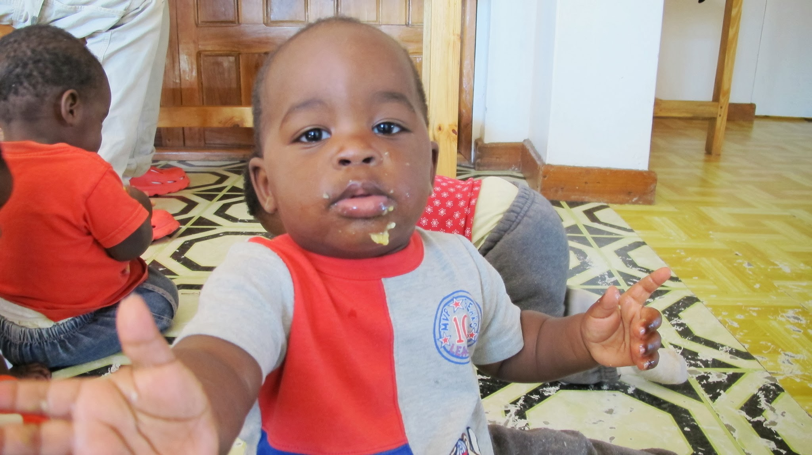

Thank you Nan! Your translation is really good! We're waiting for the Chinese one! [French version](/2011-09-11)

Upon arrival to Malawi, we had met Augustine in Chipita. Augustine is an administrative assistant of an orphanage in Mzuzu. When we met him, he was on the way to getting a new-born baby whose mother just died. After taking us in his car, he told us that we could help him later in Mzuzu.

Three days later, we arrived in Mzuzu and we called Augustine. At the night, we were in that orphanage where we would help for 5 days.

Augustine proposed us to camp in his garden. He invited us to have meals with his family composed by his wife, his little daughter Olivia and himself. They lived just beside the "Crisis Nursery".

"Crisis" means that this orphanage takes care of the children who all have a critical age: between several weeks and 2 years old. These children, whose mothers are dead, need to be fed with milk for babies, which are expensive. Their lives are in danger because in a money-lacked family, they won't be fed in priority.

We then find ourselves in the center of 13 little kids.

After two or three times of crying because of the beard of Olivier, we get familiar with these babies very quickly. With the help of the mothers and a German volunteer, Laura, we learn to know them fast. We play with them, help to feed them, to get them dressed, to wash their nappies, etc.

Here is a typical day:

- 7h : get up, breakfast (porridge)
- 7h30 ¨C 9h30 : break !
- 9h30 : snack (mess of banana et baby bottle)
- 10h to 12h : nap
- 12h : lunch (Nchima)
- 13h to 16h : break again !
- 16h : baby bottle - bath
- 18h : supper (Nchima)
- 19h : Sleep !

Meal time:

After three days passing with the children, when we need to make them eat, we know well who we will choose! Not Mosis: he will piss on you between the meal¡­ not Joshua: he is distrait and eats too slowly¡­ not Joseph: he always makes himself dirty when he eats¡­ not Mamane: he cries all the time! A word, the best is to take Flyness!

Here, the sentence of: "a scoop for..." doesn't exist; we take Nchima with right hand and it will directly be in the little's mouth. At the end of the meal, the child has it everywhere. Well fine, this may be not the only responsible.

At the age of two years old, when they can walk and eat Nchima (the local food) they will be resent to their villages where they have their relatives to take care of them. In theory, the orphanage will visit them 4 times to ensure that they can be well looked after. But in practice, most of the time, they have no enough money for even organize one visit (because of the transport cost). Without following, the children run the risk of being badly fed or being discarded. The orphanage is financed by the mobilization of an American Christian parish and other private donations. The preferred expenses are used to support the primary needs of children: the special milk, the rent of the place, the salaries of mamans, etc. The budget is always insufficient for cover the other necessary expenses like the following of children or buying the place.

The orphanage needs help. It depends a lot on the private donations for improve their work efficiency. If this touches your heart, don't hesitate to contact Augustine. We will also be available for more information.

Only just adapted to this kind of life, we set out again for the lake Malawi.

import Navigation from "../../Navigation";

<Navigation
  previous="/2011-09-03"
  next="/2011-09-22"
  gallery="/galerie/malawi"
/>
