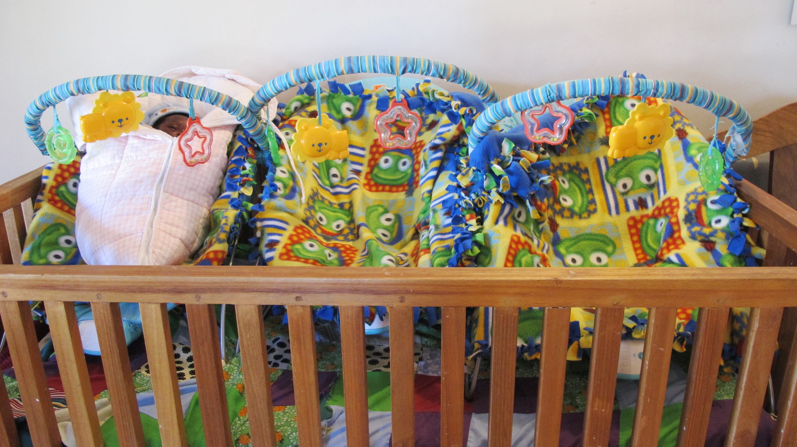
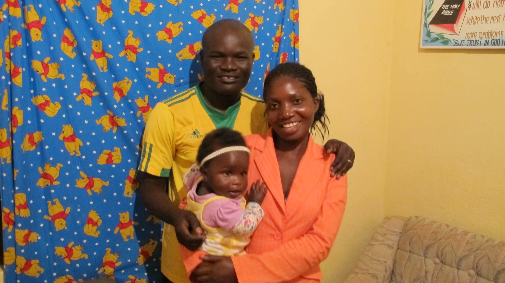
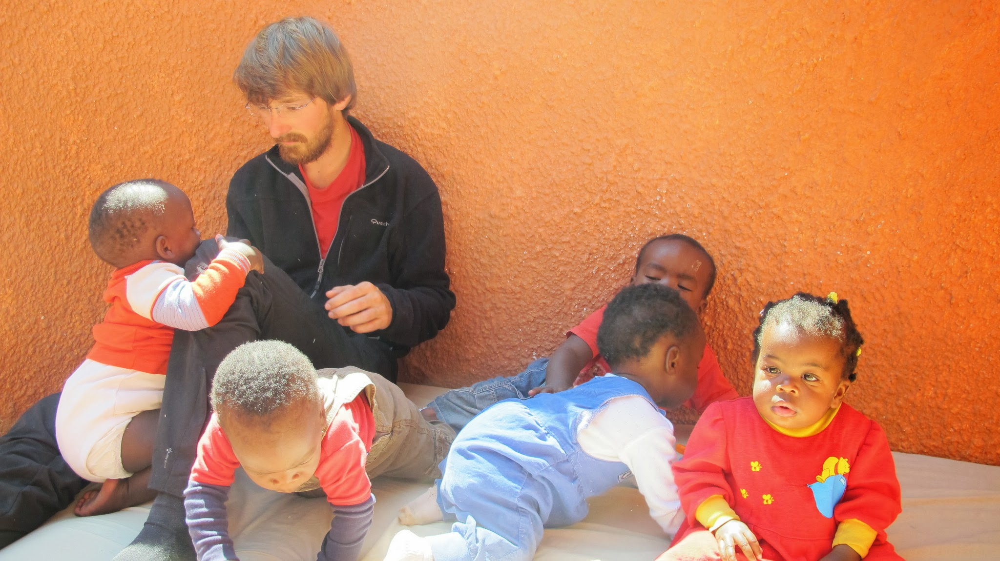
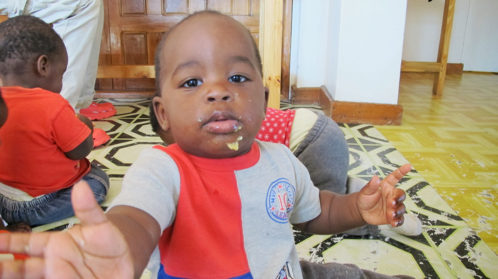
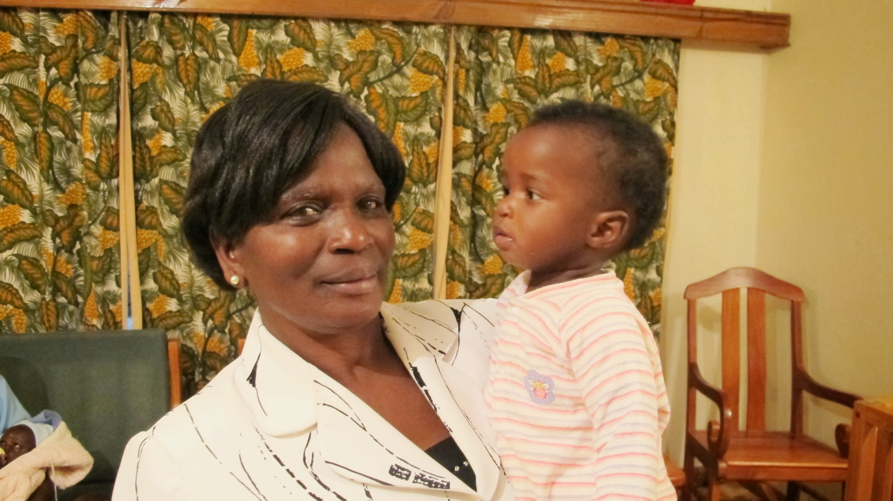

[English version here](/en/2011-09-11)

Dès notre arrivée au Malawi, nous avions rencontré Augustine à Chitipa. Augustine est l’assistant administratif d’un orphelinat à Mzuzu. Quand nous le rencontrons, il est sur la route pour aller chercher un nouveau-né dont la maman vient de décéder. Après nous avoir pris en stop, il nous dit que nous pourrons le rejoindre plus tard à Mzuzu.

Trois jours plus tard, nous voilà à Mzuzu d’où nous appelons Augustine. Et le soir, nous sommes à l’orphelinat où nous proposons notre aide pour 5 jours.

Augustine nous propose chaleureusement son jardin pour camper. Il nous invite à prendre les repas avec sa famille composée de sa femme, sa petite fille Olivia et lui-même. Ils habitent juste à côté de la « Crisis Nursery ».

« Crisis » car cet orphelinat s’occupe d’enfants en âge critique : entre quelques semaines et 2 ans. Ces enfants, dont la maman est décédée, doivent être alimentés avec du lait pour nourrisson, cela coûte cher. Leur vie est en danger car, dans une famille où l’argent manque, ils ne seraient pas nourris en priorité.

Nous nous retrouvons donc au milieu de 13 petits bouts de chou.

Après deux ou trois pleurs à cause de la barbe d’Olivier, nous nous familiarisons vite avec ces petits bébés. Avec l’aide des « mamans » et d’une volontaire allemande, Laura, nous apprenons vite à les connaître. Nous jouons avec eux, nous aidons à les nourrir, à les changer, à laver les couches, etc.

Voici comment s’organise une journée type :

- 7h : debout, petit déjeuner (porridge)
- 7h30 – 9h30 : création !
- 9h30 : snack (purée de banane et biberon)
- 10h – 12h : sieste
- 12h : déjeuner (Nchima)
- 13h – 16h : recréation !
- 16h : biberon - bain
- 18h : dîner (Nchima)
- 19h : Dodo !<

L’heure du repas

Après trois jours passés avec les enfants, lorsque nous devons leur donner à manger, nous savons bien lesquels il faut choisir ! Pas Mosis : il fait pipi sur vous pendant le repas… pas Joshua : il est distrait et mange beaucoup trop lentement… pas Joseph : il n’est pas très propre quand il mange… Pas Mamane : il fait des crises ! Bref, le mieux c’est de prendre Flyness !

Ici, la phrase : « une cuillère pour… » n’existe pas ; on prend Nchima avec la main droite et ça va directement dans la bouche du petit. A la fin du repas, l’enfant en a paaartout ! Bon d’accord, ce n’est peut-être pas le seul responsable…

A l’âge de 2 ans, lorsqu’ils peuvent marcher et manger Nchima (la nourriture locale) ils sont renvoyés dans leur village où leurs proches s’occupent d’eux. En théorie, l’orphelinat les visite à 4 reprises pour s’assurer qu’ils sont bien traités. En pratique, la plupart du temps, il n’y a même pas assez d’argent pour organiser une visite (à cause des frais de déplacements). Sans suivi, les enfants risquent d’être mal nourris ou mis à l’écart.

L’orphelinat est financé grâce à la mobilisation d’une paroisse chrétienne américaine et d’autres dons privés. Les dépenses prioritaires sont de subvenir aux besoins primaires des enfants : le lait spécialisé mais aussi la location des locaux, le salaire des « mamans » etc. Le budget est souvent insuffisant pour couvrir d’autres dépenses nécessaires comme le suivi des enfants ou l’achat de locaux.

L’orphelinat a besoin d’aide. Il compte beaucoup sur les dons privés pour améliorer l’efficacité de son action. Si elle vous touche, n’hésitez pas à contacter Augustine. Nous sommes également disponibles pour plus d’informations.

A peine adaptés à ce rythme de vie, nous voilà repartis sur les routes en direction du lac Malawi !
