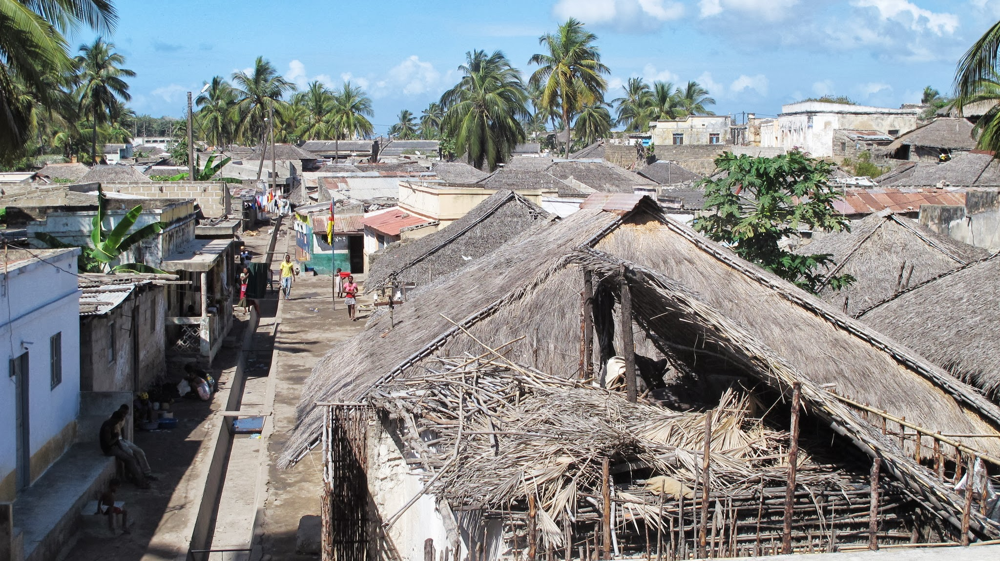

[French version here](/2011-09-22)

### Nkhata Bay

After several days in Mzuzu, we were then on our way to Malawi. We left for Nkhata Bay, a village of fisherman in the border of the lake Malawi. We waited there for Ilala, the ferry who crossed the lake and went to Mozambique.

Nkhata Bay

We now appreciated the fact of being only one of a dozen in the trailer of a big
truck (despite that in a quarter of hour, about twenty young Malawian football fans
had joined us!). But we savored not to be too shaken on this paved road. Nkhata Bay
pleased us very much. The village was peaceful, the habitants were very helpful,
friendly and liked talking. We passed two nights there: the first was in the port
quay where the other people were waiting for the ferry.

Traveller waiting for Ilala

The second was in a youth hostel where we setted up the tent. We took this opportunity
to admire the magnificent view of the lake, to rest, swim and use the internet! Nkhata
Bay was very touristy but at the beginning of september, the tourists were rare.
We strolled for 3 days in this village whose main street was invested by the market.
The street was very busy. The fish caught on the bay was sold along with tomatoes,
onions, Kasave (an edible root), grilled corn, bananas, rice, a variety of local
cakes ...

Main street of Nkhata Bay Nkhata

We regretted a little to leave Malawi so fast where we were so well (and our wallet as well) but the journey must continue and the ferry passed here only once a week. Thus it was the third night, we went on the quay where we waited Ilala (well…it’s more that we had waited…6 hours late still!)

### Ilala, the ferry of the Lake Malawi

Ilala, it’s the ferry of the Lake Malawi. It goes around the lake every week. For the locals, it’s the only way to connect two small islands inhabited of the lake. Some tourists also take it to their destinations, like us, to Mozambique or just going around the lake to see the big ports. On board, there are three classes. After our last adventures on the road, we used our money to buy us a second class.

The loading of the boat was impressive. A crowd of people who could fill the stadium of France would find it’s just nothing compared with this small ferry. Everyone carried with himself a large amount of things. When boarding, everyone thrust himself forward, no one waited for the people setting down. It was not the shoulders that were pressed, but the bags on the heads of Africans. The rush to the ferry was no “thank you”. The disorders were everywhere. A host of odd objects were embedded: a 50kg bag of flour, bunches of bananas, windows, chickens, wooden boards, fishing nets, barrels... The only time the hustle stopped was at the checkpoint at the entrance of the boat. Yes, there was no push there because a police officer pointed a gun at the crowd (big scare for Olivier). That seemed to be the only way to calm the crowd.

Ilala

After some time of pushing, we could at last breathe for a while when putting our
bags in our small private cabin…euh no… sorry… that was in our dreams. We still breathed
a little when we put our bags at a table and we sat in the benches. However, we were
still in the passage and the loading lasted for about 4 hours.

  The second class at the end of journey (so-called 'empty')

It followed the night in a large room packed with people and luggage. Everyone slept on everyone. We realized later that the boundary between the second and third class was not well defined. Our only advantage was to have the right to a seat at a table but we did not succeed in winning a place! In the morning, we visited a little the ferry and decided to move to a bridge where there was still space. We stayed there all day before finding out that actually it was a part of the first class. The landing on the two islands took a very long time because there was no dock. The small boats came to take passengers and freight. And we walked in the beach of Mozambique with a good half-day delay.

At the time of writing this article, we have just learned that a ferry sank off at the coast of Tanzania, causing more than 150 killed and 100 missing. We felt it was really more dramatic than us.

  Landing of passengers at one of the islands of the lake

We then used 2 days to get to Cuamba, the city where we took the train to the east for approaching the Indian Ocean.

### The moving market

A traveller that we met in Luderitz had made us dream about this famous train for a long time who goes everyday from Cuamba to Nampula (250km). So here we were! The start was at 5 a.m. in the morning. We just got up a little earlier than usual for checking out our small guest house in the train hostel. We were surprised by the punctuality of the train: only just 30 minutes late. Then here we were in a train of 12 hours, in a luxury 3rd class: a two-seat bench just for us two! "Bench" was still a bit exaggerated ... it was rather a wooden plank. Anyway, we didn’t ask for more comfort. The train was full, but almost everyone had a place.

In the train for Nampula

The journey was divided into about ten stops in the « stations » of province. In fact, those were not really the stations… just the places where train stopped! The first stop was replaced by a big surprise: far away we saw many passengers waiting for the train but the closer we got…more tomatoes, bananas, peas, onions, sweet cakes and other goods appeared. The train was actually stopping in the middle of a market that came to life very quickly! The passengers gave their money out and began their buying from their window. The huge bags of tomatoes overwhelmed the wagon… believing that they were preparing their stock for a whole month. The prices were ridiculous. A huge bag of onions cost about the price of 5 pieces on the market in town ...

Market scene at a train station

The scenario was repeated consistently at each stop. The wagon filled up with goods quickly. In fact, after a while we understood that this train was an opportunity for producers to pass their products in the city where it would be sold on the market. For passengers, this was the opportunity to pay off the cost of the ticket by the intermediary between producers and sellers in the market...

This experience in the train was still a great time : beautiful scenery, the feeling of being submerged by the life of Mozambique allowing us to understand better some aspects of their livesand good meetings

On arrival in Nampula (What? No late ???), all goods were sorted on the platform. We didn’t see a result but the market vendors were surely coming to do some shopping.

### Mozambique island

The next day we took a minibus to get to the ancient capital of Mozambique: Mozambique Island, classified by UNESCO. This way, one of the top 5 tightest paths, allowed us to link the Indian Ocean which marked the end of our journey from West to East Africa from the Atlantic Ocean which we had left in Luderitz. It was the end of a fantastic epic!

Houses of the island of Mozambique

A bridge of 3km connects the small island to the mainland. On foot, you can go around the island in less than an hour. The atmosphere was special, it was very interesting. We had a strong feeling of history. A huge hospital was located in the center of the island, the streets were paved, the buildings were often multi-storey, the places with commemorative statues were innumerable, there were also many office buildings ... but here, the activity of the island had completely stopped since the capital became Maputo. Today all these buildings were abandoned to a life much more modest. There was no more than one very small market of about ten stalls. The streets were quiet.

The hospital

We camped in a lodge where we were the only guests (early September, the holidays
were over).

Street of the Island Mozambique

This allowed us to rest in a hotel for next to nothing. So we spen
4 days to be in the quiet streets of the island. We discovered the mix of cultures that still remained today. We were indeed here at the crossroads between India, the Arab world and Africa. It was also a place of cohabitation of religions Hindu, Muslims and Christians.
Unfortunately, our recent lunches taken in the unhygienic places had defeated us and we passed two days in poor physical conditions. The passage in this island marked a good time of break in the journey.
But time went on: we had to leave for Tanzania. The journey to reach there was not an easy task ... but that would be for the next article! ;-) !

import Navigation from "../../Navigation";

<Navigation
  previous="/2011-09-11"
  next="/2011-10-07"
  gallery="/galerie/mozambique"
/>
