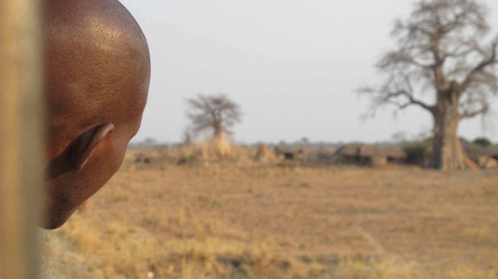
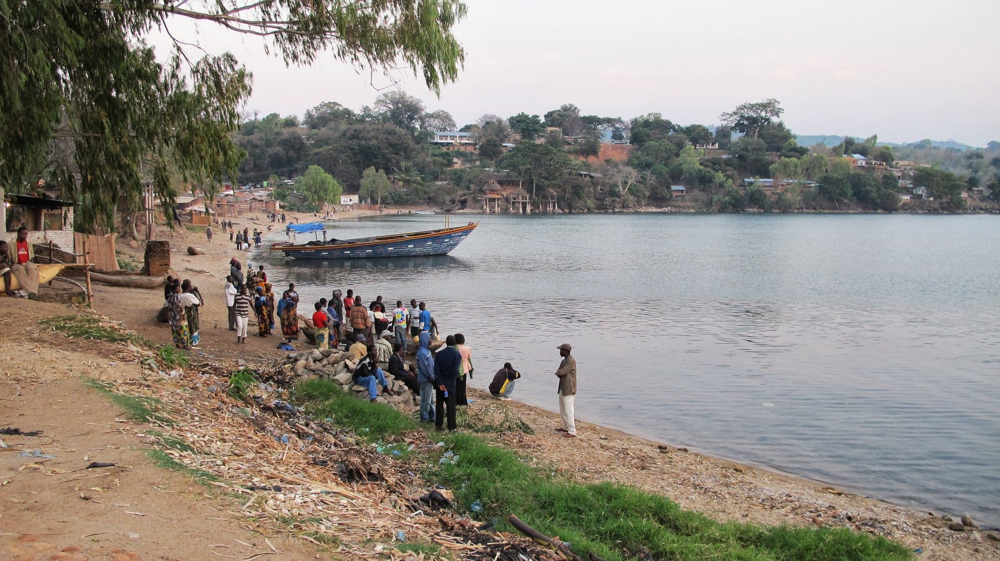
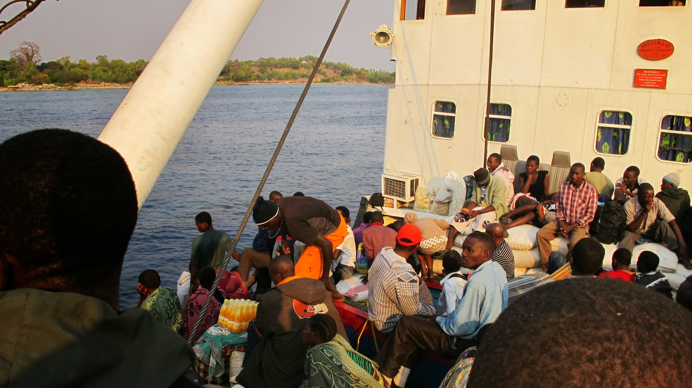
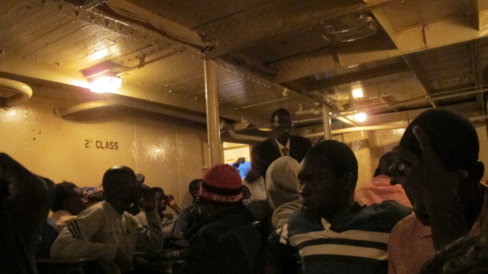
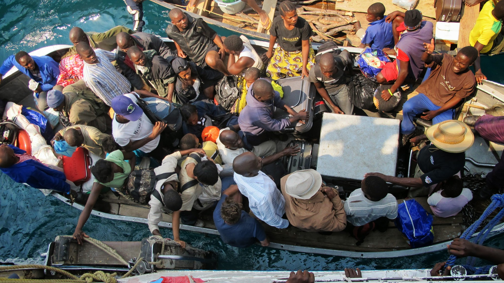
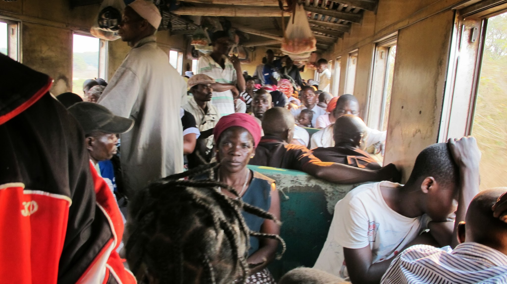

[English version here](/en/2011-09-22)

### Nkhata Bay

Après ces quelques jours à Mzuzu, nous revoilà sur les routes en direction du Malawi. Nous partons pour Nkhata Bay, un village de pêcheurs bordé par le lac Malawi. Nous y attendons Ilala, le ferry qui traverse le lac pour le Mozambique.

Nkhata Bay

Nous savons maintenant apprécier le fait de n’être qu’une dizaine dans la remorque d’un grand camion (malgré un bon quart d’heure où une vingtaine de jeunes supporters de foot malawiens nous ont rejoints !). Mais nous savourons de ne pas trop être secoués sur cette route goudronnée.
Nkhata Bay nous a beaucoup plu. Le village est paisible, les habitants sont très serviables, amicaux et aiment discuter. Nous y passons 2 nuits : la première sur le quai où d’autres personnes attendent le ferry ;

Voyageur attendant Ilala

la deuxième dans une auberge de jeunesse où nous plantons la tente. Nous en profitons pour admirer la vue magnifique sur le lac, nous reposer, nager et utiliser internet ! Nkhata Bay est assez touristique mais en ce début du mois de septembre, le touriste se fait rare.
Nous nous baladons pendant 3 jours ce village dont la rue principale est investie par le marché. La rue est très passante. Le poisson pêché sur la baie y est vendu ainsi que des tomates, des oignons, du kasava (une racine comestible), du maïs grillé, des bananes, du riz, des sortes de petits gâteaux locaux…

Rue principale de Nkhata Bay

Nous regrettons un peu de quitter si vite le Malawi où nous étions si bien (et notre portefeuille aussi) mais le voyage doit continuer et le ferry ne passe qu’une fois par semaine. C’est ainsi que le 3ème soir, nous nous rendons sur le quai où nous attend Ilala (enfin… c’est plutôt nous qui l’avons attendu… 6h de retard quand même !)

### Ilala, le ferry du lac Malawi

Ilala, c’est LE ferry du lac Malawi. Il fait le tour du lac chaque semaine. Pour les locaux, il est le seul moyen de relier deux petites îles peuplées du lac. Quelques touristes le prennent également pour se rendre, comme nous, au Mozambique ou bien pour faire un tour sur le lac et voir les grands ports. A bord, il y a trois classes. Après nos dernières aventures sur la route, nous jouons les fortunés et nous offrons une seconde classe !
Le chargement du bateau est impressionnant. Une foule qui remplirait le stade de France se retrouve dans un tout petit ferry de rien du tout ! Chacun emporte avec lui une grande quantité d’affaires. Lors de l’embarquement, tout le monde se pousse, personne n’attend que les gens débarquent. Ce ne sont pas les épaules qui sont serrées mais les sacs sur la tête des africains. La ruée dans le ferry est sans merci. Le désordre est total. Une multitude d’objets hétéroclites sont embarqués : sacs de 50kg de farine, régimes de bananes, fenêtres, poules, planches de bois, filets de pêche, tonneaux… Le seul moment où la bousculade cesse, c’est au niveau du barrage à l’entrée du bateau. Oui, là ça ne bouscule pas car un policier braque un pistolet sur la foule (grosse frayeur pour Olivier). Ça semble être le seul moyen pour calmer le flot.

Ilala

Après un certain temps de bousculades, nous soufflons un grand coup en posant nos sacs à dos dans notre petite cabine privée... euh non pardon… ça c’était dans nos rêves. Nous soufflons quand même un peu quand nous posons nos sacs sur une table et nous asseyons sur des bancs. Nous restons tout de même en plein passage et le chargement durera environ 4h.

  La seconde classe en fin de voyage (c’est-à-dire « vide »)

S’ensuit la nuit dans une grande pièce bondée de personnes et de bagages. Tout le monde dort sur tout le monde. Nous nous rendrons compte un peu plus tard que la limite entre la 2ème et 3ème classe n’est pas bien définie. Notre seul avantage est d’avoir le droit à une place à une table mais nous n’avons pas gagné en place !
Au petit matin, nous visitons un peu le ferry et décidons de nous déplacer sur un pont où il y a de la place. Nous y resterons toute la journée avant de découvrir que c’est en fait une partie de la première classe. Les débarquements sur les 2 îles sont très longs car il n’y a pas de quai. Des petites barques viennent prendre les passagers et le fret. Nous posons ainsi notre pied sur les plages du Mozambique avec une bonne demi-journée de retard.
Au moment où nous écrivons cet article, nous venons d'apprendre qu'un ferry a coulé au large de la Tanzanie faisant plus de 150 morts et 100 disparus. On en ressent d'autant plus l'aspect dramatique.

  Débarquement des passagers sur l’une des îles du lac{" "}

Nous mettons ensuite 2 jours pour nous rendre à Cuamba, ville où nous prenons le train vers l’Est pour nous rapprocher de l’océan Indien.

### Le marché ambulant

Un voyageur rencontré à Luderitz nous avait fait rêver depuis longtemps de ce fameux train allant tous les jours de Cuamba à Nampula (250km). Nous y voici donc ! Le départ est à 5h du matin. Nous nous levons à peine plus tôt que d’habitude pour relier notre petite « Guest house » premier prix : la gare. Nous nous laissons surprendre par la ponctualité du train : à peine 30min de retard. Nous voici en route pour 12h de train dans une 3ème classe luxueuse : une banquette de 2 places rien que pour nous 2 ! « Banquette » est tout de même un peu exagérée… il s’agit plutôt d’une planche en bois. Quoi qu’il en soit, nous ne demandons pas plus de confort. Le train est plein mais tout le monde ou presque a sa place.

Dans le train pour Nampula

Le trajet se découpe en une dizaine de stops dans des « gares » de province. En fait, ce ne sont pas vraiment des gares… justes des endroits où le train s’arrête ! Le premier arrêt fait place à une grande surprise : au loin nous voyons de nombreux passagers attendant que le train arrive mais plus on se rapproche… plus les tomates, bananes, petits pois, oignons, gâteaux sucrés et autres marchandises se dessinent. Le train vient en fait de s’arrêter au beau milieu d’un marché qui s’anime très vite ! Les passagers sortent l’argent et commencent leur achat à leurs fenêtres. Des énormes sacs de tomates envahissent le wagon… à croire qu’ils font leurs provisions pour le mois. Les prix sont dérisoires. Ici, les oignons coûtent trois fois moins chers que sur le marché en ville…

Scène de marché à une gare

Le scénario se répète immanquablement à chaque arrêt. Le wagon se remplit vite de marchandise. En fait, nous comprenons au bout d’un certain temps que ce train est l’occasion pour les producteurs de faire passer leur production en ville où elle sera vendue sur le marché. Pour les passagers, c’est l’occasion d’amortir le prix du billet en faisant l’intermédiaire entre producteurs et vendeurs sur le marché…
Cette expérience en train reste un grand moment : de beaux paysages, l’impression d’être submergés par la vie mozambicaine permettant de comprendre un peu mieux certains de ses aspects, de belles rencontres.
A l’arrivée à Nampula (Quoi ??? sans retard ???), toutes les marchandises sont triées sur le quai. Nous ne verrons pas la suite mais les vendeurs au marché sont sûrement venus y faire quelques courses.

### L’île Mozambique

Le lendemain, nous prenons un minibus pour nous rendre à l’ancienne capitale du Mozambique : l’île Mozambique, classée par l’UNESCO. Ce trajet, un du top 5 des trajets les plus serrés, nous permet de relier l’océan Indien, ce qui marque la fin de notre traversée d’Ouest en Est de l’Afrique depuis l’océan Atlantique que nous avions quitté à Luderitz. C’est la fin d’une épopée fantastique !

Maisons de l’île Mozambique

Un pont de 3km relie la petite île au continent. A pied, on peut faire le tour de l’île en une petite heure. L’ambiance y est particulière, c’est très intéressant. On sent que son histoire est très forte. Un immense hôpital se trouve au centre de l’île, les rues sont pavées, les bâtiments sont souvent à plusieurs étages, des places avec des statuts commémoratrices ne se comptent plus, il y a de nombreux bâtiments administratifs… mais voilà, l’activité de l’île s’est complètement arrêtée depuis que la capitale est devenue Maputo. Aujourd’hui, tous ces bâtiments sont abandonnés à une vie beaucoup plus modeste. Il n’y a plus qu’un tout petit marché d’une dizaine d’étals. Les rues sont paisibles.

L'hôpital

Nous campons dans une lodge où nous sommes les seuls clients (Début septembre, les
vacances sont finies).

Rue de l’île Mozambique

Cela nous permet de poser les pieds dans un hôtel pour trois fois rien. Nous passons ainsi 4 jours à nous reposer dans les rues paisibles de l’île. Nous y découvrons le mélange des cultures qui reste vif aujourd’hui. Nous nous trouvons en effet ici au carrefour entre l’Inde, le monde arabe et l’Afrique. C’est aussi un endroit de cohabitation des religions Hindoue, Musulmane et Chrétienne.
Malheureusement, nos déjeuners récents dans des lieux peu hygiéniques auront raison de nous et nous passerons 2 jours en mauvais état. Le passage sur cette île marque donc un bon moment de pause dans le voyage.
Mais le temps avance : il nous faut repartir pour la Tanzanie. Le voyage pour la rejoindre ne sera pas une mince affaire… mais ça, c’est pour le prochain article ;-) !

import Navigation from "../../Navigation";

<Navigation
  previous="/2011-09-11"
  next="/2011-10-07"
  gallery="/galerie/mozambique"
/>
