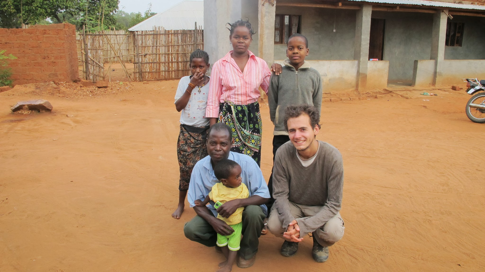
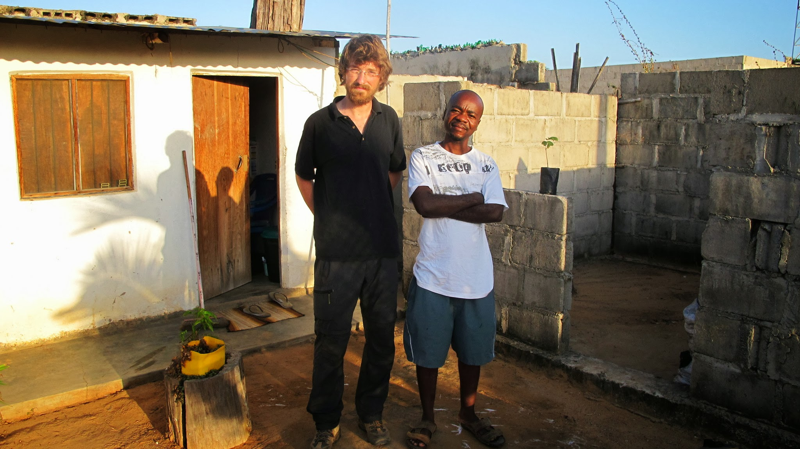
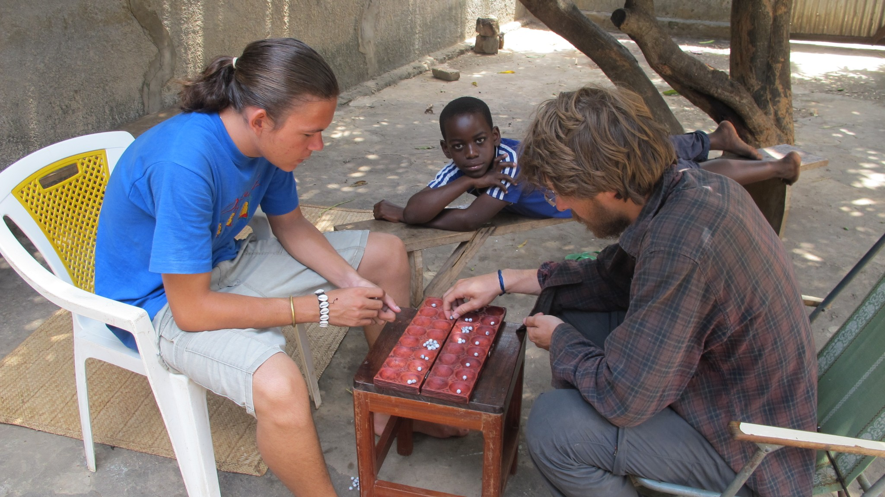
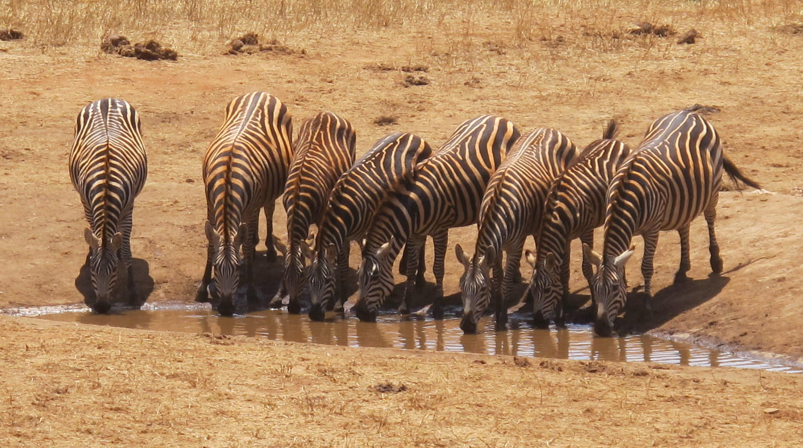
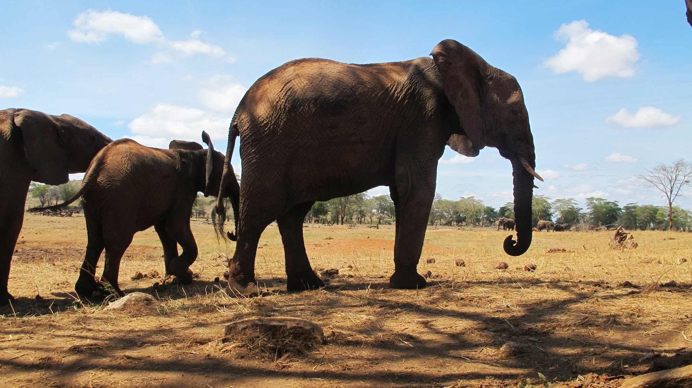
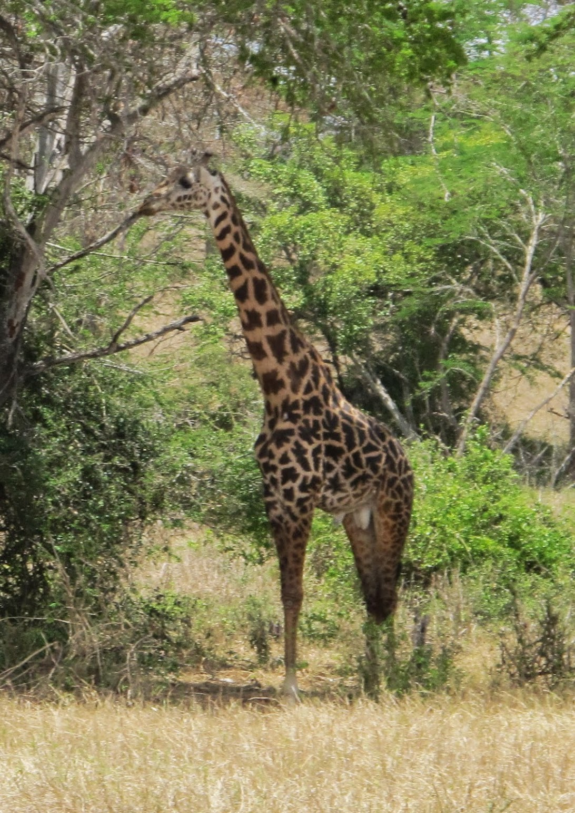
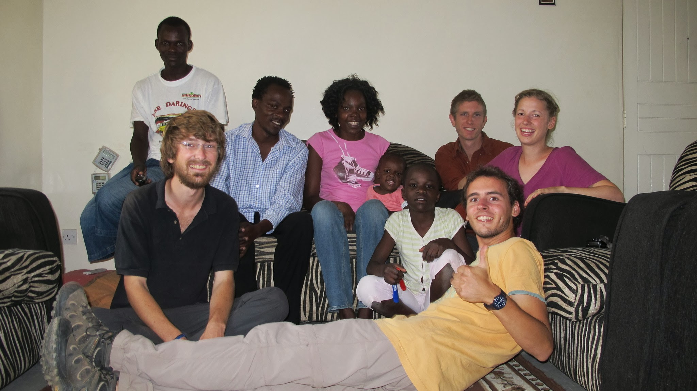

Thank you Tristan for the translation! [French version here](/2011-10-07)

### Target: Dar Es Salam

Your mission, should you accept it, is to reach Dar Es Salam within one week.
Travel 800km a week is not as easy as it seems… We just learned it with last week example.
We face (very) bad roads, rare free highjacking, and very few cars.
Our traveler’s week:

##### Wednesday 14, September:

We’re leaving the Island of Mozambique. It’s a difficult exit: the island is at the very end of the road, so we couldn’t see a lot of drivers. We spend the all morning reaching the road to Tanzania. And the afternoon, we walk slowly but surely on this very bad road. The good news of the day will be our meeting with a jolly teacher witch will bring us a roof and a delightful local dinner!

Notre adorable hôte et sa famille

##### Thursday 15, September:

On the road again! We had some difficulties to leave. It will take us 2 hours to find a free lift. But we were lucky after all, we met good drivers: 150km/h on dirt roads. We will overtake the cars that told us no few hours before (and say them hello again across the windows!). We then had a rest inside a truck, moving forward to reach Mocimboa, a town less than 80km away from the mozambico-tanzanian frontier. The truck driver will not accept our money at the end of the trip: incredible for a truck driver! We will then meet a young Mozambican who happened to be also a French speaker. We will sleep at the same Guest House than he and his girlfriend, after a restful talking evening.

  A la guest house, bons moment avec notre ami francophone

##### Friday 16, September:

Targeting the border! Once again, the leaving was difficult, but we fortunately we’ve been dropped in Palma, the last village before the border (only 40 km). We were stucked there: no car cross the border. The shared pick-ups cross the border earlier in the morning, we are late. We’re not sure about finding one this afternoon. The major problem was that they are very expensive and that we had no money left at the end of the Mozambican trip. That’s why Nicolas came back to Mocimba to find a cash machine, while Olivier cross the border with his last coins. We will meet at the border the day after.

##### Saturday 17, September:

Whereas we planed to cross the border last Wednesday, we just did it today, Saturday. It takes a long long time to get the Mozambican mark.We then start walking again until the border-river. No bridge… We take a small boat and make our first Tanzanian foot prints 10 min after. Welcome to the civilization! We meet Chris, a German living in Tanzania for two years. We have lunch together in Mtwara, a big city in the south, and we follow him to his house, in a small village on Dar Es Salam road.

##### Sunday 18, September:

Resting at Chris’s. We cook local and play the famous traditional ball game. We’ll think about Dar Es Salam tomorrow!

  Parties acharnées de ball-game entre Chris et Olivier

##### Monday 19, September:

On the road again. Highjacking was not successful this morning. That’s why we decide to reach the minibus station in order to get to the nearest city. But there it was still not successful. Once again, we take a minibus pour move forward. At the end of the day, we finally manage get into a bad looking truck, moving to Dar Es Salam. But we stopped quickly as the night came: no light on the truck. We will reach our city tomorrow!

##### Tuesday 20, September:

It is a very bad road today. We drive very slowly. The afternoon, the road was better, but not the speed. The night comes when we were at 20 km from Dar Es Salam. We will reach our city tomorrow!

##### Wednesday 21, September:

We decide to Highjack again, avoiding that ugly truck that dirties our clothes and poison us with it’s engine’s smoke. We quickly find a pick-up that throws us like a rocket near of the center of Dar Es Salam. But the minibuses would not take us because of our dirty stuff. We walked the last 6 km to reach a guest house in the center. Dar Es Salam: We did it! We did it!

### Dar Es Salam: do you deserve it?

After this tiring week, we finally have some rest in a comfortable room. Showers and washing machines were useful.
It is a long time since we have seen an active city, with traffic jams and some tie in the streets. We also discover supermarkets and tarred sidewalks. The city itself is not very pretty and is noisy. We could not fell all it’s history: a hundred years ago, thousands of slaves were sold here. We are a bit disappointed by this so-difficult-to-reach city.
On the other side, we like in Dar Es Salam the diversity. On a religious point of view, the majority of the population is Muslim, but we also meet Christians. What a surprise to find the early mangos at the market, in the middle of strawberries, some grape, but also bananas and cucumbers. What a surprise to find more than 10 choices on a restaurant’s menu. Dar Es Salam regroups all the food we can found in the country!
But our weak health and noisy ears will choose to prepare the next steps of the trip rather than exploring more the city.

### Mombassa

After this break, we are now on Mombassa’s road, in Kenya. We will take the bus because we like knowing when we reach our destination (Tanga), and highjacking is not necessarily cheaper. Despite of the bad road, we enjoyed the trip thanks to a real sit.
After our arrival, we settled in a small guest house for 2 nights. It will allow us to see the ocean and to interview an Imam.

Interview avec Mohamed, Imam de Tanga

Once again with a bus, we finally reached Mombassa. It looks like Dar Es Salam in many points. It’s an active city, with a big market place. We were enchanted by the sellers that made us visit their shops. We are now in a colorful spice shop. Watching is free, let’s watch! After some talk with the sellers, we ask the one who grabbed us if we could sleep by himself. We will sleep in a real bed tonight! Saïd is the kind of guy that listen to Bob the whole day, and smokes something else than the local tobacco. A good place to sleep!
The day after, we walk in the city. We thought sleeping again in the same place, but he asked us money, so we leave earlier. Next step: Nairobi.

### In the Lion King's country!

We have some time left. We are a bit disappointed to leave Africa without the classic African safari (which cost about 200e/day/person). We decide to spend some time in Voï, a city between two parks. We’ll see what we’ll fund there. Maybe some tourist guys will offer us some place in their car? Well, we take the risk, we a 80USD/person budget.
When we discover that the entrance is 60USD/head, we realize that we wont make it. We try to rent a car, since tourists’ cars are rare.
After some failed negotiations, we meet a guy that works in the park. He says Akuna matata (what a wonderful thing), which means in Swahili that there is no problem. He is ahead a voluntary program to help a park: planting trees, taking care of the flora, healing animals, … He has reductions on the entrance, and since he is alone right now, he offers his help. We accepted that safari-in-a-car-with-guide-and-driver day. We wont regret it, it will be a wonderful day.

Only Simba (Lion in Swahili) was not here.

### Nairobi

Whereas we were thinking about spending the whole day travelling to Nairobi, a 160km/h driving car stops and brought us there for about nothing. That’s why we get there for lunch, and meet our couch surfer couple that will provide us a roof until we leave. We share their flat with a lovely amewican couple.

  En Couch Surfing chez David et Helene avec les Américains

