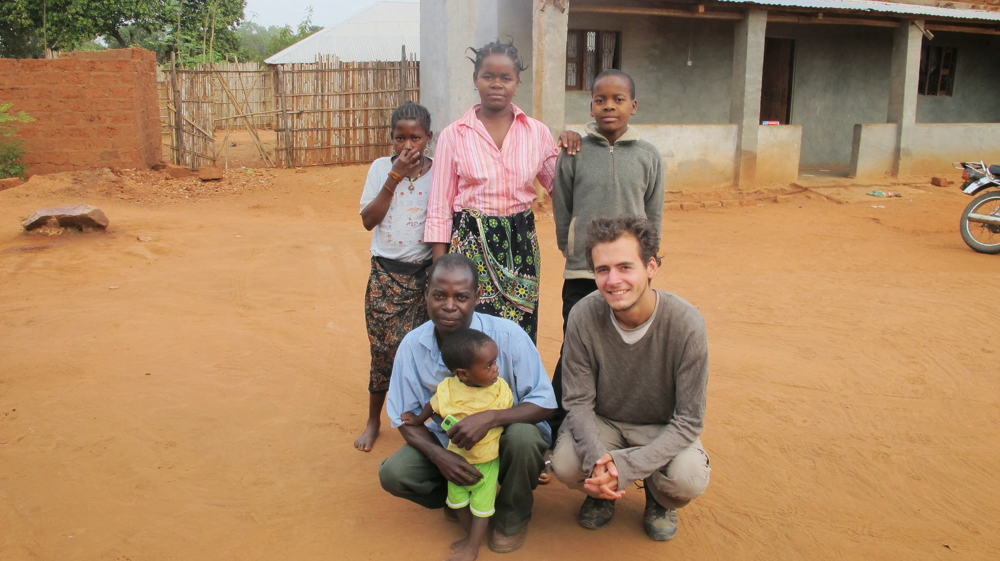
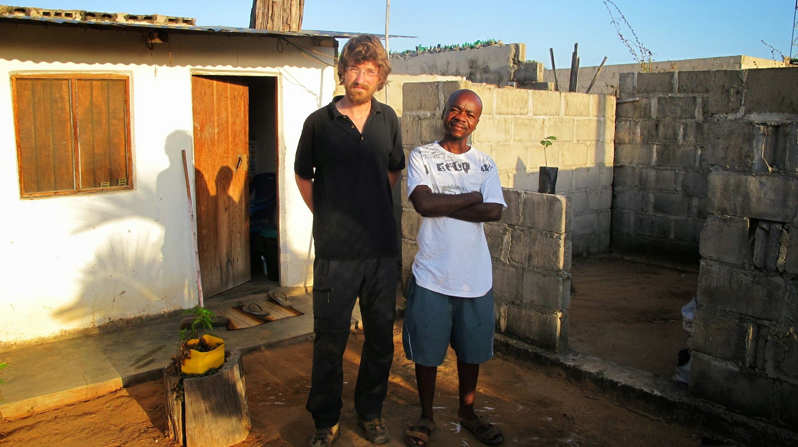
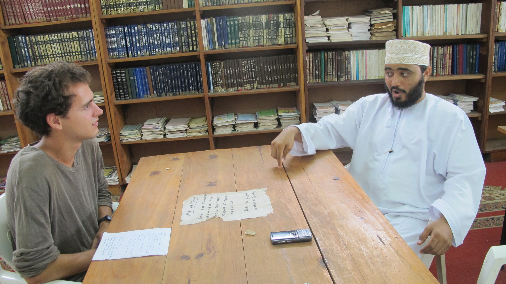
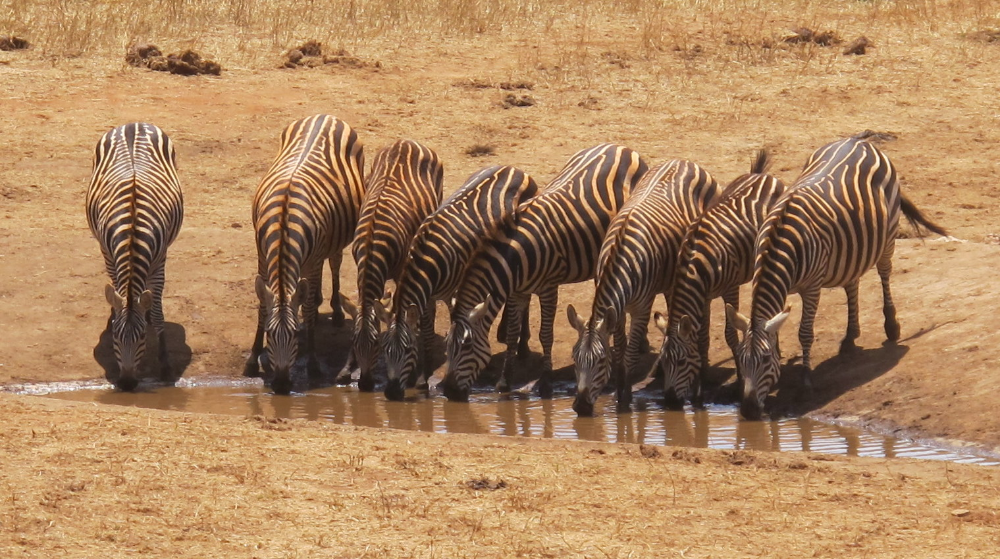
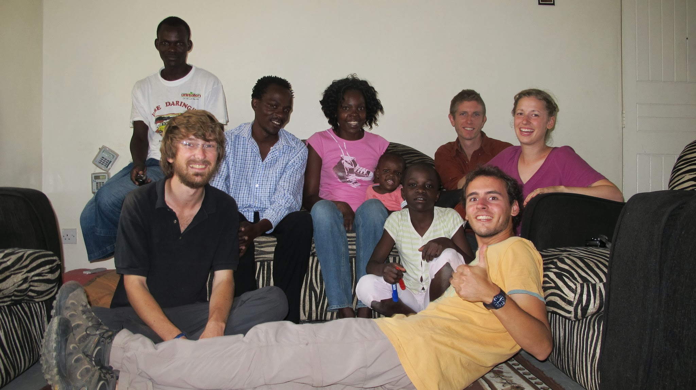

[English version here](/en/2011-10-07)

### Objectif Dar Es Salam

Votre mission, si vous l’acceptez, sera de vous rendre à Dar Es Salam en moins d’une semaine.
Non, non, détrompez-vous, faire 800km en une semaine ce n’est pas toujours facile… preuve en est avec la semaine épuisante que nous venons de passer.
Nous cumulons (très) mauvaises routes, difficulté à faire du stop sans que cela nous coûte une fortune et rareté des véhicules…
Retour sur une semaine de routards :

##### Mercredi 14 septembre :

Nous quittons l’île Mozambique. Sortie difficile : l’île est à l’extrémité de la route. Par conséquent, peu de voitures circulent. Nous passons une matinée à rejoindre la route en direction de la Tanzanie. L’après-midi, nous avançons doucement mais surement sur une route en mauvais état. Notre rayon de soleil de la journée sera le joyeux professeur qui nous hébergera pour la nuit et nous offrira un excellent diner local !

Notre adorable hôte et sa famille

##### Jeudi 15 septembre :

C’est reparti ! Départ difficile : nous mettrons presque 2h à décoller avec un « free lift ». Malgré tout nous choisissons les bonnes voitures : à 150km/h sur les routes non goudronnées, nous rattraperons toutes les voitures qui nous avaient refusés plus tôt. (Nous leur faisons des petits signes par la vitre) Nous faisons la sieste l’après-midi dans un camion ! Direction Mocimboa à 80km de la frontière mozambico-tanzanienne. Le chauffeur refuse l’argent que nous lui tendons à la fin du voyage : une première pour un chauffeur de camion ! A Mocimboa nous rencontrons un jeune mozambicain qui parle français. Nous passerons la nuit dans la même Guest House que lui et sa copine, bonne soirée à papoter.

  A la guest house, bons moment avec notre ami francophone

##### Vendredi 16 septembre :

Direction la frontière ! Le départ est encore difficile. On nous dépose tout de même à Palma, le dernier village avant la frontière (40km). Là-bas, nous sommes bloqués : aucune voiture ne se rend à la frontière. Les « pick-up communs » passent tôt le matin et nous arrivons donc trop tard. Nous ne sommes pas sûr d’en trouver un cette après-midi. Et le gros problème, c’est qu’ils sont très très chers et à la sortie du Mozambique, nous n’avons presque plus de monnaie. Nicolas retourne donc à Mocimboa pour retirer de l'argent. Pendant ce temps, Olivier se rend à la frontière avec les derniers sous. Nous nous retrouvons le lendemain matin à la frontière.

##### Samedi 17 septembre :

Alors que nous pensions passer la frontière mercredi dernier, nous ne le faisons qu’aujourd’hui samedi. Obtenir le tampon mozambicain prend beaucoup de temps. Nous reprenons ensuite la route jusqu’à la rivière-frontière. Il n’y a pas de pont. Nous prenons une barque et posons 10min après les pieds en Tanzanie ! Retour à la civilisation ! Nous rencontrons Chris, un allemand qui vit en Tanzanie depuis deux ans. Nous déjeunons ensemble à Mtwara, grande ville du sud de la Tanzanie avant de nous rendre chez lui, dans un petit village sur la route de Dar Es Salam.

##### Dimanche 18 septembre :

Repos chez Chris. Nous cuisinons local et jouons au ball game, le jeu local ! Dar Es Salam sera pour demain !

  Parties acharnées de ball-game entre Chris et Olivier

##### Lundi 19 septembre :

Nous revoilà sur les routes. Nous n’arrivons pas à faire du stop. Nous décidons donc de prendre le minibus pour nous rendre dans une ville proche du village de Chris. Mais là-bas, rebelote ! Nous prenons un minibus pour avancer de nouveau. En fin de journée, nous trouvons tout de même un camion en piteux état qui va jusqu’à Dar Es Salam. Mais nous nous arrêtons vite : le camion n’a pas de phares et la nuit tombe. Dar Es Salam sera pour demain !

##### Mardi 20 septembre :

La route est très mauvaise le matin. Nous avançons très lentement avec le camion. L’après-midi, c’est mieux… mais nous n’allons pas plus vite ! La nuit tombe alors que nous sommes à 20km de Dar Es Salam… Dar Es Salam sera pour demain !

##### Mercredi 21 septembre :

Au matin, nous décidons de faire du stop et non de repartir avec ce piteux camion qui salit toutes nos affaires et dans lequel nous pouvons à peine respirer tant nous sommes intoxiqués par la fumée du moteur. Nous trouvons rapidement un pick-up qui nous emmène telle une fusée pas très loin du centre de Dar Es Salam. Les minibus plein à craquer qui se rendent au centre-ville ne veulent pas nous prendre nous et nos sacs tout sales ! Nous finissons les 6 derniers kilomètres à pied jusqu’à une Guest House en plein centre de la ville. Dar Es Salam, ça y est, on y est !

### Dar Es Salam, la ville qui se mérite ?

Après cette semaine épuisante, nous profitons de notre chambre assez confortable (moustiquaire + ventilateur) pour nous reposer. Lessives et douches sont aussi plus que nécessaires.
Voici un bout de temps que nous n’avions pas vu de ville très active, avec des embouteillages et parfois même des personnes en cravate marchant dans la rue. Nous redécouvrons également les supermarchés et les trottoirs goudronnés. La ville n’est franchement pas très jolie. Elle est très bruyante à cause des générateurs personnels que l’on trouve partout sur les trottoirs. Nous ne percevons pas son passé : il y a encore une centaine d’année il s’agissait d’un carrefour où se vendaient des milliers d’esclaves. Nous sommes donc déçus par celle ville qui se faisait tant attendre.
En revanche, nous apprécions dans Dar Es Salam la diversité que l’on peut y trouver. D’un point de vue religieux, la majorité de la population est musulmane et nous rencontrons aussi des chrétiens. Au marché, quelle surprise de trouver les premières mangues de la saison, des fraises, du raisin mais aussi des concombres qui viennent s’additionner aux traditionnelles bananes ! Au restaurant, voilà qu’on nous distribue un menu avec plus d’une dizaine de choix ! Au niveau culinaire, Dar Es Salam est un concentré de tout ce qu’on peut trouver dans le pays.
Malgré cela, notre santé encore mauvaise et nos oreilles fatigués nous feront préférer préparer la suite du voyage plutôt que de découvrir plus en profondeur la ville.

### Mombassa

Après une bonne pause à Dar Es Salam, nous reprenons la route en direction de Mombassa au Kenya. Nous nous payons le luxe de prendre le bus. D’une part car nous apprécions le fait de savoir quand nous arriverons à Tanga, ville de la côte nord de Tanzanie, d’autre part car ce n’est pas forcément moins cher que de faire du stop. Malgré le mauvais état de la route, avoir une place où poser les fesses rend le trajet assez agréable.
A notre arrivée à Tanga, nous nous installons dans une petite Guest House pour 2 nuits. Cela nous laissera le temps de voir l’océan et de réaliser une interview d’un Imam.

Interview avec Mohamed, Imam de Tanga

Une fois encore en bus, nous finissons par atteindre Mombassa au Kénya. Mombassa ressemble par beaucoup d’aspect à Dar Es Salam. Ville très active, grouillant de personnes avec un grand marché. Nous nous laissons prendre au jeu des vendeurs qui vous poussent dans leur boutique. Nous nous retrouvons rapidement dans une boutique d’épices multicolores. « Regarder ne coûte rien » donc regardons ! Après avoir sympathisé avec les vendeurs, nous demandons à celui qui rabat les clients dans le magasin si nous pouvons dormir chez lui. Il nous emmène chez lui ou nous profiterons d’une chambre avec un grand lit et d’un canapé. Saïd est le genre de personne qui écoute du Bob Marley à longueur de journée et qui fume d’autres choses que le tabac local ! C’est un bon endroit pour passer la nuit.
Le lendemain, nous retournons en ville où nous nous baladons. Nous pensions passer une seconde nuit chez Saïd mais une fois rentré chez lui, il nous demande de l’argent pour passer la nuit. Nous partons donc plus tôt que prévu sur la route de Nairobi.

### Au pays du Roi Lion !

Il nous reste un peu de temps ; nous sommes un peu frustrés de partir sans vivre le grand safari africain qui coûte en moyenne 200€/jour/personne… nous décidons donc de passer un peu de temps à Voï, ville coincée entre deux parcs avant de nous rendre à Nairobi. Nous verrons bien ce que nous trouverons là-bas. Peut-être des touristes nous offriront-ils une place dans leur voiture ? Bref, nous tentons notre chance en nous donnant un budget maximum de 80 USD/pers.
Lorsque nous découvrons que l’entrée du parc est de 60USD/pers, nous comprenons que nos chances de réussir sont minces. Nous cherchons tout de même à louer une voiture (les voitures de touristes sont rares).
Après plusieurs négociations infructueuses, nous rencontrons une personne qui travaille dans les parcs. Il nous dit : Akuna matata (Quelle phrase magnifique), ce qui veut dire en Swahili qu'il n'y a pas de problème. Il monte un programme de volontariat pour aider à plusieurs tâches d’un parc : plantation d’arbres, entretien de la flore, soin des animaux… Il peut obtenir des entrées « tarif réduit ». Il n’a pas de volontaire pour le moment, il nous propose son aide. Nous nous laissons emballés par une journée safari avec voiture, guide et chauffeur. Nous ne le regretterons pas, notre journée safari sera un régal.

Seuls Simba (Lion en Swahili) et les mythiques léopards manqueront à l’appel.

### Nairobi

Alors que nous pensions passer la journée à voyager pour nous rendre à Nairobi, une voiture dépassant les 160km/h s’arrête et accepte de nous emmener pour trois fois rien. Nous arrivons ainsi pour déjeuner à Nairobi où nous retrouvons Hellene et David, le couple de couch surfeur qui nous hébergera jusqu’à notre départ.
Nous partageons leur appartement avec un adorable couple d’améwicains.

  En Couch Surfing chez David et Helene avec les Américains

Nous profitons de ces derniers jours en Afrique pour réfléchir sur notre voyage, écrire nos articles en retard ;-) et réfléchir à la suite de notre voyage.

import Navigation from "../../Navigation";

<Navigation
  previous="/2011-09-22"
  next="/2011-10-12"
  gallery="/galerie/tanzanie"
/>
