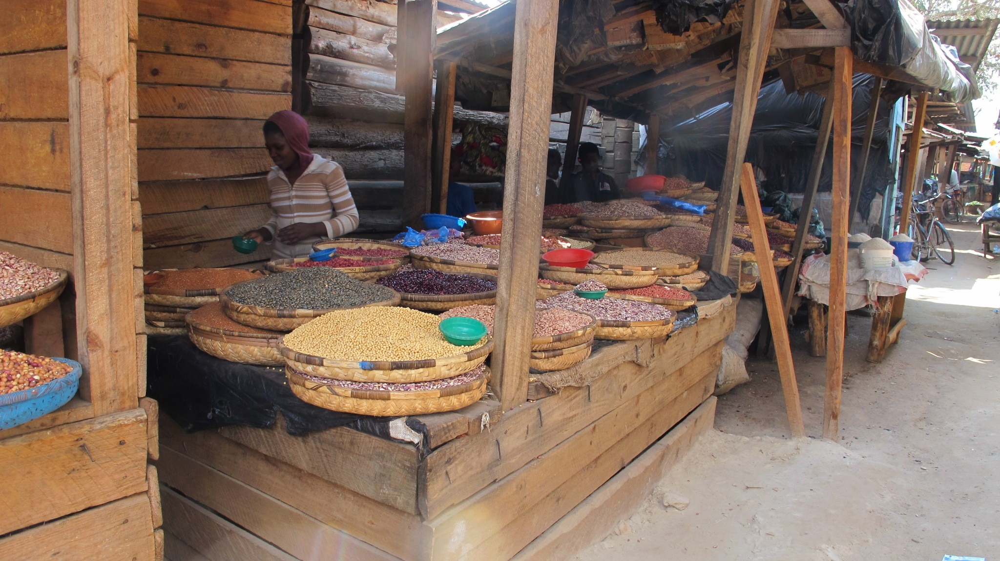
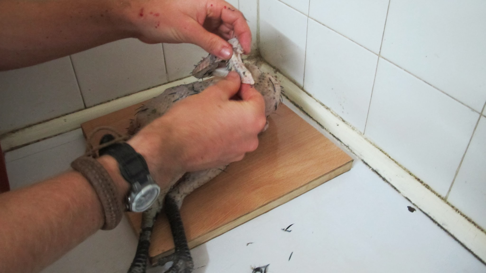

Ces trois mois de voyage en Afrique ont été d’un dépaysement absolu ! La découverte des cultures africaines fût un régal ! A ce propos, avec deux ou trois repas par jour représentant environ un tiers de notre budget, il est certain que la nourriture locale a joué un rôle important dans notre découverte de l’Afrique. Nous ne pouvons plus nous retenir de vous raconter nos habitudes alimentaires. Alors c’est parti, sortez vos papilles : retour sur trois mois de dégustation !

### De l’Afrique du Sud au Kenya, changement total de nos habitudes alimentaires

Depuis la Tanzanie, nous redécouvrons petit à petit les supermarchés que nous avions perdus de vue depuis la Namibie. Parcourir les rayons nous rappelle qu’il y a encore deux mois, nous nous nourrissions presque totalement de nos achats aux supermarchés : plats tout cuisinés, pâtes 2 minutes, conserves… Nous avons totalement changé cette façon de nous nourrir depuis la Zambie, pays à partir duquel nous ne cuisinions presque plus : les petits restos au coin de la rue ont alors été mis à l’honneur. Notre popote est ainsi restée inutilisée pendant plusieurs semaines à partir de la Zambie et notre estomac a parfois été mis à mal !

  En premier plan, type de petit resto du coin : un banc et des chaises

Ce changement de mode de vie est à la fois dû à la disparition des supermarchés et à l’apparition des étals où l’on sert les plats locaux pour trois fois rien. Nous avons ainsi pu apprécier davantage la nourriture locale sans pour autant augmenter notre budget nourriture !

### L’Afrique du Sud

En Afrique du Sud, nous allions au supermarché et nous cuisinions avec notre Butagaz.

Pic-nic au butagaz

Les courses au supermarché ont aussi été l’occasion pour Nicolas de découvrir le beurre de cacahuète… surement la mixture la plus addictive de la planète. Heureusement pour notre budget, Nico est maintenant en cure depuis plus d’un mois ! C’est également à Cape Town que Keith et John nous ont fait découvrir le biltong, une spécialité d’Afrique du Sud et de Namibie : il s’agit d’une viande séchée parfumée qui se conserve indéfiniment et que nous avons donc trimballé dans nos sacs en prévision de jours de galère.
Vous souvenez-vous de notre voyage le long de [la Wild Coast](../2011-07-17) ? Nous avons tout de même eu l’occasion d’y goûter un plat local chez notre adorable hôte, Virginea. Dans une immense marmite de sorcière, elle nous avait à chacun servit une grosse louche de haricots rouges accompagnés de sauce. Rien de génial mais nous y trouvions le mérite de manger local !
Enfin, proche de la région du Cap, se trouvent de grands domaines viticoles qui produisent beaucoup de vin. Pas mal mais la France reste en tête !

Une journée à tester les vins de la région du Cap

### Namibie

Huuummm les chenilles !

Nos habitudes alimentaires de Namibie ne sont pas très différentes de celles d’Afrique du Sud. Nous avons tout de même beaucoup profité des nombreux feuilletés au poulet, au bœuf ou au fromage qui sont apparus à chaque coin de rue.
Dès nos premiers jours de voyages, les fruits ont pris une part importante dans notre nutrition. En Afrique du Sud et en Namibie, nous trouvions essentiellement des oranges, des bananes et des tomates. Malgré le fait que la Namibie exporte beaucoup de raisin (souvenez-vous <a href= "Noordoewer_Luderitz.php"> le village de paille</a> avec tous les travailleurs saisonniers dans les vignes), nous n’en avons pas vu la couleur.
Antoni, qui nous a accueillis en Couch Surfing dans le sud de la Namibie, nous avait préparé un repas local : il s’agit d’une sorte de Parmentier au <a href="http://www.thesafaripeople.co.uk/wp-content/uploads/2010/06/www.safari4less.com-kudu-2.jpg" target = "_blanck">Kudu</a> ! Un délice !
La Namibie étant une ancienne colonie allemande, nous avons également goûté de nombreuses bières locales assez proches de celles qu’on peut apprécier en Europe. Mais dès la Zambie, la bière locale change totalement : il s’agit d’une bière blanche comme le lait avec des petits grumeaux ! On retrouve bien le goût de la bière mais il faut un peu de temps pour apprécier !

  Sur le ferry qui nous emmène au Mozambique, Olivier apprécie la bière locale !

### La Zambie

Notre séjour en Zambie marque un moment important de notre voyage : la découverte de Nchima, aussi connu sous le nom d’ugali en Tanzanie et au Kenya. Nchima, c’est un peu à l’Afrique ce que le riz est à l’Asie.
C’est chez Kecha, rencontrée en faisant du stop, que nous testons Nchima pour la première fois. Cette sorte de mie de pain légèrement collante et consistante se mange avec la main droite… et détrompez-vous, manger avec les mains, ce n’est plus aussi facile que ça le fut ! Sous les rires de Kecha et sa famille, nous débuterons donc à (re) apprendre à manger avec les mains. Notre habilité s’endurcira rapidement puisque depuis ce jour, nous mangerons presque quotidiennement Nchima. Le principe consiste à détacher un petit morceau de la mixture souvent très très chaude (au prix de brulures du bout des doigts) ; à la malaxer avec la main droite pour en faire une petite boulette puis à appuyer au centre avec le pouce pour en faire une sorte de cuillère qui permet d’attraper les légumes ou la viande qui l’accompagne.

Olivier cuisine Nchima

##### Recette du jour : un plat de Nchima pour une grande famille

**Prix :** très bon marché - **Difficulté :** 2/5 - **Temps :** 20 min - **Accepté par l’estomac :** 100%

1. Dans une grande marmite, faire chauffer de l’eau
2. Une fois l’eau chaude (pas bouillante), ajouter un peu de farine de maïs pour faire une sorte de porridge
3. Porter le mélange à ébullition
4. Ajouter alors encore de la farine et mélanger sans cesse jusqu’à l’obtention de la texture souhaitée (suffisamment solide pour avoir beaucoup de mal à mélanger...).
5. Prendre un ramequin d’eau froide et une cuillère à Nchima. Tremper la cuillère dans l’eau froide puis prendre une grande cuillère de la mixture. La lancer tel un « splaash » dans le plat à servir. L’eau froide permet à la mixture de ne pas coller à la cuillère.
6. Apprécier en famille et avec les doigts !

Notre séjour chez Soline et Magda, deux volontaires sage-femme et infirmière nous permettra de tester une variante de cette recette : en pancake avec des haricots ! Il faut dire que Nchima est difficile à apprécier tel quel pour un Européen. Cependant, c'est le plat préféré de tout les africains des pays que nous avons visités

Nchima presque prête

Nous découvrirons en Tanzanie et au Kenya une autre façon de cuisiner Nchima : au lieu d’utiliser la cuillère à Nchima, on laisse la mixture dans le plat puis on démoule lorsque la mixture est bien solide. On obtient ainsi un gâteau Nchima !!

En premier plan, Nchima à la façon kényane

Enfin, en Zambie, au coucher de soleil, on peut aussi profiter de petits apéros constitués de… pastis et jambon de Bayonne ;-) merci Soline !

  Oui oui ! Nous sommes bien dans un petit village perdu d’Afrique !

### Malawi

Au marché de Nkhata Bay au bord du lac Malawi

Notre arrivée au Malawi marque notre arrêt total de cuisiner. Il faut dire que quand nous arrivons à la frontière, nous découvrons qu’un bon plat au restaurant coûte moins d’un euro. Nous prendrons donc l’habitude de manger dans ces restaurants à l’hygiène souvent critique. Les plats étant déjà cuisinés, ils sont servis quasi instantanément. Le menu est souvent très réduit : nous avons le choix entre Nchima, Wali (riz) et parfois des pommes-frites. Ils accompagnent des œufs, du bœuf ou parfois du poulet ainsi qu’une sorte d’épinards. Ces restaurants sont les premiers suspects en ce qui concerne nos quelques jours en mauvais état du voyage.
En arrivant au Malawi, nous découvrons la délicieuse omelette aux pommes-frites… ou pommes-frites à l’omelette !

  Le poisson séché du lac Malawi. Nous l’avons évité au maximum !

### Mozambique

Comment parler du Mozambique sans que nous vienne immédiatement à l’esprit [le marché ambulant](../2011-09-22) : le train qui relie Cuamba à Nampula. Tout au long du voyage, les paysans des villages traversés vendent leurs marchandises, faisant du train, un très long marché !

Le marché ambulant

C’est ici l’occasion de vous montrer la diversité des produits que l’on trouvait quotidiennement sur les étals.

Etals de graines à Mzuzu

- **Les bananes !** Oui, ce n’est pas un cliché, en Afrique, les bananes sont reines ! Souvent toutes petites, parfois immenses (plus de 40cm au Kenya !), c’est le fruit parfait pour un snack ! Très sucrées et pleines de goût, ce fut un réel plaisir de manger des kilos de bananes pour trois fois rien durant tout notre voyage. Attention cependant à l’explosion inopinée dans le sac !

Un petit paquet de banane !

- **Les oranges :** très nombreuses en Afrique du Sud et en Namibie, elles se sont raréfiées par la suite puis sont réapparues en nombre en Tanzanie ! Elles sont bien pratiques mais nous avons eu du mal à en trouver de délicieuses.
- **Les avocats :** souvent énormes, un régal. On trouvait beaucoup de jus d’avocat.
- **Les tomates :** pas très pratiques à manger (il faut les rincer avant), plus chères que les bananes, mais très nombreuses.
- **Les fruits de la passion :** ils ne sont apparus qu’en Tanzanie, c’est délicieux et encore meilleur en jus ! Un grand verre de jus de fruits de la passion coûte environ 30 centimes !
- **Les pastèques :** nous les avons testées au Mozambique lors des grosses chaleurs.
- **Les papayes :** juste un régal !
- **Le raisin :** nous ne l’avons pas vu en Namibie malgré son exportation massive. Nous avons pu le goûter à Dar Es Salam. Bof bof, mais ça faisait du bien de changer un peu des bananes.
- **Les mangues :** la saison commençait quand nous partions… nous avons pu en goûter une le jour de notre départ.
- **Poivrons, citrons, piments, oignons :** nous n’en achetions pas mais les trouvions au quotidien dans nos plats.
- … on en oubli surement !

Oignons et tomates… une étal classique

Les fruits ont définitivement été délicieux en Afrique.

Marché de nuit sur l’île Mozambique

### Tanzanie

Lors de notre fatigante semaine de voyage entre l’île Mozambique et Dar Es Salam, nous avons rencontré Chris, un allemand installé en Tanzanie depuis plusieurs années. Nous avons eu l’occasion de cuisiner des supers plats avec lui… retour sur le riz au coco !

Séance cuisine avec Chris

##### Recette : le riz au coco !

**Prix :** bon marché - **Difficulté :** 3/5 - **Temps :** 45 min - **Accepté par l’estomac :** 100%

**Etape 1 :** obtenir le lait de coco

- Râper une noix de coco

Nicolas sur la chaise à râper les noix de coco !

- Ajouter de l’eau à la mixture obtenue et presser à la main en utilisant une passoire pour récupérer le lait. Répéter l’action à plusieurs reprises pour bien extraire tout le lait de coco.

**Etape 2 :** cuisiner le riz avec le lait de coco

- Faire bouillir le lait de coco (jusqu’à l’apparition de mousse)
- Ajouter le riz
- Après 5 ou 10 minutes (lorsqu’il n’y a plus de liquide), mettre le riz au four pour finir la cuisson

Petits pains éclairés à la bougie

Notre arrivée en Tanzanie marque aussi la découverte des chapatis. A première vue cela ressemble à une crêpe ou plutôt un pancake. En fête, il s’agit d’un pain cuit à la poêle en forme de crêpe. Nous avons beaucoup apprécié les déguster au petit déjeuner.

Préparation des chapatis

Nicolas cuisine le chapati !

### Kenya

Nous ne pouvions pas quitter l’Afrique sans cuisiner de A à Z un poulet ! Les poules et coqs sont partout en Afrique (et cocoricottent bien trop tôt le matin !). Mais ce qui est surtout amusant, c’est qu’il est très commun de rencontrer dans les transports blindés un africain qui se trimballe avec son poulet ! Il y a aussi des vendeurs au bord des routes qui vendent des poulets. Il n’est pas rare que les bus s’arrêtent pour permettre aux passagers d’acheter un ou deux poulet !
Malgré notre amitié pour elle, Cocote notre poule a été un régal !

Cocote avant

Cocote après

Pour ceux qui veulent la vidéo de Cocote cuisinée de A à Z, contactez-nous :)

import Navigation from "../../Navigation";

<Navigation previous="/2011-10-07" next="/2011-10-17" />
