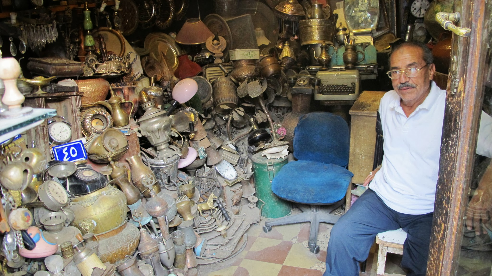

Le 5 Octobre, nous nous envolons de Nairobi (Kenya) vers le Caire en Egypte. L’Egypte est le dernier pays du continent Africain que nous visitons mais, il est bien différent de tout ce que nous avons vu jusque-là !

Par le hublot de l’avion, nous apercevons déjà le désert, les pyramides et l’immensité de la ville du Caire.

### El Cairo

Dès notre arrivée nous avons la chance d’être accueillis à l’aéroport par Hesham que nous avions contacté via le site de CouchSurfing. Après trois mois en Afrique, nous ne sommes plus habitués à aller « boire un coup » dans un café. Nous regagnerons un peu cette habitude durant nos quelques jours passés au Caire. Hesham nous emmène donc dans l’un de ses cafés favoris où nous pouvons savourer des mets égyptiens et fumer la traditionnelle chicha.

Olivier qui fume une chicha à la noix de coco

Hesham ne peut pas nous héberger, il nous conduit donc jusqu’au centre du Caire où nous rencontrons Hussein et Ali, deux jeunes égyptiens avec qui nous passerons nos prochains jours.

Nous pensions ne faire qu’une courte escale dans cette ville « dangereuse », mais finalement nous nous sentons en sécurité et nous voyons que la ville regorge de merveilles à découvrir. Grâce à l’hospitalité de nos hôtes, nous resterons 4 jours à découvrir le Caire.

Nous commençons par le plus important… les Pyramides !

 Olivier, Hussein et Nicolas 

Nous rejoignons la bande de potes d’Hussein pour admirer les fameuses pyramides du haut desquelles quarante siècles d’histoire nous contemplent. Nous en profitons pour entrer dans un tombeau, embrasser le Sphinx et faire une petite balade à dos de chameau !

Olivier dans un tombeau

  Hussein, sa bande d’amis et nous sur des chevaux et des chameaux

De plus, nous sommes le 6 octobre (date commémorative du début de la guerre du Kippour à l’issue de laquelle l’Egypte a récupéré le Sinaï qui était israélien depuis la guerre des six jours). C’est une fête nationale. Nous voyons filer dans le ciel une partie de l’aviation égyptienne.

Le soir, avec Hesham, nous allons sur une colline qui borde la ville pour admirer le paysage en mangeant des petits gâteaux égyptiens et en buvant le thé.

Pause thé avec Le Caire en paysage

Le lendemain, nous décidons d’aller visiter le Khan al-Khalili. C’est le marché traditionnel du vieux Caire.

La caverne d’Ali baba ! 

Un étal du Souk Khan al-Khalili 

Nous avons aussi la chance de pouvoir visiter la mosquée al Hakim, construite en 990 en plein cœur du vieux Caire.

La mosquée al Hakim

Pour terminer notre séjour au Caire, nous nous embarquons dans une felouque (bateau à voile) pour une petite croisière sur le Nil (eh oui, on n’arrête pas les clichés ! Mais on assume :) )

  A bord d’une felouque sur le Nil au coucher du soleil

Nous avons adoré Le Caire. C’est sûr, nous y retournerons un jour !

Durant nos 4 jours au Caire, nous passerons beaucoup de temps dans des « cafés » à boire du thé et à discuter avec nos nouveaux amis égyptiens.

Dans un café avec la bande d’amis d’Hussein

Nous posons beaucoup de questions sur les « révolutions arabes » et sur les tensions entre musulmans et chrétiens. Le pays est peuplé d’une majorité de musulmans sunnites et d’une minorité de chrétiens coptes qui représentent 10% de la population. On entend régulièrement parler dans l’actualité des églises Coptes incendiées en Egypte (5 églises depuis janvier).

Depuis la chute de Moubarak, le pays est dirigé par l’armée. Et les élections présidentielles ne sont prévues que pour l’année prochaine. On nous explique qu’ici, on n’aime pas trop la façon dont l’armée gère la situation car les militaires sont parfois injustes ou arbitraires.

Cela sera illustré le jour suivant notre départ du Caire avec la répression d’une manifestation Copte par l’armée dans le centre de la capitale égyptienne (plus d’infos ici). 24 égyptiens décèderont sous les tirs à balles réelles ou écrasés par les véhicules de l’armée.

En discutant avec nos nouveaux amis égyptiens, nous ne sentons pas de tensions interreligieuses. Ils sont musulmans, pratiquants et ils ont des amis Coptes. Ils sont très ouverts et nous expliquent que les tensions proviennent d’une infime minorité d’extrémistes.

Hussein et ses amis n’ont pas été les premiers à aller manifester sur la place Tahrir, mais ils ont soutenu la révolution. Ils subissent les conséquences de cette révolution ; depuis janvier, il est plus difficile de trouver un travail, même avec un diplôme d’ingénieur. Maintenant, ils espèrent que la transition va s’opérer, mais ils sont conscients que cela va prendre du temps.

### Le Sinaï

Après une nuit dans le bus, nous arrivons à Sharm El Sheikh, dans le sud du Sinaï. Nous admirons au passage les fabuleux paysages du Sinaï.

Une ville dans le Sinaï

Nous avons choisi cette destination car nous pouvons être hébergés par un Couch Surfer. Malheureusement pour notre porte-monnaie, c’est une ville très touristique. Cependant, nous profitons tout de même du vieux marché de la ville. Regarder est gratuit ! Nous avons aussi la chance de pouvoir profiter de la plage publique à deux pas de l’appartement de notre hôte. Un égyptien sur la plage nous prête son masque et son tuba et nous plongeons à la découverte des coraux et des poissons multicolores !

Nous repartons en bus jusque Taba, la ville frontière avec Israël. Nous pensons prendre le ferry pour aller à Aqaba en Jordanie (à 12km de Taba) mais nous nous apercevons que nous avons passé la ville à partir de laquelle il fallait prendre le ferry. Nous changeons finalement nos plans et nous nous rendons directement en Israël à Eilat. Nous n’irons pas en Jordanie.

C’est Souccot, la « fête des tentes ». Durant cette fête, les juifs commémorent l'assistance divine dont leur peuple a bénéficié lors de l'Exode qui suit la fuite d’Egypte. Nous rejoignons les Israéliens qui campent déjà sur la plage.

import Navigation from "../../Navigation";

<Navigation
  previous="/2011-10-12"
  next="/2011-11-07"
  gallery="/galerie/egypte"
/>
