Après une semaine bien trop courte en Egypte, nous arrivons en Israël. Malgré la récente affaire israélo-égyptienne (des soldats égyptiens avaient été tués « par erreur » par l’armée israélienne), la frontière est ouverte aux voyageurs. Son passage n’en reste pas moins une étape ! Nous passons plus de 20 minutes à répondre aux nombreuses questions des douaniers israéliens, nous montrons à peu près tous nos documents administratifs : billets d’avions, carte d’étudiant, carte bancaire, cash, etc., et racontons toute notre vie (étudiants à Télécom, on voyage pour un an, on a gagné des sous en donnant des cours particuliers, blablabla…). Au bout du long interrogatoire, leur façade s’estompe soudainement, un grand sourire apparaît et on nous souhaite un très bon voyage en Israël.

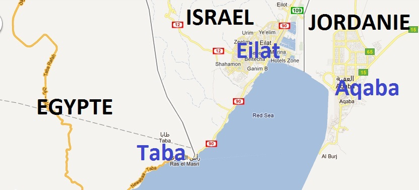

Ca n’aura pas échappé à nos attentifs lecteurs : que faisons-nous donc en Israël et non en Jordanie ?! Quelques minutes plus tôt, nous pensions rejoindre la ville d’Aqaba en Jordanie en prenant un ferry à Taba (ville frontalière d’Egypte) mais voilà que nous apprenons qu’il n’y en a pas et que nous avons dépassé la ville d’où partait le ferry. Nous pourrions traverser rapidement Israël pour rejoindre Aqaba par la terre mais la taxe de sortie d’Israël nous retient ! De plus, nous comprenons que parcourir l’Egypte, la Jordanie et Israël en un mois est mission impossible… nous décidons donc de profiter d’Israël au détriment de la magnifique Jordanie (qui vaudra bien un petit voyage à elle toute seule d’ici quelques années !).

Bref, nous voilà à Eilat et on peut dire que les premiers mètres en Israël nous ont rappelé ce qu’était l’occident ! Les magasins, les restaurants, les feux tricolores, les visages typés à l’occidental, l’abondance des ressources, les… prix !! Ici, finit le petit thé à quelques centimes, il va falloir faire drôlement attention à nos shekels !

Notre arrivée improvisée en Israël nous oblige à faire une longue pose internet pour chercher de nouveaux couch surfings. La nuit s’installe. Nous décidons d’aller dormir sur la plage où il y a énormément de monde. Nous trouvons difficilement quelques mètres carrés pour installer la tente. En fait, nous arrivons au début de la fête juive nommée Soukkot que l’on peut traduire par la « fête des tentes ». Le principe est de dresser une sorte de cabane pour une semaine. Les juifs font ainsi mémoire de l’Exode et de la précarité du peuple israélite qui devait alors s’en remettre à Dieu. Voilà pourquoi tant de familles installent leurs tentes sur la plage.

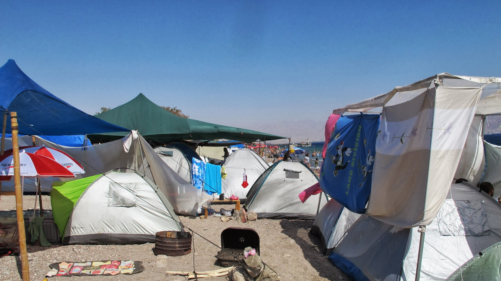

Sur la plage d’Eilat

Nous campons donc au milieu des nombreuses familles israéliennes et nous faisons connaissance avec nos voisins. Ce sera une bonne occasion pour découvrir la culture israélienne, apprendre les rudiments de l’hébreu et piquer une tête dans la mer rouge pour admirer les coraux et les poissons grâce à leurs masques et tubas.

Deux nuits plus tard, nous reprenons la route en stop et en direction d’Arad où nous attend un couch surfeur. Le stop est commun en Israël mais pas facile ! Nous arrivons le soir au niveau de la mer Morte où nous cherchons à nouveau un endroit où camper. En période de Soukkot, nous pouvons planter la tente n’importe où ! La plage est un endroit idéal. Alors que nous sommes affamés, nous avons la chance de tomber sur une bande de jeunes israéliens qui préparent à dîner ! Parfait ! Nous nous laissons inviter et passons une excellente soirée à discuter et écouter le guitariste du groupe. Les jeunes sont âgés de 23 ou 24 ans et ils commencent à peine leur études. En fait, ils viennent tous de passer plusieurs années dans l’armée. C’est obligatoire et c’est donc ce que font la plupart des jeunes après le lycée. Une liste de choix est remplie par les jeunes et leur poste est attribué à la suite d’une sélection-entretien. Il en va du soldat à l’informaticien en passant par à peu près tous les corps de métiers possibles. Beaucoup n’apprécient pas ces années difficiles et arrêtent après le temps obligatoire. D’autres prolongent ensuite leur carrière dans l’armée.

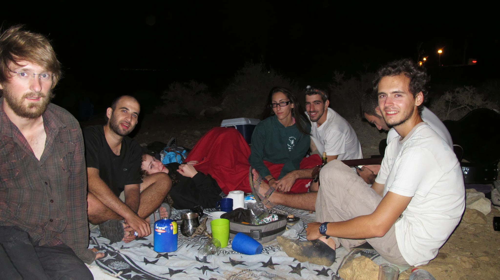

Soirée posée sur une plage de la mer morte

Nous partons le lendemain pour Arad. En attendant notre couch surfing, nous nous posons à la terrasse d’un restaurateur de plats à emporter. Nous avons déjà acheté notre nourriture au supermarché et nous lui demandons s’il peut faire réchauffer notre repas dans un four à micro-onde. En échange, nous consommons une boisson. Peu après, il doit fermer et demain, c’est Shabbat donc toute la nourriture sera perdue. Au lieu de gâcher, il nous offre alors deux énormes Tupperware de nourriture. C’est un geste qui nous a beaucoup touchés.
Peu après, nous nous installons en Couch Surfing pour quelques jours. Nous sautons sur la machine à laver pour faire notre première lessive en machine depuis le début du voyage ! Finalement le bonheur ne tient pas à grand-chose ! Gal, la jeune israélienne qui nous héberge chez son père, nous embarque avec elle pour voir le désert du Néguev et la mer Morte. Nous passons la journée à visiter les sources de Ein Gedi qui se jettent dans la mer Morte. C’est fabuleux de voir comment, au milieu du désert, l’eau jaillit !

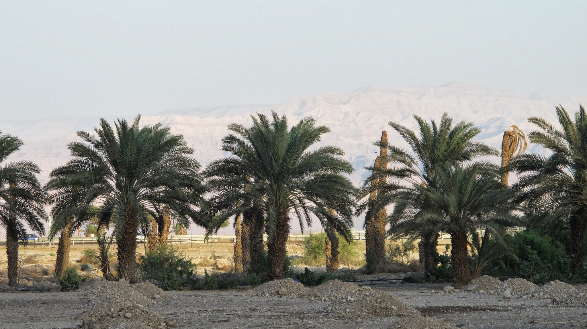

Source d’eau à Ein Gedi

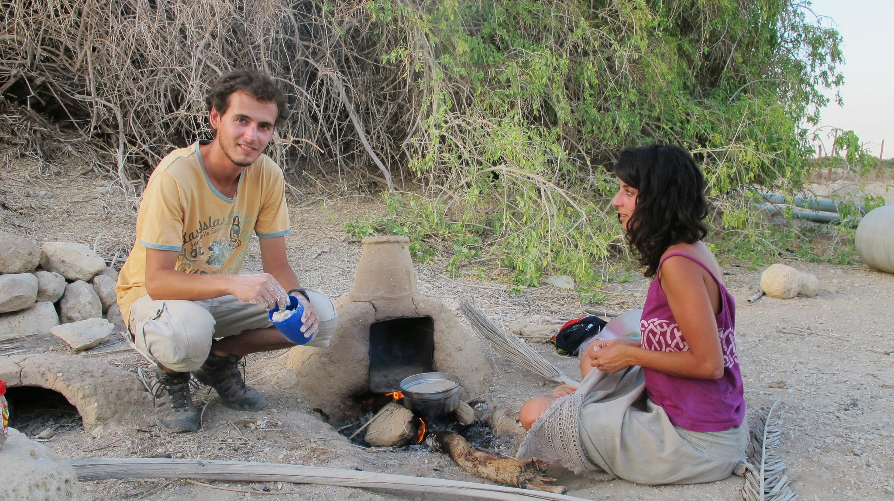

  Préparation du dîner à Ein Gedi avec Gal notre hôte

Nous allons ensuite du côté de Tel Aviv et de Jérusalem pour visiter ces deux grandes villes du pays et attendre la famille d’Olivier qui arrive bientôt pour une dizaine de jours. Tel Aviv est une grande ville à l’occidentale : beaucoup de gratte-ciels et de magasins. La vieille ville et la plage sont charmantes.

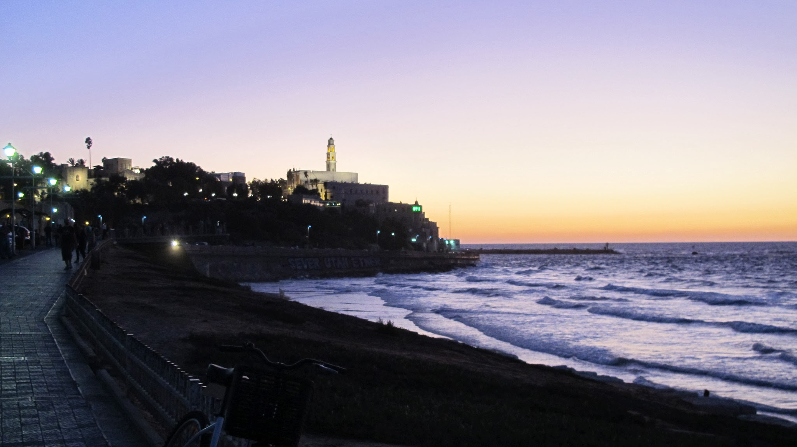

Tel Aviv

Nous voulons aussi en profiter pour faire faire notre visa russe. Malgré notre insistance, c’est non : il faut être israélien pour en demander un en Israël. Nous serons obligés de passer par la Lettonie pour demander le fameux visa russe.

Quant à Jérusalem, dans la vieille ville, l’atmosphère historique et religieuse est omniprésente. La vieille ville est partagée entre les quartiers chrétien, arménien, juif et musulman. Nous n’y passons qu’une journée car nous y retournerons dans les prochains jours avec la famille d’Olivier.

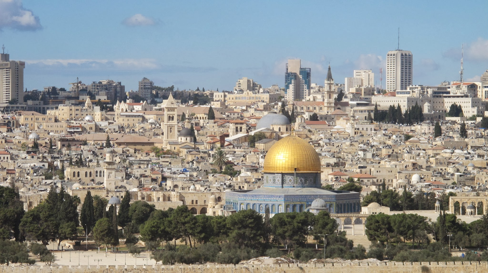

Jérusalem

Ces quelques jours entre Tel Aviv et Jérusalem sont aussi l’occasion de découvrir la célébration du shabbat dans une synagogue. Nous nous y rendons avec Domi et Blandine, la maman et la tante d’Olivier qui nous ont rejoints quelques jours avant les autres. Nous sommes tous très bien accueillis à la synagogue et sommes invités à la fin de la célébration à un pot ! Cette semaine est importante car il s’agit de Sim'hat Torah, c’est-à-dire que c’est la fin du cycle annuel de lecture de la Torah. C’est une fête très joyeuse. Le pot est aussi l’occasion de fêter la libération de Gilad Shalit, le soldat Israélien qui était détenu par le Hamas depuis plus de 4 ans.

La famille d’Olivier a organisé un pèlerinage en profitant de nous rejoindre en Israël. Nous retrouvons donc un groupe de pèlerins composé de la famille d’Olivier et d’amis de son oncle qui est Père dans un foyer de charité de Martinique. Nous passons 10 jours au rythme d’un pèlerinage : dans le désert du Negev, puis, sur les pas de Jésus en Galilée (à Nazareth, Tibériade, Capharnaüm, etc) et en Judée (Bethléem et Jérusalem). Nous découvrons de nombreux lieux bibliques accompagnés d’explications historiques et spirituelles. Nous écoutons aussi de très beaux témoignages. Il y a des moments spirituels très forts pour les croyants. Nous passons 10 jours magnifiques tous ensemble.

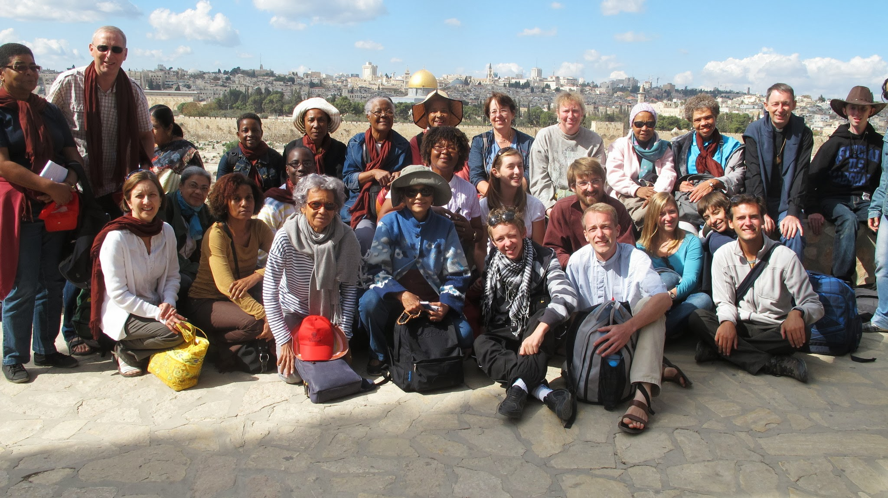

Le groupe au complet au mont des oliviers

Le retour à notre « vie normale » se fait dans la nostalgie du passage du groupe. Nous nous rendons à Ramallah, au nord de Jérusalem, en territoire palestinien, où nous cherchons à équilibrer les témoignages concernant le conflit israélo-palestinien.

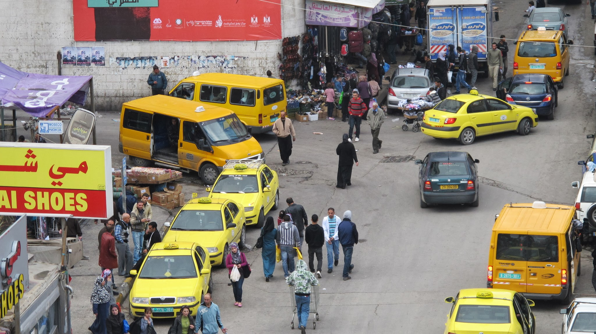

Ambiance dans la rue à Ramallah

Nous retournons ensuite à Jérusalem pour fêter Shabbat. Une fois de plus, nous sommes très bien accueillit à la synagogue. Nous assistons à une Bar-mitsva. C’est la fête juive marquant l’entrée dans la vie adulte pour un garçon. Cette fête a lieu quand le garçon a 13 ans. C’est très joyeux !

Dans l’après-midi, nous partons vers l’ouest où nous nous laissons inviter par de jeunes israéliens qui fêtent Shabbat. Ils chantent dans la joie et se souhaitent une bonne semaine, l’ambiance est musicale. Rien que pour nous, ce soir, nous avons le droit à un concert avec guitare, mandoline, cithare, tambourin et maracas ! Quelle chance !

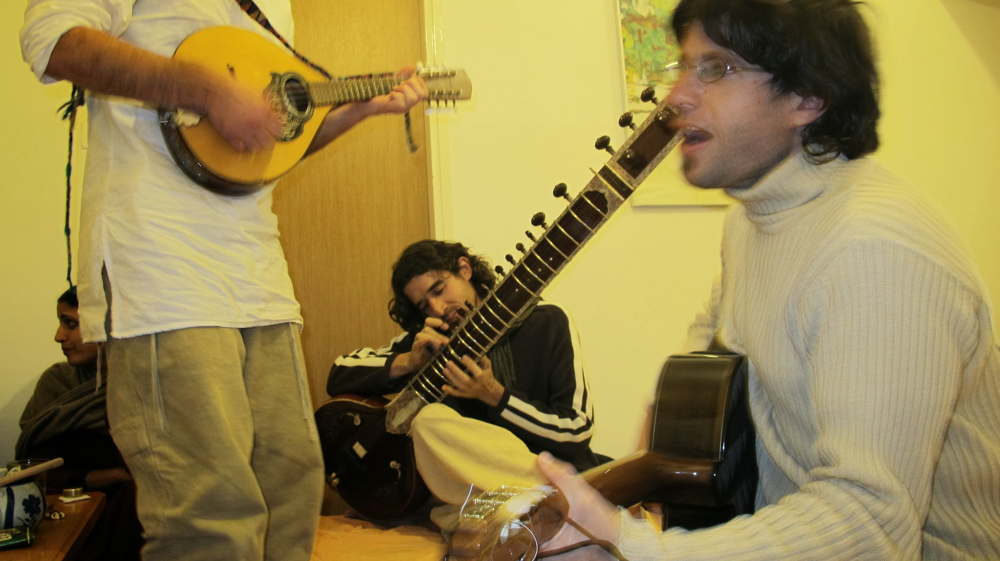

Notre concert privé et inopiné

Durant notre dernier jour en Israël, nous visitons l’ancien village arabe Sataf. Détruit en 1948 par l’armée Israélienne, il est maintenant devenu un lieu touristique pour les écoliers israéliens.

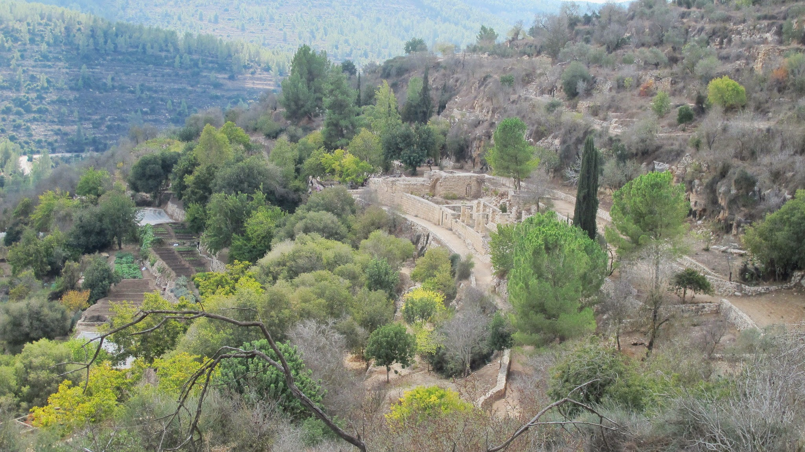

Village de Sataf

Nous faisons un détour par l’abbaye trappiste de Latrun. Puis nous reprenons le stop vers l’aéroport. Nous partons pour la capitale de la Lettonie : Riga, où nous passerons une semaine afin d’obtenir notre visa russe.
