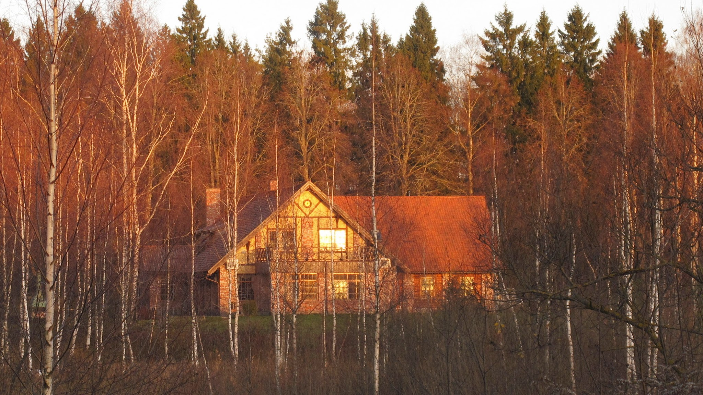
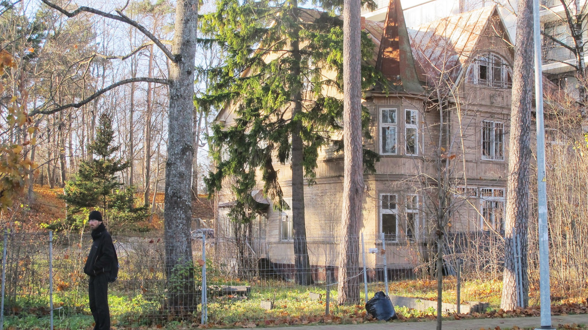

Après un mois intense en Israël, nous prenons l’avion en direction de la Lettonie ! Notre dernier souvenir d’Israël sera malheureusement la fouille intégrale que nous avons subie à l’aéroport Ben Gurion (Tel-Aviv). Deux heures durant, tous nos bagages y sont passés. Nous nous sommes chacun retrouvé dans une cabine en caleçon avec un membre de la sécurité qui scrutait chacun de nos vêtements. Pas très drôle !

Après une courte nuit dans l’avion, nous arrivons à Riga, la capitale lettone. C’est le choc thermique ! Nous avons perdu des degrés en vol.

Nous étions venus à Riga pour obtenir notre visa russe (Voir la page visas). Nous sommes donc allés directement au consulat de Russie à Riga. Au bout de 2h d’attente, nous découvrons que nous ne pourrons jamais passer au guichet (trop de queue). Heureusement, nous nous sommes fait un ami. Sous ses conseils, nous nous dirigeons vers une agence de voyage. Alors que le nombre de papiers pour le visa russe est à en décourager plus d’un, ici, nous ne donnons que nos passeports et une photo d’identité. Ce n’est pas cher et nous disons adieu aux queues interminables. Rendez-vous dans 9 jours pour récupérer nos passeports.

Maison en bois à Riga

Nous passerons donc une grosse semaine à la découverte de la culture balte.

Alex, notre premier hôte de couch surfing à Riga nous fait goûter le Black Balsam. C’est un alcool fort, certes, mais il nous explique que les 2 premiers verres sont bons pour la santé car ce breuvage à base d’herbes était avant tout un médicament ! Nous buvons ses paroles et un peu de cette liqueur.

Le lendemain, nous décidons de partir pour la mer Baltique. Nous nous y baignons !

Olivier après la baignade

Puis nous nous baladons dans un charmant village de bord de mer très calme qui est, en été, pris d’assaut par les vacanciers.

Campagne lettone

Pour notre 3e jour à Riga, nous rencontrons Ieva, notre 2e hôte de couch surfing. Elle nous emmène dans une soirée de danse Folk ! La danse Folk est très répandue en Lettonie. L’ambiance est bonne enfant. Nous dansons au rythme du violon et de l’accordéon.

 Nicolas avec son accordéon

Le 11 novembre en Lettonie, on commémore la lutte des Lettons contre leurs nombreux envahisseurs au court de l’histoire (Soviets et Nazis principalement). Le soir, à Riga, des centaines de milliers de bougies illuminent une partie de la ville. C’est magnifique. (Malheureusement, nous n’avions pas notre appareil photo avec nous)

Puis après ces quelques jours à Riga, nous décidons de nous rendre en Lituanie et pourquoi pas en Pologne. Après un jour intense d’auto-stop, nous revoyons nos ambitions à la baisse et nous décidons de rester 4 jours en Lituanie.

  Réveil glacial de notre camp de fortune en Lituanie

Les deux premiers jours, nous dormons sous la tente et les deux derniers, nous rejoignons Daiva (rencontrée grâce au Couch Surfing) dans son village : Anykciai. C’est un village assez paisible. Daiva nous fait découvrir les merveilles de cette charmante bourgade. A Anykciai, il y a le plus grand rocher de Lituanie, la plus grande église de Lituanie, quelques statuts de poètes et de jolies petites maisonnettes en bois.

Depuis une semaine dans les pays baltes, tout le monde nous parle des saunas. Ici, aller au sauna semble commun. Nous rencontrons les parents de Daiva. Ils ont un sauna chez eux et ils nous proposent d’en profiter. Nous allons donc au Sauna avec le père de Daiva. La séance au sauna se fait étape par étape : d’abord on va dans le sauna prendre de la chaleur. Puis on va se refroidir un peu et boire un thé. Puis on retourne prendre la chaleur et on se fait frapper le corps avec une sorte de feuillage. Enfin on se baigne dans l’eau froide. Cela semble rituel.

Après deux jours très agréables à Anykciai, nous décidons de retourner à Riga car nos visas russes devraient être prêts. Un ami de Daiva nous emmène jusque Vilnius (la capitale de la Lituanie) d’où nous pensons prendre le bus jusque Riga.

 Vue sur Vilnius, la capitale de la Lituanie

Nous achetons nos tickets, le bus arrive. Seulement voilà… Prendre le bus, ça serait trop simple. Le chauffeur descend pour vérifier les billets et le passeport. Mais le problème, c’est que nos passeports sont à Riga… Nous avons beau montrer la photocopie du passeport, la carte d’étudiant et le permis de conduire ; cela ne change rien, nous comprenons que nous ne pourrons pas passer la frontière en bus.

Nous nous dépêchons alors de faire rembourser nos billets et de prendre un autre bus pour nous rapprocher un peu de la frontière pour faire du stop. La nuit tombe, nous ne voulons pas dormir dehors alors nous continuons le stop. Cependant, c’est difficile car les voitures nous voient mal et il fait froid. Nous sommes pris jusqu’à une station essence par laquelle seuls quelques camions passent. Mais au moins nous sommes au chaud à l’intérieur du petit magasin de la station. Le problème c’est qu’à 22h, elle fermera et nous nous retrouverons dehors. Les camions ne peuvent prendre qu’un seul passager et nous ne voulons pas trop nous séparer. Finalement, à 22h10, dehors, dans le froid, nous décidons de nous séparer ; Olivier rentre en camion à Riga. Après 5km de marche dans la nuit il arrive chez Ieva. Nicolas campe à côté de la station et le rejoint le lendemain matin.

Au final on est bien content d’être arrivé ! Le soir, après avoir récupéré nos passeports muni du fameux visa russe, nous prenons le bus de nuit. Direction Moscou !!!
