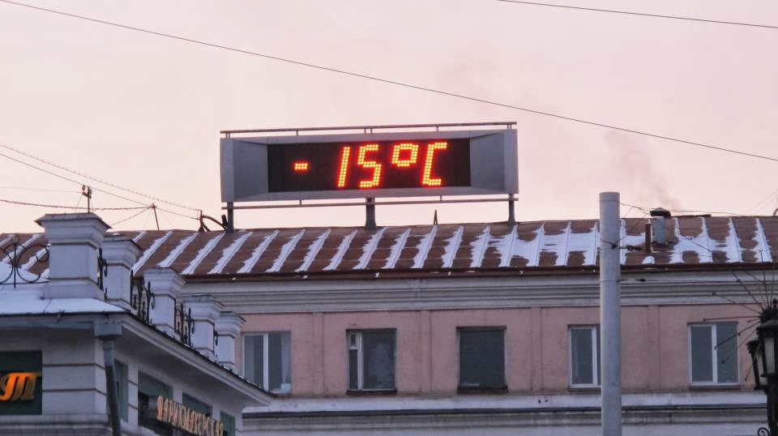

## Obtenir le visa chinois

Nous arrivons en matinée dans l'immense Moscou après un long trajet en bus. Au programme de la journée : aller à l'ambassade de Chine et retrouver Olga notre hôte pour les prochains jours.

Notre trajet jusqu'à l'ambassade de Chine nous permettra de découvrir le magnifique métro moscovite. L'ambassade se trouve néanmoins à 2,5km de la station de métro la plus proche. Nous arrivons à l'ambassade de Chine (et d'une) en début d'après-midi. Contrairement aux informations que nous avions trouvées sur internet, le service des visas est fermé l'après-midi ! Nous devrons donc attendre lundi pour demander notre visa !

Nous ne perdons pas notre temps car nous avons rendez-vous avec Olga dans peu de temps dans le centre-ville et l'ambassade de Chine est un peu excentrée. Nous retrouvons finalement Olga dans le métro. Elle parle un tout petit peu l'anglais mais c'est déjà pas mal car en Russie, il est très difficile de trouver quelqu'un qui parle anglais. Après une journée rythmée et fatigante (longue marche avec les sacs à dos), nous posons enfin nos sacs à nous nous réchauffons autour d'un thé.

Nous profitons du week-end pour découvrir le quartier de Moscou dans lequel nous sommes installés : le marché du quartier, l'immense forêt en pleine ville, une petite île avec de magnifiques monuments, le marché aux puces… Nous rencontrerons aussi un Russe très accueillant dans un petit restaurant qui, après quelques minutes, nous offrira deux énormes paires de moufles militaires ! Nous n'aurons plus jamais froid aux mains par la suite ! Sans parler un mot d'anglais, nous aurons tout de même une grande discussion… avec les mains !

Lundi, tôt le matin, nous revoilà à l'ambassade de Chine (et de deux) ! Grâce à Mintao, l'ami chinois de Nicolas, nous avons une invitation. Nous ne sommes pas sûrs d'en avoir vraiment besoin et nous ne l'avons pas imprimée (elle est sur notre ePC). Nous pensons naïvement qu'à l'ambassade ou dans les environs, il sera facile de la faire imprimer au cas où l'invitation serait vraiment nécessaire. Au bout d'un certain temps de queue, nous passons au guichet, nous apprenons que l'invitation est nécessaire et qu'il n'est pas possible de la faire imprimer ici. Nous commençons une course contre la montre, Olivier remplie les 4 pages des formulaires avec un stylo défaillant tandis que Nicolas part à la recherche d'une imprimante dans les environs de l'ambassade.

La recherche de l'imprimante n'est pas fructueuse dans cette immense ville où aller d'un commerce à l'autre prend énormément de temps. Nous décidons de retourner en ville (à 40 minutes de l'ambassade) et nous finissons par trouver un cyber-café où nous imprimons nos fameuses invitations. Nous sommes au taquet pour revenir le lendemain.

Mardi matin : ambassade, queue, guichet (et de trois). Cette fois, il manque la photocopie du passeport de la personne qui nous invite ! Argghh…

Pas de temps à perdre. Il est 10h, l'ambassade ferme à midi. Notre mission : aller dans un café free WIFI, contacter Mintao ou Nan, un autre ami de Nicolas (il est 7h en France) et imprimer le document (alors que l'imprimerie ouvre à 11h). Ce n'est pas gagné… Par chance, Nan est connecté (Nan, que faisais-tu sur internet à 7h du mat ???) et nous fournit tous les documents nécessaires ! Nous imprimons nos sésames. Nous prenons le métro ; courrons les 2,5km qui séparent le métro de l'ambassade. 11h45, on se faufile lâchement dans la queue. Et, arrivés au guichet (et de quatre), nous entendons dans un anglais impeccable : « mais vous n'avez pas été enregistré en Russie, nous ne pouvons pas procéder à la demande de votre visa chinois » (tous les étrangers doivent se faire enregistrer après 3 jours de présence sur le sol russe).

En recalculant les heures avec les jours ouvrés, non travaillés, il nous reste en théorie quelques heures pour nous faire enregistrer. Nous sommes donc dans les règles et après quelques minutes de négociation, nous obtenons le petit papier qui nous demande de revenir le lendemain pour récupérer nos passeports avec le VISA ! Youpi !

Le lendemain, nous retournons à l'ambassade (et de cinq). Et nous récupérons nos passeports. Nous sommes maintenant autorisés à aller en Chine. Nous avions fait du repérage la veille, le Transsibérien part à 13h20 le même jour, nous avons donc juste le temps d'aller acheter notre billet à la gare et de faire quelques provisions en pensant aux 4jours de trains qui nous attendent jusque Irkoutsk.

## Le transsibérien

Le transsibérien est la ligne de train mythique qui relie Moscou à Vladivostok en passant par Irkoutsk (en Sibérie). Il existe en fait plusieurs autres lignes de train : le transmongolien relie Moscou à Pékin en passant par la Mongolie et le transmandchourien qui relie aussi Moscou et Pékin mais en évitant la Mongolie. C'est cette dernière ligne de train que nous avons prises. Nous nous sommes arrêtés à Irkoutsk et nous avions prévu d'y prendre nos billets pour Pékin.

Il existe plusieurs classes lorsqu'on voyage en Transsibérien. Nous avons choisi la troisième classe (la moins cher). Nous avions tout de même un certain confort : une couchette par personne avec un matelas et des draps. Le wagon n'est pas réparti en cabine et tout le monde entend ses voisins. Le problème, c'est quand la voisine du dessous… ronfle ! Pas un petit ronronnement… non non ! Un groooos ronflement bien gras. Heureusement, nous avions prévu les boules Quiès. Sinon, le voyage aurait été bien différent…

L'ambiance dans le wagon était assez chaleureuse. Même si nous avons passé beaucoup de temps à lire, nous avons quand même pu rencontrer quelques Russes très sympathiques. Les Russes ne comprennent pas bien pourquoi des Européens veulent prendre le transsibérien (et non l'avion qui est bien plus rapide). Pour eux c'est le seul moyen de se déplacer pour aller visiter les grands-parents, aller passer un concours scolaire ou essayer de chercher du travail à Moscou.

D'un point de vue pratique, de l'eau bouillante est disponible pour se faire des « pâtes 2minutes » et les WC ne permettent que de faire une toilette succincte.

A chaque arrêt, des vendeurs ambulants nous ont ravitaillés. Les prix étaient raisonnables quoique plus chers qu'en grande surface.

Une prise électrique par wagon est disponible mais pour recharger l'ordinateur, nous devons aller au wagon restaurent qui est énigmatiquement toujours vide.
Aux gares, l'heure est Moscovite, la lumière dans le wagon suit le décalage horaire (5h de différence entre Moscou et Irkoutsk) et nous ne savons pas trop comment régler nos horloges.

La magie du transsibérien, c'est quand, au trois-quarts du voyage, on se demande : " Quelle heure est-il ? Où sommes-nous ? " On est comme transporté dans un univers insolite où les notions de temps et d'espace sont différentes. On ne sait plus bien dans combien de temps on arrive.

On finit quand même par arriver à Irkoutsk.

## Irkoutsk

Même si le froid commençait à se faire sentir à Moscou, ce n'était rien comparé à Irkoutsk. A notre arrivée, le thermomètre de la place de la gare indique -15°C.

  Notre seule photo de Russie (publiée sur facebook à temps)

Malgré la superposition de maillots de corps, de T-shirts, de pulls et de pantalons, nous sentons le froid ! Nous nous allons chez Alex et Léa qui nous accueillerons pour les prochains jours. Mais une fois arrivés chez eux, personne ne répond. En fait, nous nous étions mal compris : avec le décalage horaire, Alex et Léa nous attendaient seulement le lendemain. Nous les retrouvons finalement en ville un peu plus tard. Ils nous font visiter un peu.

Notre pose à Irkoutsk est l'occasion pour nous de préparer un peu la suite du voyage, d'acheter nos tickets de train jusqu'à Pékin, de nous enregistrer sur le sol russe.

Nous partons également pour un jour voir le lac Baïkal, surnommé « la perle de Sibérie ». C'est la plus grande réserve d'eau douce au monde et également le lac le plus profond. Malgré la cinquantaine de kilomètres qui le sépare d'Irkoutsk, il y fait beaucoup plus chaud. Nous ne comprenons pas bien pourquoi… (L'eau pas encore gelée réchaufferait l'atmosphère ?) Si vous avez des suggestions…

Nous faisons une magnifique balade dans la forêt entourant le lac puis faisons du stop pour rentrer. 2 jeunes russes très sympathiques s'arrêtent pour nous. Ils sont ravis de nous rencontrer et, malgré la barrière de la langue, nous échangeons quelques idées et prenons quelques photos ensemble… Mais voilà, une fois arrivés, nous oublions l'appareil photo dans la voiture ! Adieu belles photos de Russie… adieu coûteux appareil photo !

Nous partons le lendemain pour Pékin via Manzhouli, ville frontière avec la Chine.
