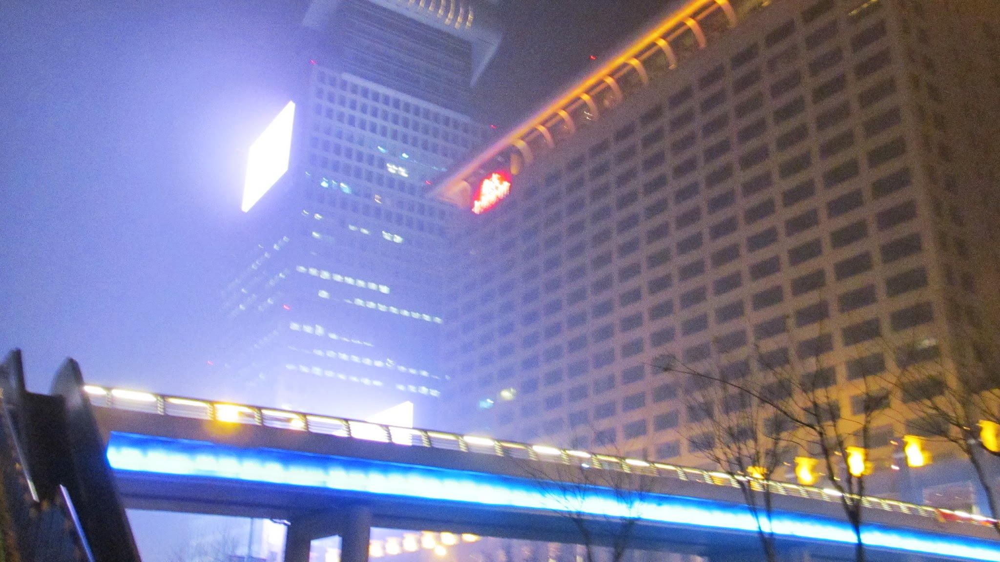
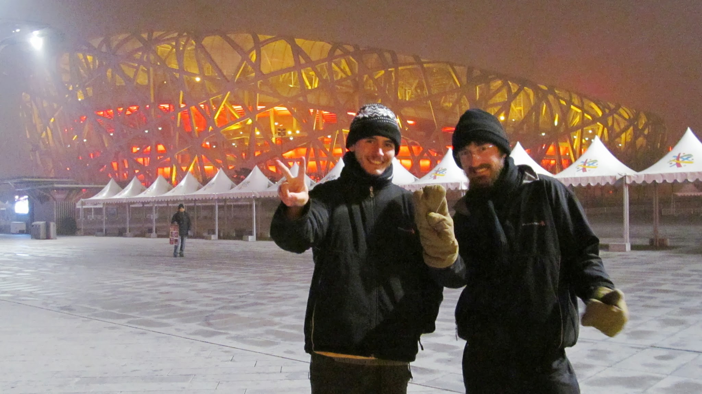
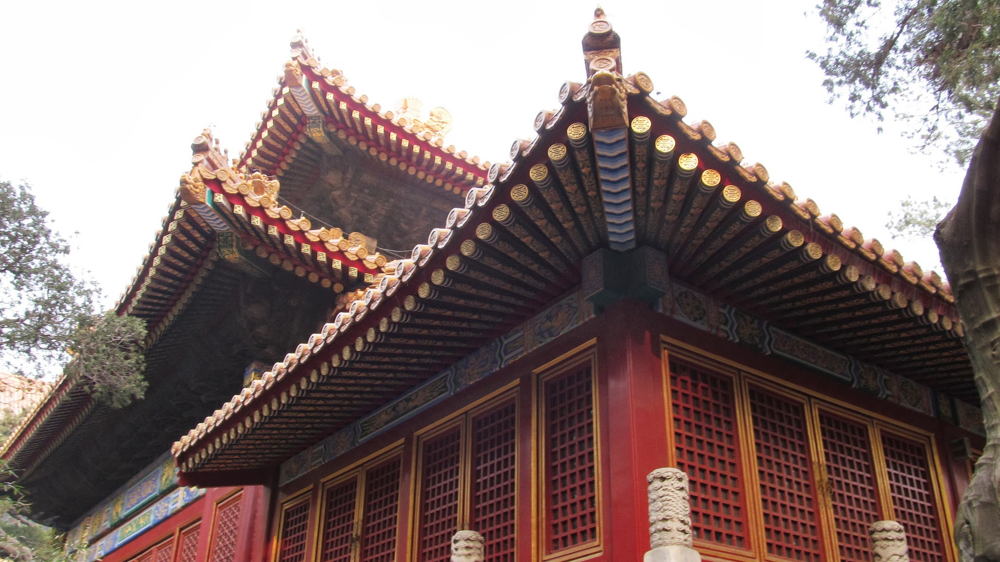
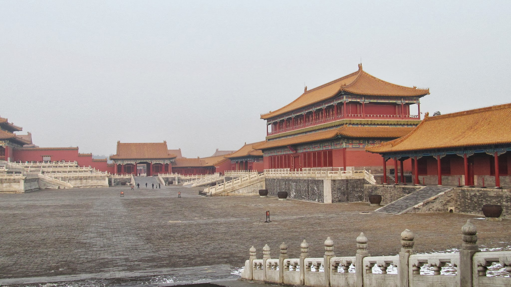
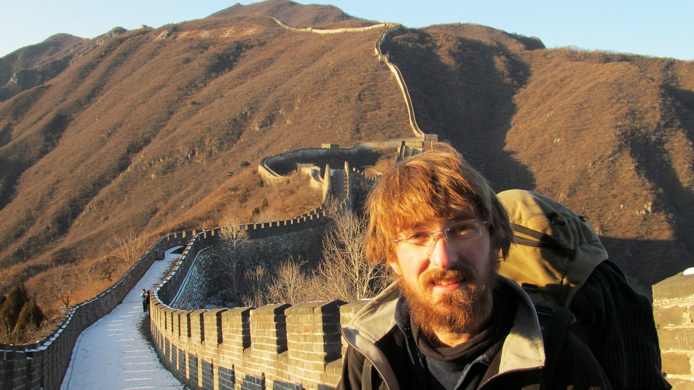
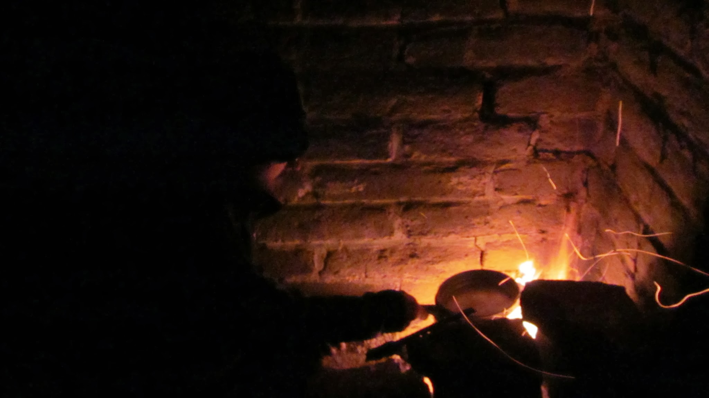
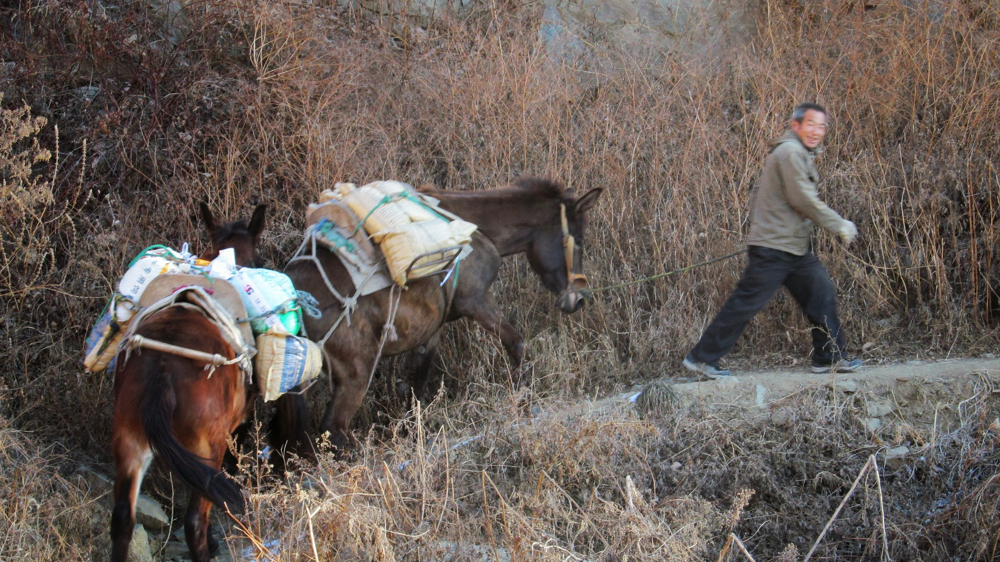
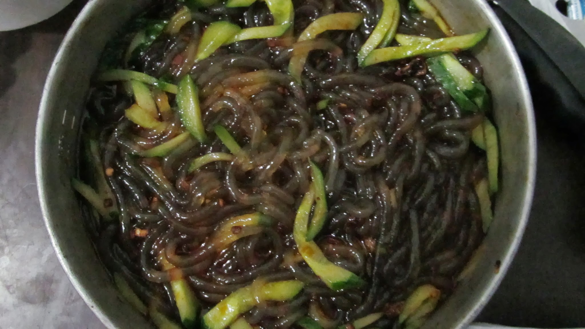

### Notre arrivée en Chine

Au petit matin de notre deuxième nuit en train, nous arrivons à la ville frontière russe proche de la Chine. Cette matinée marquera sûrement les températures les plus froides de notre voyage. Dans le noir, nous nous dirigeons vers la frontière. Nous avions vu sur Google Map qu’elle était au plus à 2 ou 3km. C’est en fait un vrai labyrinthe et dans ce froid, nous décidons de prendre un taxi pour nous y emmener.

La frontière n’est pas encore ouverte quand nous y arrivons. Nous nous réfugions, bien au chaud, dans un minibus qui attend l’ouverture de la frontière. Nous quittons ainsi la Russie. Le minibus va à Manzhouli, là où nous nous rendons, mais le chauffeur réclame bien naturellement de l’argent. Nous tentons donc de continuer à pied… Malheureusement, nous nous faisons très vite interpeller car nous n’avons pas le droit de traverser la frontière à pied. Bien que le poste frontière chinois ne soit qu’à une cinquantaine de mètres et qu’il n’y ait qu’un malheureux grillage à passer, nous sommes obligés de suivre le chauffeur qui nous pousse à remonter dans son véhicule. Nous passons la frontière chinoise et nous hâtons de nous séparer du groupe du minibus pour qu’on ne nous réclame pas d’argent. Mais une fois le poste frontière chinois passé, il y a encore une dernière petite barrière à passer et là encore, pas moyen de passer à pied. Après un temps d’attente au niveau de la barrière, nous retrouvons le minibus dans lequel nous remonterons pour faire environ 2 mètres : la distance nécessaire pour passer la barrière !!! Nous remercions le chauffeur sympathique qui nous a bien aidés et partons à pied vers Manzhouli.

Sur la route, malgré le froid glaglaçant, nous admirons une belle surprise : au milieu de nulle part (pas de ville en vue), des sculpteurs de glace travaillent sur d’énormes blocs répartis environ tous les 100m le long de la route. Derrière, de spectaculaires monuments sortent de la brume : églises, immense poupée russe… Nous pensions que Manzhouli était plus proche de la frontière. Sans trace de ville à l’horizon, nous demandons à un conducteur arrêté à un feu de nous y emmener. Sur une carte de Chine, Manzhouli est à peine indiquée. Dans la voiture, nous sommes donc très surpris de voir sortir de la brume des gratte-ciels et d’arriver dans un centre-ville très actif. Cette arrivée en Chine est grandiose ; la différence avec la Russie est saisissante ; nous nous sentons maintenant en Asie… dans une Asie en plein essor.

Comme à chaque entrée dans un nouveau pays, nous allons vite tirer des sous. Nous voulons aussi acheter une carte SIM car ne pas pouvoir appeler ou être contactés nous a souvent posé problème en Russie. Mais nous n’aurons l’occasion de l’acheter qu’à Pékin. Nous allons à la gare de Manzhouli pour décrocher nos premiers mots de chinois : « Je veux un ticket pour Pékin ; le moins cher possible ». Parfait, nous n’avons que 2 heures d’attentes. Et hop, c’est reparti pour 32h de train, cette fois-ci sans couchettes ! Et dire qu’en France on ne met qu’une poignée d’heures pour se rendre n’importe où dans le pays ! Après ces nombreux jours passés dans le train, nous perdons un peu la notion de ce qu’est un court trajet.

Ce long trajet en train est pour nous l’occasion d’observer l’effervescence de la Chine. Les gratte-ciels sont partout, les grues aussi. Les chinois sont contents de nous voir. Nous introduisons la bataille corse en Chine et réapprenons à compter sur les doigts (et oui, en Chine on compte jusqu’à 10 avec une seule main !).

### Pékin

A notre arrivée à Pékin, Lee, notre couch surfeur nous attend à la gare. Le lendemain, il nous fait découvrir Pékin, les grandes allées commerçantes et un marché aux puces où nous nous laissons avoir par quelques tout petits prix. Nous allons également dans les Wutongs, des petites ruelles commerçantes anciennes. Beaucoup d’entre elles sont détruites pour faire place à de grands immeubles. Cette journée à Pékin est aussi l’occasion de goûter nos premiers délicieux plats chinois.

Devant le stade olympique des JO 2008

Nous visitons également la très touristique Cité Interdite, lieu de résidence des empereurs de Chine ce qui nous permettra de tester notre nouvel appareil photo, preuve ci-dessous !

Les magnifiques toitures chinoises

Une des immenses cours de la cité

### La Grande Muraille

Et comment passer à Pékin sans découvrir la Grande Muraille de Chine ! Nous décidons d'y partir pour deux ou trois jours de marche. Bien qu’il fasse très froid, le temps clair est idéal et nous ne sommes pas déçus des paysages !

Olivier sur la Grande Muraille

La première nuit, glaciale, dans une tour de garde nous fait vite retourner sur nos pas ! Nous avons galéré pour allumer un feu dans ce froid et ce vent. Plus de 8 couches de T-shirts, pulls, manteau et sac de couchage ne retiendrons pas nos frissons durant cette longue nuit. Au petit matin, nous sommes ravis d’avoir visité ce lieu magnifique mais nous ne nous voyons pas passer une seconde nuit comme celle-là et nous ne pensons pas pouvoir allumer un feu pour déjeuner et dégeler notre réserve d’eau… Nous rebroussons donc chemin !

  Essayez de faire un feu avec ces températures-là, un tout petit peu de papier
  et des doigts gelés… nous étions heureux d’avoir un repas ce soir-là

Le plat de riz, au chaud, dans un petit restaurant au pied de la muraille nous redonne quelques forces. Nous posons nos quartiers dans un petit hôtel entre la muraille de Chine et Pékin pour un repos bien mérité.

  Rencontre insolite avec un vieux monsieur et ses ânes au pied de la muraille

Le soir, nous sortons diner un peu tard. Les chinois ont l’habitude de manger tôt et à 21h, tous les petits restaurants sont en train de fermer. Nous achetons donc des pâtes et des œufs que nous cuisinerons à l’hôtel. La famille qui tient l’hôtel est très serviable et très contente de voir des étrangers. La maman, la fille et la petite fille s’occupent de tout mais très vite quelque chose ne va pas. Elles ne veulent absolument pas que nous mangions les pâtes que nous avons achetées. La compréhension est difficile… au bout d’un certain temps, une de leurs amies qui parle deux mots d’anglais arrive et essaye de nous expliquer qu’il ne faut pas manger ces pâtes ! Nous ne comprenons pas pourquoi ! Finalement, la maman part nous acheter un repas qui nous est livré à domicile ! Une fois cuites, nous comprenons pourquoi elles ne voulaient pas qu’on mange les pâtes : il s’agissait de pâtes aux haricots, gluantes et qui donnent mal à la tête d’après ce que nous avons compris.

Les pâtes gluantes !

