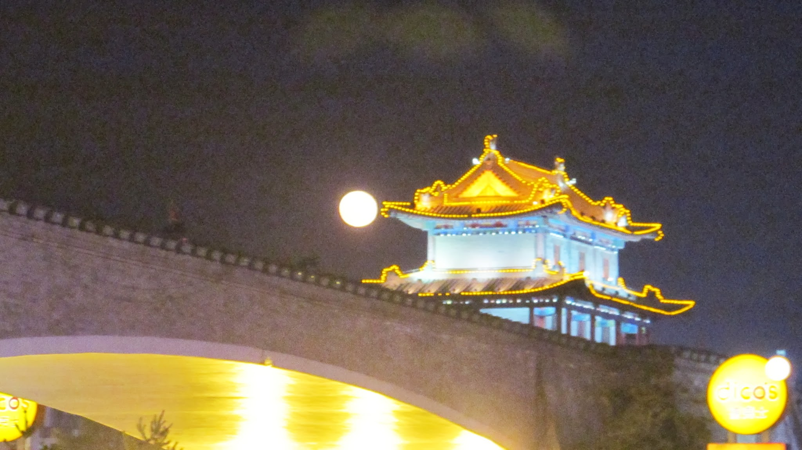

Pleine lune en Chine 

### En route pour Chengdu

Après une semaine à Pékin, nous voulons reprendre le train pour nous rapprocher du Tibet.

Nous aimerions ne pas arriver trop tard à Chengdu pour être en mesure de constituer un groupe pour partir au Tibet. Nous reparlerons de la constitution de ce groupe dans notre prochain article.

Nous pensons donc faire une escale de deux jours à Xi’an, à mi-chemin entre Pékin et Chengdu, même si nous savons que c’est un peu juste. Nous prenons donc, deux jours à l’avance, notre billet de train pour Xi’an.

Notre trajet en Chine

Nous disons au revoir à Lee, notre ami couchsurfer de Pékin et nous nous dirigeons vers le bus qui va à la gare. Nous avons prévu 40 minutes de marge au cas où il y aurait du trafic. Malheureusement, nous sommes vendredi soir et la circulation est complètement bloquée. Au bout d’une heure, coincés dans le bus, nous nous rendons à l’évidence, nous allons manquer notre train !

Nous arrivons finalement à la gare un bon quart d’heure après le départ du train. Nous allons directement au guichet anglophone et nous apprenons que nous pouvons tout de même changer notre billet. Nous décidons alors d’aller directement à Chengdu mais ce n’est pas possible ; il n’est possible que de changer le billet pour un autre train qui va à Xi’an. Tant pis, nous avons vu qu’il y a des correspondances à Xi’an pour Chengdu et nous pensons avoir seulement quelques heures d’attentes à la gare de Xi’an. Malheureusement, les trains en Chine sont bondés et il faut prendre son billet un ou deux jours à l’avance pour avoir des places. Résultat, à notre arrivée à Xi’an le matin, il n’y a plus de place pour la correspondance. Nous passons donc la journée à Xi’an et obtenons pour le soir un billet « debout » pour les 16h de train reliant Xi’an à Chengdu.

A Xi’an, repose la fameuse armée souterraine en terre-cuite qui accompagne dans son sommeil éternel un des grands empereurs chinois. Malheureusement, 3 jours après son ouverture, elle a perdu ses magnifiques couleurs. Il existe d’autres salles encore inexplorées avec des armées en terre-cuite. Le gouvernement chinois veut attendre d’avoir les techniques nécessaires pour conserver les belles couleurs de ces soldats pétrifiés.

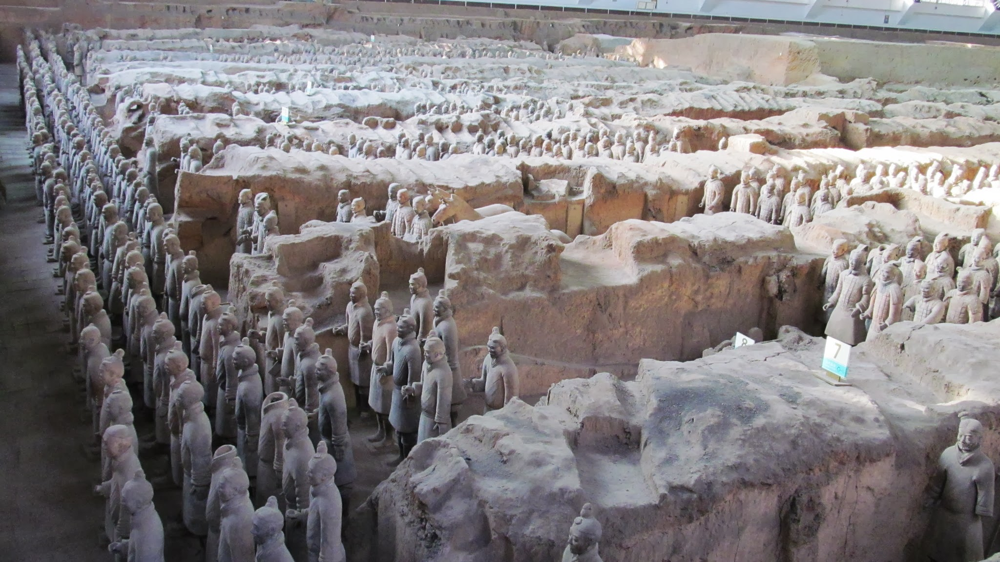

  L’armée en terre cuite, grande attraction touristique de Xi’an

### Le ticket « debout » !

En fin de journée, nous nous retrouvons donc dans le train pour Chengdu, debout pour passer la nuit…

En effet, dans les trains de nuit chinois, il y a trois classes : les couchettes molles, les couchettes dures et les sièges. Mais quand il n’y a plus de siège disponible, il reste encore des billets « debout » à la vente. Lors de nos premiers voyages ferroviaires en Chine, les trains n’étant pas bondés, nous avions bénéficié d’un peu de place pour nous allonger par terre sous les sièges sans être gênés par le passage.

Mais cette fois-ci, il y a bien plus de monde ! Sous les sièges, il y a des bagages et nous avons de la peine à trouver une place pour les nôtres. Il est impossible de s’asseoir dans l’allée principale du train à cause des allées et venues des passants qui vont chercher de l’eau chaude, des vendeurs qui passent avec leur chariot ou des femmes de ménage qui tentent de passer le balai.

Nous sommes donc contraints à rester debout ! Il est 21h, il ne reste que 14h… Chacun de notre côté, nous cherchons une solution. Nicolas opte pour le siège dépliant (que lui prête une passagère). Il est assis dans l’allée mais toutes les 30 secondes il doit se relever pour céder le passage. Olivier entrevoit un espace un peu libre où une famille a rangé un récipient pour recueillir le pipi de bébé. Après le déplacement délicat du récipient, Olivier se recroqueville sur le sol crasseux et s’insère dans un micro-espace ; coincé sous les sièges et les sacs, avec les coups de balai de la femme de ménage et les pieds des gens dans la figure ! Mais au moins Olivier est quelque part où il peut dormir ! Après la technique de la chaise dépliante, Nicolas fait un repli stratégique et décide d’accélérer le temps. Dans le passage certes, il regardera trois films consécutifs pour atteindre le petit matin.

Nous arrivons tout frais à Chengdu.

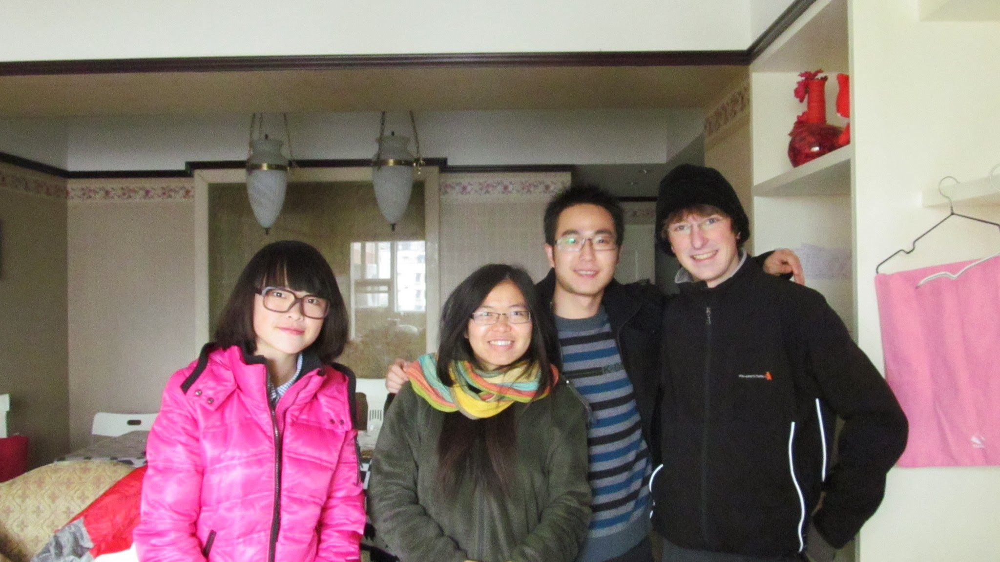

Rencontres couchsurfing à Chengdu

### Accueil dans les montagnes de Li Xian

Alors qu’Olivier reste à Chengdu pour préparer des dossiers scolaires pour l’année prochaine, Nicolas part quelques jours hors des grandes villes chinoises. Les horaires et les prix des trains décideront de la destination : j’irai donc (Nicolas) à Li Xian, à 200km de Chengdu, dans les montagnes qui marquent le début du Tibet historique (plus vaste que la province chinoise nommée Tibet). Le but est de m’éloigner des grandes villes que nous côtoyons sans cesse depuis Moscou ce qui permettra avec un peu de chance de me faire accueillir à l’improviste par des chinois.

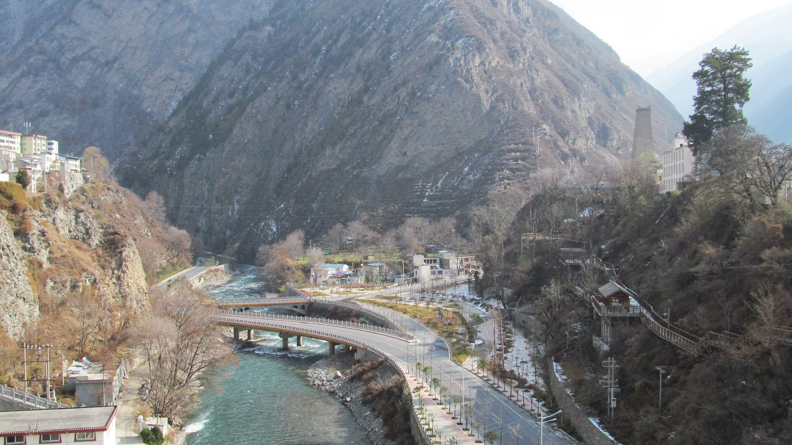

Li Xian

La chance est plus qu’au rendez-vous : après quelques heures de marche dans la vallée de Li Xian, la nuit tombe et deux paysans rentrent leurs vaches au village. Ils me déconseillent d’aller plus loin car il y aurait trop de neige. Ils sont ravis de m’accueillir pour la nuit lorsque je leur demande. L’homme m’indique un canapé pour dormir et s’en va finir les tâches qu’il lui reste à réaliser.

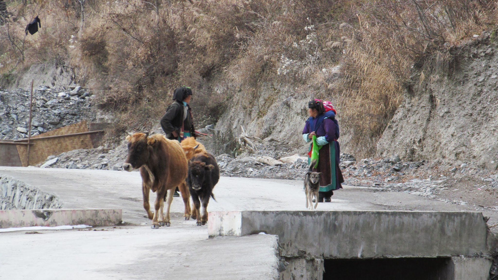

Dans la vallée de Li Xian

Malgré le manque d’accessibilité de la vallée, toutes les maisons ont l’électricité et sont bien équipées. La maison est bien plus confortable que ce que je m’attendais. Le salon est grand, il y a des meubles de rangements colorés, des tables, des canapés et une ampoule au plafond. L’homme revient vite avec un plat de braises pour me réchauffer et m’offre des clémentines. Je ne m’attendais pas à mieux mais c’était sous-estimer l’accueil de ces paysans !

Très vite, l’homme me dirige vers la cuisine. Sur la table, déjà 5 plats sont sont là et sa femme en cuisine encore d’autres. Les plats sont délicieux, de la vraie cuisine chinoise. A chaque fois que mes baguettes sont inactives plus de 3 secondes, le couple s’empresse de me dire « Miennesaï, miennesaï » en me montrant les plats… Je me dépêche donc de réactiver mes baguettes pour arrêter de me faire gronder ! Quant à la tasse de thé qui accompagne le repas, j’ai bien essayé de la vider… mais à chaque fois que la tasse est à moitié pleine, la femme la remplie à nouveau ! Le dîner sera un régal jusqu’à l’arrivée du terrible alcool de riz qu’apportera l’homme… beurk ! Et la tradition veut qu’à chaque fois que l’un boit, l’autre doit trinquer et boire également ; j’ai donc à peine le temps de me remettre de la gorgée précédente qu’une nouvelle s’impose… heureusement, il s’éloigne quelques minutes plus tard, me laissant l’opportunité de vider mon verre dans le sien discrètement !

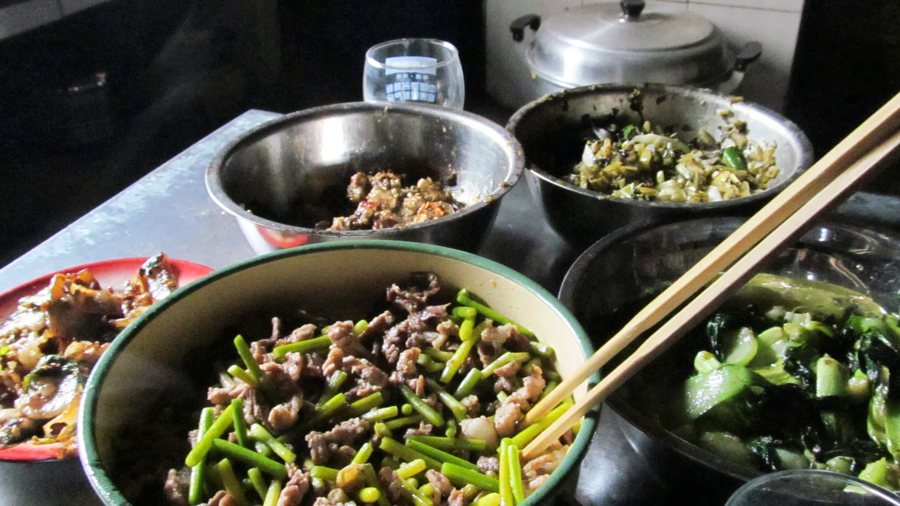

A table !

Une fois repu, je pensais ensuite aller me coucher mais on m’emmène dans une autre maison et je découvre par surprise tout le village réunit dans une pièce pour… dîner ! Je venais donc de déguster l’apéro ! Cette fois-ci, je compte sur la table 17 plats tous délicieux et on m’oblige encore à manger malgré mon manque d’appétit. Je vois avec horreur mon verre se remplir à nouveau de cet infâme alcool et cette fois-ci : aucune échappatoire possible ! Les discussions sont très difficiles : personne ne parle anglais mais j’échangerai tout de même quelques gestes avec eux.

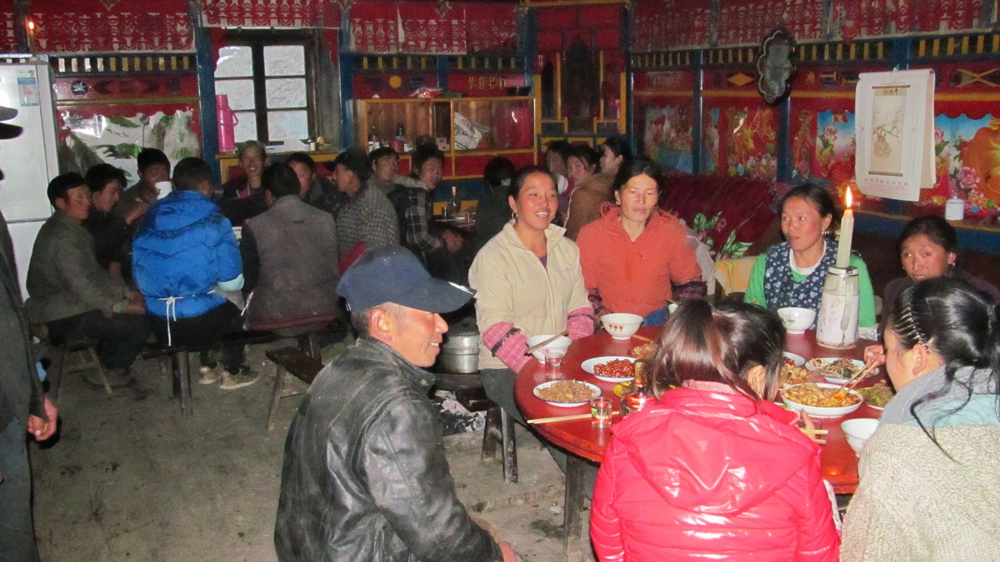

Diner avec les habitants du village

Au retour à la maison, une dizaine de personnes s’installent dans le salon et la fête continue. Dans l’ordre chronologique : les femmes du village s’habillent en costume traditionnel et dansent juste pour moi ; le grand père sort son violon pour me jouer des petits morceaux ; on tente de m’apprendre le jeu local (une sorte de rumikcube pour les connaisseurs). Quelle belle soirée. Finalement, le couple ne me laissera pas dormir sur le canapé et m’offrira leur chambre. Eux iront dormir chez le grand-père. Je me couche donc sous 2 énormes couettes, bien au chaud.

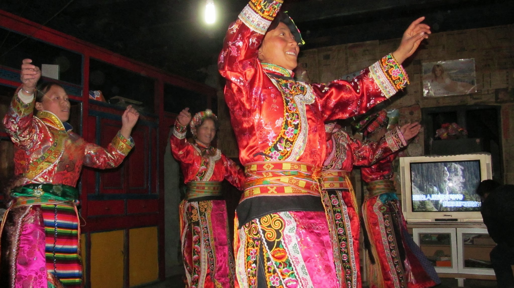

Danse traditionnelle dans le salon

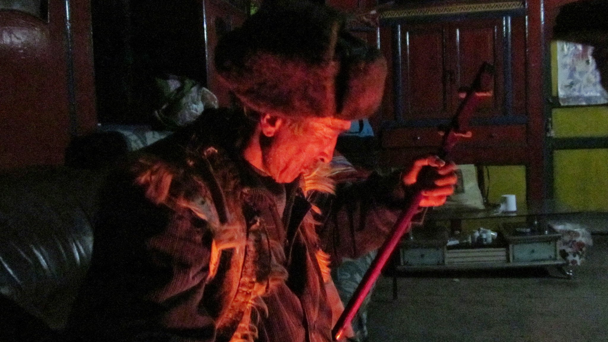

Papy joue du violon au coin du feu !

Le lendemain matin, les plats de la veille se retrouvent à nouveau sur la table. Je vois avec grand malheur l’homme s’installer à la table avec sa bouteille d’alcool de riz à la main ! Une fois que la femme a rempli mon sac d’œufs durs et de mandarines, je les remercie du fond du cœur et reprend la direction de Li Xian ! Cette rencontre restera dans ma mémoire !

### Une journée de stop en Chine - Retour à Chengdu

Je me dirige ensuite vers Wo Long qui est le grand parc national où l’on peut voir les pandas (le symbole de Chengdu est le panda). C’est l’occasion de tester le stop en Chine. Il paraît que c’est très dur et que les chinois ne connaissent pas le principe. Avant de partir, je me suis donc procuré un papier avec écrit dessus en chinois « Puis-je monter dans votre voiture sans payer ? Je vais par-là, j’aime les longs trajets ». Les chinois sont tellement curieux de voir un occidental avec un gros sac à dos qu’il n’y a même pas besoin de lever le pouce au bord des routes ! Au cours de la journée, 7 voitures me prendront en stop avec à chaque fois très peu de temps d’attente.

Arrivé à Wo Long, c’est la grande déception… il n’y a absolument rien ici ! Il y a eu un tremblement de terre en 2008 et depuis, le centre des pandas est fermé… merci le Petit Futé 2011 et tous ces panneaux avec des pandas sur la route pour ce super bon plan ! Il n’y a absolument rien à faire dans le coin… je décide donc de prendre la route de Chengdu. Tard le soir, un couple fortuné de chinois s’arrête pour me prendre en stop. Bien qu’ils aient compris que j’ai une tente et un sac de couchage pour dormir, ils me déposeront dans un hôtel chic qu’ils m’offriront et insisteront pour me laisser de l’argent pour prendre le taxi le lendemain !!

Le lendemain matin, je découvre avec plaisir la belle ville où ils m’ont laissé puis rentre en bus à Chengdu (vous ne pensiez quand même pas que j’allais prendre le taxi tout de même ?). J’y retrouve Olivier, qui y a bien travaillé !

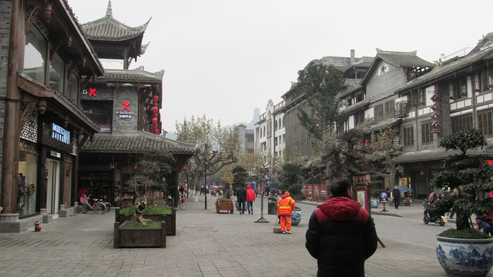

  Petit temps de visite avant de rentrer sur Chengdu

Après une semaine de travail intensif, la récompense d’Olivier est d’aller voir… les PANDAS !!!!!

La suite en image :

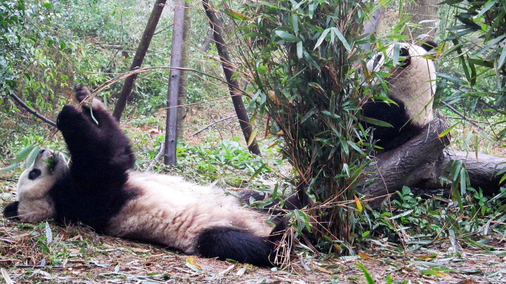

Huummmmm du bambou !

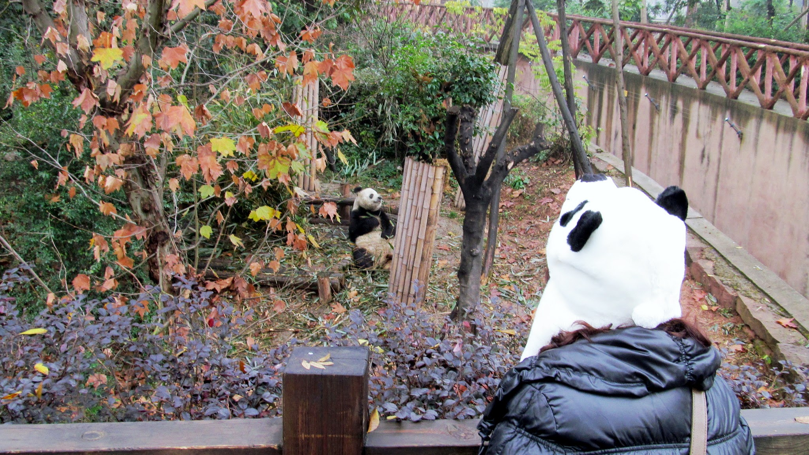

Terrible face à face

Nous partons dimanche soir pour Lhassa, 44h de train sur des sièges, sur la ligne de chemin de fer la plus haute du monde !

mport Navigation from "../../Navigation";

<Navigation
  previous="/2011-12-16"
  next="/2011-12-30"
  gallery="/galerie/chine"
/>
