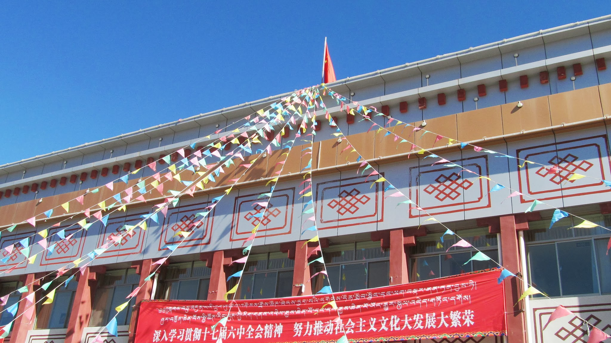
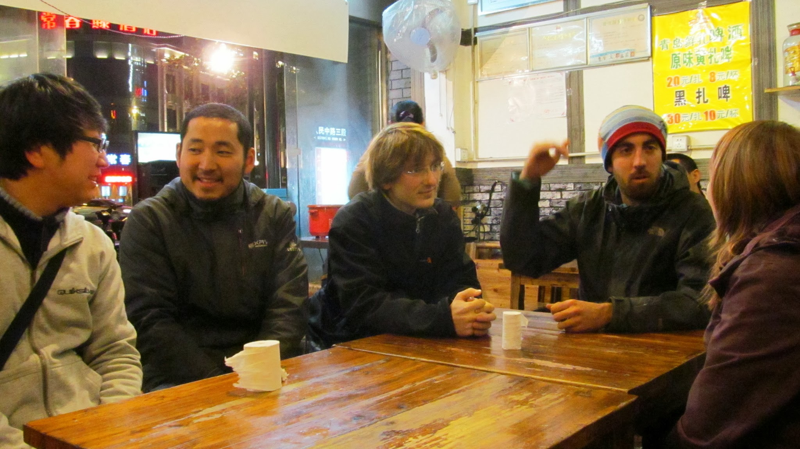
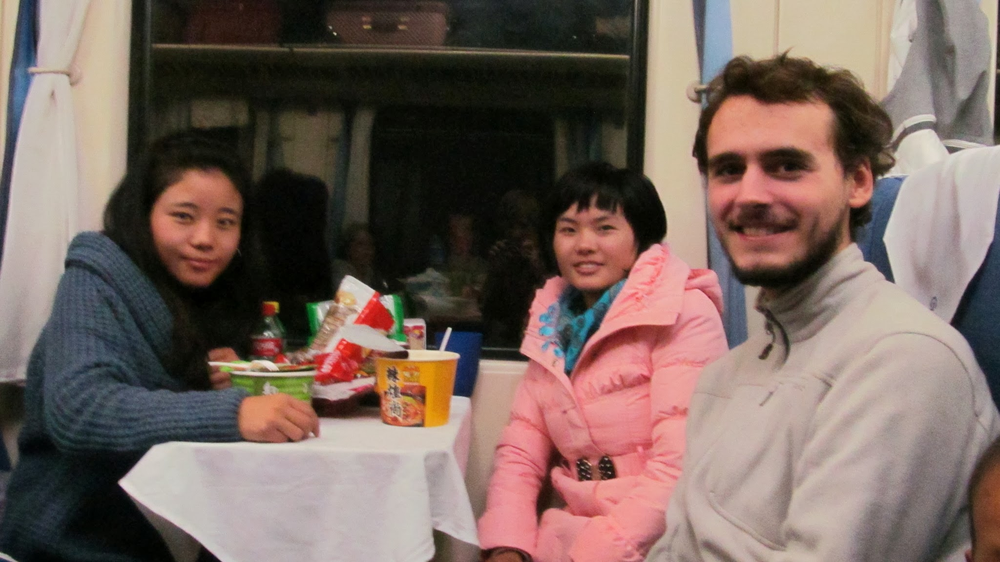
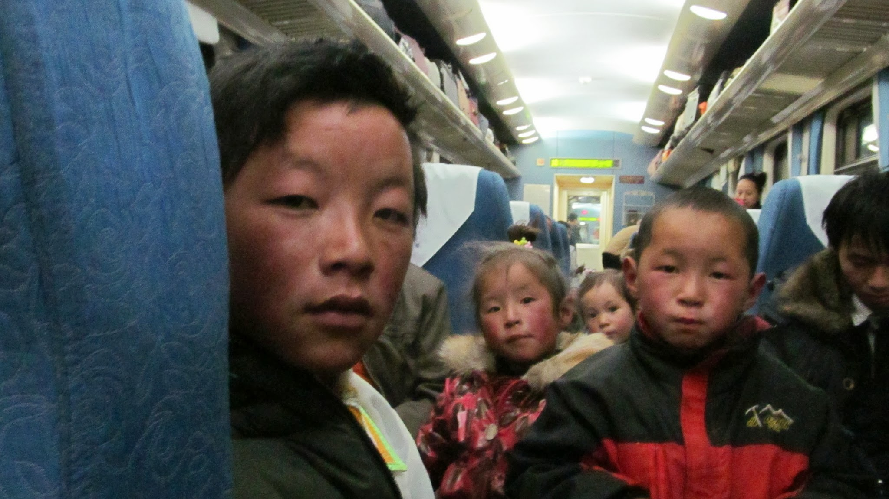
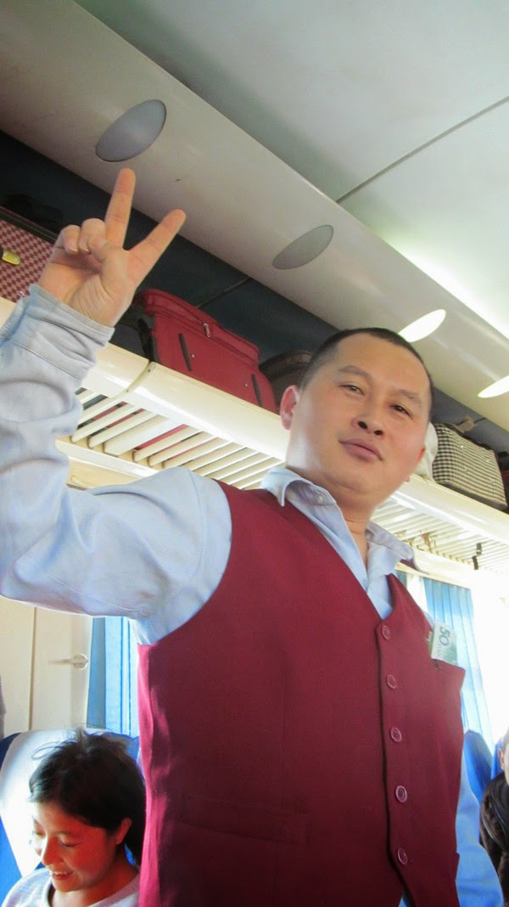
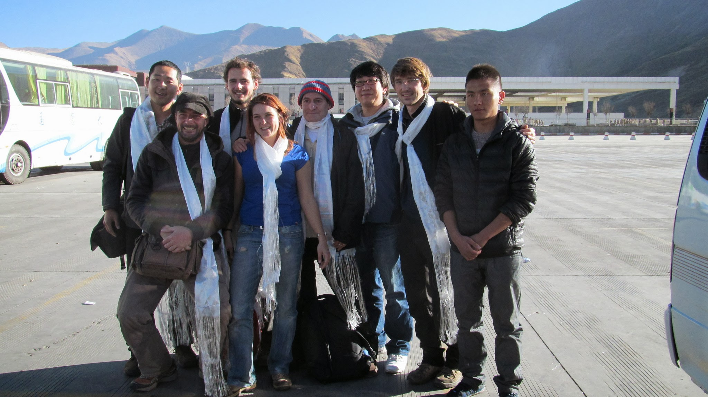
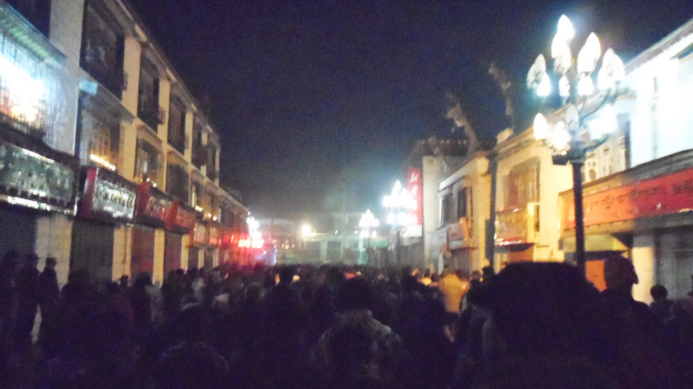
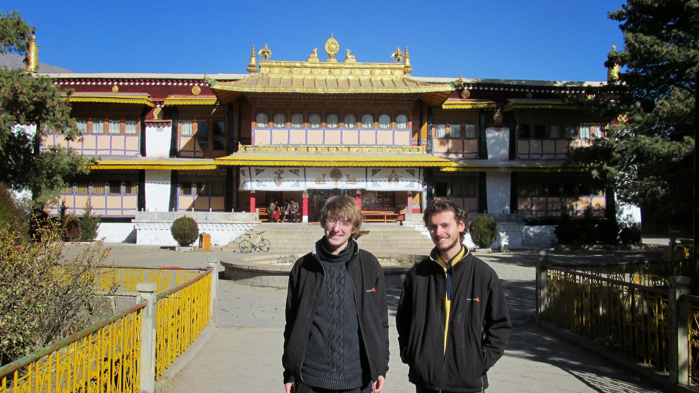
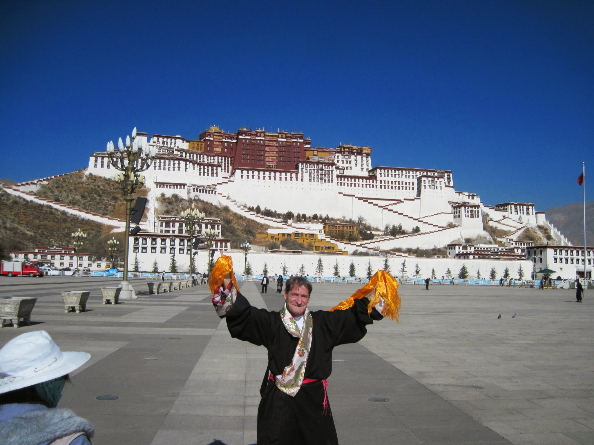
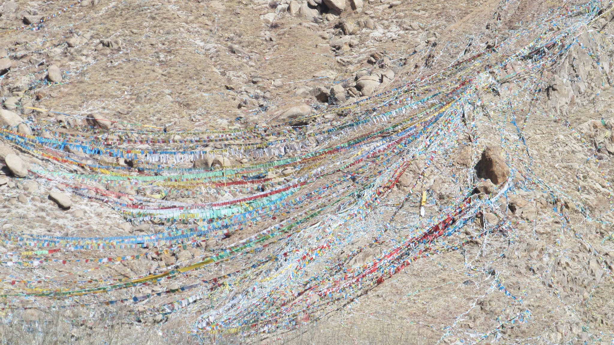

### Montons un groupe pour le Tibet !

Pour se rendre en Inde depuis la Chine par la route, la seule solution est de passer par le Tibet. Nous ne voulons pas survoler les plateaux tibétains en avion. Nous aimerions bien un peu profiter de la culture tibétaine, bien plus spirituelle qu’en Chine. Nous sommes donc bien motivés pour nous rendre sur les plus hauts plateaux du monde.

Seulement voilà : les voyageurs n’ont pas le droit de se rendre au Tibet librement. C’est le cas depuis longtemps mais la situation s’est très largement dégradée après les incidents de 2008 au Tibet.

  Drapeaux de prières tibétains dominés par le drapeau chinois

Nous ne pouvons donc pas nous rendre au Tibet sans un permis et un guide. Autant dire que le porte-monnaie va en prendre un coup ! La solution la plus économique est de monter un groupe (jusqu’à 8 personnes) pour partager les frais du tour : permis, guide et location du véhicule.

Bien informés de ces détails, nous avons contacté les hôtels et auberges de jeunesse de Chengdu très tôt pour demander s’ils n’avaient pas des clients qui voudraient se rendre au Tibet. En parallèle, nous laissons des messages sur les forums de voyage (Forum Voyage, LonelyPlanet, Le routard) pour tenter de trouver des compagnons de voyage. Ce problème est si connu que certains de ces forums ont une rubrique spéciale pour trouver un compagnon de voyage pour le Tibet !

La piste des hôtels nous permet de nous réunir avec Erica, hollandaise, puis un peu plus tard avec Han et Chris, coréens. Monter un groupe de 5 semblait déjà inespéré avec le peu de temps et de flexibilité que nous avions !

Nous rencontrons le groupe de 5 au Mix hôtel à Chengdu et nous nous mettons d’accord sur l’itinéraire du tour (nous choisissons le moins cher) ainsi que sur la date de départ.

  Rencontre à Chengdu d’une partie du groupe et d’un voyageur à vélo français

Puis au dernier moment, Yuri, espagnol, avec qui le planning ne semblait pas coller nous rejoint tout de même ainsi qu’un allemand : Bernd.

Nous voilà donc 7 voyageurs réunis pour aller passer Noël au Tibet !

### En route pour le Tibet

Pour se rendre au Tibet, nous pouvons emprunter la toute nouvelle voie ferrée qui relie Chengdu à Lhassa (la capitale du Tibet). 44h de train nous attendent sur les rails les plus hauts du monde avec un pic à 5100 mètres d’altitude ! Nous sommes maintenant assez habitués aux longues distances en train et nous décidons de prendre le ticket « siège dur ». Les autres voyageurs du groupe prennent des couchettes, nous les retrouverons donc à l’arrivée à Lhassa. Pour nous, pas de couchette pendant ces deux nuits de train mais nous ne regrettons pas car nous ferons de très belles rencontres !

Dans le train, nous commençons à parler du Tibet, du Bouddhisme tibétain et un petit peu du Dalaï-Lama. Le voisin en face d’Olivier parle anglais, il est chinois et sera notre traducteur pendant la première moitié du voyage !

Puis, quand il descend du train, nous découvrons que la voisine d’en face de Nicolas parle un peu anglais. Elle est Tibétaine, elle fait des études de tourisme et maintenant elle connaît la bataille corse !

Voisines de Nicolas

C’est aussi elle qui nous prêtera la lotion du Tigre, très efficace contre le mal de l’altitude !

  Lotion (miraculeuse) du Tigre contre le mal de tête{" "}

Le train est aussi rempli de petits enfants très mignons. Les Tibétains sont bien différents des Chinois, ils ne parlent pas la même langue, ils ont un alphabet (pas des caractères) et c’est facile de les reconnaître : ils ont les joues rouges !

Enfants tibétains dans le train

Dans le train, il y a aussi un vendeur qui passe toutes les demi-heures pour nous vendre toute sorte de bricoles inutiles. Il est très fort et la plus grosse difficulté est de résister à la tentation… Finalement, ce sera le vendeur qui sera le plus endurant et qui arrivera à vendre à Olivier une paire de verres solaires que l’on peut accrocher aux lunettes…

Le vendeur du train, victorieux !

### Arrivée à Lhassa

Nous arrivons à Lhassa le 20 décembre, notre guide nous attend. Il nous présente un de ses amis qui prendra des photos les deux premiers jours pour faire la promotion d’une agence de voyage. Nous serons donc sur les brochures !

Photo de groupe lors de notre arrivée à Lhassa

Nous avons la chance d’arriver le jour d’une fête bouddhiste : la fête des lanternes. Aujourd’hui, on se remémore la vie de Tsongkhapa (1357-1419) qui réforma l’une des sectes du bouddhisme tibétain(les bonnets jaunes) et dont le neveu sera, à titre posthume, le premier Dalaï-Lama.

Pour cette fête, les Bouddhistes marchent autour du temple Jokhang. En fait, pour prier, les Bouddhistes font tourner des cylindres qui contiennent des prières et marchent autour des temples dans le sens des aiguilles d’une montre. Mais pour cette fête, il y a bien plus de monde que d’habitude. Il y a aussi bien plus de militaires et de policiers (plusieurs milliers).

Pour nous, c’est l’occasion d’observer pour la première fois une fête religieuse. Cela était totalement impossible en Chine où la grande majorité de la population n’a pas de religion. Nous entendrons plusieurs tibétains dire des chinois que leur croyance, c’est l’argent.

Foule qui tourne autour du temple Jokhang

Nous passerons les deux prochains jours à Lhassa. Le premier matin, notre guide nous emmène dans un temple. L’entrée est excessivement cher, les explications du guide sont très pauvres, ce sera le seul temple que nous visiterons avec notre guide…

Cependant les lieux sont magnifiques, de l’intérieur comme de l’extérieur.C’est la résidence d’été du Dalaï-Lama. Malheureusement celui-ci ne peut en profiter puisqu’il est en exile en Inde.

Olivier et Nicolas au jardin d’été du Dalai Lama

Nous passerons le reste du temps à nous balader seuls ou avec une partie du groupe.

  Photo souvenir pour notre ami espagnol, habillé traditionnellement devant le
  Potala Palace

Contrairement à ce que l’on pourrait croire, même à 4000 mètres d’altitude, il ne fait pas froid le jour. Par contre la nuit, les températures descendent jusqu'à -10°C.

### C’est Noël !

Le 3e jour, nous partons de Lhassa en direction du lac Yamdrok, le paysage est tout simplement magnifique ! A chaque col, sont suspendus des drapeaux de prière et les quelques bus qui passent jettent des petits papiers de prière comme des confettis.

Col, habillé de drapeaux de prière tibétains

L’ambiance du groupe est bonne, nous allons souvent manger au restaurent tibétain et, lors du trajet, toutes les 5 minutes, c’est « snack time » !

Pour Noël, nous sommes dans un petit village tibétain, loin des sapins, des crèches et des églises ; mais nous avons quand même prévu des petits cadeaux ! Pour la soirée du 24, ce sera vin rouge et saucisson avec le groupe, tours Eiffel pour notre guide et pour les 2 coréens. Pour le 25 au matin, nous dégustons du foie gras en initiant nos deux amis coréens… Hmmm !

Le dernier jour, nous arrivons à la ville frontière avec le Népal, on n’est plus qu’à 2000 mètres d’altitude, la température est bien plus agréable le soir. En essayant de trouver le wifi, nous tombons sur un français qui nous interpelle : « salut ! Ca va les mecs ? Alors le Tibet ? ». Il vient d’y passer un mois ! Un mois, avec un guide, ça a dû lui coûter cher ! Non, non, lui, il voyage illégalement depuis un mois ! Il est tombé amoureux du Tibet et maintenant il s’y rend la moitié de l’année. A chaque check-point, c’est l’aventure : ramper sur le bord de la route, se cacher dans des camions ou négocier avec les policiers étaient son quotidien !

C’est sûr, la prochaine fois, on retournera au Tibet sans guide !

Nous passons la frontière, obtenons facilement notre visa népalais et nous disons au revoir à nos compagnons de voyage qui se rendent à Katmandu en Jeep. Nous, nous préférons marcher au milieu de ces magnifiques paysages. Et ça, ce sera une autre histoire...
