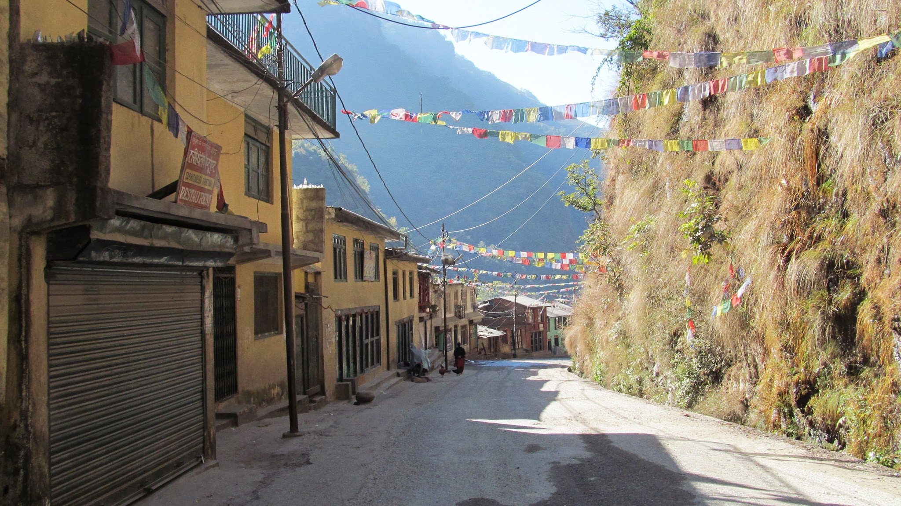

Arrivée au Népal

### Dans les vallées de L’Himalaya

Une fois la frontière Chine-Népal passée, nous disons au revoir à notre guide tibétain. Nous sommes au Népal, enfin libres de circuler par nous-mêmes. Nous quittons également les membres du groupe qui sont bien plus pressés que nous de rejoindre Katmandu, à 120km de là. Une grève des transports les oblige à prendre un véhicule privé. Pour nous, grève ou non, nous comptons marcher ou faire du stop pour rejoindre cette ville.

L’Himalaya borde toute la frontière nord du Népal alors qu’au sud, c’est la plaine ou la jungle. Nous sommes donc encore dans les montagnes ; les paysages sont magnifiques. De plus, pour la première fois depuis plusieurs mois, la température est vraiment très agréable ! Nous en profitons donc au cours de 3 jours de marche au creux de la vallée. Les terrasses de rizières se multiplient sur les versants des montagnes.

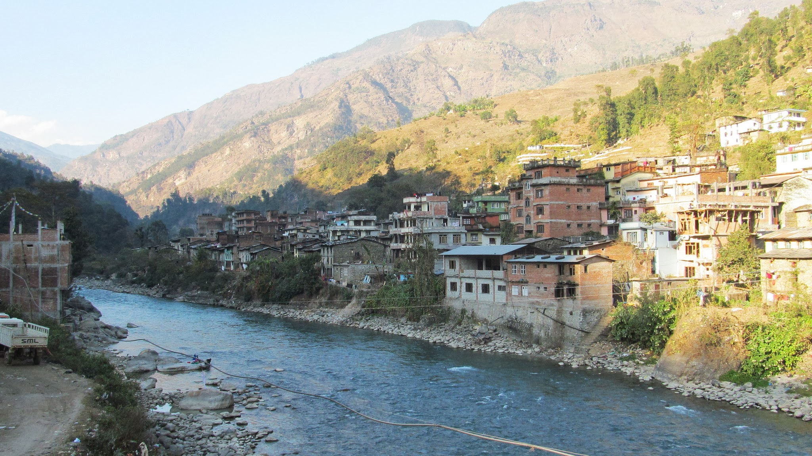

Un village dans la vallée

De plus, les prix sont très nettement moins chers qu’en Chine ; nous voilà maintenant avec notre plat de pâtes pour 50 roupies (0,50€) ou un plat de riz (servi à volonté) pour un peu moins d’un euro.

Tout le monde sur la route nous salue « Namasté » ou « Hello, how are you ? What is your name ? ». Il est vraiment agréable de pouvoir à nouveau parler avec la population locale. Le soir tombant, nous allons dans un petit village séparé de la route principale par un pont suspendu et demandons à dormir dans une grange.

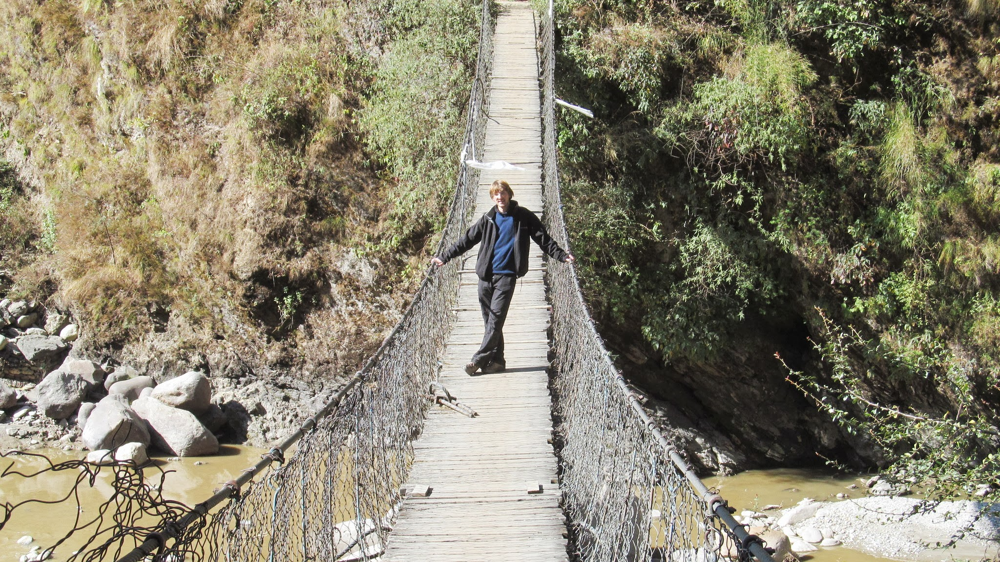

Le pont suspendu

Bien qu’au Népal beaucoup de gens parlent anglais, dans ce petit village, se faire comprendre n’est pas facile. Mais nous sommes royalement accueillis : super dîner (comme bien souvent en Asie, nos hôtes nous regardent manger et sont à notre service au cours du repas), puis un jeune du village nous offre son lit pour dormir. Nous passons donc une courte soirée avec sa famille. Le soir, tout le monde est réuni dans le salon pour regarder la télé.

### Sur les toits de Katmandu

Nous ne marcherons pas jusque la capitale Népalaise, car le stop se révèle assez facile. On nous demande souvent de l’argent, mais on nous laisse tout de même monter si on n’a pas d’argent.

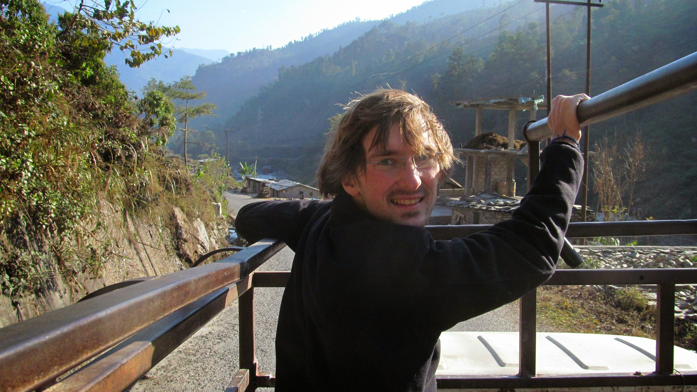

Le stop comme on l'aime à l'arrière d'un pick-up

Nous arrivons donc à Katmandu où nous nous dotons des cartes essentielles : cartes SIM et carte du pays ! Nous avons un couchsurfing de prévu, mais uniquement dans 2 jours. Nous sommes donc à la recherche d’un endroit où dormir.

Kishan, un jeune, nous aborde pour nous demander ce que nous cherchons. Quand il comprend que nous ne voulons pas dormir à l’hôtel et que nous avons une tente, il nous propose spontanément de la planter sur son toit. De fil en aiguille, il finira même par nous offrir son lit !

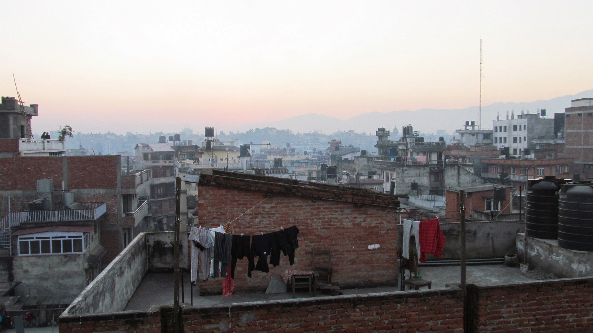

Sur les toits de Katmandu

Nous passons une excellente soirée ensemble avec ses amis à discuter. Pour nous, c’est l’occasion de mieux comprendre la situation du pays : une instabilité politique du gouvernement très corrompu et détesté par sa population ; le système d’électricité, qui ne fonctionne que quelques heures par jour en saison sèche à cause de la mauvaise gestion des ressources hydrauliques. Ce sont aussi nos premiers échanges sur le système des castes que nous allons découvrir tout au long de notre voyage au Népal et en Inde.

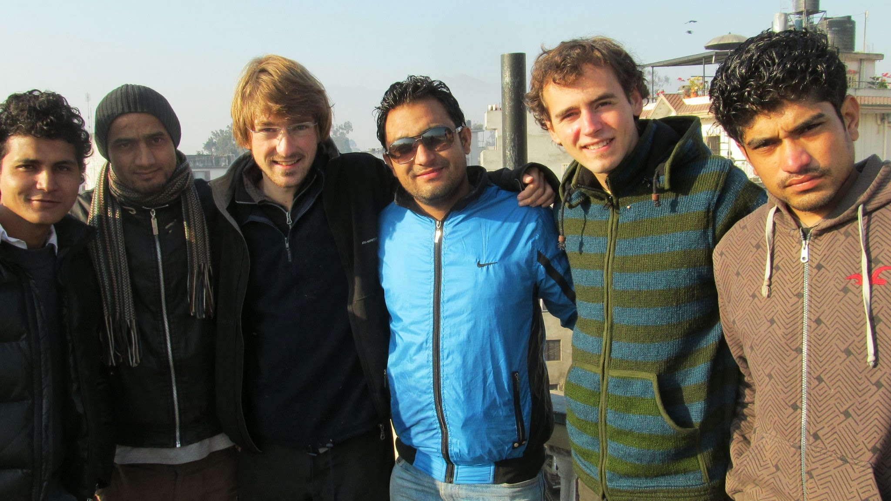

Nos hôtes de Katmandu

Deux nuits plus tard, nous retrouvons nos hôtes couchsurfing, une Française et un Népalais qui nous permettront notamment de passer notre réveillon dans une soirée d’un resto chic de Katmandu.

Comme ils habitent près du temple Pashupati, le principal temple Hindou de Katmandu, nous en profitons pour aller le visiter. Grâce à un brin de malice, nous contournons les entrées principales pour nous rendre dans le temple sans payer les 500 roupies (5€) de participation pour les touristes.

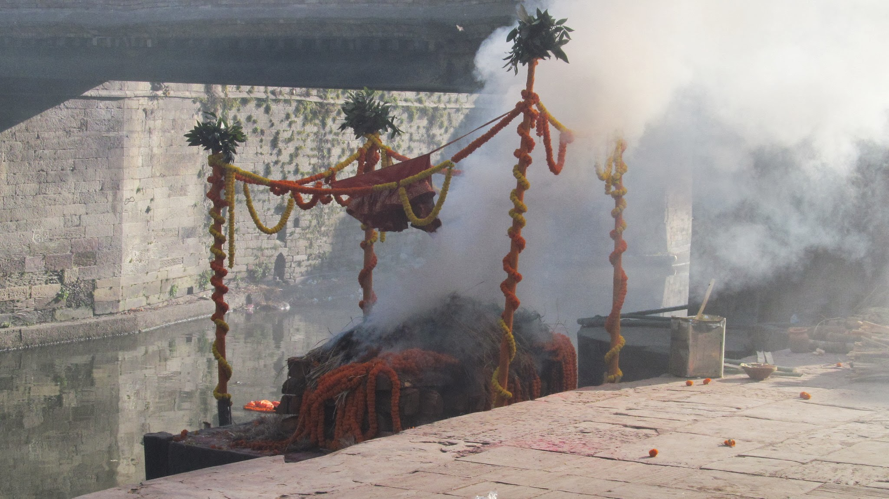

Incinération d'un corps

Une fois dans le temple, le spectacle est éprouvant. Ici, on incinère des corps sur la rivière. L’odeur est difficilement supportable. C’est incroyable de se dire que les restes des corps tombent dans la rivière. Cette même rivière qui passe ensuite dans Katmandu et dans laquelle les Népalais font leur lessive ou se lavent !

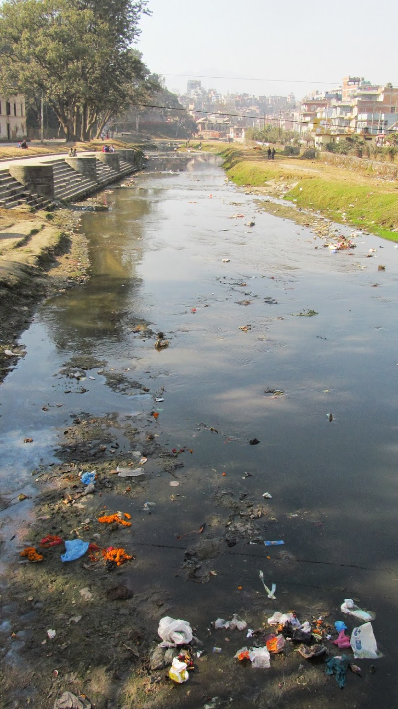

  La rivière pleine de déchets qui traverse le temple

### Chez les rhinos de la jungle népalaise

Il est difficile d’aller au Népal sans passer par Katmandu, mais l’intérêt d’y rester est assez limité. La ville est bruyante et polluée, elle n’est pas très agréable. Nous partons donc pour le sud du pays : un voyageur nous a parlé d’un safari à Sauhara à dos d’éléphant où l’on peut voir tigres et rhinocéros pour une dizaine d’euros.

Sauhara est un endroit très touristique. Les hôtels et agences de voyage remplissent les rues. Après discussion avec la personne qui nous vend notre sésame pour le parc, nous décidons de faire une marche dans la jungle avec des guides plutôt que de monter à dos d’éléphant.

Une fois dans la jungle, on nous explique chaque attitude à adopter si l’on rencontre un rhinocéros, un tigre, un léopard ou un éléphant sauvage ! Nous ne verrons rien de cela, mais seulement quelques biches, oiseaux et singes…

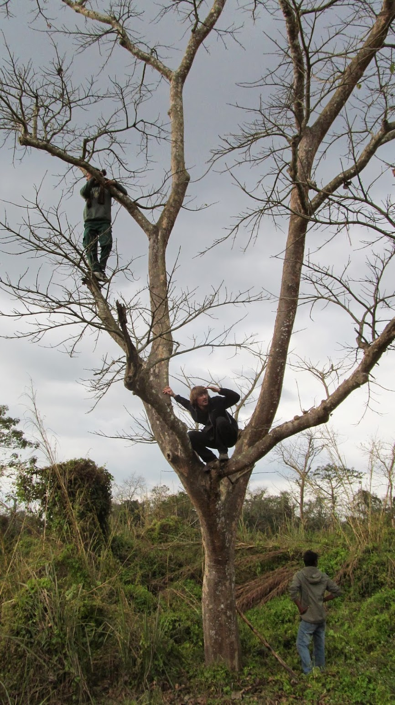

Olivier qui cherche les rhinos !

Nous décidons ensuite de nous séparer pour 10 jours : Olivier travaillera ses projets quelques jours à Pokhara alors que Nicolas vadrouillera dans les vallées environnant Katmandu.

### Dans une ferme à fromage (Nicolas)

Je pars donc en stop, vers une destination inconnue que le hasard des rencontres décidera. Le stop gratuit marche très bien au Népal : les camions sont nombreux et même si les chauffeurs réclament de l’argent, ils n’insistent jamais bien longtemps. L’intérieur des camions est étonnant : très décoré, avec des fleurs partout et souvent des statues de Dieux ou Déesses. La musique aux sonorités indiennes est bien sûr à fond ! Dommage, les chauffeurs parlent rarement anglais.

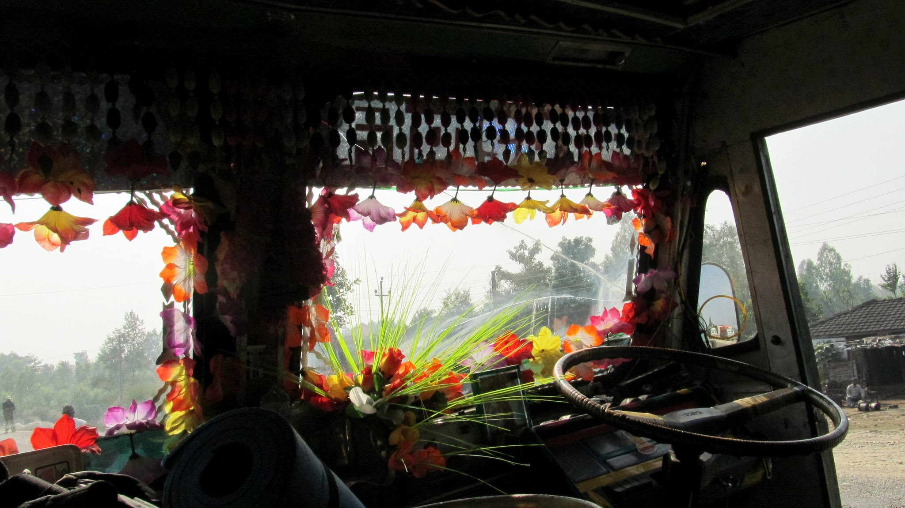

A l'intérieur d'un camion

On retrouve aussi la culture indienne avec la télévision au resto : il arrive que les cuisinières aient du mal à quitter des yeux l’écran pour s’occuper d’un client affamé ! Les films de Bollywood (studios indiens) pleins de musiques et d’histoires à l’eau de rose passionnent ! Au menu, toujours les mêmes plats : Chomeins (les nouilles frites avec des légumes, des œufs ou de la viande) ou Dalbat (le riz, servi à volonté).

Il fait bon retrouver les magnifiques paysages montagneux loin des grandes villes.

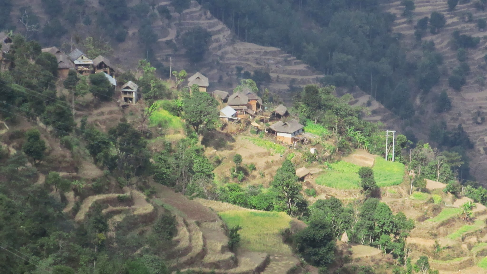

Paysage de montagne

Là, les déchets ne s’amoncellent pas comme dans les lieux urbains. Les populations sont aussi souvent très accueillantes et heureuses de m’inviter pour un thé ou un snack. Un jeune marchera même avec moi pendant plus d’une heure, heureux comme tout de bavarder avec un étranger et d’avoir un nouvel ami ! Je me demande si je suis toujours en fond d’écran sur son téléphone portable !

Je suis maintenant loin des camions et le seul moyen de me déplacer est la marche ou le bus. Ce dernier est tellement bondé qu’il faut monter sur le toit ! Que de bons souvenirs d’Afrique reviennent alors à la surface. Il faut tout de même descendre et s’entasser à l’intérieur du bus pour une centaine de mètres lorsqu’on rencontre un barrage de police !!

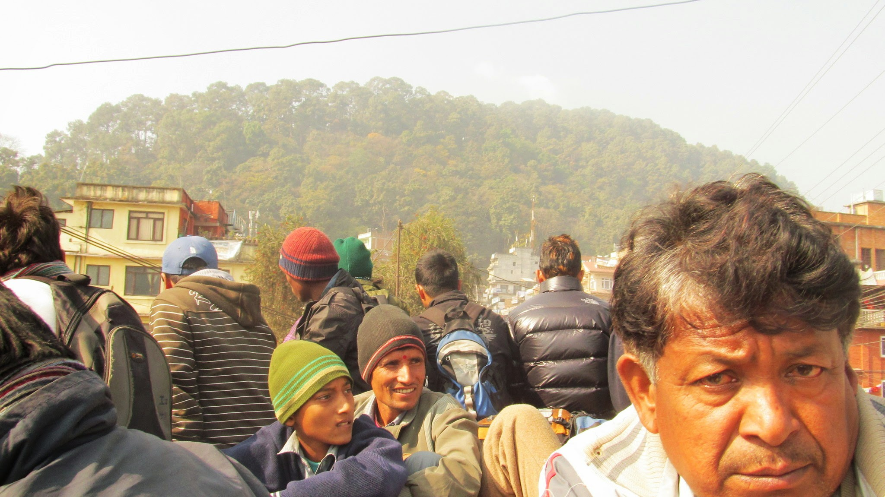

Sur le toit du bus

Après cette courte vadrouille dans la campagne népalaise, je me dirige de nouveau vers la vallée de Katmandu pour rencontrer François, un entrepreneur français installé au Népal depuis 5 ans. Il possède une ferme et produit quelques produits bien français comme du bon fromage !

Je vais tester chez lui le principe de woofing qui consiste à travailler quelques heures par jour dans une ferme en échange d’être nourri et logé.

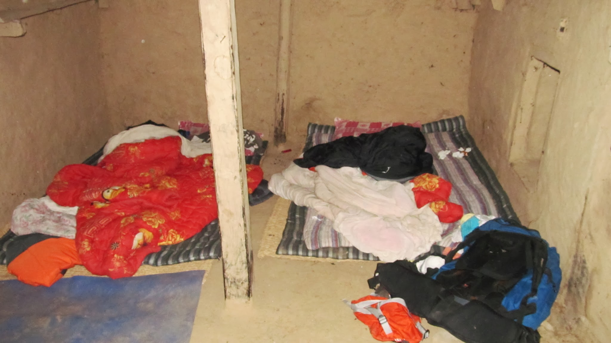

Ma chambre de woofing

Après un vrai jeu de piste pour le retrouver, je m’installe pour une semaine dans sa ferme à m’occuper des vaches, chèvres, moutons, poules, canards et cochons ! Une bonne semaine de repos avant de repartir sur les routes avec Olivier. Autant vous dire que le petit apéro le dernier jour : toasts de fromage grillés au four ne s’oubliera pas de sitôt.

### A Pokara (Olivier)

Pokara est l’endroit touristique du Népal par excellence. C’est d’ici que partent plusieurs treks et l’ambiance au bord du lac y est reposante. C’est aussi l’endroit idéal pour avoir accès au Wifi et travailler mon projet sur le système de caste. Je m’installe dans un hôtel bon marché, éclairé à la bougie, sans eau courante, je me laverai dans le lac...

Le dimanche, je décide d’aller à l’église du village (qui n’est pas dans le quartier touristique). Je me rends compte que l’office est célébré l’après-midi. Comme nous sommes le matin, je décide d’aller prendre mon petit-déjeuner dans un restaurant. Je rencontre alors Dipak, un Népalais d’environ 40 ans. Au bout de 15 minutes (top chrono) il me propose d’aller chez lui pour rencontrer sa famille. Il est marié et a deux enfants. Il construit des routes, mais en hiver, il n’y a pas de projets. Comme il a du temps libre, il me propose de m’emmener en moto pour voir la vue depuis la montagne. Nous devenons les meilleurs amis du monde, il me propose d’aller visiter tout le Népal ensemble ! Malheureusement, ce n’est pas possible pour moi, mais nous pouvons tout de même passer deux super soirées ensemble. Il me proposera aussi de dormir chez lui le dernier jour avant mon départ.

L’église de Pokhara est tenue par les Jésuites (des prêtres catholiques). Comme je me montre intéressé de rencontrer les 4 pré-noviciants (qui se préparent à rentrer au noviciat pour ensuite devenir prêtres Jésuites), le père me donnera un créneau de cours avec eux pour faire un échange d’expérience et pratiquer l’anglais ! Les Jésuites sont très accueillants, ils m’inviteront plusieurs fois à manger avec eux.

Dans le bus pour aller à l’église, je rencontre un professeur de maths Népalais. Quand je lui dis que je donnais des cours de maths l’année dernière, il sourit et me dit qu’il est très heureux de m’avoir rencontré (il en loupera son arrêt de bus) et m’invite chez lui ! Quel accueil ! Malheureusement, on ne peut pas être l’ami de tout le monde… Je dois repartir pour Katmandu où Nicolas m’attend pour récupérer nos visas indiens.

Les bus au Népal ne sont pas fiables. Pour retourner à Katmandu, il faut normalement 6h. Je pars à 14h30 et pense arriver à 20h30. Malheureusement, au bout d’une heure le bus s’arrête. Plus tard je comprends qu’un accident est survenu. C’est horrible, un petit enfant est écrasé sur la route. La famille n’a pas donné son accord pour déplacer le corps. J’arrive à Katmandu à 1h du matin, les hôtels sont fermés, je dois me lever à 7h le lendemain pour aller faire la queue à l’ambassade de l’Inde. Je décide donc de me diriger vers l’ambassade et de passer la nuit dans un petit squat. Sur la route, un vélo-taxi me propose de l’aide. Comme je lui dis que je n’ai pas d’argent, il me dit que ce n’est pas grave, lui non plus. Mais il peut m’aider. J’accepte qu’il m’aide à condition que ce soit moi qui pédale. Arrivés près de l’ambassade, il me propose de passer la nuit à se balader sur son vélo. Comme je suis fatigué, je préfère me trouver un endroit tranquille pour dormir.

### Avec un accueil fabuleux chez Sayliza

Le lendemain, nous nous retrouvons à l’ambassade comme prévu et après avoir récupéré nos visas indiens, nous partons pour l’Est du Népal où Sayliza, notre couchsurfeuse nous attend !

C’est la première fois que Sayliza héberge des couchsurfers. Nous sommes accueillis comme des princes. Petits gâteaux, thé, dalbat (le plat local à base de riz), nous ne manquons de rien.

Nous passons aussi une journée formidable à aller visiter la région !

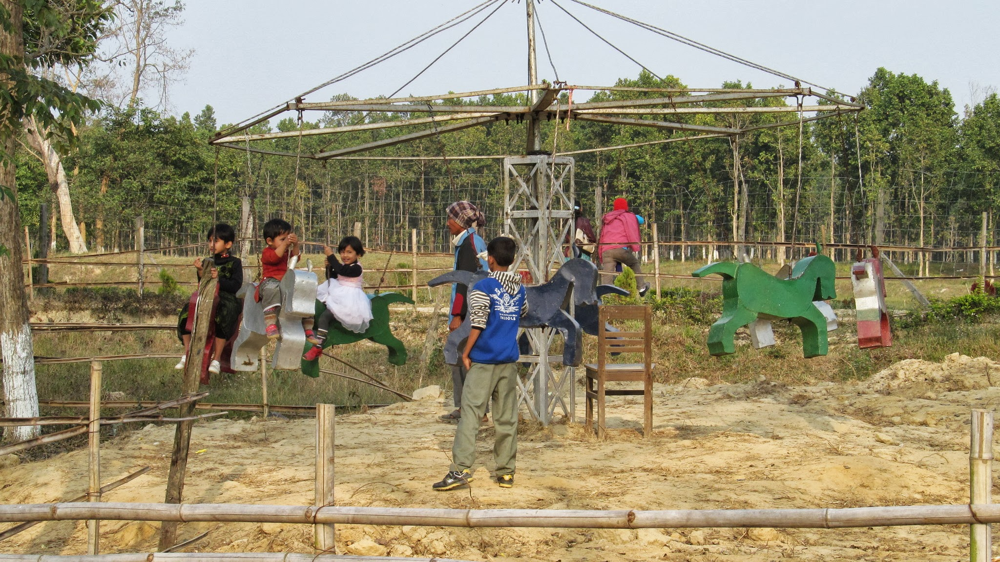

Manège à enfant dans un parc

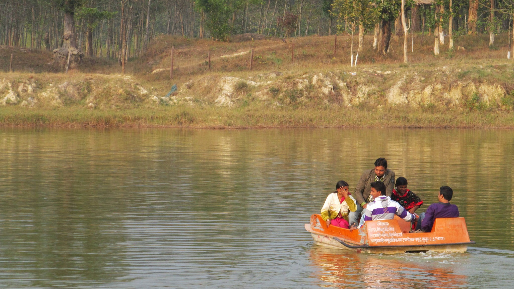

Pédalo au bord d'un lac

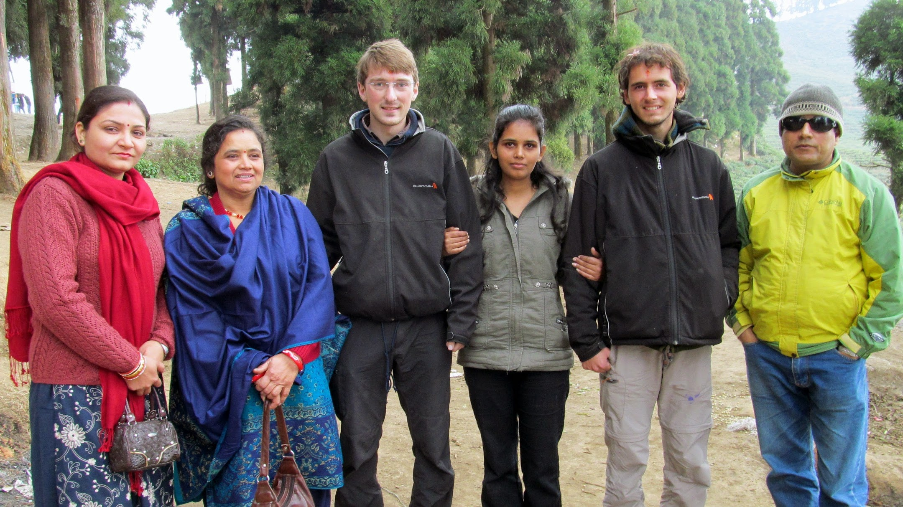

Sayliza, sa famille et nous

Sayliza nous explique que sa vie est basée sur la méditation quotidienne. Le but est d’atteindre le Nirvana, c’est-à-dire le niveau de méditation le plus élevé, atteint par Buddha (mais aussi par d’autres hommes tels que Jésus par exemple !). Et ainsi, on peut se libérer des cycles de réincarnation.
La réincarnation, une croyance très présente en Asie. La maman de Sayliza nous explique que, lors de la méditation, il est possible d’avoir l’expérience de ce qu’on était dans les vies antérieures. Un homme, un cheval, un végétal, etc.
Tout cela est à la fois très facile et très difficile. Cela demande beaucoup de temps, beaucoup de travail et d’avoir un guru (guide spirituel) parfait qui ait déjà vécu le niveau de méditation le plus élevé.
C’est une bonne introduction à ce qui nous attend à partir du 17 janvier : 10 jours de méditation Vipassana, une méditation basée sur la concentration de l’esprit sur sa propre respiration.

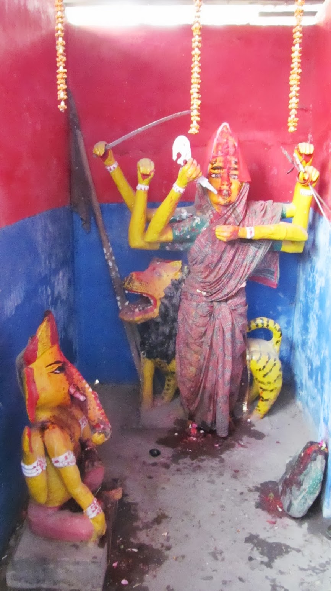

Temple hindou

Pendant ces 10 jours, nous n’aurons aucun contact avec l’extérieur, nous ne pourrons pas nous parler, nous n’aurons qu’un repas par jour, mais nous aurons de la nourriture spirituelle à volonté.
