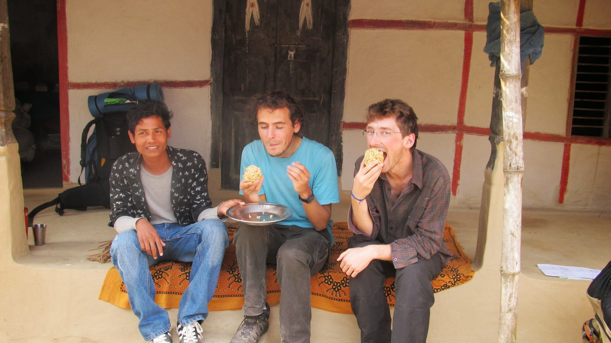
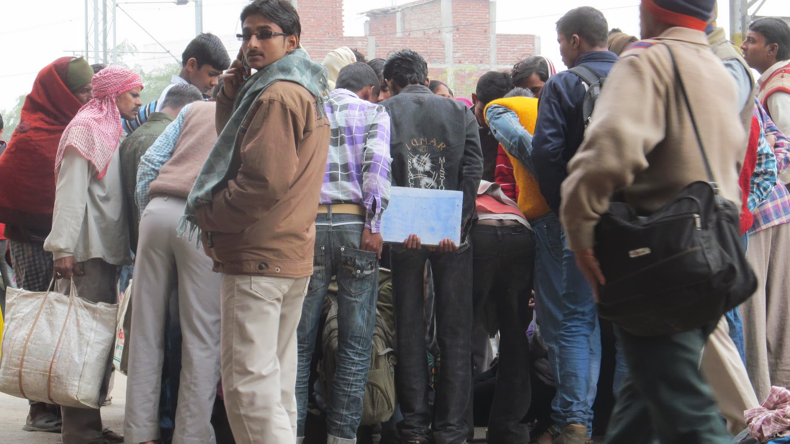

Après notre sortie prématurée du cours de méditation, notre envie de découvrir le monde est encore plus forte que jamais. Ainsi, nous voilà partis pour 2 semaines rurales rythmées de rencontres toutes plus marquantes les unes que les autres. On peut le dire, l’accueil des Népalais et des Indiens est exceptionnel !

Le parcours de nos 10 premiers jours en Inde

### Au cœur d’un village népalais

Nous prenons, à pied, la route de la frontière indienne qui se trouve à une vingtaine de kilomètres. Non pas par soucis d’économies (faire 20km en bus coûte au maximum 0,20€), mais pour se perdre un peu dans les campagnes du Népal que nous nous apprêtons à quitter.
Le temps passe et nous apprécions les magnifiques paysages. Ces derniers nous font déjà penser à l’Inde qui n’est d’ailleurs qu’à quelques kilomètres. Les rizières, bien irriguées, s’étalent à perte de vue ; les vaches les plus chanceuses se baladent dans les rizières alors que d’autres sont attachées à un poteau au bord du chemin ; des cocotiers, bananiers et autres palmiers s’élèvent à droite à gauche.
Même en zone rurale, la population reste assez dense : il y a du monde sur le petit chemin que nous suivons et les villages s’enchaînent très régulièrement. Alors que nous nous arrêtons à côté d’une pompe à eau pour boire un peu, un jeune nous accoste. Comme beaucoup, il ne comprend pas ce que nous faisons ici. Il parle légèrement anglais mais malgré tout, nos explications ne lui suffisent pas ! Qu’est-ce que peuvent bien faire deux étrangers ici ??? Il ne cesse de vouloir nous rediriger mais nous, on veut aller tout droit ! Finalement, il comprend qu’on n’est ni pressé, ni en recherche d’une grande route et il nous invite à déjeuner. On s’empresse d’accepter !

Notre ami qui nous offre des gâteaux locaux

Après ce bon déjeuner, il nous emmène visiter son village : nous nous rendons chez ses amis, il nous montre la rivière, le magasin du village, nous allons au marché à quelques kilomètres d’ici… bref, l’après-midi est chargée. Tous les villageois sont très curieux de nous rencontrer. La nuit finit par tomber et nous acceptons donc de dormir chez lui.

Femme qui vend au marché

Le marché local

Dans une maison, toutes les générations se côtoient. Même les oncles et tantes ne sont pas loin. Il semble avoir beaucoup de frères et sœurs et d’oncles et tantes mais en fait, « brother » signifie à la fois frère et cousin… et cousin germain ! De même, « uncle » désigne tous ceux de la génération d’au-dessus.
Cette partie du village que nous visitons est, en fait, l’habitat d’une caste. Pour parler de quelqu’un de sa caste, notre ami emploie le terme « relative » (en anglais). En fait, tout le monde a plus ou moins un lien de parenté avec les autres. Ici, on naît dans une caste, on se marie avec quelqu’un de sa caste et on vit toute sa vie dans la maison de ses parents !

La famille !

Comme pour toutes les rencontres que nous faisons dans la région, le départ est difficile ! On ne nous laisse pas partir facilement, et le lendemain, notre jeune hôte et ses amis nous suivront sur plusieurs kilomètres avant de nous dire au revoir… de vrais papa-poules !

### Faux départ pour l’Inde

Nous rejoignons finalement la frontière népalo-indienne dans la journée avec un de ces fameux petits rickshaws : un vélo avec une petite caravane pour les passagers. Une fois à la frontière, nous sommes prêts à changer nos dernières roupies népalaises mais nous apprenons que le passage est ici réservé aux locaux ! Ils peuvent franchir la frontière librement comme c’est le cas pour nous dans l’espace Schengen mais nous, nous ne pouvons pas passer ! Il nous faut reprendre les routes népalaises pour rejoindre un poste frontière avec bureau d’immigration. Nous arrivons le soir à une autre ville frontière.
Nous rencontrons quelqu’un qui nous dit tenir un hôtel. Nous ne comptons pas dépenser d’argent pour une chambre d’hôtel mais cela ne semble pas le gêner. Avec notre expérience, nous n’y croyons pas trop, on se doute bien qu’il n’a pas bien compris les signes qu’on lui a fait ni les « No roupies, no money » que nous lui répétons. Non, finalement, il a bien compris et cherche à nous aider.
Nous nous retrouvons donc finalement dans une chambre avec des lits, un ventilateur contre les moustiques et une salle de bain ! Waouh ! Il nous apportera même un dîner dans la chambre, quelle générosité !
Mais sa générosité dévie lorsqu’il revient vers nous avec une prostituée. En voir sur le bord de la route en France est une chose ; voir une jeune fille, loin d’être majeure entrer dans notre chambre en est une autre. Abasourdis nous nous empressons de les mettre dehors et fermons la porte. Ce qui vient de se passer semble irréel, on prend conscience que ce genre de choses existe bel et bien, on pense à cette pauvre jeune fille qui a probablement été vendue par ses parents. Nous avions rencontré un photographe à Katmandu qui réalisait un reportage sur les réseaux de prostitutions : les filles des campagnes népalaises, vendues par leurs propres parents (tentés par une grosse somme), viennent alimenter le réseau de prostitution en Inde.
Bref, le lendemain, en partant, notre bonhomme n’est pas là et on nous montre la facture ! On le retrouve finalement ; il s’explique avec la propriétaire ; elle le fusille du regard et se tourne vers nous en nous demandant de payer la prochaine fois qu’on vient. C’est promis, on paiera double la prochaine fois !

### Nos premiers pas en Inde

  Pont entre le Népal et l’Inde, en route vers l’inconnu !

Ca y est, nous sommes le 22 janvier et nous entrons au pays de l’hindouisme (et des klaxons). Nous comptons y rester jusqu’à début mars. Nous nous empressons de tirer la monnaie locale : la roupie only. 1 € = 65 roupies only. Une nuit de voyage dans le bus coûte 175 roupies only, 12 bananes coûtent 10 roupies only, le fameux Dal Bat (plat de riz avec une sauce et des légumes) coûte entre 15 et 20 roupies only (on peut aussi dire « only 15 roupies »).
Etant à deux pas de Darjeeling, nous décidons d’y faire un tour. Il paraît que les paysages montagneux y sont magnifiques. Les Indiens s’y rendent pour faire un pique-nique le weekend. Les plantations de thé y sont très nombreuses. Sur la route, nous constatons que certains Indiens sont assez malins pour récolter des sous : ils stoppent les voitures avec un ruban en guise de barrière et vendent des billets de tombola. D’autres sont encore plus malin : ils attachent une pierre au bout d’une corde qu’ils font tourner très vite et se mettent au milieu de la route ! Ils ne libèrent le passage que lorsque le chauffeur donne 1 ou 2 roupies only.
A Darjeeling, il fait froid et brumeux… c’est loupé pour les beaux paysages. Nous dégustons tout de même de superbes petits gâteaux avant de repartir le lendemain matin. Nous ne comptons pas rester sur les grands axes touristiques plus longtemps. Nous prenons la direction de Patna, capitale du Bihar (une des provinces les plus pauvres d’Inde). Nous nous souviendrons du car de nuit pour nous y rendre ! Au petit matin, nous quittons le car au niveau d’un petit village de la banlieue de Patna.

### Les stars du Bihar

Vous avez l’âme d’une star mais ne savez ni chanter, ni danser, vous n’avez aucun talent d’acteur ? Ce n’est pas grave, venez en Inde !
Eloignez-vous des grandes villes et des endroits touristiques (venez au Bihar par exemple) et c’est parti pour votre tournée !
Vous arrivez à peine, vous êtes maintenant sans cesse entourés d’un cercle de fans. Ils se déplacent avec vous, ils vous observent avec des yeux écarquillés.

Olivier, attendant le train

Nicolas, marchant sur la route

Il n’est plus possible de faire 10 mètres sans vous faire interpeler par de nouvelles personnes. Certains de vos fans parleront anglais, ils vous inviteront à prendre un thé, prendre un repas ou visiter la famille. A chaque nouvelle rencontre, vous devrez expliquer pourquoi vous êtes venus dans CE village particulièrement. C’est un immense honneur pour vos fans !
Comme toute star qui se respecte, vous n’échapperez pas aux multiples séances photos avec vos fans. Dans toutes les positions avec toutes les combinaisons possibles de personnes sur la photo…

  Nicolas et les villageois de Natthachak, dans le Bihar

Vous serez aussi interviewés (trois fois) par la presse locale et vous paraîtrez dans les journaux !

Photo à paraître dans la presse locale 

Attention ! Avant de signer un premier autographe, regardez combien de personnes vous entourent ! Vous devrez en signer un pour chacun.
La célébrité, c’est difficile, vous n’aurez plus un moment d’intimité. Même réfugiés dans un hôtel, on viendra frapper à votre porte toutes les 5 minutes pour vous proposer un thé, vous parler, ou simplement… vous regarder !
Si vous êtes invités, vous vivrez sûrement le moment fatidique du « you are my guest now! ». Après cette phrase d’une apparente simplicité, vous ne pourrez plus échapper à l’abondante générosité de vos hôtes. Ils vous demanderont fréquemment « Are you comfortable? ». Des porteurs de chaises s’assureront que vous êtes toujours bien assis, on vous apportera régulièrement du thé et des petits gâteaux, on ne vous laissera plus aller seul aux toilettes (vous pourriez vous perdre) !

Olivier et Nicolas, lors d’un bain de foule…

Bref, les Indiens sont bien curieux de nous voir et ils nous réservent un accueil fabuleux. En Inde, le temps de sa venue, l’invité est considéré comme un dieu !

### Immersion totale dans les villages du Bihar et du Jarkhand

Nous voulons mieux comprendre la culture indienne et nous savons que plus de 70% de la population est rurale. Nous décidons donc de nous rendre à la campagne pour comprendre la vie de la majorité des indiens : les villageois ! Loin de l’image de la superpuissance indienne développée et internationale, nous nous rendons dans les régions les plus pauvres, les moins touristiques, les plus dangereuses (dit-on…) mais aussi les plus authentiques !
Difficile de raconter toutes nos expériences, en 9 jours, nous sommes invités 8 fois à dormir dans 7 villages différents, et autant d’expériences humaines fabuleuses.
Nous avons aussi pu assister à plusieurs fêtes :
Nous avons eu la chance de vivre la fête nationale du jour de la République (le 26 janvier) dans un village. Nous munissons nos sacs de drapeaux indiens. Dans la rue décorée, les enfants paradent et les voitures klaxonnent en continu (euh, mais ça, en fait, c’est tous les jours…).

Enfants qui paradent dans la rue

Encore plus festive que le jour de la République, du 27 au 29 janvier, c’est la fête du dieu des études pour les hindous. Dans chaque village, on bâtit un temple et on achète une statue en terre représentant le dieu des études.

Temple du dieu des études, érigé pour l’occasion

Le premier jour, certains étudiants vont jeûner, le second jour, tout le monde mange une nourriture particulière offerte par le dieu et on défile avec la statue. Le troisième jour, on lance la statue du dieu dans l’eau pour qu’elle se dissolve.

Parade avec la statue du dieu des études

Autre célébration religieuse mais moins joyeuse : nous avons assisté à une partie du rituel suivant un décès. Nous avons rencontré Ravi, un jeune homme qui venait de perdre sa grand-mère. Le deuil dure 10 jours, il est rythmé par plusieurs étapes. La croyance veut que lors d’un décès, les proches du défunt (sa caste) perdent leur pureté rituelle.
Le premier jour, le corps est inhumé. Pendant les 10 jours suivants, les personnes de la caste du défunt ne vont pas se laver au savon, mais le 3e et le 6e jour, ils vont prendre un bain rituel dans la rivière. A deux reprises, les femmes de la caste pleurent la défunte, c’est impressionnant à voir. La famille du défunt ne cuisine pas de viande ni de nourriture frite pendant cette période, mais elle invite toute sa caste à dîner si elle en a les moyens.

  Nicolas qui aide à cuisiner de la nourriture non frite

Deux jours après notre rencontre avec Ravi, il se rend à Bénares, la principale ville sainte de l’hindouisme, pour disperser les cendres de sa grand-mère.

### Rencontre des tribus arriérées de la forêt indienne

Quand nous arrivons dans la région du Jarkhand et que nous disons que nous voulons aller à pied à Chandwa à 60 km d’ici, les indiens s’inquiètent pour nous : c’est loin et c’est dangereux d’y aller à pied, on nous conseille de prendre le bus. Cela nous intrigue, pourquoi est-ce dangereux ? Plusieurs fois durant notre périple, nous nous sommes rendu compte que les locaux avaient peur des gens du village d’à côté à cause d’une mauvaise histoire ou de réputation. Mais cette fois, cela semble différent. On nous explique : « pour aller à Chandwa, vous devrez traverser la forêt et dans cette forêt vivent des tribus non-éduquées, c’est dangereux ! ». Une tribu dans la forêt, on s’imaginerait presque des gens nus avec une lance et un bouclier, c’est intriguant ! Bref, on a envie d’en savoir un peu plus… mais on ne veut pas prendre de risques.
A Balumath, nous avons alors la chance de rencontrer Madhav, un directeur d’école. Cette personne est passionnée de travail social et a pour ambition d’apporter l’éducation aux enfants des tribus les plus arriérées. Il nous explique son travail de longue haleine pour convaincre les tribus de la forêt d’envoyer leurs enfants à l’école.

  Etudiants de l’école de Madhav. Ici, la discipline est de rigueur

Un enfant à l’école, c’est un enfant qui coûte de l’argent (5kg de riz et 2kg de pomme de terre par mois s'il va à l’internat) et qui ne travaille pas aux champs. Il faut donc convaincre les populations de la rentabilité à long terme de l’éducation.
Madhav nous propose de nous emmener à moto pour aller visiter l’un des villages dans la jungle. Nous partons avec un enseignant qui est né dans cette région et qui parle couramment la langue des tribus de cette forêt.

  Nicolas et Madhav, sur la moto en route pour la forêt

Au bout de 3 ou 4 km de route, nous bifurquons pour nous enfoncer dans la forêt. Après quelques minutes, nous apercevons les premiers villages. Nous apercevons au loin un petit enfant nu accompagné de son frère. Quand ils nous voient, ils s’enfuient à toutes jambes.

  Enfant qui s’enfuit avec son petit frère dans les bras

Nous avançons encore et d’autres enfants semblent apeurés à notre vue, ils fuient en laissant leur troupeau ou leur champ. Nous ne comprenons pas pourquoi ils ont si peur. Le chef de ce village nous dit de passer notre route, il n’a pas l’air content.
Ce n’est qu’après coup que nous comprendrons, grâce aux explications de nos amis : 15 ans auparavant, un monsieur (blanc) était venu pour proposer l’éducation aux enfants du village. Une dizaine d’enfants l’avaient suivi, mais ils ne sont jamais revenus. Cet évènement terrible a marqué les mémoires et ces villageois semblent avoir très peur que nous venions enlever leurs enfants ou faire du repérage.
Nous arrivons ensuite au second village. Nos deux amis sont déjà venus deux fois pour le visiter. Au bord de la rivière, une vieille dame fait la vaisselle. Nous la saluons. Elle demande alors pourquoi on lui parle, de toute façon, elle vient d’une basse caste de la forêt, elle ne parle pas le même langage.

Villageois du 2e village

Nous sommes ensuite accueillis pour boire du vin local (beurk !) et manger des petits fruits ramassés par les enfants. Dans ce village, aucun enfant ne va à l’école. Mais aujourd’hui est un grand jour, les parents disent qu’ils sont prêts à y envoyer l’un de leur fils ! L’école est à 10km. Il devra parcourir la distance deux fois par jour ou bien rester à l’internat de l’école.

Internat de l’école de Madhav

Le premier des enfants qui avait osé nous rejoindre était sa sœur. Elle nous expliquait être très triste d’être née fille, car elle aimerait beaucoup aller à l’école. Mais dans ce village, il est impensable qu’une fille aille s’éduquer à la ville. Etre une fille en Inde, ce n’est pas toujours facile. Ce n’est pas non plus facile pour les parents qui veulent à tout prix des fils. En effet, avoir une fille c’est coûteux : elle n’apporte pas d’argent à la maison mais en plus, lors de son mariage, la famille de la mariée doit donner une importante somme d’argent à la famille du mari. Les filles ne sont donc pas du tout souhaitées dans les campagnes.
Après cette aventure dans la forêt, nous dormons à l’école. Et le lendemain, Madhav nous emmène faire le tour de ses amis (et sponsors de l’école).

  Photo souvenir avec le responsable de la sécurité (et donateur) de l’école

Nous enchaînons 4 thés, nous sommes un peu fatigués de toujours nous présenter et de dire un peu toujours la même chose. En Inde, nous sommes sollicités en permanence. Nous disons au revoir à Madhav qui nous aurait bien encore accueillis un ou deux jours de plus. Nous nous réfugions à Chandwa, à 20km de là, où nous voyageons incognito… Enfin, c’est ce que nous croyons…

import Navigation from "../../Navigation";

<Navigation
  previous="/2012-01-29"
  next="/2012-02-16"
  gallery="/galerie/inde1"
/>
