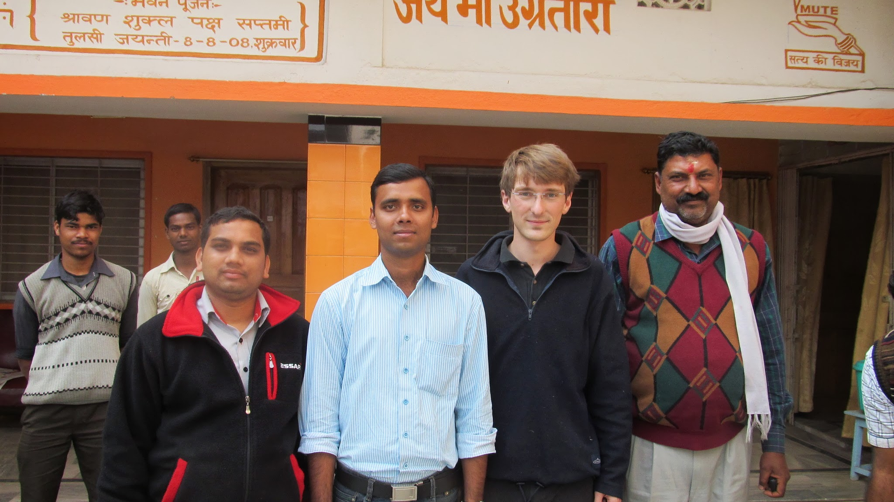
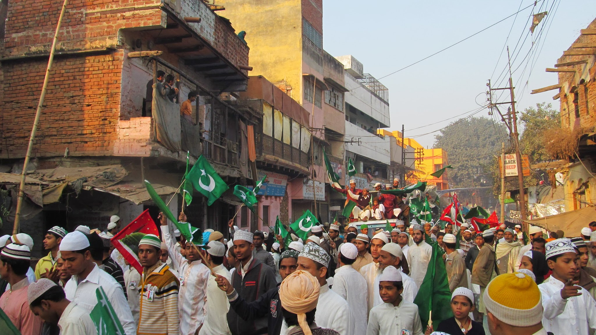

Nos 15 premiers jours en Inde ont été éprouvants ! Les accueils que nous avons vécus ont été merveilleux. Hélas, ils nous font aussi perdre notre indépendance et ne nous laissent aucun temps de repos. Nous décidons donc de prendre quelques jours de repos à Chandwa, dans un hôtel et non chez un hôte.
Mais voilà, même dans un hôtel, le propriétaire est tellement curieux de nous voir ; tellement touché par notre démarche de voyage que nous devenons facilement des invités et non des clients ! Nous nous laissons donc une fois de plus inviter par « uncle », le propriétaire de la Guest House.

  Olivier avec des employés de la centrale et « uncle » à droite, un homme
  vraiment adorable

Celle-ci est occupée par des employés des 2 centrales électriques qui sont en cours de construction dans le secteur. Tous sont curieux de nous rencontrer et veulent bavarder avec nous mais notre manque de courage et notre volonté de quitter quelques jours ce schéma nous pousse à nous cloîtrer dans notre chambre. Ne rêvons tout de même pas trop, même enfermés dans notre chambre, on vient y « toquer » toutes les 5 minutes pour nous demander si tout va bien et échanger au moins quelques mots !
Le calme retrouvé, nous prenons davantage plaisir à rencontrer les travailleurs des centrales, un par un. Beaucoup sont ingénieurs et parlent donc très bien anglais. L’un d’eux nous propose d’aller le lendemain visiter la centrale dans laquelle il travaille. Curieux et pas élèves ingénieurs pour rien, nous partons le lendemain matin à la centrale avec les employés. Autour de la centrale, une vraie petite ville s’est construite. Notre premier arrêt sera au temple.

  Visite d’une des deux centrales électriques de Chandwa

Au temple, à deux pas des camions et pelleteuses

Puis nous traversons l’impressionnant chantier avec quelques explications. Cependant, pour entrer dans les bâtiments, il nous faut un laissez-passer. Les problèmes commencent ici. Les responsables et la sécurité ont du mal à comprendre ce que deux touristes viennent faire ici. Nous n’obtenons pas nos laisser-passer et avons quand même de la chance de quitter le chantier facilement. Nous étions sérieusement embêtés de créer des problèmes à notre ami. Nous rentrons donc plus tôt que prévu à l’hôtel.
Il faut aussi savoir qu’en ce moment, on ne plaisante pas avec la sécurité de la centrale. En effet, un groupe terroriste local, une branche maoïste, est actif dans la région et il y a déjà eu des problèmes de sécurité dans le passé. Le jour de notre arrivée à Chandwa, nous avons d’ailleurs appris qu’une fusillade avait fait trois morts dans la ville que nous venions de quitter. Rassurez-vous quand même : nous faisons vraiment toujours attention. Le danger pourrait survenir une fois la nuit tombée et nous ne sortons jamais le soir. De plus, nous sommes toujours bien accompagnés.
Nous continuons donc de nous reposer à l’hôtel avant de partir le lendemain pour Bénarès (aussi appelée Varanasi).

Deux brahmanes face au Gange

Bénarès est le plus haut lieu de l’hindouisme. On pourrait la rapprocher de la Mecque pour les musulmans ou du Vatican pour les catholiques. Il s’agit d’une porte grande ouverte sur le moksha (la fin du cycle des réincarnations) : mourir à Bénarès, c’est la garantie d’en finir avec ce cycle. La mort est donc omniprésente au bord du Gange où des milliers d’incinérations ont lieu chaque jour. Il y a aussi de nombreux hindous qui viennent se purifier en suivant un rite bien précis d’immersion dans les eaux du fleuve sacré.

Ablutions dans les eaux du Gange au petit matin

Les balades au bord du Gange nous plongent dans l’univers de l’hindouisme. La ville est aussi très active et nous passons la majorité de notre temps à nous promener le long des étroites rues bondées et bruyantes.

Rencontre avec un habitant de Bénarès

C’est aussi à Bénarès que nous avons eu l’occasion d’assister à la célébration de l’anniversaire de Mohamed. Dans les rues de Bénarès, des dizaines de milliers de musulmans défilent avec de beaux habits, des drapeaux islamiques et des slogans religieux. C’est l’occasion de se rappeler que l’Inde n’est pas seulement un pays hindou. Après la séparation avec le Pakistan, la minorité musulmane en Inde n’a cessé de croître pour atteindre près de 20% aujourd’hui. Et les musulmans en sont très fiers ! Dans les discussions, on sent parfois un peu d’animosité entre musulmans et hindous (d’un côté autant que de l’autre). La résolution de ces animosités est un défi majeur de l’Inde moderne.

  Passage des musulmans dans les rues de Bénarès – ils fêtent l’anniversaire de
  Mohamed

Bénarès étant une ville très touristique, l’interpellation curieuse des passants est remplacée par celle des rickshaws (taxis), des vendeurs de fausse soie ou de cartes postales auxquelles s’ajoute une mendicité importante et insistante.
Alors que dans les villages, on nous demandait rarement de l’argent et toujours avec un sourire ; ici, les petites filles font des grimaces de pitié en tendant la main, les mamans poussent leurs petits enfants à aller mendier, les jeunes enfants connaissent toutes les répliques (en anglais) par cœur pour nous vendre des bougies ou des cartes postales. Ce n’est même pas possible d’entamer une discussion avec l’un de ces mendiants : s’il voit qu’il n’aura pas d’argent, il passe au touriste suivant. C’est marqué « money » sur notre front, on n’aime pas du tout ça. Pour autant, on ne blâme pas ces petits enfants qui mendient, c’est une situation bien compliquée.
Nous nous retrouvons dans un hôtel très francophone où nous faisons de belles rencontres dont celle d’Axel et Aurélie qui débutent leur tour du monde. Retrouvez leur <a target="_blanck" href="http://ungrandtour.blogspot.com">blog de voyage</a> avec pleins de bons plans ! Leur fraîcheur de début de voyage nous renvoie aussi à nos débuts en Afrique.

  Axel et Aurélie entourent le Guru qui tient l’hôtel dans lequel nous sommes
  allés diner ensemble

Nous reprenons le train vers Allahabad, sur la route de Delhi. Dans le train, nous rencontrons des amis qui nous invitent gentiment à dormir chez eux et à visiter un peu la ville. Ils nous parlent de leur vie étudiante et de cricket. Comme, en Inde, on nous demande tout le temps quel est notre joueur de criquet favori, nous en avons appris un (Ricky Ponting) et les indiens sont très contents de voir que l’on s’intéresse un peu à leur sport national.

  Olivier face à un monument visité avec nos amis d’Allahabad

Nous prenons ensuite la route de Delhi pour retrouver Claire-Marie et Tristan qui viennent passer 15 jours avec nous à partir de vendredi 10 février !

  Olivier se réveille après une nuit dans le train pour Delhi

