### du Rajasthan, de l'Uttar Pradesh et de Delhi (par Claire-Marie)

Le Vendredi 10 février, nous nous dirigeons vers l’aéroport de Delhi pour accueillir Claire-Marie et Tristan (Clara et Timi selon leurs nouveaux noms indiens). Nous sommes heureux de les accueillir. Nous savons aussi qu’ils vont nous apporter un regard plein de fraîcheur dans notre voyage ! Voici donc un Tableau de l’Inde sous le regard de Claire-Marie :

Dans les villes, des cochons noirs ou blancs grignotant les déchets, des vaches l’air songeuses assises n'importe où, des singes sautant de maison en maison en quête de nouveaux objets, des écureuils gris se faufilant entre les murs, des chameaux transportant d'énormes paquets dans des carrioles de bois, des éléphants décorés au milieu de la circulation routière, des chevaux aux sabots roses tirant des touristes, pas de moustiques car ce n'est pas la saison, des mouches volant au-dessus de tout ce qui dépasse un seuil de saleté.

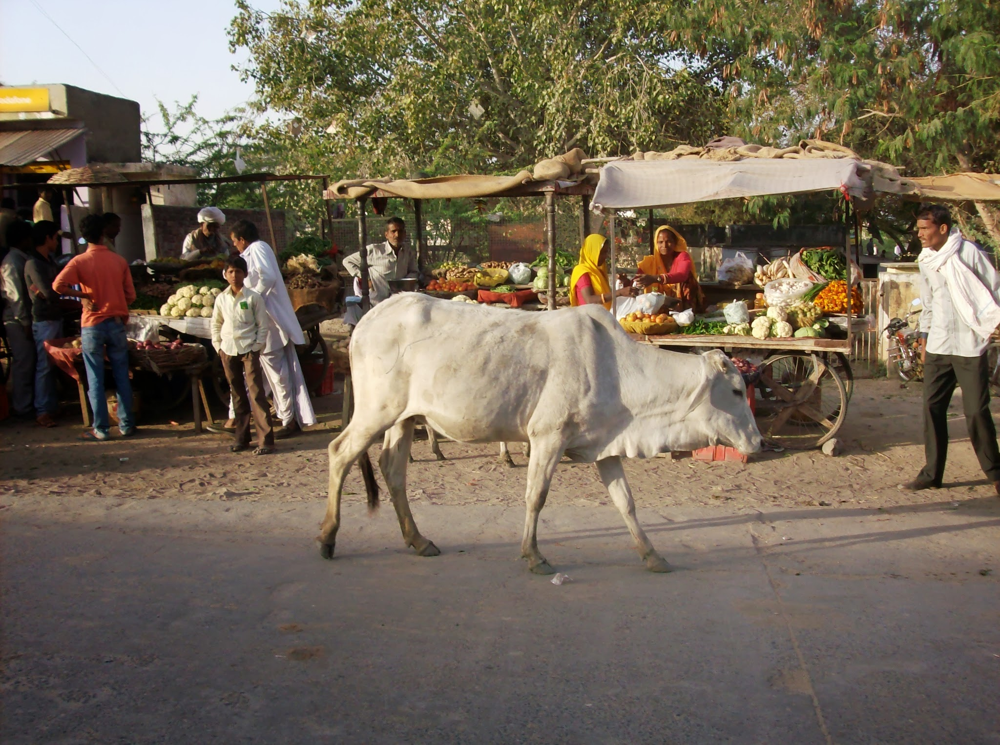

Une vache gambade tranquillement en ville

A la campagne, une femme qui tape sur son linge avec une latte de bois, un agriculteur qui coupe à la faucille son champ, des femmes assises qui récoltent les pommes de terre, des femmes qui portent sur leur tête de gros paquets de plantes probablement pour les vendre à la ville, un sourire échangé, une salutation de loin, ici l'activité suit son court.

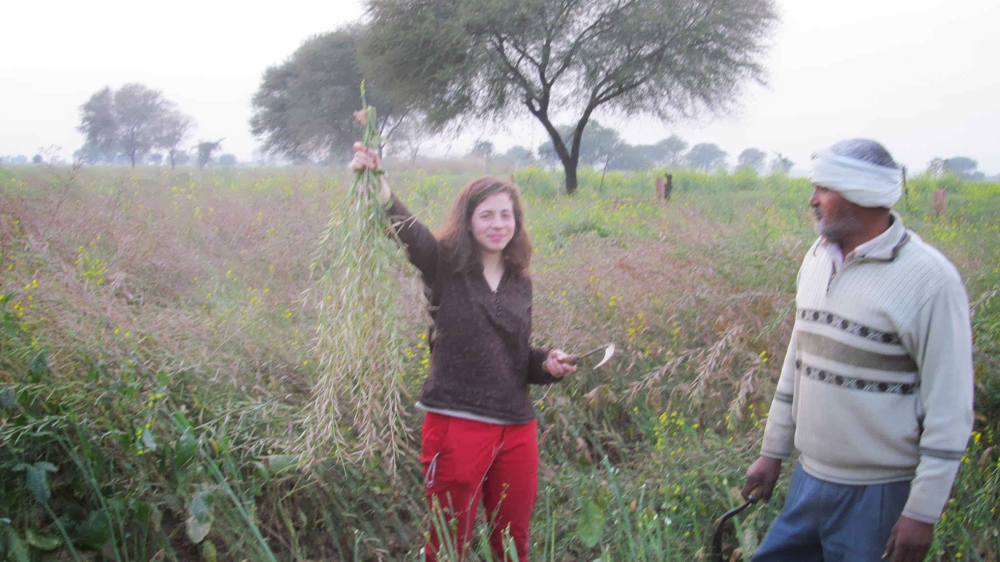

  Un villageois apprend à Claire-Marie à se servir d'une faucille

Dans une petite ville, les maisons ont chacune une jolie couleur grisée par la pollution, le vendeur de ficelles discute avec son voisin vendeur de tissus, et celui de bonbons gâteaux, ou de médicaments. Les jeunes filles (à partir de la puberté) restent dans la maison (elles sortent pour aller à l'école), les jeunes hommes cherchent du travail. Les familles vivent ensemble. Un jour, à Jaipur, un vendeur nous a invités chez lui pour me montrer comment se mettait un sari. Il nous a ensuite fait visiter sa maison où vivent 30 personnes. Il avait l'air fier. Des cousins jouent ensembles dans la cours du milieu au cricket, une vieille femme en sari rouge achète des épices, la procession d'un mariage passe dans la rue puis disparait, les motos klaxonnent dans les rues étroites.

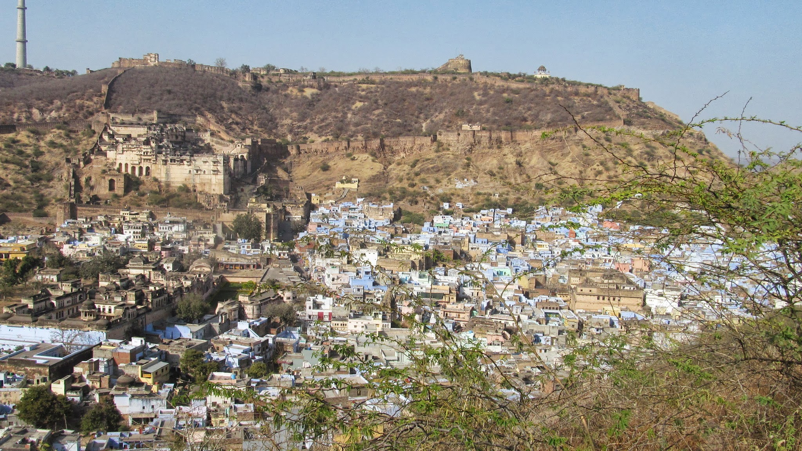

Bundi, une ville bleue entourée de fortifications

Notre arrivée à Aktasa suscite un changement. Chacun se retourne, surtout si l'un de nous a l'idée subite d'acheter un ananas. La nouvelle passe vite entre eux, les enfants accourent. Le plus âgé nous offre du thé. Très vite nous nous changeons en star hollywoodienne et posons pour des photos prises depuis leurs portables. Le soir tombe, l'un d'eux nous invite à dîner et dormir chez lui, mais auparavant, il faut se faire connaître au commissariat de police. Une fois cette formalité faite, la foule d'indiens qui nous entouraient se disperse et nous pénétrons au cœur d'un foyer.

<!-- 

Nicolas achète un ananas
 -->

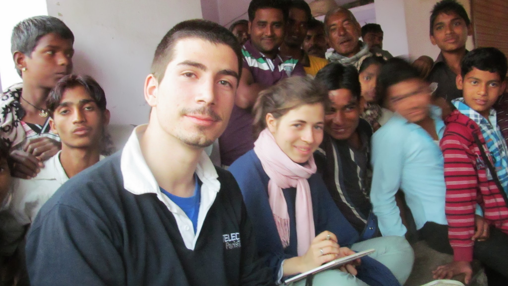

Timi et Clara entourés d'une foule de curieux

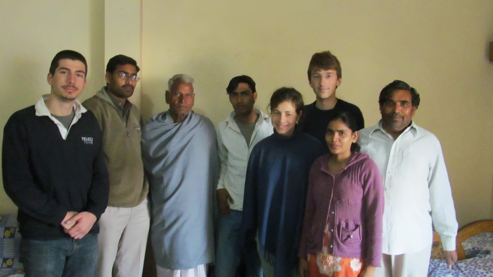

Oli, Timi et Clara au cœur d'un foyer

Dans un village, tout le monde se connait. Les femmes se lavent les cheveux, font leur toilette, se maquillent, se mettent du henné (qui ressemble à un tatouage) sur les mains. Elles ravivent le feu au milieu de la cours, essuient le nez de bébé qui court partout le derrière à l'air, balayent, et discutent avec leur voisine. Les hommes discutent entre eux, mais j'avoue que leur activité quotidienne, si ce n'est pour une partie d'entre eux, l'agriculture, me reste inconnue. Aucun livre dans ces maisons toutes simples et pleines de vie par la place laissée aux enfants. Pas ou peu de journaux, mais la télévision, surtout allumée le soir. Le soir, les jeunes se réunissent pour prier ensemble au temple.

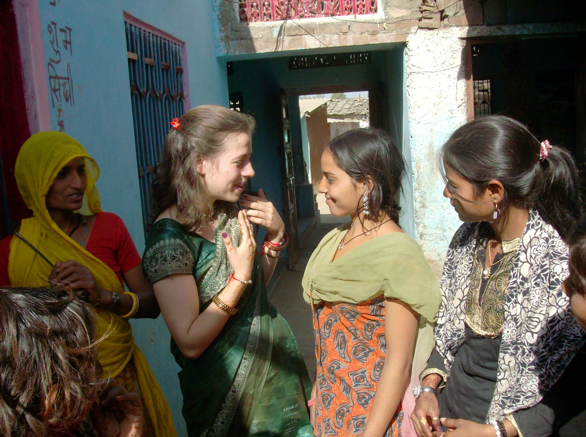

  Claire-Marie, relookée par les villageoises, se voit offrir un collier

Dans les lieux touristiques, notre rapport aux indiens nous a paru moins spontané, moins généreux, le vendeur à la sauvette même si nous entamons une discussion espère bien nous vendre ses porte-clés, la petite fille qui nous sourit se dépêche vite de tendre la mains, les conducteurs de rickshaw qui s'arrêtent tout le temps pour nous proposer de monter, les guides qui commencent la visite guidée avant de savoir si cela nous intéresse. La misère qui existe en Inde est étonnamment plus grande et visible dans le lieu touristique. Les femmes souffrent plus. Les hommes mendient peu. Dans les villages, on nous cache la misère et on nous reçoit comme des rois. La notion de misère n'existe pas, ces gens sont heureux avec ce qu'ils ont, ils n'ont pas toujours conscience de ce qu'il y a chez les autres. Dans les sites touristiques qui se dégradent petit à petit, on ne nous montre que la pauvreté, on nous considère comme une machine à billet.

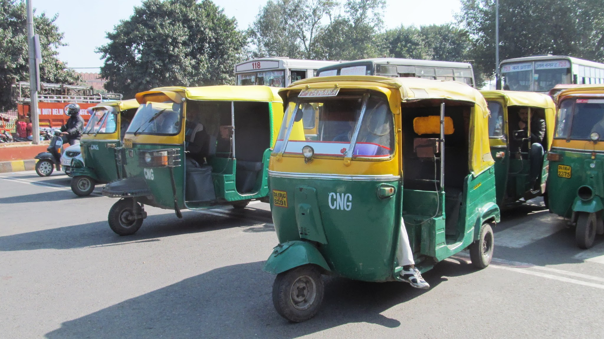

  Une armée de rickshaws, prête à tout pour nous faire embarquer

Dans les châteaux, les palaces indiens que l'on visite aujourd'hui, on y voit des tours carrées avec de petits dômes élégamment décorés. Les palaces encadrés de leurs murailles sont construits en haut des collines et s'étalent sur d'immenses espaces. A l'intérieur beaucoup de salles se succèdent, avec des couloirs pour les relier. Certaines sont recouvertes de fresques murales très colorées représentant des scènes de la vie comme par exemple, un combat d'éléphants, une bataille, le don d'offrandes aux dieux, des jeux, des discussions autour d'un thé ou des natures mortes. C'est néanmoins assez difficile d'imaginer une vie active dans ces beaux palaces parce qu'ils sont vides. Il reste en quelque sorte le squelette d'un trésor passé, où chaque pierre peut nous faire rêver !

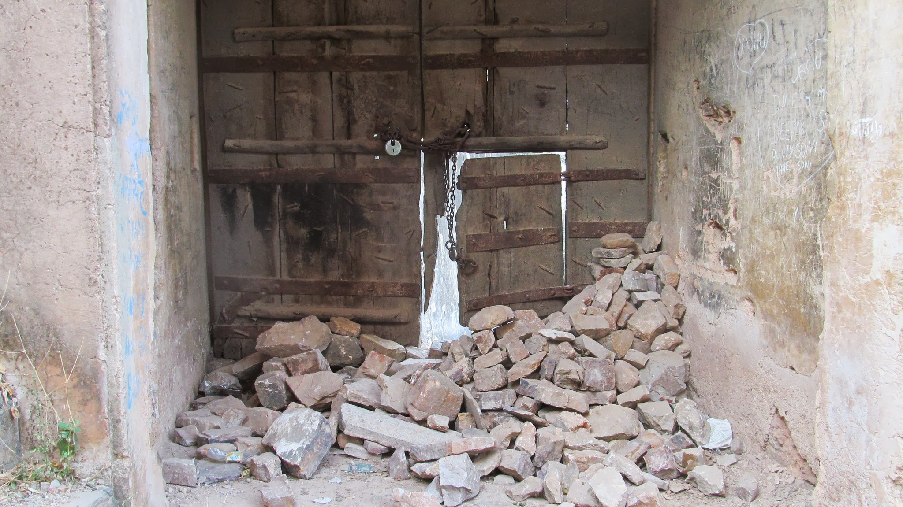

Porte abandonnée du palais de Bundi

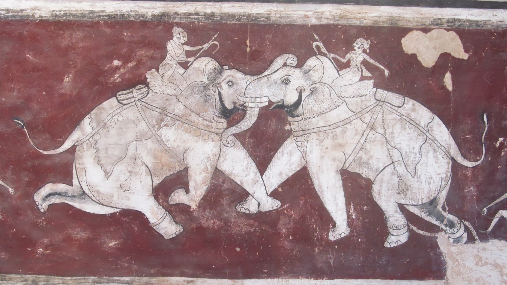

Fresque murale d'un combat d'éléphants

Dans les temples, la religion est une pratique très respectée, nous sommes restés un temps trop court pour comprendre comment se vit la foi des Indiens. Ceux-ci nous ont reçus avec beaucoup de courtoisie, "you are my guest because you are in my country, it's my duty to welcome you" nous disait un ami rencontré le dernier jour dans le dortoir du temple sikh de Delhi. Ceux-ci nous ont montré ce qu'ils avaient de plus beau, ce qui les rendait heureux, leur lien fraternel, leur maison avec un lieu pour prier, des femmes toujours prêtes à faire le thé, ou un diner plus conséquent, des hommes prêts à écouter, échanger, nous présenter leurs amis pour que nous en devenions très vite un!

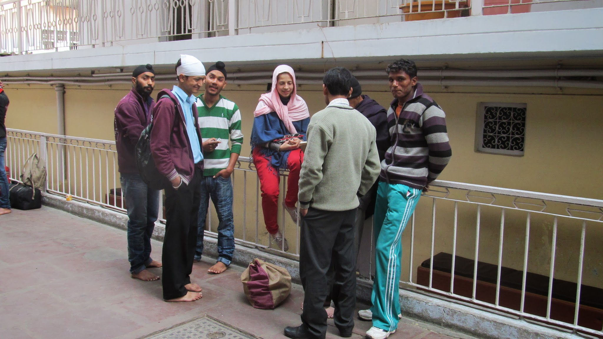

  Claire-Marie entourée de nouveaux amis du dortoir sikh

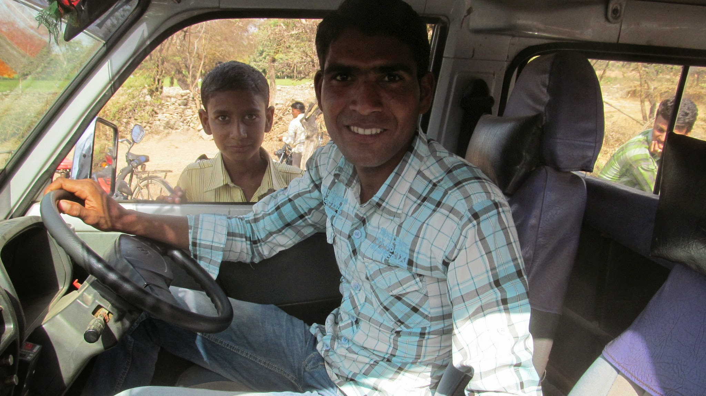

  Nouvel ami de Tristan et Nicolas qui les a pris en stop

import Navigation from "../../Navigation";

<Navigation
  previous="/2012-02-16"
  next="/2012-03-09"
  gallery="/galerie/inde2"
/>
