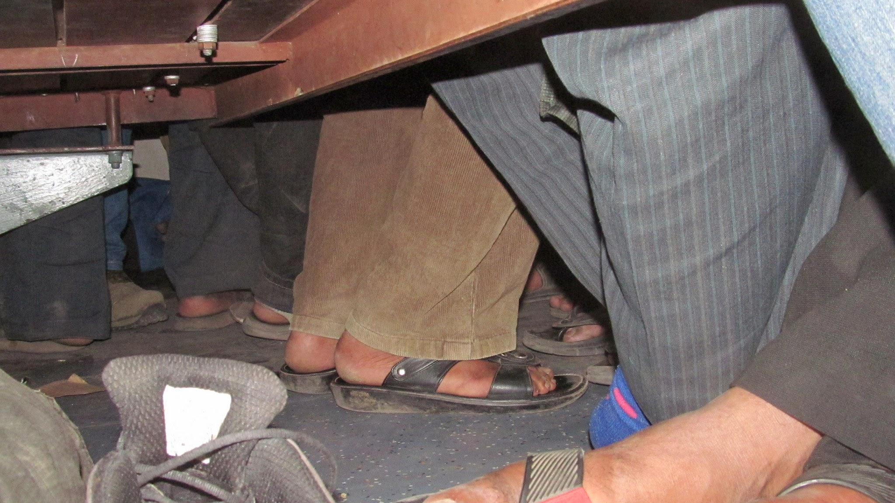
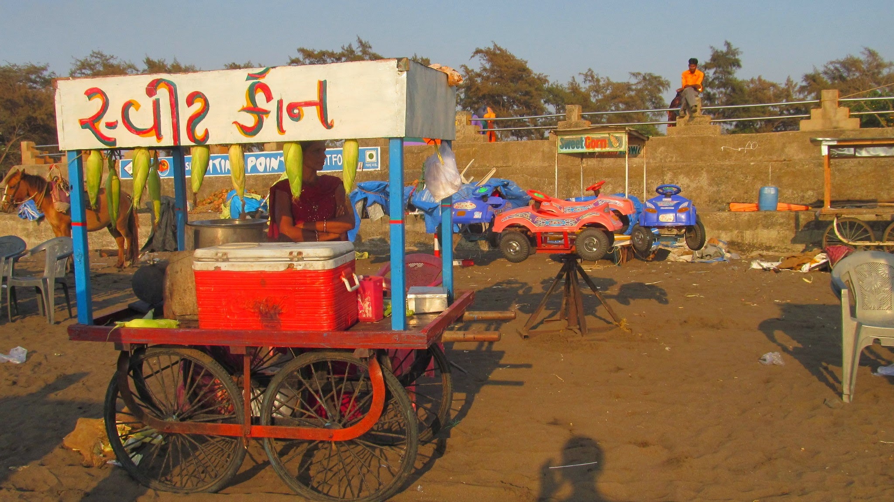
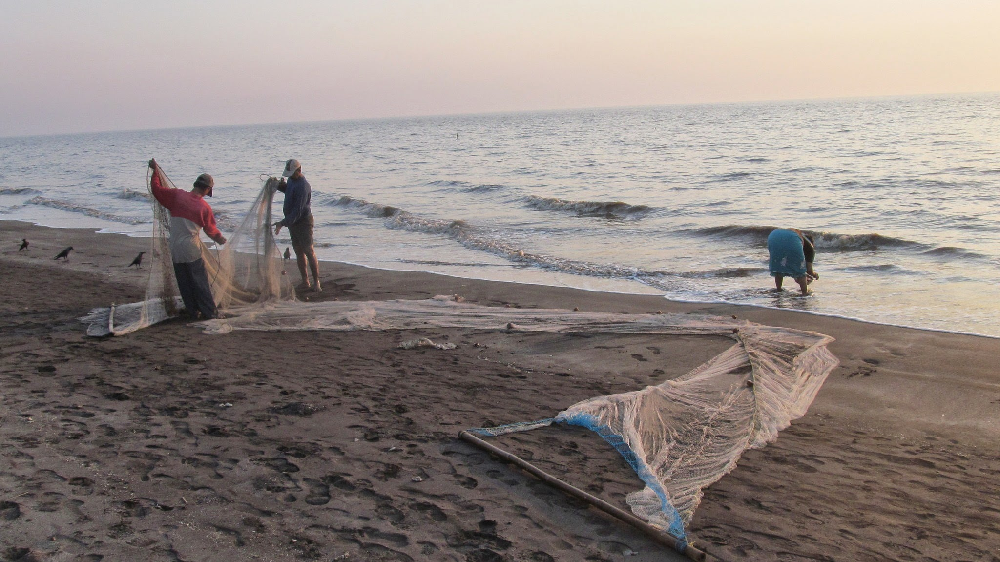
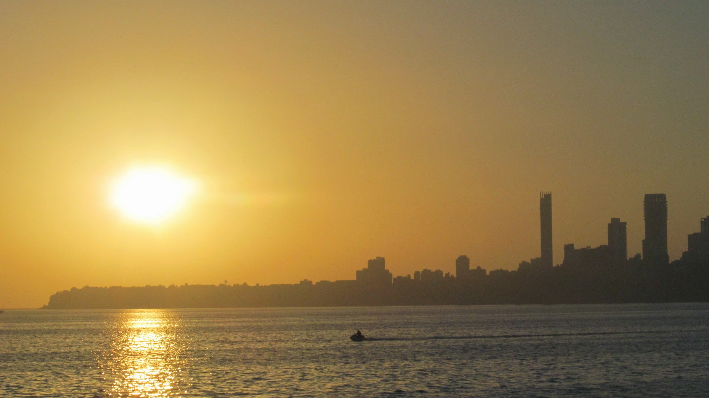
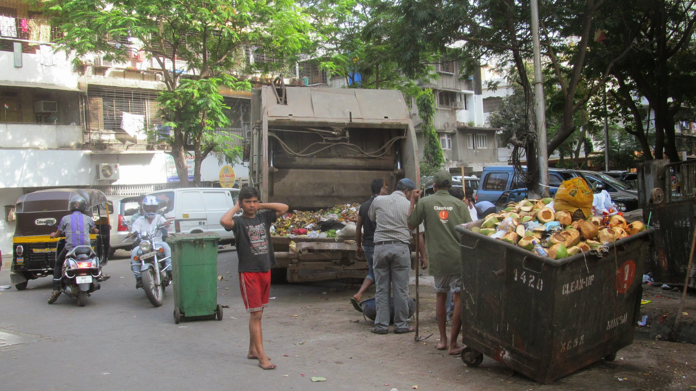
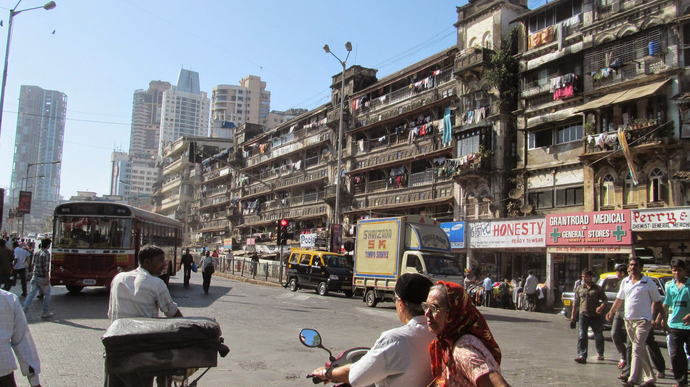
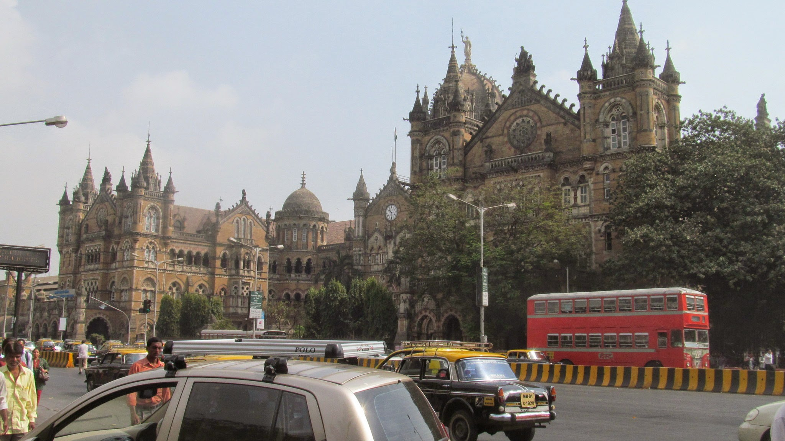
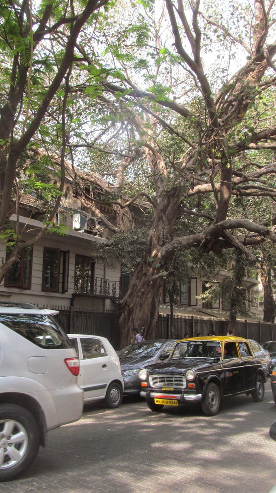
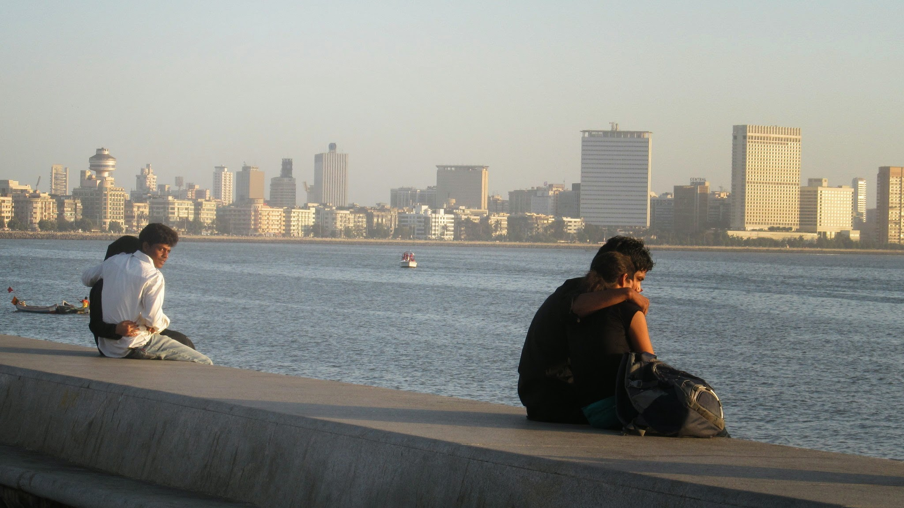
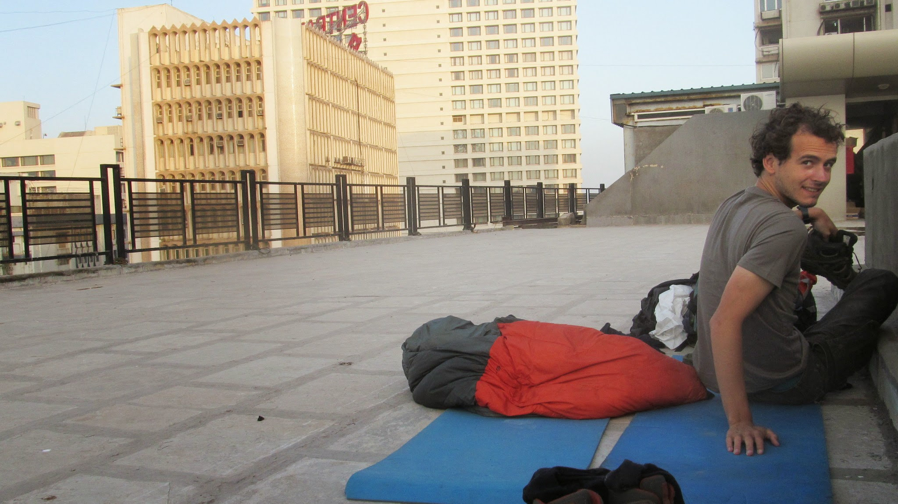

### Entracte dans une petite ville de pêcheurs

Nous quittons Claire-Marie et Tristan à l’aéroport de Delhi le 26 février. Le lendemain, nous prenons le train pour Bombay, mais décidons de nous arrêter 150 km avant notre destination pour profiter, encore un peu, d’une petite ville de province proche de la mer : Valsad.

  On trouve de la place où il y en a… 20h de train Delhi-Valsad

Nous nous installons dans un hôtel très bon marché pour 3 nuits. Le climat du sud de l’Inde et la ville sont très agréables. Nous ne sommes pas trop interpellés mais la population est tout de même très ouverte et il est facile de discuter avec les vendeurs ou passants. Bref, il y fait bon vivre.
Nous prenons nos petites habitudes. Bien vite, il n’est plus nécessaire de dire au vendeur de chips combien de grammes il faut mettre dans le paquet ou au vendeur de sandwichs qu’il ne faut pas mettre la sauce épicée !
La plage est proche, c’est l’occasion de revoir la mer que nous avions quittée en Lettonie. Sur la plage, les vendeurs à la sauvette vendent des noix de cocos, les pêcheurs… pêchent. Bien que l’eau soit très chaude, le lieu n’est pas paradisiaque puisque le sable est noir. Néanmoins, la balade au bord de mer reste une valeur sûre !

Vendeur de noix de cocos sur la plage de Valsad

Bien maigre pêche pour une fin de journée…

Nous rencontrons également de nombreux tour-du-mondistes qui sont allés plusieurs fois en France, aux Etats-Unis, en Amérique de Sud, à Singapour, en Chine… En France, ils ne connaissent pas Paris, mais Brest et le Havre ! Oui, car nous sommes ici dans une ville de pêcheurs. De nombreux marins y résident. Ils partent 10 mois en mer sur d’immenses cargos de conteneurs avec des intervalles de 6 mois de pause.
Nous finissons ensuite notre route jusqu’à Bombay où nous devons prendre l’avion pour Bangkok en Thaïlande.

### Les surprises de Bombay

La baie de Bombay !

Imaginez une ville indienne où :

- Il n'y aurait ni rickshaws, ni vaches sur les routes
- Il n’y aurait pas d’ordures tout le long des trottoirs, mais de jolies plantes
- Vous entendriez quelqu’un qui vous parle en marchant, car le son de sa voix ne serait pas couvert par le bruit des klaxons
- Les femmes porteraient le pantalon et même le débardeur !
- Des couples se tiendraient la main… pire, s’embrasseraient en public

Oui, nous savons, vous avez surement du mal à l’imaginer, mais une telle ville existe
bien, c’est Bombay (Mumbai pour les intimes).

  A Bombay, il y a d’étranges camions qui passent dans les rues !

La richesse de la ville est incroyable. Des plantes bordent les grands trottoirs, les gratte-ciels ne se comptent pas, les grands hôtels non plus, les hommes d’affaires abondent dans les rues, les loisirs et activités sur la plage sont nombreux. Il faut se rendre dans des quartiers moins connus de la ville pour se rendre compte qu’il y a aussi une misère à Bombay. Pas pire qu’ailleurs en Inde, mais le contraste avec la richesse qui l’entoure est saisissant.

Dans les rues de Bombay

Le passé colonial de la ville est bien visible. Par moments, on se croirait à Londres. Les vestiges anglais se marient très bien avec les grands arbres centenaires et leurs lianes qu'on imaginerait mieux au beau milieu de la jungle.

Non non, nous ne sommes pas en Angleterre !

Sur les trottoirs, c’est presque la jungle

Ce qui nous surprend le plus, tout de même, c’est la place de la femme qui a totalement changé. Pendant plus de deux mois (au Népal et en Inde), il était impensable qu’un couple se montre en public. De plus, dans les rues, les femmes mariées étaient bien couvertes avec l’habit traditionnel : le sari. Rien n’attire les yeux des hommes dans les rues ; c’est une grande différence avec l’occident où les tenues sont beaucoup plus provocantes et où il n’est plus possible de promouvoir un yaourt sur une affiche publicitaire sans une femme en bikini à côté…
Alors qu’en occident, les mœurs sont libérées en matière de sexualité, c’est tout l’inverse en Inde. La sexualité y est un véritable tabou. Les hommes ne connaissent pas la sexualité avant leur mariage (arrangé). Les femmes sont complètement tenues à l’écart du monde avant leur mariage. Du coup, nous avons constaté que de nombreux jeunes hommes étaient frustrés. Les conséquences de cette frustration nous ont parfois gênés. Beaucoup de jeunes hommes sont très « câlins » entre eux (et parfois ils essayent aussi avec nous). De même, dans le train, il est arrivé plusieurs fois qu’un travesti (Nicolas pense un transsexuel) se balade en frappant des mains, réveillant tout le monde et réclamant de l’argent en échange d’une bénédiction, de caresses dans les cheveux ou de baisers sur la main. Certains indiens étaient indifférents, d’autres étaient fascinés et excités. Nous, on était écœuré.
Quoi qu’il en soit, à Bombay, les couples s’embrassent sur le bord de mer. Et peut-être même avant le mariage ! Cela reste peu provoquant pour un occidental, mais suffisant pour nous faire demander si nous sommes bien encore en Inde après 40 jours dans le pays !

Whaaaaaat ?

Alors que la nuit tombe, nous cherchons un petit coin tranquille pour dormir (les hôtels sont extrêmement chers). Nous pensons peut-être aller au cinéma avant de nous coucher. La séance étant plus chère qu’en France, nous préférons nous rendre directement sur le toit du cinéma et y regarder un film sur notre ordi. Nous passons ainsi une nuit sur les hauteurs de la ville avant de partir le lendemain pour l’aéroport où nous attend notre avion pour la Thaïlande.

  Campement de fortune sur le toit du cinéma de Bombay

