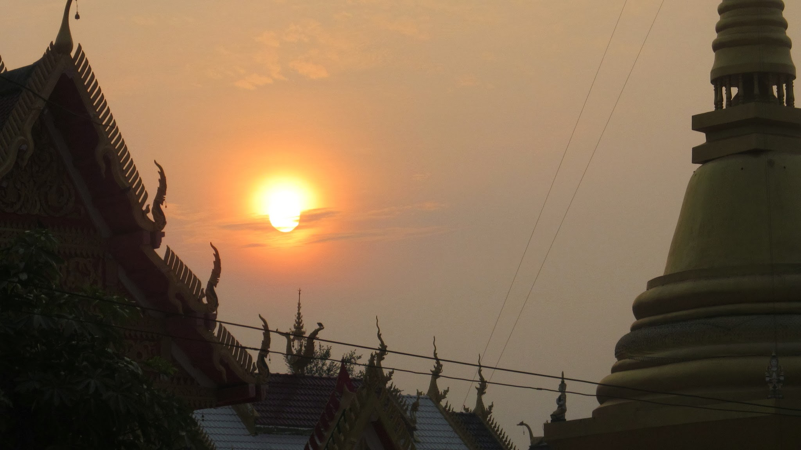

Lever de soleil dans un temple bouddhiste

### Arrivée dans un nouveau monde

Nous arrivons au petit matin à Bangkok. Nous comprenons tout de suite que quelque chose est différent : des panneaux nous indiquent le chemin. En moins de deux, nous nous retrouvons dans un superbe métro climatisé, deux cartes de Bangkok dans les mains. Nous sommes ahuris du contraste avec la désorganisation de l’Inde.
Cette arrivée à Bangkok marque un tournant de notre voyage. Nous quittons le monde de l’hindouisme dans lequel nous étions plongés depuis plus de 2 mois. En Thaïlande, 95% de la population est bouddhiste. Nous avions déjà rencontré cette religion au Tibet, mais la pratique en Thaïlande semble assez différente du bouddhisme Tibétain.

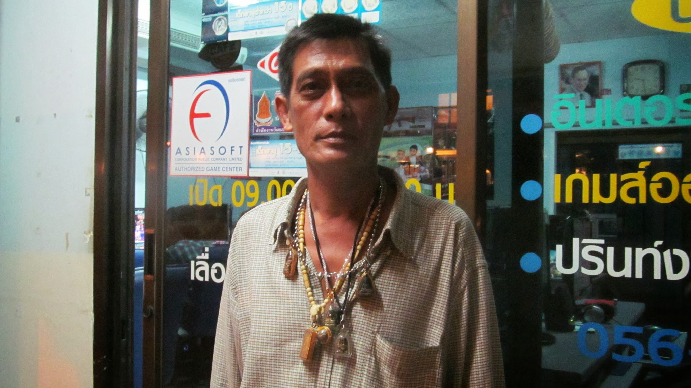

  Le gérant d'un cyber café, très fier de nous montrer toutes ses amulettes
  autour du cou qui coûtent parfois plusieurs centaines d'euros

A la sortie du métro, nous embrassons l’atmosphère chaude et humide qui règne en
Thaïlande. Nous n’avions pas froid en Inde, mais ici le climat est bien plus humide.
Nous nous rendons à l’adresse de notre couch surfeur. En marchant dans les rues de
Bangkok, nous ne manquons pas de remarquer les grandes différences avec l’Inde :
ici, les rues sont propres, il n’y a pas d’animaux errants, les petits restaurants
de rue sont hygiéniques, les machines électriques (climatisations, frigos, TVs…)
abondent car contrairement à l’Inde, il n’y a pas de coupures d’électricité ! Dans
les rues roulent de nombreuses voitures particulières qui ne klaxonnent pas !

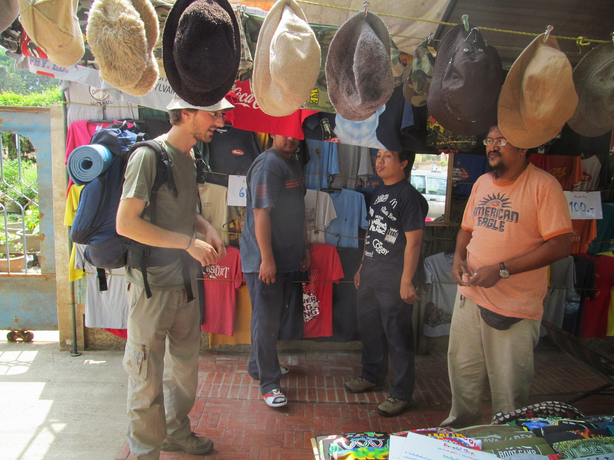

  Avec ce beau temps, petit arrêt chez le marchand de chapeau !

Nous ne manquons donc pas de remarquer que nous entrons dans un pays bien plus riche que celui que nous venons de quitter. Les prix sont aussi un peu plus élevés qu’en Inde, mais ils sont affichés et cela nous fait gagner beaucoup de temps et d’énergie car nous avons rarement à négocier.
Malgré la chaleur écrasante, nous nous baladons un peu dans les jolies rues de Bangkok. On peut y trouver tout et n’importe quoi : vêtements, électronique, objets hétéroclites, nourriture…
A notre étonnement, nous croisons beaucoup d’occidentaux. La Thaïlande semble être un pays très touristique. Ici, nous passons vraiment incognito ! Finies les sollicitations incessantes de l’Inde!

### Première étape à Ayutthaya

Nous prenons rapidement la route du nord de la Thaïlande en direction d’Ayutthaya. Le train est bon marché et la troisième classe est propre, spacieuse et presque vide. Sans le savoir, nous débarquons dans une des villes des parcours touristiques classiques. Nous n’avons donc pas de problèmes pour trouver une petite Guest House où nous passons deux nuits, le temps de découvrir un peu la ville.

Les ruines d'un des temples d'Ayutthaya

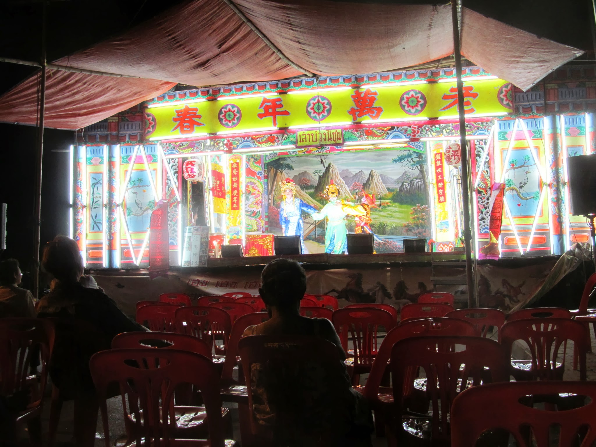

Soirée théâtre chinois à Ayutthaya

### Le stop en Thaïlande

Nous nous dirigeons ensuite vers Ang Thong, quelques kilomètres plus au nord. Le train ne couvre qu’une toute petite part du pays, nous devons donc trouver un autre moyen de transport. Mais le bus est bien plus cher que le train. En Inde, il était presque ridicule de faire du stop tant le prix des trajets était négligeable dans notre budget. Mais ici, prendre le bus reprend une vraie part dans notre budget. Nous nous remettons donc au stop ! Les Thaïlandais ont un peu de mal à comprendre le principe mais avec un panneau de la ville-destination, placés au bon feu (rouge de préférence) et avec un peu de patience, nous aurons la chance de rencontrer de sympathiques Thaïlandais, très serviables et généreux.

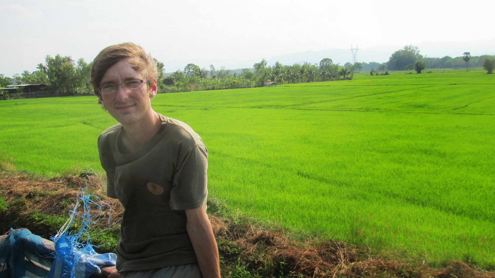

  A l'arrière d'un pick-up, nous profitons bien des jolis paysages thaïlandais

### Accueil dans les temples bouddhistes

Alors que nous arrivons à Ang Thong, en fin d’après-midi, nous rencontrons une bande de lycéens autour d’une table. Nous commençons à discuter, et malgré la barrière de la langue, ils comprennent bien vite que nous cherchons un lieu où dormir. Deux d’entre eux nous prennent en main ! Ils nous conduisent à un temple bouddhiste. Là-bas, on nous offre une chambre climatisée pour la nuit avec des lits ! Wahou, on ne s’attendait pas à ça. Par la suite, nous irons régulièrement dormir dans les temples bouddhistes. Nous n’aurons pas de chambre climatisée les autres fois, mais nous y trouverons toujours un endroit simple et sûr pour dormir, avec un ventilateur pour nous protéger (plus ou moins bien) des moustiques.

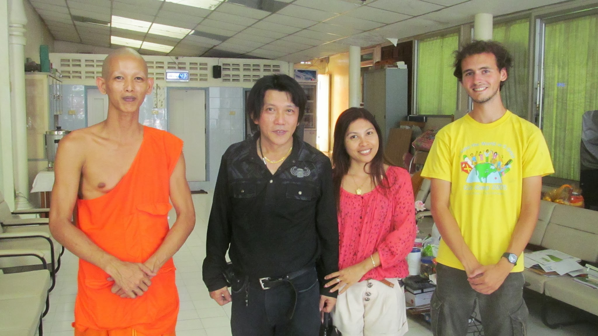

  Photo de départ avec le moine qui nous a accueillis et un couple venu acheter
  une amulette

Nous trouvons qu’il y a une forte ressemblance entre l’accueil dans les temples bouddhistes
et dans les presbytères chrétiens : dans les deux cas, peu importe qui nous sommes,
quelle est notre religion. Ce qui compte, c’est que nous sommes deux personnes qui
avons besoin d’un toit où dormir et c’est ainsi que nous sommes accueillis.

### Petits bouibouis thaïlandais

Le lendemain, nous arrivons un peu tardivement à Nakhon Sawan. Nous dînons sur un trottoir, dans les sympathiques petits bouibouis de Thaïlande. On y sert de délicieux petits plats, coûtant entre 30 et 50 baths (1€ = 40 Baths). Nous apprécions particulièrement les soupes de nouilles et le « chicken rice » qui, aussi incroyable que cela puisse paraître, ne sont PAS EPICES !!! Une autre grosse différence avec l’Inde, est que les doses de viandes sont bien plus conséquentes. En Inde, une grande partie de la population est végétarienne. Mais même sans être végétarien, lorsqu’on demande un plat avec de la viande, on obtient rarement plus qu’os à grignoter.

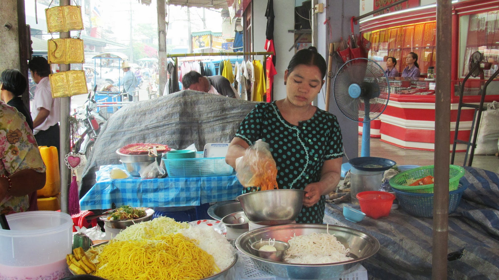

Bouiboui au marcher

Nous arrivons trop tard pour aller dans un temple. Nous cherchons donc un coin tranquille
pour dormir. Dans une maison bordant le trottoir, nous échangeons un sourire avec
une Thaïlandaise. Elle nous fait coucou, nous faisons de même. Elle nous dit d’entrer,
nous entrons, et après un petit temps de discussion, Eve et son mari nous offrent
une très belle chambre où dormir !

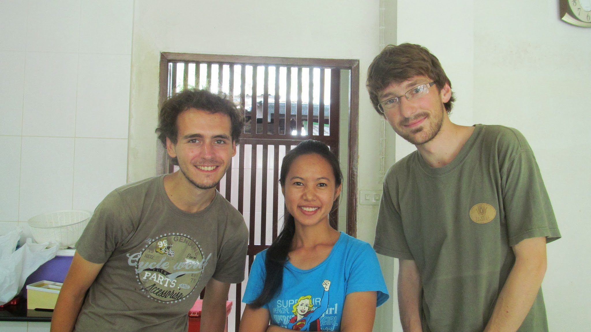

Nicolas, Eve et Olivier

### Scènes de vie thaïlandaises

Nous prenons ensuite la direction de Tak. C’est l’occasion de visiter le marché de la ville. Nous nous arrêtons régulièrement chez les marchands de fruits pour y manger une mangue, un melon, une pastèque ou un ananas ! Quel délice !

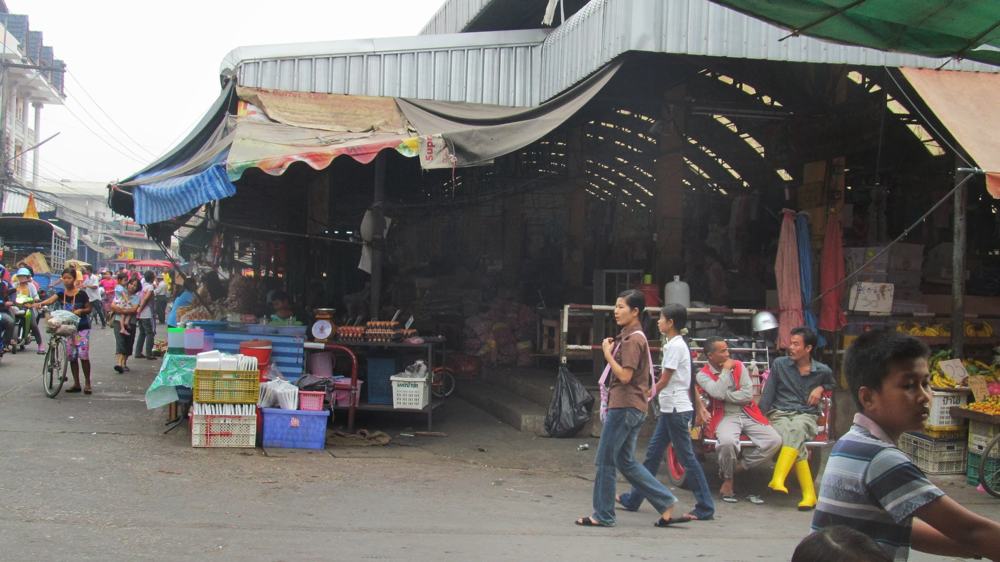

Au marché

Au hasard, nous tombons sur un match de boxe thaïlandaise. C’est le sport national
et les gens viennent très nombreux aux matchs où ils parient. Nous nous faisons invités
et regardons trois matchs. Un match dure environ 15 minutes. On pense que l’arbitre
compte des points et celui qui obtient le plus de points remporte le match. Mais
sur les 3 matchs auxquels nous assistons, 2 se finissent par KO. D’ailleurs, c’est
assez impressionnant car le coup va tellement vite, qu’on voit juste l’un des boxeurs
tomber à terre, sans comprendre ce qu’il s’est passé…

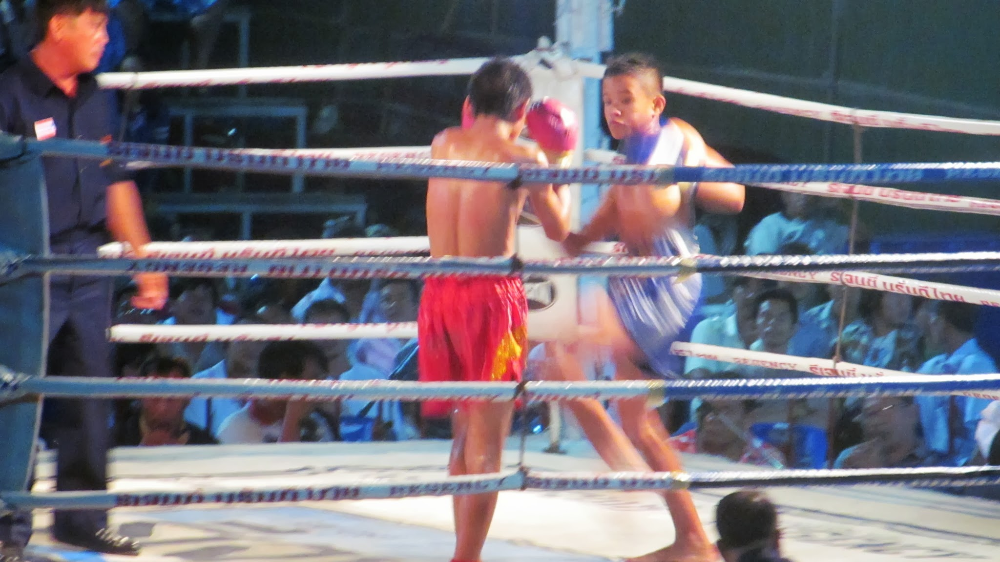

Combat de boxe entre deux juniors

Tak n’est pas très loin de la frontière birmane. Nous nous y rendons. Sur une route
longeant la frontière, nous rencontrons un réfugié Birman. Il nous explique qu’il
a le statut de réfugié car en Birmanie, il y a trop de combats. Mais en Thaïlande,
il n’a un laisser-passer que pour se déplacer sur la route qui longe la frontière.
Il n’a ainsi accès qu’à son camp de réfugié et à quelques petites villes frontières.
Nous sommes si chanceux, avec notre passeport européen, de pouvoir nous déplacer
presque partout sur le globe !

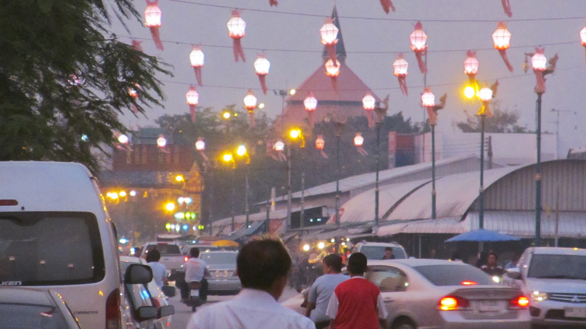

Ambiance du soir à la ville frontière

Nous reprenons finalement la route pour Chiang Mai où nous sommes rejoints par Grégoire,
un ami de Télécom qui voyage deux mois en Asie du Sud-Est. Il vient de Malaisie et
va poursuivre sa route avec nous.

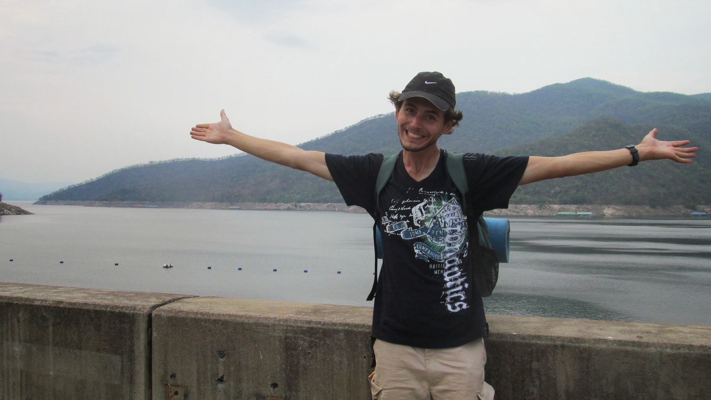

  Sur la route de Chiang Mai, petit arrêt au plus grand barrage de Thaïlande

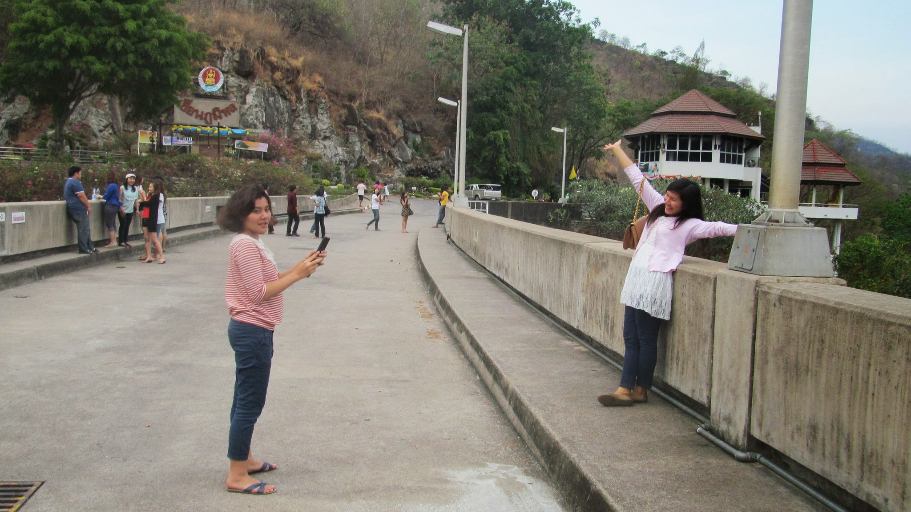

Copieuses !!

Le 19 Mars, Olivier prendra la route de Bangkok pour ensuite rentrer en France le
25 Mars. Nicolas et Grégoire continuent à vagabonder ensemble en Thaïlande, puis
ils iront au Cambodge !

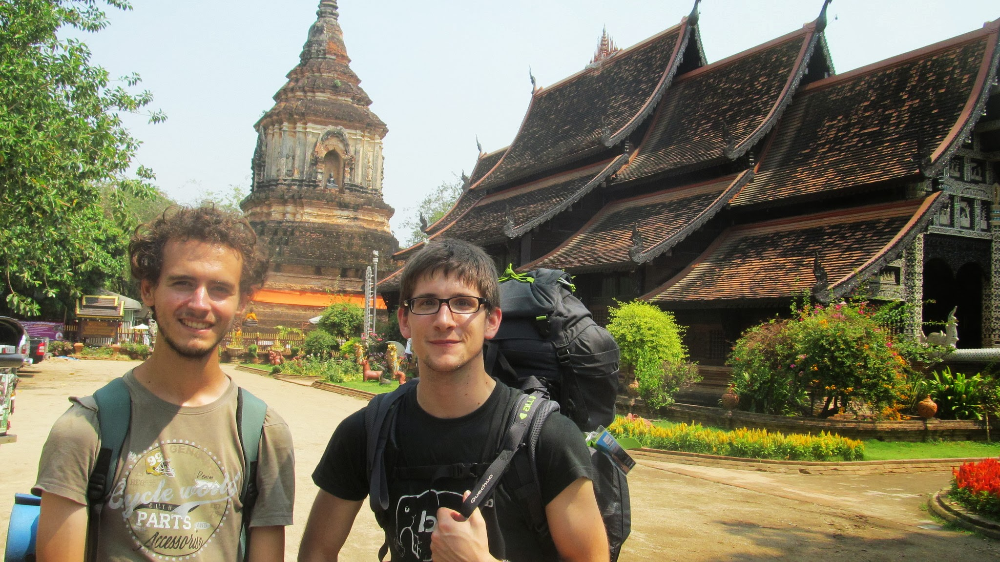

Grégoire et Nicolas à Chiang Mai

import Navigation from "../../Navigation";

<Navigation
  previous="/2012-03-09"
  next="/2012-03-28"
  gallery="/galerie/thailande"
/>
