### La fin d’une épopée !

Nous retrouvons Grégoire à l’aéroport de Chiang Mai le 15 mars ! En effet, nous apprenions quelques jours plus tôt qu’il voyage en Asie du Sud-Est avant de commencer un stage en Indonésie. La chance est avec nous, nous avons une partie d’itinéraire en commun et allons ainsi en profiter pour passer 15 jours ensemble.

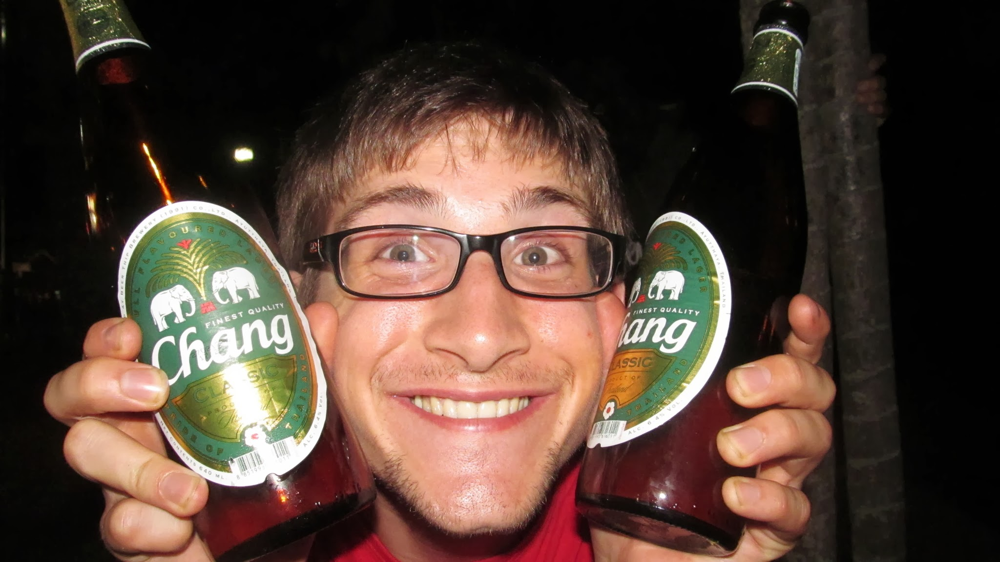

  Deuxième soirée avec Grégoire... on ne risque pas de s’ennuyer pendant ces 15
  jours !!

Nous partons rapidement en direction de Chiang Rai, tout au nord de la Thaïlande. A trois, faire du stop s’annonce plus difficile et nous décidons donc de prendre le bus. Malheureusement, nous nous faisons surprendre par le peu de bus en direction de Chiang Rai et les rares disponibles sont pleins. Nous tentons donc le stop.

Sous le soleil des tropiques, c’est un vrai effort que de faire du stop. Nous avons effectivement du mal à trouver une voiture, mais après un certain temps, un monsieur nous appelle. Il s’est garé un peu plus loin pour nous. Nous partons ainsi pour Chiang Rai, avec un Thaïlandais tout heureux d’avoir trois Français dans sa voiture !

A Chiang Rai, nous visitons les “black houses” et surtout le “White Temple”, éblouissant par sa beauté. Un grand artiste Thaïlandais ayant fait fortune en vendant ses toiles, dépense son argent pour créer cette oeuvre. Le site est déjà très avancé mais on peut encore voir des bâtiments en construction.

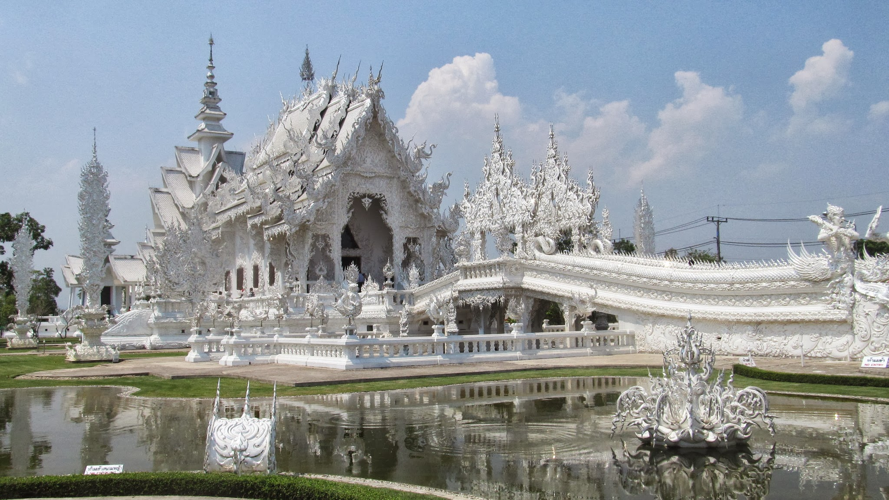

Le “White Temple”

Nous prenons ensuite la route de Phayao, où nous apprécions le coucher de soleil au bord du lac.

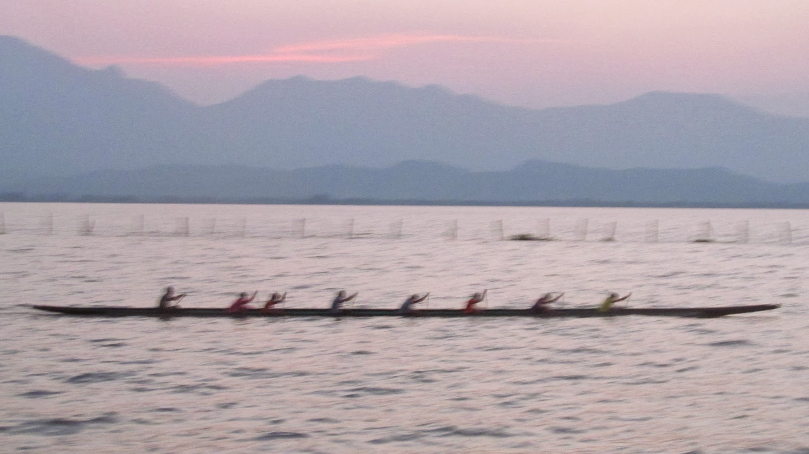

  Magnifique coucher de soleil au bord du lac de Phayao

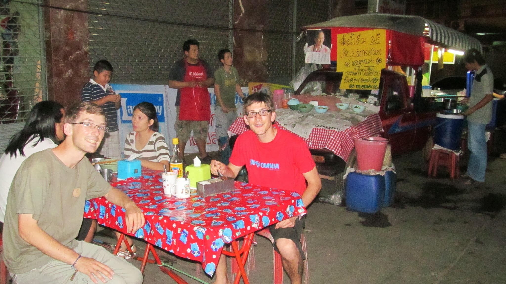

  Dîner dans un petit bouiboui de Phayao avec Grégoire !

<iframe
  src="http://www.youtube.com/embed/nWPG84xEbo8"
  frameborder="0"
  allowfullscreen
></iframe>

  Son et lumière au bord du lac de Phayao

Notre troisième étape est Lampang, où nous étions déjà passés quelques jours plutôt. Phayao et Lampang sont bien moins touristiques que Chiang Mai et Chiang Rai. Les Thaïlandais sont très agréables avec les touristes et ils sont encore plus agréable lorsqu’il y en a peu.

<iframe
  src="http://www.youtube.com/embed/jJ9sPgSmqak"
  frameborder="0"
  allowfullscreen
></iframe>

  Sport collectif en fin de journée !!!

A notre arrivée à Lampang, nous cherchons un lieu où loger. Nous demandons notre chemin à une Thaïlandaise et en moins de deux, nous nous retrouvons dans sa voiture, en direction d’un hôtel pas cher.

A Lampang, nous nous baladons au marché de nuit où l’on peut manger de succulentes brochettes, mais aussi des insectes et autres gourmandises thaïlandaises !

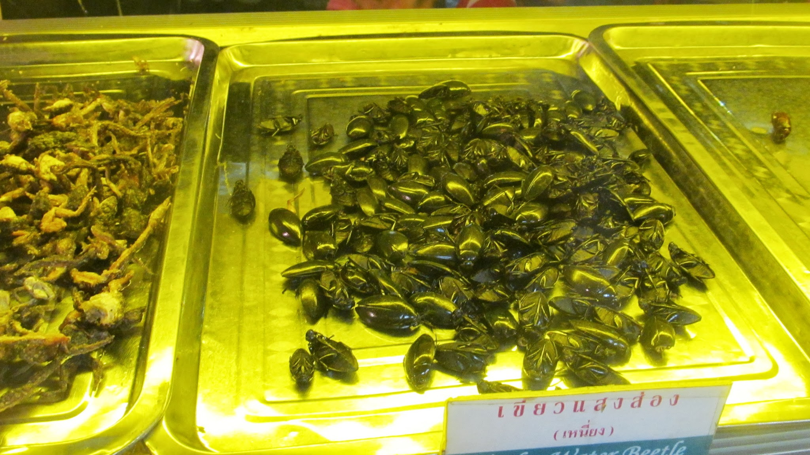

Petites gourmandises thaïlandaises

<iframe
  src="http://www.youtube.com/embed/NrQ7eP9Tptk"
  frameborder="0"
  allowfullscreen
></iframe>

  Grégoire est encore un peu jeune pour ces choses là !

Nous voulions également visiter le centre pour éléphants où l’on pouvait donner le bain et monter les éléphants... mais nous arrivons un peu tard. Notre lot de consolation sera tout de même de voir quelques éléphants de très près !

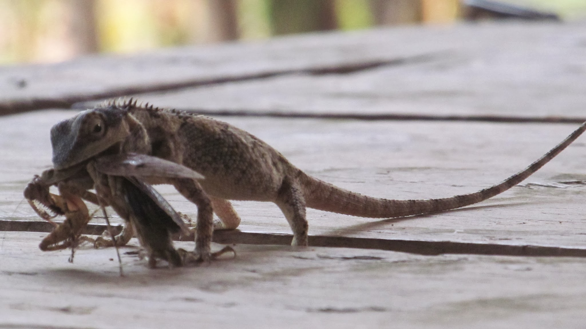

  On ne monte pas les éléphants mais nous sommes bien au beau milieu de la
  jungle : les dangereux reptiles sont redoutables

Après ce petit tour de trois jours, Olivier retourne à Bangkok pour y préparer son retour en France alors que Grégoire et Nicolas retournent à Chiang Mai.

Chacun d’un côté de l’autoroute, nous levons nos pouces à la recherche d’un conducteur bienveillant, avec 9 mois de souvenirs communs en tête...

**Nicolas continue le voyage au Cambodge, au Vietnam et au Laos et continuera à donner des nouvelles sur le blog. Quant à Olivier, retour au boulot mais ce n’est pas tout ! Vous pourrez bientôt lire une série d’articles sur le système des castes en Inde rédigée sous sa plume.**

### 2 jours à moto dans la province de Chiang Mai

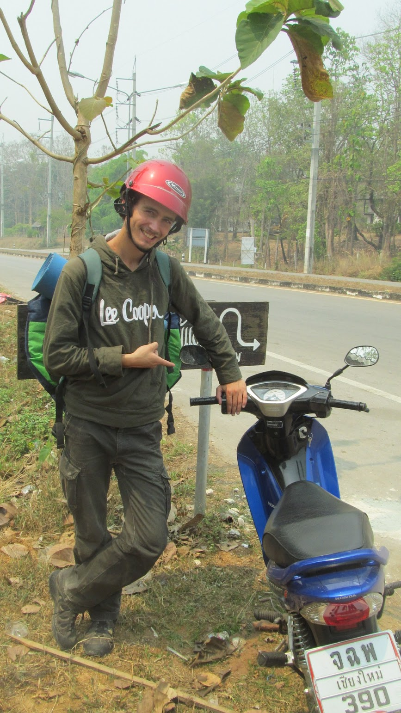

Moi et mon Harley Davidson 1500cm3

A notre retour sur Chiang Mai, Gregoire et moi louons deux motos et partons faire un tour dans la province de Chiang Mai. Comparé au bus ou au stop, la moto nous permet de plus profiter des paysages et surtout, nous rend libres et indépendants : nous pouvons faire des petites excursions, en quittant la route principale, à souhait. Nous découvrons ainsi des endroits qui ne nous étaient pas accessible en bus ou en stop.

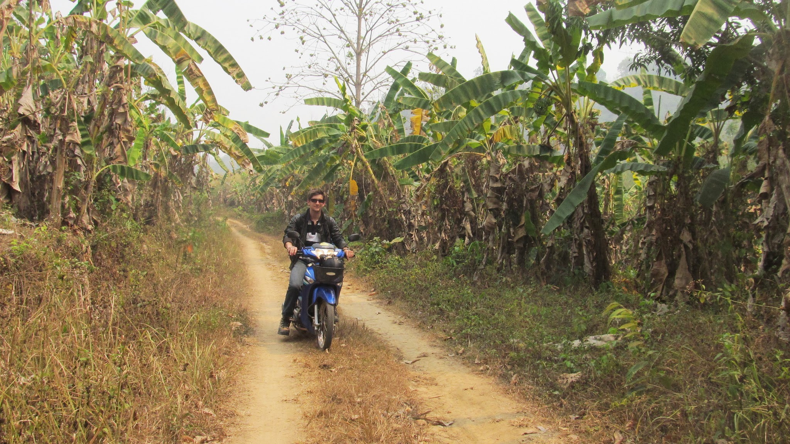

  Grégoire au beau milieu d’une plantation de bananiers

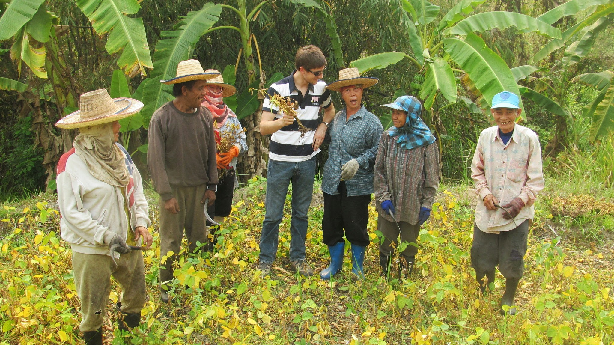

  Rencontre avec des agriculteurs heureux de voir des touristes passer sur la
  route

Je rentre sur Chiang Mai après 2 jours alors que Grégoire continue encore 2 jours la moto. Nous nous retrouverons sur la route vers le Cambodge.

### 1000km de stop sur les routes de Thaïlande

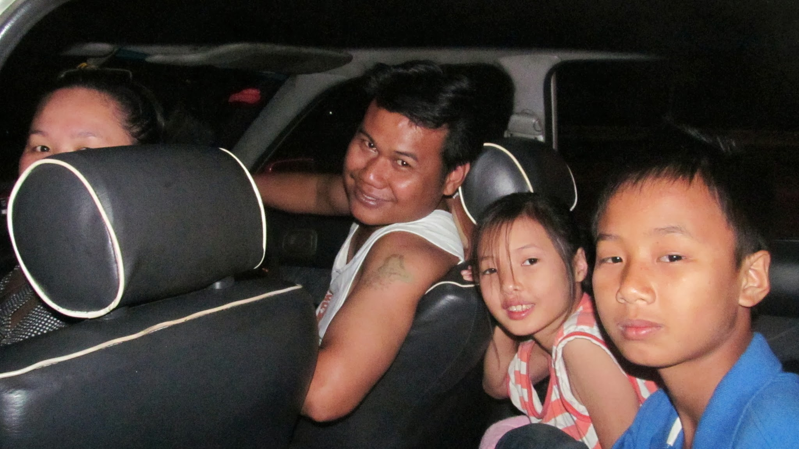

  Super souvenir de stop avec cette famille qui rentrait sur Bangkok

Marcher jusqu’au bon spot pour faire du stop ; lever le pouce avec le sourire sous la chaleur tropicale ; profiter d’une voiture climatisée pendant quelques minutes ou quelques heures en tentant de discuter en thaï avec le conducteur... tel aura été le cycle répété une dizaine de fois pour arriver au Cambodge.

Je garde un très bon souvenir du stop en Thaïlande : les belles rencontres qui en découlent me font vite oublier les heures d’attente sous le soleil.

Voici deux souvenirs, au cours de ce road trip, un peu plus marquants que les autres.

Ma première étape de nuit est Phitsanulok, où j’arrive tard le soir. Les temples ont fermé leurs portes et je dois trouver un autre endroit où dormir. Finalement, on me dirige vers la rivière qui traverse la ville. Et en effet, la rivière est bordée par un petit parc très sympa où je pense être tranquille pour dormir. Il n’y a pas de toit, mais le ciel est dégagé, et surtout, il y a des toilettes publiques ou je peux prendre une douche plus que nécessaire après cette journée sous le soleil, souvent à marcher. Juste à côté, une trentaine de matelas sont sur la pelouse et les gens s’y arrêtent pour se faire masser une heure pour 2,5€.

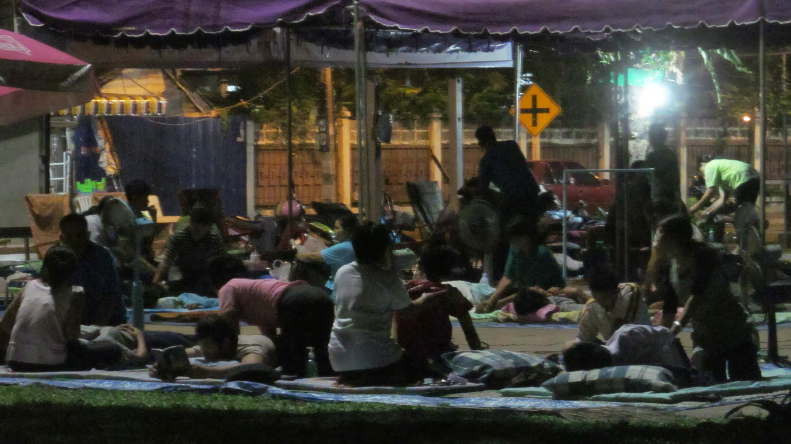

Au bord de la rivière, soirée massage

La nuit aurait presque été un grand succès si… je ne m’étais pas réveillé à 4h du matin par quelqu’un assis à un mètre de moi. La personne est silencieuse et me regarde. Séparé d’elle par ma moustiquaire, je m’assieds et dis bonjour. Je comprends vite que cette personne est sourde et muette. Avec des signes ou avec son carnet sur lequel elle écrit quelques mots d’anglais, elle me pose des questions. J’échange ainsi avec elle, au travers de ma moustiquaire, pendant plus d’une heure. Je comprends vite que je n’ai pas trop de soucis à me faire et que cette personne n’est pas dangereuse… Je ne suis tout de même pas très à l’aise, tout seul avec elle, loin des regards des quelques passants dans la rue, un peu plus loin. Le malaise s’amplifie lorsque la personne me demande si je veux coucher avec elle, me propose des bonbons et m’invite de manière un peu insistante chez elle. Mes refus ne semblent pas la vexer car elle est avant tout contente de discuter avec quelqu’un. Malgré tout, elle ne veut pas partir, car elle dit avoir peur que quelqu’un vienne me poser des problèmes. Finalement, à 6h30, elle finit par partir !

Le deuxième souvenir fort est la rencontre d’un moine à Sing Buri.

Je cherche à quitter le centre-ville pour faire du stop. Je demande ma route à un moine qui attend un bus. Il me conseille de prendre un bus, mais je lui explique que je préfère marcher. Il m’indique une direction et je continue mon chemin. 2kms plus loin, je le retrouve qui m’attend, tout souriant. Il avait pris le bus mais a ensuite décidé de s’arrêter pour marcher avec moi ! D’un simple geste de la main, il m’invite à le suivre. Je le suis.

15 minutes plus tard, alors que nous passons devant un magasin, une employée nous interpelle. Elle offre à chacun d’entre nous 2 bouteilles d’eau fraîche. Puis elle s’agenouille au pied du moine. Il récite une prière de bénédiction et repart. J’assiste ainsi à plusieurs reprises à cette scène marquante. C’est avec les donations des bouddhistes que les moines vivent. Le matin, les moines partent marcher en ville. Les passants les interpellent, leur donnent de la nourriture ou d’autres produits ; les moines les bénissent. Lorsqu’un moine se promène, comme c’était le cas avec moi, il a toujours un sac avec lui pour y déposer les donations qu’on peut lui faire sur son chemin.

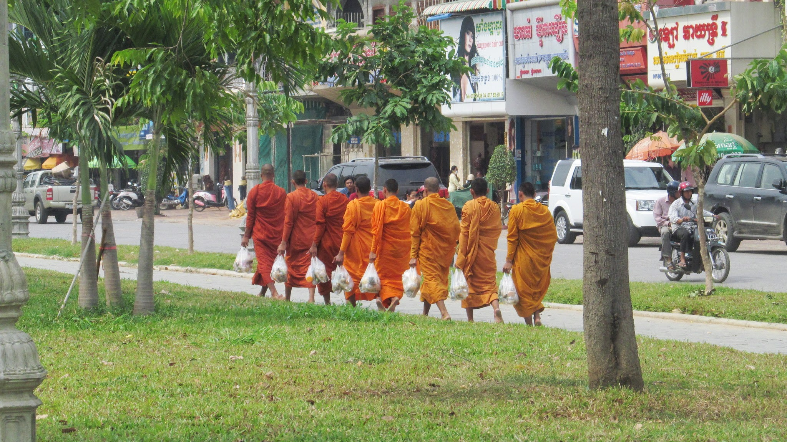

  Après la quête matinale, les moines rentrent au temple

Après 2h de marche, à suivre tant bien que mal ce moine septuagénaire, je commence à comprendre qu’il croit que je veux aller à la prochaine étape (à 50kms) à pied. Je comprends également qu’il compte m’accompagner jusqu’à son temple, à 10kms d’ici ! Je m’arrête donc et commence à lui expliquer le principe du stop. Il est très sceptique, mais il me fait confiance et avec bonne foi il lève son pouce avec moi !

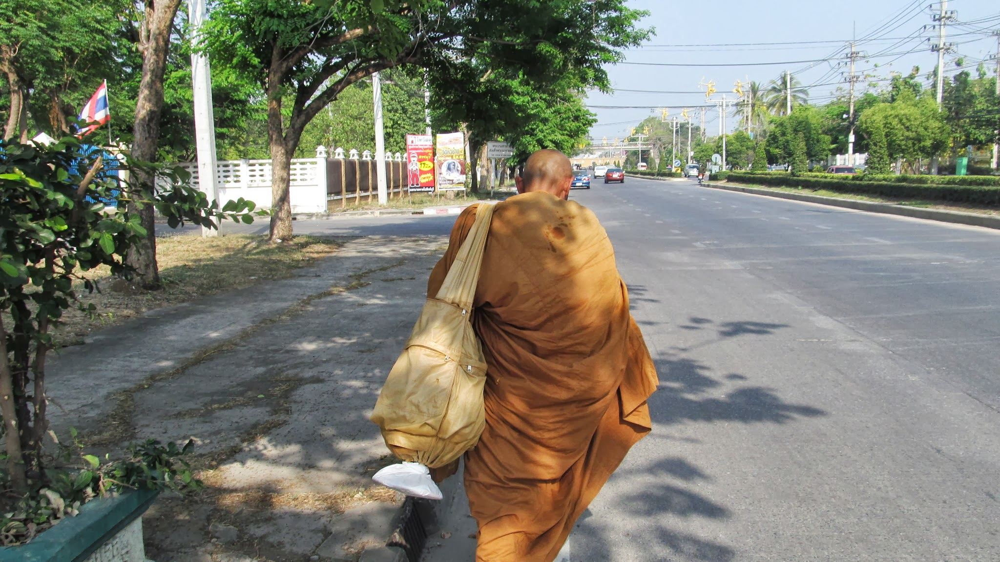

  A 70ans, le moine a encore une sacrée forme ! Je le suis tant bien que mal

Quelle aubaine d’avoir un moine avec soi pour faire du stop ! Il interpelle bien plus les conducteurs que moi ! En 10 secondes chrono, nous voici dans la voiture d’un jeune qui se débrouille bien en anglais. Il peut enfin faire le traducteur entre le moine et moi. Il rit aussi beaucoup avec le moine. Lorsque le moine quitte la voiture, il me remercie de lui avoir fait découvrir le stop et m’avoue qu’il ne fera plus que ça maintenant !

Je retrouve finalement Grégoire dans la banlieue de Bangkok, puis nous finissons ensemble la route en stop jusqu’à la frontière du Cambodge.

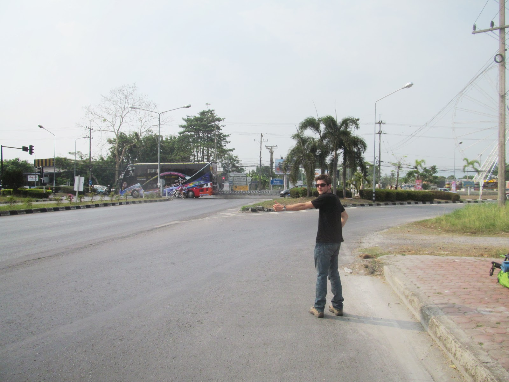

En route pour le Cambodge

import Navigation from "../../Navigation";

<Navigation
  previous="/2012-03-18"
  next="/2012-04-07"
  gallery="/galerie/thailande"
/>
