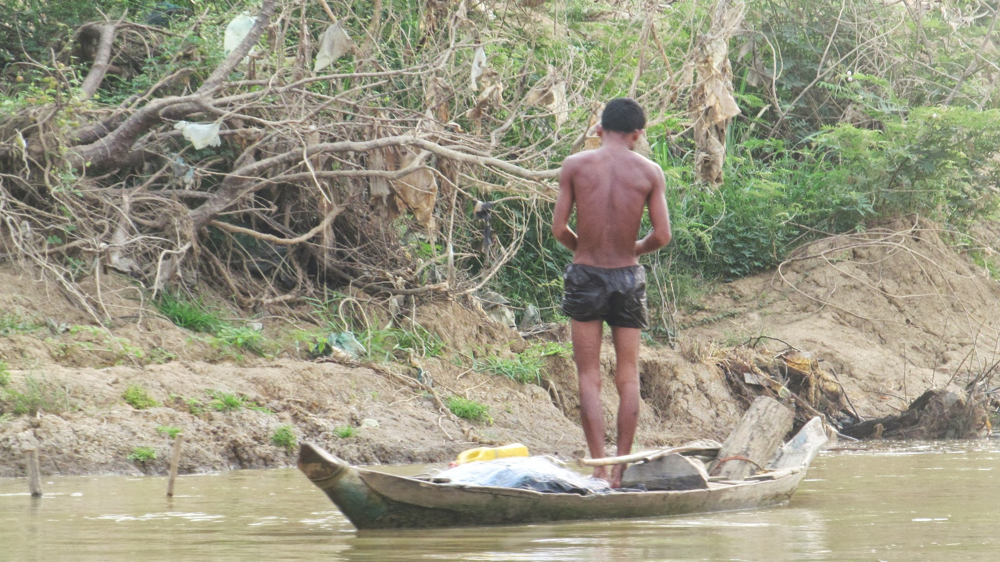

### Arrivée humide au Cambodge

Avec Grégoire, nous arrivons au Cambodge le 24 mars. L’orage gronde, me rappelant que la saison des pluies approche (de fin-avril à octobre). L’ambiance dans le camion qui nous sauve des trombes d’eau est bien humide ! Le camion fuit et nous sommes presque plus mouillés à l'intérieur qu’à l'extérieur (bon d’accord, j'exagère tout de même peut être un peu). Nous arrivons à la tombée du jour à Battambang.

  Même sous la pluie, le petit Grégoire garde le sourir

Nous prenons rapidement la direction d’un temple où nous pourrons passer la nuit. Nous sommes très bien accueillis par de jeunes moines dont l’un, Kim, nous offre sa chambre pour la nuit. Nous passons une bonne soirée à discuter avec lui et ses amis. Je comprends que devenir moine ici, n’est pas le même engagement que devenir moine pour un chrétien. Kim, par exemple, ne compte pas être moine toute sa vie. Il compte quitter le temple dans lequel il vit aujourd’hui à la fin de ses études. En fait, être moine, ça a plutôt l’air d'être un bon plan pour ses études ! En effet, avec ce statut, il profite d’une éducation gratuite et de qualité. Cela lui permet aussi d’avoir une chambre. Mais il doit aussi prier de nombreuses heures par jour.

Discution tardive avec les moines de Battambang

### Les villages flottants

  Entrée dans un village flottant lors du trajet Battambang-Siem Reap

Le lendemain, nous visitons Battambang, son marché, ses nombreux temples…
Nous partons ensuite pour Siem Reap, la ville jouxtant les fameux temples d’Angkor. Un bateau nous y emmène en 7h. Sur la route, nous traversons de nombreux villages flottants : les maisons sont construites sur des bidons d’air et des planches de bois. Cela est bien pratique pour profiter de tous les avantages du fleuve sans l'inconvénient des inondations pendant la saison des pluies. A cette période, le niveau de l’eau s'élève de plusieurs mètres, recouvrant parfois les plaines qui entourent le fleuve.

Un pêcheur installe un piège

Un homme dans sa salle de bain !

Nous admirons donc les jolies maisons qui se font faces séparés par le fleuve ; les clients du coiffeur qui ont garé leur barque à côté de la boutique ; les pécheurs étirant leur filet ; les enfants jouant sur la terrasse en prenant bien garde de ne pas tomber à l’eau ; les paresseux dormir dans leur hamac ; les passants, qui vont d’une maison a l’autre avec leur petite barque en essayant tant bien que mal de ne pas être déséquilibrés par les grosses vagues de notre bateau à moteur.
Nous arrivons en fin d'après midi à Siem Reap. Alors que je craignais d’arriver dans le plus gros "attrape touriste" du pays, je découvre une petite ville charmante, certes où les occidentaux sont partout, mais où on peut dormir pour 1$, avoir un croissant pour 0,5$, et une baguette avec du beurre et de la confiture pour 1\$! Je pensais alors que la présence des boulangeries était due au tourisme , mais en fait, on trouve des boulangeries partout au Cambodge… il faut dire que le pays a été sous occupation française de 1863 a 1953.

### Les temples d’Angkor

Il s'agit d'une des nombreuses 8ème merveille du Monde ! Le site est impressionnant de par sa taille. Pour visiter le lieu, Grégoire et moi louons des vélos pour la journée mais une journée ne suffit pas pour tout découvrir. Il se vend ainsi des tickets pour la journée mais aussi pour 3 jours et pour une semaine… il y a vraiment de quoi faire. Pour ma part, je me contente d’un ticket pour une journée intense alors que Grégoire choisit le ticket 3 jours.
Le site n'est en fait qu'un squelette de la ville d’en temps. En effet, la pierre était réservée pour la construction des monuments sacrés. Les autres bâtiments étaient en bois… et ont donc disparus aujourd’hui. Le lieu était la capital de l’empire Khmer entre le IXème et le XVIème siècle. Alors que Londres ne comptait que 50 000 habitants, cette capitale en comptait environ 1 million. Aujourd’hui, la jungle a repris son droit. Bon d’accord, j’arrête de vous lire la brochure de présentation… Voici les photos !

Un petit temple, entouré par la jungle

  Pour les amateurs, les créateurs de Tom Raider se sont fortement inspirés des
  temples d'Angkor...

  Même à 5h du matin, il y a déjà beaucoup de monde sur le site

### Couch Surfing dans la campagne du Cambodge

Pendant que Grégoire continue de visiter les temples d’Angkor, je prends la direction d’un Couch Surfing situé dans la province de Siem Reap.
Kim m’accueille pour 3 jours et il se fait un plaisir de me faire découvrir la communauté dans laquelle il vit. J’aurais aussi l’occasion de donner plusieurs cours d’anglais dans l’école qu’il a crée… qui l’eu cru ! Voici une interview de Kim !

Une des classes à l'école de Kim

##### Que fais-tu ici, a Angkor Chum, comment es-tu arrivé ici ?

Je travaille en tant qu’interprète a l’hôpital à mi-temps. Les après-midi, je travaille en tant que directeur et professeur dans une école privée d’anglais que j’ai crée il y a un peu moins d’un an. Les étudiants y viennent tous les jours après leurs cours a l’école publique. Avant, je travaillais dans un orphelinat en tant que comptable mais j’ai arrêté.

##### Pourquoi as-tu quitté l’orphelinat ?

Un jour, l’orphelinat a eu un contrôle fiscal. Il y avait des problèmes dans les comptes. Le directeur de l’orphelinat m’a demandé de créer des faux papiers pour justifier de certaines dépenses. J’ai refusé et quitté l’orphelinat. La corruption est partout dans le pays, a tous les niveaux. Le Cambodge est classe 154eme sur 178 dans <a href='http://www.transparence-france.org/e_upload/pdf/cpi2010_table_2010.pdf'>le classement des pays corrompus</a> d’après l’ONG Transparency International. C'est assez choquant de se retrouver dans une telle situation de corruption.

  Kim m émmène déjeuner avec des personnes de son village

##### Comment fonctionne l’école que tu as créée ?

Ma mère a financé les premières dépenses. L’école coute 3$ par mois et par étudiant. Ce n’est pas grand chose : à Siem Reap, ce type d’école coute 10$/mois. Et en effet, 3$, ça ne suffit pas. Mon salaire de l’hôpital me permet de joindre les deux bouts quand il y a besoin. Mais les 3 professeurs que j’emploie ne sont payés que 25$ par mois... Même en les logeant et nourrissant, ce n’est pas suffisant pour qu’ils restent sur le long terme.

##### Qui vient dans ton école ?

Parmi les enfants de la communauté, 70%vont à l’école publique et 20% à mon école. Cela fait 120 élèves du grade 1 au grade 12 (CP à la terminale). Bien sur, ce sont ceux dont les parents ont le plus conscience de l’importance des études qui viennent... cela correspond souvent aux plus riches. Je ne veux pas que l’argent soit un problème pour venir dans mon école. Elle gratuite pour ceux qui n’en n’ont pas les moyens. Mais cette catégorie de personne ne vient pas frapper à ma porte.

##### Y a-t-il des cours d’anglais à l’école publique ?

Oui, mais les professeurs ne savent pas parler anglais - juste les bases. Ils guident les étudiants comme ils le peuvent dans leur étude de l’anglais. Le résultat est ridicule (en effet, j’ai constaté que des élèves de lycée ne savaient pas répondre a la question “How are you ?”). Mes professeurs n’ont pas non plus un niveau très élevé, mais tout de même suffisant pour assurer des cours (la différence de niveau entre deux élèves du même niveau, un à l’école publique et l’autre a l'école publique + privée est saisissant).

Un des villages proche de celui de Kim !

##### Quels sont tes projets pour les années à venir ?

Mon petit salaire cambodgien ne me suffit plus. Ici je gagne 300\$ par mois. Je pourrais en gagner le double, voir le triple en Thaïlande... Je pense partir pour la Thaïlande pour mettre de l’argent de côté. Mais l’école me bloque car je ne veux pas qu'elle ferme mais je ne connais personne prêt à prendre la relève.

##### Que manque-t-il à la région pour se developer ?

Moins de paresse et un tout petit peu d’ambition... Les gens ne font rien de leurs journées et s’ennuient. Aujourd’hui, un hectare de terre se vend 500$… c’est rien. Mais les terres ne sont pas utilisées.
Le simple fait de faire pousser quelques fruits et légumes améliorerait considérablement le quotidien des habitants. Les pastèques ne nécessitent aucun entretien, elles poussent toutes seules et partout… Il y a des manguiers partout, mais personne ne récolte les mangues.
Mes parents élèvent des porcs et d’autres animaux. Rien que la dizaine de porcs qu’ils élèvent leur permet de vivre aisément : un porc se vend 700$ sur le marche. Il met un an à grandir et coûte environ 300\$ à nourrir. Une femelle peut donner jour à des dizaines de porcs chaque année... Autant dire qu’il y a possibilité de gagner beaucoup d’argent... Mais il y a aussi un investissement au départ qui n’est pas donne à tous. Pourtant, la mise en commun de fonds par plusieurs éleveurs est courant ici. Mais les gens ne voient pas au long terme... pour eux, ce business ressemble juste à une source de malheur.

Les porcs de la famille de Kim !

Au lieu de cela, les gens quittent le pays et vont illégalement en Thaïlande ou ils travaillent dans la construction. Leur salaire y est bien plus élevé mais ils vivent alors loin de leur famille et les conditions de vie pour ces sans papiers n’est pas facile en Thaïlande.

Bref, la région a un fort potentiel agricole mais les mentalités ne permettent de profiter de ce potentiel. J'aimerais partir en Thaïlande pour mettre de l'argent de côté pour ensuite créer un élevage à grande échelle dans cette province.
